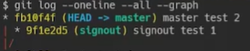

# git merge vs rebase


[TOC]


# 1. merge

 

- 브랜치의 사용내역을 남겨야할 때
- merge 이후 branch 지워주기

## 1-1 fast-forward

 

> master에서 login브랜치를 만듦
>
> 그러나 master에선 변경된게 없기 때문에 merge login을 하게되면 그냥 HEAD가 앞으로 나가주면 됨
>
> 이를 fast-forward라고 함 (merge후 merge commit 이 생기지 않음)

```bash
git branch -d login1   # 브랜치 지워주기
```


## 1-2  3-way merge(merge commit)

- **1-1과 달리 master에도 변화가 있을때, 공통된 부모인 C2  & 새로 만들어진 C4, C5**

 

  

1. 브랜치 update
2. master update

- **merge 후 `C6` 라는 새로운 commit이 생기면서 앞으로 나감**

```bash
# master
git merge signout
git branch -d signout
```

 


## 1-3 merge conflict

- merge하는 두 브랜치에서 같은 파일의 같은 부부을 동시에 수정하고 merge하면 자동 merge X
  - 동일파일이라도 서로 다른 부분을 수정한다면 자동으로 merge된다.
- conflict 이후 `git commit`만 하기 `esc :wq`

# 2. rebase

 

메인 브랜치에 보라색 커밋들을 추가한것 처럼 보임

- 히스토리를 깔끔하게 유지할 수 있음
- 협업시 권장 x


---

참고

[youtube](https://www.youtube.com/watch?v=Kh-m5mLedfs&list=PLcqDmjxt30RvjqpIBi4mtkK5LkzYtXluF&index=9)

https://git-scm.com/book/ko/v2/Git