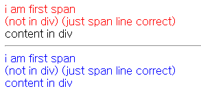
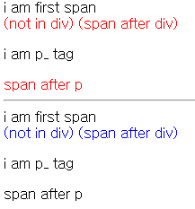

- 결합자
  - 자식결합자 `div>span` __  다른곳에 들어가있지 않고 // 같은 줄에 있는것들 !!
  - 자손결합자 `div span` __ 모두 (다른곳에 들어가있어도 포함함)

```html
<body>
    <div class="childbox">
        <span>i am first span</span>
        <br>
        <div></div>
        <span>(not in div) (just span line correct)</span>
        <div>
          <span>content in div</span>
        </div>
    </div>
    <hr>
    
    <div class="grandbox">
        <span>i am first span</span>
        <br>
        <div></div>
        <span>(not in div) (just span line correct)</span>
        <div>
          <span>content in div</span>
        </div>
    </div>
</body>
```

```css
.childbox > span {
  color: red;
}

.grandbox span{
  color: blue;
}
```

.


- 일반형제 결합자 `div~span` __ div 밑의 같은 라인의 span 
- 인접형제 결합자 `div+span` __div밑의 인접한 span <단 하나> 그 밑의 span도 안됨 !

```html
<body>
    <div class="nomal_brotherbox">
        <span>i am first span</span>
        <br>
        <div></div>
        <span>(not in div) (span after div)</span>
        <p>i am p_ tag</p>
        <span>span after p</span>
    </div>
    <hr>
    
    <div class="border_brotherbox">
        <span>i am first span</span>
        <br>
        <div></div>
        <span>(not in div) (span after div)</span>
        <p>i am p_ tag</p>
        <span>span after p</span>
    </div>
</body>
```

```css
.nomal_brotherbox div ~ span {
  color: red;
}

.border_brotherbox div + span{
  color: blue;
}
```

.


- `label for과 id 연결 = 라벨 클릭시에도 input 적용 가능하게, 또한 id로 js적용가능`

- `name은 서버로 보내기 위한 이름_ 체크박스, 라디오박스 등등은  name이 같아야 동작한다.`

- `value는 사용자는 선택만 하므로, 서버에 보낼 값을 value로 미리 지정해놔야함`

  ```html
  <label for="name">이름</label> 
  <input type="text" id="name" name="name" value="홍길동" disabled>
  ```

- 