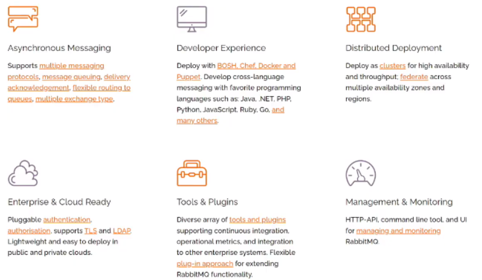

## 좋은 웹 AP(application)가 가져야 할 것들

### 성능

- 속도
- 양 (부하)

### 안정(신뢰)성

### 보안

 

------

## 웹 아키텍쳐

 

웹서버는 3번에서 처리하는데, 6을 도입하면 좋지않을까

### 무인 주차 정산 시스템 구현

- 카카오 모빌리티: 입차시 카메라로 차량번호 인식
- 요금 할인 대상 차량 여부 확인(REST API)
- 출차시 주차 요금 자동 정산

 

→ 차가 무한대기하는 상황 발생

→ RESTAPI 평균 응답시간 4초 (16초)

**해결방안**: 비동기처리

- 사용 언어, 프레임워크 환경에서 제공하는 것부터 적용
- ⭐ 업무 이해에 기반한 적절한 비동기 처리
- synchronous/ asynchronous는 중요한 개념

`spring boot async`🔎

`django async`🔎

**안정성**

- 서버는 최소 2대 이상
- 관리자 환경 설정 내용을 로컬파일로 관리

```jsx
changeEnv(){
	파일오픈 ""
	write작업 수행
}
```

- WAS 재실행, 서버 이상 등 이슈발생시 문제?

------

## 메시지 큐

- 메시지(byte)의 버퍼 역할을 하며 비동기적으로 전송
- 서비스(서버)간 느슨한 결합이 가능
- 메시지의 무손실을 보장

`발행`만 하면 되는 간단한 로직

```jsx
`생산자` --발행--> `메시지` --소비--> `소비자`
						메시지{ 입차iD:'asdf', 차량번호: '1234'}
```

- 발행만 하면 됨 (0.05초정도면 끝남)

```js
`생산자` --발행--> `통계리포트큐` --소비--> `소비자` (통계 리포트 작성)
```


- 운영체제가 다른 이기종간 메시징에도 적합

### MSA(마이크로 서비스 아키텍쳐)

 

- 독립적으로 쪼갬

  → 메시지 큐가 좋지 않을까 ?

- MSA를 고려하고 있다면 적극적으로 고려해보자

- `http` 는 목적 외의 빈번한 요청이 많음

### RabbitMQ Features

 

- 기본 활용만으로도 많은 장점
- 단순 사용 경험보다는 어떤 환경에서 어떤 이유로 적용했는지에 대한 가설 세워본 경험이 중요

**설명**

- 다양한 클라이언트 라이브러리 제공
- 메시지 디스크 저장 설정 가능
- 메시지 무손실(영속성) 보장
- 고가용성을 위한 클러스터 설정 가능
- 접근성 좋은 WEB UI 제공


