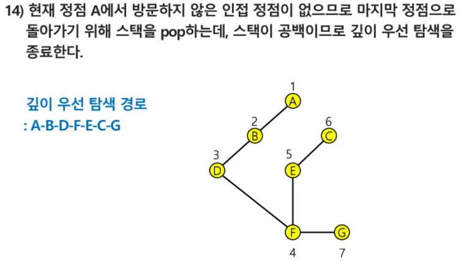

### DFS(깊이우선탐색)   

- 비선형구조인 그래프 구조는모든 자료를 빠짐없이 검색하는 것이 중요
  - 스택, 재귀, 그래프....
- 깊이우선탐색(DFS) 
  - 재귀, 반복으로 할 수 있는데 반복으로 할때 스택을 사용함.
  - 마지막에 저장된 것부터 꺼내는 방법으로 탐색

```python
# 자주 쓰는 코드 
from collections import defaultdict
graph = defaultdict(list)  #set을 사용하면, 순서가 정렬됨 # add

for i in range(0, len(lst), 2):
    a = lst[i]
    b = lst[i+1]    
    graph[a].append(b)
    graph[b].append(a)
    
from pprint import pprint


stack = []
visited = []

stack.append(1)
visited.append(1)
cnt = 0
while stack:
    cnt += 1
    tmp = stack[-1]
    for node in graph[tmp]:
        if node not in visited:
            stack.append(node)
            visited.append(node)
            break  ##다음후보로 넘어가지 말라고
    else:
        stack.pop()
    
print(visited)
```

```python
stack
---------   
|12345    <-
|		 ->
---------
후입선출
append(1)
append(2)...
pop() =>5...
```


```
만일 순서가 정해져있는 탐색경로가 주어진다면, 출발 도착 지정해두고 해보기
0  1  2  3  4  도착
1
2
3
4
출발
```





---


```python

input_str = "1, 2, 1, 3, 2, 4, 2, 5, 4, 6, 5, 6, 6, 7, 3, 7"


lst = list(map(int, input_str.split(", ")))  #len(lst)//2 = 간선의 개수


# 2칸씩 띄워서 index 가져오기
for i in range(0, len(lst), 2):
    print(i, i+1)

for i in range(len(lst)//2):
    print(2*i, 2*i+1)

for i in range(len(lst)):
    if i%2:
        print(i-1, i)

for i in range(len(lst)):
    if i%2 == 0:
        print(i, i+1)

# 그래프 만들기 - 2차원 리스트
grid = [[0]*8 for _ in range(8)]
for i in range(0, len(lst), 2):
    a = lst[i]
    b = lst[i+1]
    grid[a][b] = 1
    grid[b][a] = 1
    
pprint(grid)
[[0, 0, 0, 0, 0, 0, 0, 0],
 [0, 0, 1, 1, 0, 0, 0, 0],
 [0, 1, 0, 0, 1, 1, 0, 0],
 [0, 1, 0, 0, 0, 0, 0, 1],
 [0, 0, 1, 0, 0, 0, 1, 0],
 [0, 0, 1, 0, 0, 0, 1, 0],
 [0, 0, 0, 0, 1, 1, 0, 1],
 [0, 0, 0, 1, 0, 0, 1, 0]]
    


# dfs, 2차원 리스트
# stack : 근처에 방문할 수 있는 node가 있을 가능성이 있는 node / 근처의 모든 node를 방문했으면 pop
stack = []
# visited : 방문표시
visited = []

# 1에서 시작
stack.append(1)
visited.append(1)

# 모든 node에 대한 가능성을 확인할때까지
# 인접 행렬
while stack:

    # stack의 top의 값 확인(peek)
    tmp = stack[-1]

    # 모든 노드에 대해
    for node in range(1,8): # 7 : node의 개수 1 ~ 7
        # 인접해있고(간선으로 연결되어 있고) and 방문하지 않았으면
        if grid[tmp][node] == 1 and node not in visited:
            # stack 및 visited에 append.
            stack.append(node)
            visited.append(node)
            # break가 없다면 탐색은 가능하지만, DFS는 아님
            break
    # 해당 노드와 연결된 모든 노드에 방문하였으면 stack에서 제외
    else:
        stack.pop()
print(visited) #[1, 2, 4, 6, 5, 7, 3]


#----------------------------------------------------
input_str = "1, 2, 1, 3, 2, 4, 2, 5, 4, 6, 5, 6, 6, 7, 3, 7"


lst = list(map(int, input_str.split(", ")))

from pprint import pprint
# 그래프 만들기 - 딕셔너리
from collections import defaultdict
graph = defaultdict(list)

for i in range(0, len(lst), 2):
    a = lst[i]
    b = lst[i+1]
    graph[a].append(b)
    graph[b].append(a)

pprint(graph)
defaultdict(<class 'list'>,
            {1: [2, 3],
             2: [1, 4, 5],
             3: [1, 7],
             4: [2, 6],
             5: [2, 6],
             6: [4, 5, 7],
             7: [6, 3]})
# dfs, 딕셔너리
# stack : 근처에 방문할 수 있는 node가 있을 가능성이 있는 node / 근처의 모든 node를 방문했으면 pop
stack = []
# visited : 방문표시
visited = []  #set 사용하고 append해주는것도 빠름
# 대부분 [0]*N...이렇게 하지만

# 1에서 시작
stack.append(1)
visited.append(1)

# 모든 node에 대한 가능성을 확인할때까지
# 인접리스트
while stack:

    # stack의 top의 값 확인(peek)
    tmp = stack[-1]

    # tmp와 연결되어있는 node에 대해
    for node in graph[tmp]:
        # 방문하지 않았으면
        if node not in visited:
            # stack 및 visited에 append.
            stack.append(node)
            visited.append(node)
            # break가 없다면 탐색은 가능하지만, DFS는 아님
            break
    # 해당 노드와 연결된 모든 노드에 방문하였으면 stack에서 제외
    else:
        stack.pop()

print(visited)   #[1, 2, 4, 6, 5, 7, 3]
```

```python
'''
7 8(정점의 개수, 간선의 개수)
1 2 1 3 2 4 2 5 4 6 5 6 6 7 3 7

'''

V, E = map(int, input().split())
arr = list(map(int, input().split()))
adj = [[0]*(V+1) for _ in range(V+1)]
for i in range(E):
    n1, n2 = arr[i*2], arr[i*2+1]
    adj[n1][n2] = 1     # n1과 n2는 인접
    adj[n2][n1] = 1     # 방향 표시가 없는 경우
print()


V, E = map(int, input().split())
arr = list(map(int, input().split()))
adj = [[0]*(V+1) for _ in range(V+1)]
adjList = [[] for _ in range(V+1)]
for i in range(E):
    n1, n2 = arr[i*2], arr[i*2+1]
    adjList[n1].append(n2)
    adjList[n2].append(n1)
print()
```

---

---

---

---

---


```python
input_str = "1, 2, 1, 3, 2, 4, 2, 5, 4, 6, 5, 6, 6, 7, 3, 7"


lst = list(map(int,input_str.split(", ")))


grid = [[0]*8 for _ in range(8)]
for i in range(0, len(lst), 2):
    a = lst[i]
    b = lst[i+1]    
    grid[a][b] = 1
    grid[b][a] = 1


from collections import defaultdict
graph = defaultdict(list)  #set?

for i in range(0, len(lst), 2):
    a = lst[i]
    b = lst[i+1]    
    graph[a].append(b)
    graph[b].append(a)
    
from pprint import pprint


stack = []
visited = []

stack.append(1)
visited.append(1)
cnt = 0
while stack:
    cnt += 1
    tmp = stack[-1]
    for node in graph[tmp]:
        if node not in visited:
            stack.append(node)
            visited.append(node)
            break  ##다음후보로 넘어가지 말라고
    else:
        stack.pop()
    
print(visited)


# 반복 + stack을 이용해 DFS를 배워보았따.
# 반복 : 재귀의 자기 자신 반복
# stack : 재귀의 call stack
# 을 사용해 재귀만으로도 DFS를 구현 가능하다.

# 위의 반복문을 사용한 DFS에서, stack의 top에 있던 tmp를 사용해서 방문할 수 있는 node를 찾고, 이를 stack에 append한다
# 그렇다면 다음 반복에서 전에 append한 node가 이번에 사용할 tmp가 된다.
# -> input이 tmp일때, 자기 자신을 호출하는 재귀함수에서의 input값은 node가 되어야 한다.

# 방문할 때 visited에 append

visited = []
def func(tmp):
    visited.append(tmp)
    for node in graph[tmp]:
        if node not in visited:
            func(node)

func(1)
print(visited)
# visited = []
# def func(tmp):
#    
#    for node in graph[tmp]:
#        if node not in visited:
#			visited.append(tmp)
#            func(node)
# visited.append(1)
# func(1)
# print(visited)

# stack에 넣을 때 visited에 append.
# 따라서 처음 실행할 때 visited에 input값을 넣어주어야 한다.
visited = []
def func(tmp):
    for node in graph[tmp]:
        if node not in visited:
            visited.append(node)
            func(node)
visited.append(1)
func(1)
print(visited)
#[1, 2, 4, 6, 5, 7, 3]
```

알고리즘 인터뷰

```python
#스택을 이용한 반복구조로 구현 - 직관적
#인접한 정점중에 알파벳 순서가 빠른것 부터 (혹은 지정된 순서부터) (규칙은 정하기 나름)
def iterative_dfs(start_v):
    discoverd = []
    stack = [start_v]  #여기를 거쳐갔어...
    while stack:
        v = stack.pop()
        if v not in discoverd:  # 만약 v를 방문하지 않았다면
            discoverd.append(v)  # 방문했다고 하자
            for w in graph[v]:  # 그래프의 v의 벨류를 stack에 어팬드 하자
                stack.append(w)     #방문하지 않은 정점 w
    return discoverd
graph = {
    1: [2, 3, 4],  #1은 2, 3, 4랑 연결되어 있다.
    2: [5],
    3: [5],
    4: [],
    5: [6, 7],
    6: [],
    7: [3],
}
print(f'iterative_dfs: {iterative_dfs(1)}')
#iterative_dfs: [1, 4, 3, 5, 7, 6, 2]
```
