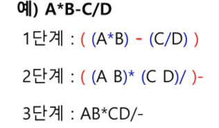

## 계산기

1. 중위표기법
   - A + B
2. 후위표기법
   - AB +

- 중위표기 ==> 후위표기

  - 수식의 각 연산자에 대해, 우선순위에 따라 괄호를 사용해 다시 표현
  - 각 연산자를 그에 대응하는 오른쪽 괄호의 뒤로 이동
  - 괄호제거

  - .

- 스택

  - 토큰을 읽음

  - if 피연산자-> 토큰 출력

  - if 연산자(괄호포함)->스택의 top에 있는거보다 우선순위가 높으면 push

    토큰의 우선순위보다 작을때까지, 스택에서 pop한 후 토큰의 연산자를 push한다.

    top에 연산자가 없으면 push한다.

  - 토큰이 ) 이면, (가 올때까지, 스택에 pop연산 수행
  - pop한 연산자 출력

  - ( 만나면, pop만하고, 출력하진 X
  - --
  - 중위표기식에, 더 읽을게 없으면 중지// 읽을게 있으면 처음부터 다시 반복
  - stack 밖의 왼괄호는 우선순위가 젤  높고, 스택 안의 왼괄호는 우선순위가 낮다.

