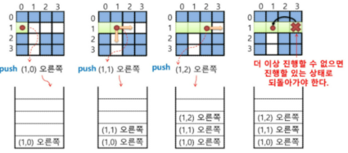
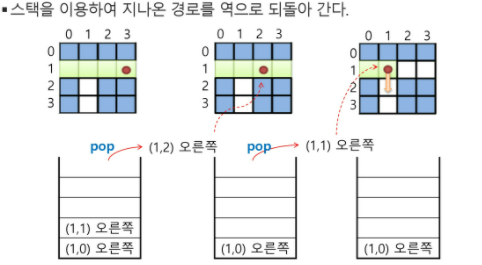
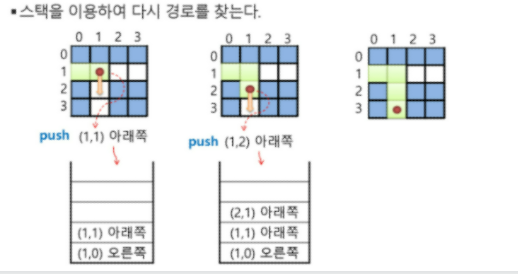
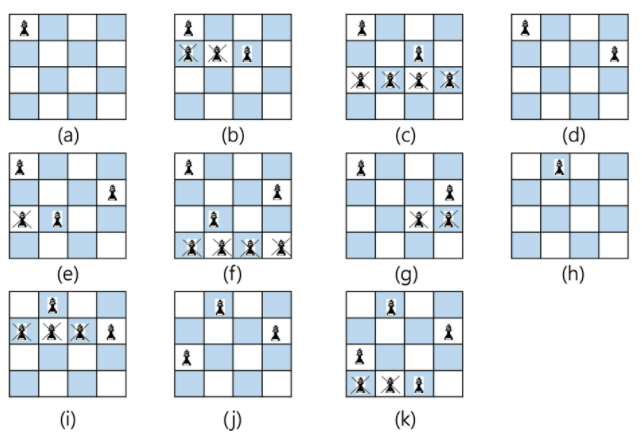
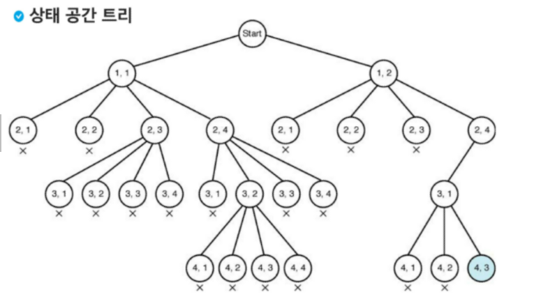

## backtracking

- 해를 찾는 도중에 '막히면' (즉, 해가 아니면) 되돌아가서 다시 해를 찾아가는 기법

-  dfs라는 모든 해를 고려하는 완전 탐색 알고리즘에서, 조건을 걸어 그 경로로 가지 않고 돌아가는 방법

-  상태공간 트리의 깊이 우선검색을 실시-> 각 노드가 유망한지 점검-> 유망하지 않으면, 그 노드의 부모노드로 돌아가서 검색을 계속한다.

- 최적화문제, 결정문제를 해결 

  - 결정문제: 미로찾기, [n-Queen1](https://www.acmicpc.net/problem/9663),[n-Queen2](https://programmers.co.kr/learn/courses/30/lessons/12952?language=cpp) Map coloring, 부분집합의 합

  - ```
    dfs
    if
    else
    
    backtracking
    if
    elif (탐색이 완료되지 않아도, 어떤 조건이 있으면 리턴해)
    else
    ```

미로찾기

```
1. 네방향으로 제한하겠어
2. 벽은 갈 필요가 없어
(후보를 제한하는 것만으로도, 백트래킹이라고 할 수 있음)
```

- .
- 좌표만 저장해도됨(내가 지나온 곳)
- .
  - 탐색할 부분을 네개로 (상하좌우) 정해서 가기 때문에 백트래킹이라고 정의
  - 저장한 경로를 꺼내서 네방향 살피기
- .
- DFS는 모든 경로를 추적하지만, 백트래킹은 불필요한 경로를 조기에 차단함 (가지치기)
- 모든후보를 검사하지 않는다 !!

`일반 백트래킹 알고리즘`

```python
def checknode (v) : #node
    if promising(v): #v에 놓을수 있나 ? 
        if there is a solution at v:   
            write the solution
        else:
            for u in each child of v:   #현재 놓은 v에 대한 각 항들(u) (자식들에 또 놓을수 있는지 확인)
                checknode(u)  #유망하지 않다면 다음단계 가지 않겠어..
                
                
promising ('위쪽의 같은 열에 있거나 대각선 위를 살핌) (v와 자식들을 봤을때, 겹치지 않아야함)'
v (앞에 뭐가 없어서 유망함)
uuuu

v
 v
uuuu  
# 델타를 써서 볼 수도 있고
# 열에 대한 배열, 대각선(2개)에 대한 배열을 만들어서 i+1, i+2, .... 배열 3개 이용
```

.


.
