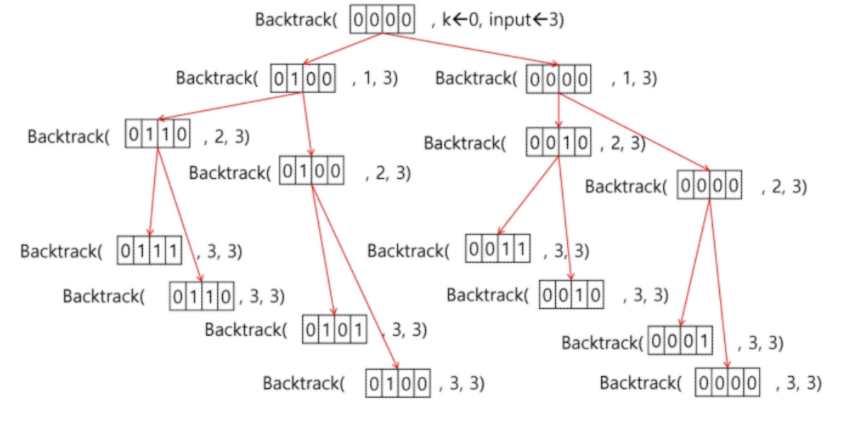

## 순열

> N개의 원소 중 r개를 뽑음
>
> 중복 X, 순서 상관 있음 
>
> nPr = n!/(n-r)!

`부분집합구하기`

- 2**n개

- {1, 2, 3}의 부분집합 표현

  ```python
  [0000]
   x123
    2^3=8
  부분집합에 포함되거나 포함되지 않거나 1/0 을 사용함
  ```



---

---

**{1, 2, 3, 4, 5, 6, 7, 8, 9, 10}의 powerset 중 원소의 합이 10인 부분집합을 구하시오**


```python
#부분집합 만들기
#bfs(후보군을 다 추천하는 경우)
def f(i, N):  #i: 부분집합에 포함될지 결정할 원소의 idx(0, 1, 2), N: 전체원소개수
    if i == N: #한개의 부분집합 완성 (i(3)=N)
       # print(bit) #[1, 1, 1], [1, 1, 0], [1, 0, 1]...[0, 0, 0]
       # for j in range(N):#직접 원소 출력
       #     if bit[j]: #부분집합에 1이 있으면 출력
       #         print(a[j], end = ' ')  #1 2 3  / 1 2  /1 3...
       # print()
        return # (return 이전 함수로 되돌아 간다./ 값을 주는게 아님)
    else:
        bit[i] = 1  #1넣고 쭉--이동하고 1넣고, i+1해주기   # 1
        f(i+1, N)  		#[1, 0, 1]
        bit[i] = 0  #이진트리면, 두번 재귀 호출
        f(i+1, N)  #[1, 0, ?]
    # return # (return 이전 함수로 되돌아 간다./ 값을 주는게 아님)
    
a = [1, 2, 3]
bit = [0, 0, 0]  ###############
f(0, 3) #0번 인덱스부터 부분집합에 포함되는지 보기, 총 원소의 개수 = 3개
```

## 1

```python
#각 부분집합의 합
def f(i, N):
    if i == N:
        s = 0
        for j in range(N):
            if bit[j]:
                s += a[j]     #[1, 1, 1] 1 2 3  6     	
		print(s)     
    else:
        bit[i] = 1
        f(i+1, N)  
        bit[i] = 0
        f(i+1, N) 
    return  
    
a = [1, 2, 3]
bit = [0, 0, 0]
f(0, 3)
```

## 1 -1

```python
# 합이 10인 경우 찾기
def f(i, N, K):  # K는 찾는 합
    if i == N:
        s = 0
        for j in range(N):
            if bit[j]:
                s += a[j]
        if s == K:  # 찾는 합이면
            for j in range(N):
                if bit[j]:
                    print(a[j], end=' ')  # 1 2 3 4, 1 2 7, 1 3 6, ...
            print()
    else:
        bit[i] = 1
        f(i + 1, N, K)
        bit[i] = 0
        f(i + 1, N, K)
    return


a = [1, 2, 3, 4, 5, 6, 7, 8]
N = len(a)
bit = [0] * N
f(0, N, 10)  ##
#밑에꺼랑 비교시, 호출 횟수가 더 크게나옴/ 모든 경우를 다 고려해서 만듦
N = 10
a = [x for x in range(1, N+1)]
bit = [0]*N
f(0, N, 10) ##
```

## 2

```python
#i-1원소까지 고려한 합s, 찾으려는 합 t

f(i, N, s, t):
    if s == t  #i-1원소까지의 합이 찾는 값인 경우  #1. i-1에 다다른경우: 다음 원소를 고려할 필요가 없음
		#몇가지가 있는가 ? global cnt +=1		  #2. 모든 원소에 대한 고려가 끝나 s==t 인경우     
    elif i == N #목표치에 다다르지 못했는데, 남은 원소가 없음
    
    elif s > t  #목표치에 다다르지 못했는데, 현재 합이, 찾는값보다 클때
    		  #값을 더 더해도 남은 원소를 고려할 필요가 없는 경우
        
    else:  #남은 원소가 있고 s<t 인 경우
        subset[i] = 1  #필요하면 만들기
        f(i+1, N, s+A[i], t)  #i원소 포함
        
        subset[i] = 0
        f(i+1, N, s, t)   #i원소 미포함
```

## 2-1

```python
#합이 t인경우
def f(i, N, s, t): #s 이전까지 고려된 원소의 합, t 목표값
    if s == t: #목표값을 찾으면
        for j in range(N):
            if bit[j]: #1이면
                print(a[j], end = ' ')
		print()
    elif i == N: #더이상 고려할 원소가 없으면
        return 		#돌아가서 선택을 바꾸기
    elif s > t: #고려한 원소의 합 s가 이미 목표를 초과한 경우
        return  #앞쪽에 가서 다시 선택해보기
    
    else:  #어떤 모습으로 도달했는지 알려면 있어야하지만 그렇지 않으면 없어도 됨
        bit[i] = 1
        f(i+1, N, s + a[i], t)  
        bit[i] = 0
        f(i+1, N, s, t) 
    return  
    
N = 10
a = [x for x in range(1, N+1)]
bit = [0]*N
t = 10  #t가 되는 경우가 있는가 ?
f(0, N, 0, t)
```

## 3


```python
#합이 t인경우
def f(i, N, s, t, rs): #남은 구간의 합 rs
    if s == t:
        for j in range(N):
            if bit[j]:
                print(a[j], end = ' ')
		print()
    elif i == N: 
        return 	
    elif s > t:
        return 
    elif s + rs < t:  ## s+ rs < t:
        return
    
    else:
        bit[i] = 1
        f(i+1, N, s + a[i], t, rs-a[i]) #i에 대한 고려가 끝난 것이므로, rs에서 a[i]를 빼줌
        bit[i] = 0
        f(i+1, N, s, t, rs-a[i]) 
    return  
    
N = 10
a = [x for x in range(1, N+1)]
bit = [0]*N
t = 10
f(0, N, 0, t, sum(a))
```

++ i에 대한 고려가 끝난 것이므로, rs에서 a[i]를 빼줌

고려하는 값이 5면

1, 2, 3, 4, // 5, 6, 7, 8, 9, 10

rs에서 5를 빼줘야 하기 때문에 rs-a[i]

---

### 순열코드 추가

```python
def f(i, r):
    if i==r:
        print(bit[:r]) # r까지
        return
    for n in range(4):
        if n not in bit[0:i]:
            bit[i] = n
            f(i+1,r)

N = 4
bit = [0]*N # 부분집합의 길이 0123
f(0, N-1) # f(idx, 부분집합의 길이)
----
[0, 1, 2]
[0, 1, 3]
[0, 2, 1]
[0, 2, 3]
[0, 3, 1]
[0, 3, 2]
[1, 0, 2] ..................
```

```python
def f(i, r):   #위랑 같은식 그림이해
    if i==r:
        print(bit[:]) # 여기서는 얕은 복사를 안해줘도 되지만, 다른 곳에 append하려고 할때는 필요할 수도 있음
    for n in range(3):
        if n not in bit[0:i]:
            bit[i] = n
            f(i+1,r)

bit = [0]*3 # 012
f(0, 3)   # f(idx, 부분집합의 길이)

'''
[0, 1, 2]
[0, 2, 1]
[1, 0, 2]
[1, 2, 0]
[2, 0, 1]
[2, 1, 0]
'''
```

. 선이 끝나는 지점에서 있는지 없는지 체크

```python
def f(idx, n, r, res):
    if idx==r: 
        print(res)
        return
    for i in range(n):
        if i not in res: # if 분기가 없다면 중복
            res.append(i)
            f(idx + 1,n, r, res)
            res.pop()


N = 4
f(0, N, N-1, [])
```

중복순열

```python
# recursion 3 중복순열
# def f(i, N): #  A[i]에 0 또는 1을 채우는 함수
#     if i==N:    # A가 채워진 경우
#         print(A)
#     else:
#         A[i] = 0
#         f(i+1, N)
#         A[i] = 1
#         f(i+1, N)
#     return
def f(i, N): #  A[i]에 0 또는 1을 채우는 함수  # 재귀호출의 단계를 결정하는 부분
    if i==N:    # A가 채워진 경우
        print(A)
    else:
        for j in range(2):  # for문의 크기가 갈림길의 개수에 따라 다르게 표현된다.(dfs) #######
            A[i] = j
            f(i+1, N)
    return

N = 3
A = [0]*N
f(0, N)
```


```python
from itertools import combinations, permutations

print(list(permutations(range(5),3)))
print(list(combinations(range(5),3)))
```

---

```python
A[1, 2, 3] 모든 원소를 사용한 순열 만들기
123, 132, 213, 231, 312, 321

ㅁ , ㅁ , ㅁ
1 , 2 3, 3 2 
2 , 1 3, 3 1
3 , 2 1, 1 2
```

```python
p [1, 2, 3]을 넣고 시작
		  ㅁ  # 1, 2, 3
       	#1    #앞에서 사용한게 다음번에 영향을 줌
       ㅁ    ㅁ 
     # 2
	ㅁ   ㅁ 	ㅁ ㅁ  ㅁㅁ
   # 3   
   #123 


따라서, p[0]을 결정시, 옆에꺼랑 자리를 바꿔주는 식으로 진행
p[1, 2, 3] 자기자신과 자리바꿈
p[2, 1, 3] 옆에꺼랑 자리바꿈
p[3, 2, 1] 옆옆꺼랑 자리바꿈 (원본기준)


p[1] 결정 f(i+1, N) #다음걸로 가보고, 내가 사용할 숫자는 N개
p[1, 2, 3] 자기자신과 자리바꿈

p[2] 결정
p[1, 2, 3] 자기자신과 자리바꿈

완성
1 2 3
----------------------------------
return-> p[1, 2, 3] #p[2]의 오른쪽 없음 
return-> p[1, 3, 2] #p[1] 
p[2] 자기자신하고 자리바꿔 p[1, 3, 2]
완성
1 3 2
----------------------------------
return -> #p[2] 오른쪽 없음
return -> p[1, 2, 3] #p[1] 원상복귀 하고 옆옆꺼랑 바꿀까 / 근데없어
return

```

```python
for j: i->N-1 # 자기자신부터 바꾸려고
    P[i] <-> P[j] # 다음거랑 바꾸고
    f(i + 1, N)   # i+1로 가서
    P[i] <-> P[j]  # 또 바꿈
```

```python
def f(i, N):
    if i == N:
        print(p)   #[1, 2, 3] [1, 3, 2] [2, 1, 3]
    else:
        for j in range(i, N): #i 포함 안시키면 원본 없어짐, i자신부터 바꿀거임
            p[i], p[j] = p[j], p[i]                       #0부터하면 바꾼거또바꿈
            f(i+1, N)
            p[i], p[j] = p[j], p[i]
            

N = 3  
p = [1, 2, 3]
#p = [x for x in range(1, N+1)]  #길이가 변하는 경우 이렇게 사용하면 좋음 
f(0, N)  #0번자리부터 결정, 총 3개
#ex) 거래처 5곳을 돌아야 하는데 방문하는 곳마다 시간이 달라져,, 그러면 어떤게 최적인지 몰라서 순서를 다 만들어봐야함
-------------------------------
[1, 2, 3]
[1, 3, 2]
[2, 1, 3]
[2, 3, 1]
[3, 2, 1]
[3, 1, 2]
```


## 조합

> N개의 원소 중 r개를 뽑음
>
> 순서상관 없음
>
> nCr = n!/(n-r)!*r!

```python
def func(idx, n, r, res):
    if idx == r:
        print(res)
        return

    start = 0
    if len(res):
        start = max(res) + 1
        # start = max(res)  # +1이 없다면 중복 허용

    for i in range(start, n):

        res.append(i)
        func(idx+1, n, r, res)
        res.pop()

        # func(idx+1, n, r , res + [i])
        

func(0, 7, 3, [])
```