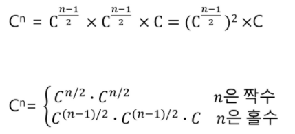

## 분할정복 알고리즘

> 큰 사건을 작은 사건으로 나눈다 !

- 분할

- 정복

- 통합

  

- 거듭제곱

  - O(n)
    - C**2 = C x C

- 분할정복 알고리즘

  - O(log2n)
    - C**8 = CxCxCxCxCx..
    - C\*\*8 = C\*\*4 x C\*\*4 = (C\*\*4) = ((C\*\*2)\*\*2)**2



```python
def Power(base, exponent):
    if exponent == 0 or base ==0:
        return 1
    if exponent%2  ==0:  #if else구조면, 재귀호출시 한 갈래로만 간다..
        newbase = power(base, exponent/2)
        return newbase*newbase
    else:
        newbase = power(base, (exponent-1)/2)
        return (newbase*newbase)*base
        
```

`퀵 정렬`

> 주어진 배열을 두개로 분할하고, 각각을 정렬한다.

```python
#공식 기억해두기
# p = pivot의 idx
# quickso..()재귀 (피봇의 왼, 오에 대해 동일한 작업함)

def quickSort(a, begin, end):
    if begin < end:  #begin <= end 알고리즘마다 다름
        p = partition(a, begin, end)
        quickSort(a, begin, p-1)  #왼
        quickSort(a, p+1, end)   #오
```

```python
def partition(a, begin, end):
    pivot = (begin + end) //2   #pivot 정하기:partitioning이 끝나고도 고정적으로 움직이지 않는값
    L = begin
    R = end
    while L < R:  #만나지 않으면 계속 움직일꺼야
        while(L<R and a[L] < a[pivot]) : 
            L += 1  # 피봇 이상인 값/ 만날때까지 하나씩 증가!
        while(L<R and a[R] >= a[pivot]) : 
            R -= 1  #피봇 이하인 값 / 만날때까지 하나씩 감소
        if L < R: # 만일 만나서 멈추게 된다면 두개가 차이가 날 것임
            if L==pivot : pivot = R #두개 자리를 바꿔줘
                a[L], a[R] = a[R], a[L]
    a[pivot], a[R] = a[R], a[pivot]
    return R  #R의 위치가 최종적으로 결정된 자리
```

#stack2.md 파일 참조하기

