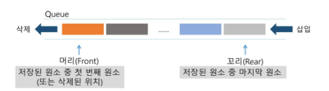
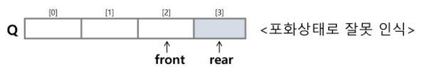
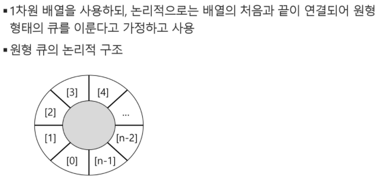

# Queue

- 스택처럼 삽입 삭제의 위치가 제한적

- 선입선출구조

- 버퍼, 마구 입력된 것을 처리하지 못하고 있는 상황, BFS 에서 사용됨

- 

  - |머리, 바닥|처음 들어간것|  ...... |꼬리, 마지막원소|

  - 양쪽 다 인덱스가 필요

- 기본연산

  - ```python
    enQueue() : 데이터 넣음 (rear다음)에 원소 삽입
    
    deQueue() : 데이터 뺌 (front)에서 원소 삭제, 반환
    
    createQueue() : 공백
    
    isEmpty() : 비어있는 지 확인
    
    isFull() : 꽉차있는 지 확인
    
    Qpeek() : 큐의 앞쪽에서 원소를 삭제없이 반환
    
    ```

    ---


#### 큐의 연산과정

- 초기값 -1로 설정(-1로 초기화)

  

- front: 마지막으로 삭제된 위치

- rear: 저장된 위치

```python
#createQueue(); #공백큐생성
(-1 )[  ,  ,  ]
front = rear = -1
- 초기값이 -1 / front, rear = -1 이면 '비어있다는 것

#enQueue(A);
(-1)[A,  ,  ]
front = -1
rear += 1
rear = 0  (저장된 위치)

#enQueue(B);
(-1)[A, B, ]
front = -1
rear += 1
rear = 1

#deQueue();
[ , B, ]
front += 1 (위치 이동시킴)
front = 0
rear = 1
dequeue = front에서 원소 삭제, 따라서 A 삭제

#enQueue();
[ , B, C]
front = 0
rear += 1
rear = 2

#deQueue();
[ ,  , C]
front += 1
front = 1 (B 삭제)
rear = 2

#deQueue();
[ ,  ,  ]
front += 1
front = 2 (C 삭제)
rear = 2  
- front와 rear가 같아지면, 마지막에 저장된것까지 삭제되어 큐가 '비어있다는 것
```

## 큐의 구현

```python
q = [NONE] * 5
print(q)
rear = -1
front = -1
------------
class Queue:
    def__init__(self):
        self.rear = -1
        self.front =-1
```

```python
선형 큐 : 1차원 배열
front: 가장 최근, 마지막으로 꺼내진 위치 / 디큐된 위치
rear: 저장된 마지막 원소의 인덱스 / 인큐된 위치

초기상태: front = rear = -1, 크기 n 1차원 배열
공백상태: front == rear
포화상태: rear == n-1 (n: 배열의 크기, n-1: 배열의 마지막 인덱스)
```

`초기 공백 큐`

```
크기 n인 1차원 배열
front, rear = -1
```

`삽입`

- 마지막 원소 뒤에 새로운 원소 삽입(rear += 1)

```python
def enqueue(data):
    global rear
    if isFull(): print('queue_full') #디버깅용(큐를 작게설게' 많이 넣음)
    else:
        rear = real + 1;  #함수 아니면, 여기만 사용(enQ)
        Q[rear] = data
```

`삭제`

- 가장 앞의 원소를 삭제(front += 1)

```python
dequeue():
    if isempty(front == rear) then queue_empty();
    else:
	front = front + 1;
	return Q[front]  #그 위치에서 꺼내쓰기
```

`공백, 포화상태 검사`

- 공백상태 : front == rear
- 포화상태: rear == n-1 (마지막 원소까지 저장이 되었을때) (n:배열의 크기, n-1:배열의 마지막 인덱스)

```python
3|2|7|4|5
  ㄴfront 만 욺겨감
def isEmpty():
    return front == rear

def Full():# 마지막 idx까지 차있으면 full
    return rear == len(Q) -1
```

`Qpeek()`

- 가장 앞에 있는 원소 반환
- 현재 front의 한자리 뒤(front + 1)에 있는 원소(큐의 1st원소)반환
  - front = 삭제된 위치이므로

```python
def Qpeek():
    if isEmpty(): print('queue_empty')
    else:
        return Q[front+1]
```

---

`연습문제1`

```python
1, 2, 3 차례로 큐에 삽입
front = rear = -1
Q = [0]*10 ##
enqueue(1)
.
.
.
----또는
front = rear = -1
Q = [0]*10
real += 1  #enqueue(1)
Q[real] = 1
real += 1  #enqueue(1)
Q[real] = 2

front += 1
print(Q[front])
front += 1
print(Q[front])   들어간 순서대로 꺼내보자
----
#삭제
front += 1
q[front] = None 
print(q)
```


`문제점`

잘못된 포화상태 인식

- 

- 삽입 삭제를 계속 하는 경우, 배열의 앞부분을 활용하지 x, rear = n-1인 상태

- 큐의 원소들을 이동 ? -> 오래걸림

- 

  (인덱스를 다시 앞으로 되돌리는 방식)

---

---

---

```
주로 쓰이는 모듈 
from collections import deque  #(시험에선 밑에꺼 쓰기)
---
import collections
a = collecions.deque()
```

```python
list보단 라이브러리를 씀 (시간복잡도 때문)
슬라이싱 X (연결리스트)
[0]*100 해서 쓰기
append()하면 공간을 늘려줘야해서 지양함, 얼마나 빨리 인덱스 되는지 ?
```

```python
from collections import deque
queue = deque()
queue.append(5)
queue.append(3)
queue.append(7)
			1
    		4
queue.popleft() #pop(0)
-> deque([3, 7, 1, 4])  #먼저들어온거 빼줌
queue.reverse()
-> deque([4, 1, 7, 3])
```