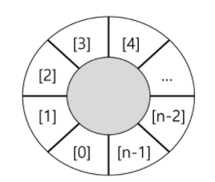
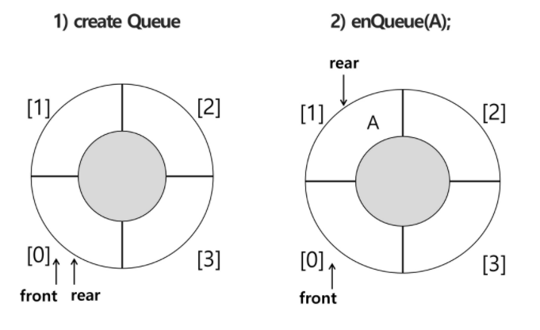
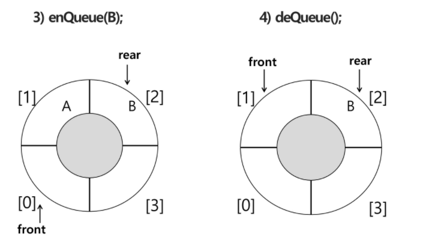
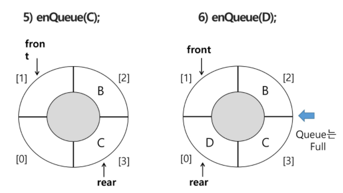

## 원형 큐

.

```python
#초기 공백상태
front  = rear = 0, 크기가 n인 1차원 배열
#인덱스 순환
front 와 rear의 위치가  n-1을 가리키는 경우, 배열의 처음 인덱스인 0으로 이동해야함
나머지 연산자 mod(%) 사용 
#front 변수
공백, 포화 상태 구분하기 위해 front자리는 사용  x  빈자리
```

|        | 삽입위치                                                     | 삭제위치               |
| ------ | ------------------------------------------------------------ | ---------------------- |
| 선형큐 | rear = rear+1                                                | front = front + 1      |
| 원형큐 | rear = (rear+1)%n<br />n-1까지 더해가다가 n이 되면 0으로 되돌아감 | front = (front + 1) %n |






- A를 지운게 아님 ?(덮어쓰임)



- 6번이 가득찬 상태로 쓰임
- 원형큐는 front를 비워두고, 가득찬 상태로 씀


`구현`

- 초기 공백 큐 생성
  - 크기 n인 1차원 배열 생성
  - front 와 rear를 0으로 초기화

`공백, 포화상태 검사`

- 공백: front == rear  (front와 rear가 만나, 그 위치까지 다 꺼냈을때)
- 포화: 삽입할 rear 다음의 위치 == 현재 front
  	(rear + 1) % n == front
  	real의 다음칸이 front이면 포화  // 위의 6번
  	cf) 만일 D에서 하나 더 늘이려고 하면, front는 비워둬야 해서 안된다고 함

```python
def isEmpty():
    return front == rear #front가 rear까지 꺼냈을때 (초기상태도 마찬가지)
def isFull():
    return (rear+1)%len(cQ) == front   #rear의 다음칸이 front라면 full
# cQ = circular Q
```

`삽입`

- 마지막 원소 뒤에 새로운 원소 삽입
- rear = (rear+1)%n

```python
def enQueue(item):
    global rear
    if isFull():  #(rear+1)%n == front
        print('queue_full')
    else:
        rear = (rear + 1) % len(cQ)
        cQ[rear] = item
---
def enQueue(item):
    rear = (rear + 1) % len(cQ) #뺌
    if isFull():  
        print('queue_full')
    else:
        cQ[rear] = item
```

`삭제`

- 가장 앞의 원소 삭제
-  front = (front + 1) %n

```python
def deQueue():
    global front
    if isEmpty():
        print('queue_empty')
    else:
        front = (front + 1) % len(cQ)
        return cQ[front]
```

```python
만약
[ , A, B, C] (다 찬상태)
[D, A, B, C] D가 들어옴(하나는 비워야되는데)

1. A를 빼준다.
2. D를 나중에 넣는다

큐를 두개 만들고 하나가 다 차면, 꺼내쓰는 동안엔 
다른 큐에 넣어주도록
```

