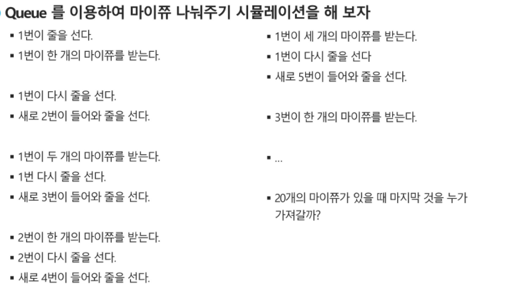

## 우선순위 큐

- FIFO 순서가 아니라 우선순위가 높은 순서대로 먼저 나가게 된다.
- 입력된 순서에 상관없이 <u>중요한게 먼저 !!</u>
- 시뮬레이션 system, 네트워크 트래픽 제어, 운영체제의 테스크 스케일링

- 배열을 이용한 우선순위 큐

  - 원소를 삽입하는 과정에서 우선순위를 비교하여, 적절한 위치에 삽입하는 구조

  - 가장 앞에 최고 우선순위의 원소가 위치하게 됨

  - 트리구조로 구현

  - 문제점: 배열을 사용하게될때, 삽입 삭제 연산이 일어날 때 원소의 재배치가 발생하며

    ​			이에 소요되는 시간, 메모리낭비가 큼

`구현`

​			배열' 연결리스트를 이용

---

## 큐의 활용: 버퍼

- 버퍼: 데이터를 전송하는 동안 일시적으로 그 데이터를 보관하는 메모리 영역
- 버퍼링: 버퍼를 활용하는 방식' 버퍼를 채우는 동작을 의미
- 입출력, 네트워크 관련 기능에서 활용
- 순서대로 입력/출력/전달 되어야 하므로 FIFO방식의 자료구조인 que 활용

- 

  ```
  [1]
  [1] [1, 2]
  [1, 1] [2, 1, 3]
  [1, 1, 2][1, 3, 2, 4]
  
  [1, 1, 2, 1][3, 2, 4, 1, 5]
  [1, 1, 2, 1, 3][2, 4, 1, 5, 3, ...
  ```

  - 큐에 있는 사람 수
  - 현재 1인당 나눠주는 사탕 수
  - 현재까지 나눠준 사탕의 수 출력해보기

```python
mychu = 20
next_person = 1

q = [] #줄을 선다
q.append([1, 1]) #1번이 한개를 받음

num, cnt = q.pop(?)  #1~4줄
my_chu -= cnt
q.append([num, cnt + 1])
q.append([next_person + 1, 1])

print(q) #[[1, 2], [2, 1]]

num, cnt = q.pop() #마이쮸를 준 다음에?
my_chu  -= cnt
q.append([num, cnt + 1])
q.append([next_person + 1, 1])

---반복되니까 while

q = [] #줄을 선다
q.append([1, 1]) #1번이 한개를 받음
while 1:
    num, cnt = q.popleft(0)  #1~4줄
    my_chu -= cnt
    q.append([num, cnt + 1])
    q.append([next_person + 1, 1])
	
    if my_chu <= 0:
        break
```
