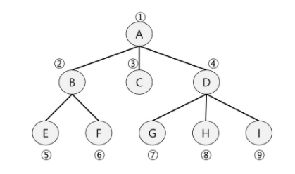
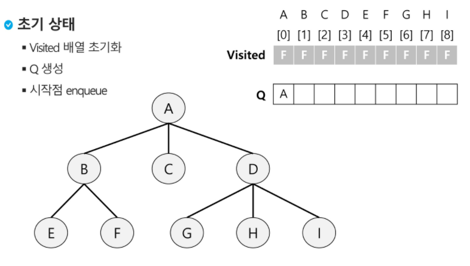
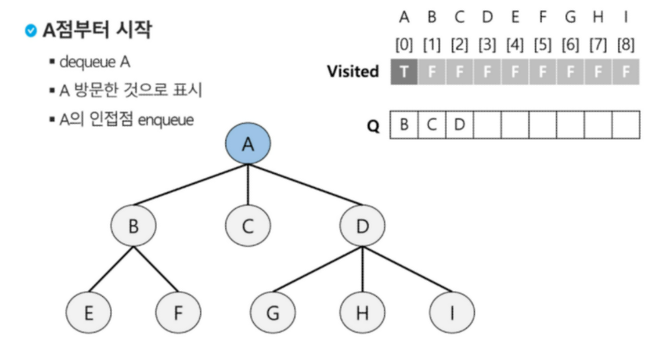
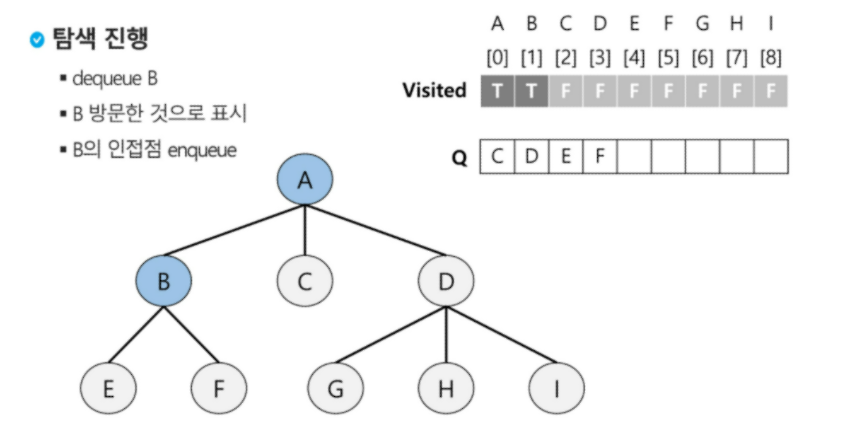
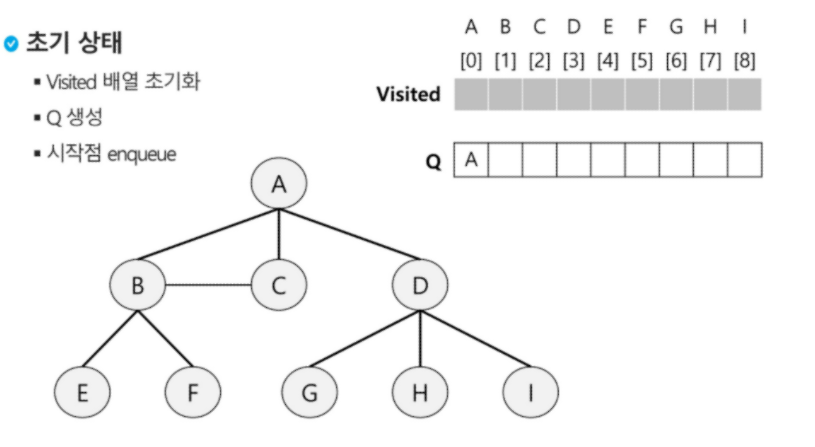

# BFS

> 너비우선탐색은 탐색 시작점의 인접한 정접들을 먼저 모두 차례로 방문한 후에, 방문했던 정점을 시작점으로 하여 다시 인접한 정점들을 차례로 방문하는 방식
>
> 인접한 정점들에 대해 탐색을 한 후, 차례로 다시 너비우선탐색을 진행해야하므로, 선입선출 형태의 자료구조인 큐를 활용함

.

- 인접한 정점들을 차례로 방문하는 방식

목차

1. [기본모양](#1. 기본모양)
2. [중복이 있는 모양](#2. 중복이 있는 모양)
3. [거리정보 파악](#2-1 . 거리정보 파악)
3. [알고리즘인터뷰](# 알고리즘인터뷰)

## 1. 기본모양

```python
A  (직계가족 넣기)
BCD(A와 인접한)  (거리가 같아서, 순서는 상관 없음)
EF(B와 인접한)  (직계가족 넣기)
GHI(D와 인접한)
[A, B, C, D, E, F, G, H, I]
```

`구현`

- 초기상태
  - visited배열 초기화
  - Q 생성
  - 시작점 enqueue

```python
입력파라미터: 그래프 G와 탐색시작점 v
def BFS(G, v): 
    visited = [0]*(n+1)  #n은 정점의 개수   #n+1 -> 1번부터 쓰려고
    queue = []   # append, pop(0)시   -- 혹은 [0]*
    queue.append(v)  # 줄세우기
    visited[v] = 1
    while queue:  # 큐가 있는동안
        t = queue.pop(0)  #dequeue(맨 앞에서 꺼냄, 줄서있는 사람 나오세요)      
        for i in G[t]:  #t의 인접점에 대해
            if not visited[i]: #방문되지 않은 곳이라면
                queue.append(i) #큐에 넣기
```



​					(front = -1, rear = A)



​					(dequeue -> visited)

​					(방문하지 않은 인접점 enqueue)



## 2. 중복이 있는 모양



```python
visited = [ ]
Q = [A]

visited = [A]
Q = [B, C, D]

visited = [A, B]
Q = [C, D, C, E, F]  #C...

visited = [A, B, C]
Q = [D, C, E, F]

visited = [A, B, C, D]
Q = [C, E, F, G, F, I]

visited = [A, B, C, D]  #C 처리하려고 봤더니 이미 처리되어있음
Q = [C, E, F, G, F, I]  #C는 그냥 무시하고 버림
#단점: 중복이 얼마나 될지 모르기 때문에, 배열의 크기를 정하기 어려움
#중복이 발생하면서 Q의 사이즈를 예측하기 어려워짐
```

```python
입력파라미터: 그래프 G와 탐색시작점 v
def BFS(G, v):
    visited = [0]*(n+1)  #정점이라서, n+1 -> 1번부터 n번까지 쓰려고 ! 격자면  [[0]*n for _ in range(n)]
    queue = []   
    queue.append(v)  
    while queue: 
        t = queue.pop(0)  
        if not visited[t]: #방문한 곳을 겹치게 하지 않으려고
            visited[t] = True
            visit(t)  #정점 t에서 할일
        for i in G[t]: 
            if not visited[i]: 
                queue.append(i) 
```

따라서, 2-1에선 처리된 것을 visited로 처리하지말고 줄선 것을 기준으로 visited를 표시함

(인접이면서, Q에 줄서지 않은것만 visited에 올리기)

## 2-1 . 거리정보 파악


​				[초기상태 = 시작점 줄섬 표시, while]

```python
#줄선 것을 기준으로 visited
#Q에 들어간 것은 visited한다.
visited = [ ]
Q = [A]   t=A

visited = [A, B]
Q = [B] #B를 줄세우고, 방문 표시  ////t의 인접점에 대해 줄선적이 없으면, 줄세우고 방문표시

visited = [A, B, C]
Q = [B, C]  #A기준, C도 줄선적이 없음

visited = [A, B, C, D]
Q = [B, C, D] #D도 처리/ 이제 더이상 A에 인접인게 없으니 'B에 인접이고 줄선적 없는 것'
.
.
visited = [A, B, C, D, E, F]
Q = [C, D, E, F] t = B  # Q에 줄세우고, visited 표시함

visited = [A, B, C, D, E, F]
Q = [D, E, F] t = C

visited = [A, B, C, D, E, F, G, H, I]
Q = [E, F, G, H, I] t = D

#장점: 중복이 없음
#내가 처리하려는 정점의 개수만큼만 배열을 만들면 됨
```

```python
최소이동거리 구할때 많이 사용함
입력파라미터: 그래프 G와 탐색시작점 v
def BFS(G, v, n):
    visited = [0]*(n+1)
    queue = []
    queue.append(v)
    visited[v] = 1  #시작점 v enqueue
    while queue:  # 큐가 있는동안
        t = queue.pop(0)  #dequeue
        visit(t) #탐색목적처리(if문 빠짐)  / ex) dfs로 방문한 순서 print(t), t가 찾으려는 곳이면 return 1
        for i in G[t]:  #t와 연결된 모든 정점에 대해
            if not visited[i]:  #그정점에 방문 안했으면 Q에 줄세우고, visited에 넣어
                queue.append(i)
                visited[i] = visited[t] + 1 # n으로부터 1만큼 이동  #밑에보기
```

```python
visited = [1, ]
Q = [A]   t=A

visited = [1, 2] #1번그룹으로부터 인접했어(2)
Q = [B] #B를 줄세우고, 방문표시

visited = [1, 2, 2]
Q = [B, C]

visited = [1, 2, 2, 2]
Q = [B, C, D]

visited = [1, 2, 2, 2, 3, 3]
Q = [C, D, E, F] t = B
...
visited = [1, 2, 2, 2, 3, 3, 3, 3, 3]
Q = [] 'front==rear  "queue 비었으면 종료
```

### 알고리즘인터뷰

```python
graph = {
    1: [2, 3, 4],
    2: [5],
    3: [5],
    4: [],
    5: [6, 7],
    6: [],
    7: [3],
}
def bfs(v): #start_v
    visited = [v]
    q = deque([v])  #1
    while q:
        v = q.popleft()
        for w in graph[v]:
            if w not in visited:
                q.append(w)
                visited.append(w)
    return visited

a = bfs(1)
print(a) #[1, 2, 3, 4, 5, 6, 7]
#인접간선을 추출하고, 도착점인 정점을 큐에 삽입함
```


---

---

---

```python
과정과정마다 que를 print
```

```python
# 인풋받기
input_str = "1, 2, 1, 3, 2, 4, 2, 5, 4, 6, 5, 6, 6, 7, 3, 7"
lst = list(map(int,input_str.split(", ")))

# 그래프 만들기
from collections import defaultdict
graph = defaultdict(list)

for i in range(0, len(lst), 2):
    a = lst[i]
    b = lst[i+1]    
    graph[a].append(b)
    graph[b].append(a)
    
    
from collections import deque
# 큐 생성
queue = []
visited = []

queue.append(1)
visited.append(1) ##위로 빼주기

# BFS
while queue:
    # deQueue
    tmp = queue.popleft()  #pop(0)   #stack에선 pop()해서 마지막 요소 혹은 stack[-1] 해줬던 부분

    for node in graph[tmp]:
        if node not in visited:
            queue.append(node)
            visited.append(node)  #break X/ 다음후보로 넘어가야함.(2, 2, 2)
    print(queue)
    # [2, 3]
    # [3, 4, 5]
    # [4, 5, 7]
    # [5, 7, 6]
    # [7, 6]
    # [6]
    # []


# BFS, visited가 tmp 아래 있으면 비효율 발생

queue = []
visited = []

queue.append(1)

# BFS
while queue:
    # deQueue
    tmp = queue.pop(0)
    visited.append(tmp) #####

    for node in graph[tmp]:
        if node not in visited:
            queue.append(node)
    print(queue)
    
# [2, 3]
# [3, 4, 5]
# [4, 5, 7]
# [5, 7, 6]
# [7, 6, 6]
# [6, 6, 6]
# [6, 6]
# [6]
# []

```

```python
from collections import deque
# 링크드리스트
q = deque()
q.append(1)
q.append(2)
print(q)
q.appendleft(10)
q.popleft()
#print(list(q)[1:2])

```

