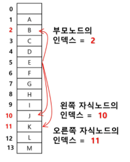
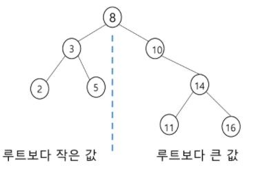

# Tree

---

[정의](# 정의)

[이진트리](# 이진트리)

- [이진트리의 저장](# 이진트리의 저장)

[이진탐색트리(bst, binary search tree)](# 이진탐색트리(bst, binary search tree))

[힙(heap)](# 힙(heap))

---

- 비선형
- 1:n 관계를 가지는 자료구조
- 계층형구조
- 상위->하위로 가면서 확장(트리)

## 정의

- 한개 이상의 노드로 이루어진 유한집합
  - 노드 중 최상위 노드를 루트라고 함
  - 나머지 노드는 n개의 분리집합, T1, T2...TN으로 분리되며, 이들은 루트의 부트리라고 함


- 형제노드: 같은 부모노드의 자식 노드들

  - BCD

- 조상노드: 간선을 따라 루트 노드까지 이르는 경로에 있는 모든 노드들

  - K 의 조상: FBA

- 서브트리: 부모노드와 연결된 간선을 끊었을때 생성되는 트리

- 자손노드: 서브 트리에 있는 하위 레벨의 노드들

  - B의 자손노드: E, F, K

    

- 차수(degree)

  - 자식노드의 수
  - 노드의 차수
    - B의 차수 2
    - C의 차수 1
  - 트리의 차수: 트리의 노드의 차수 중 가장 큰 값(3)
  - 단말노드(리프노드): 차수가 0인, 즉 자식노드가 없는 노드  / 루트는 부모가 없는 노드

- 높이

  - 루트에서 노드에 이르는 간선의 수, 노드의 레벨

  - .(상대적, 레벨 1부터 시작가능)

    

## 이진트리

- 각 노드가 자식노드를 <u>최대</u> 2개까지만 가질 수 있는 트리

  .

- 레벨 i에서의 노드의 개수는 최대 2^i개
- lv0 = 2^0 ->1  // lv1 = 2^i
- lv1 = 2^1 ->2 
- 최대 2^h개

`포화이진트리`

.

- 모든 레벨에 노드가 포화상태로 차있는 이진트리 (끝까지 다 차있음)
- 규칙 : 루트를 1번으로 정함 ! 왼쪽에서 오른쪽으로, 순서대로 내려가며 번호붙임 !!
- 높이 h,  2^h-1개의 노드를 가짐
- 2^h-1까지 정해진 위치에 대한 노드 번호 
- (루트 1번, 왼쪽에서 오른쪽으로, 순서대로 내려가며 번호붙임 )

`완전이진트리`

.

- 빈틈없이 채우는 느낌

- 높이가 h이고, 노드가 n 개 일때(단, h<=n<2^h-1)

  포화 이진트리의 노드번호 1번부터 n번까지 빈자리가 없는 이진트리

- <u>중간에 있는 노드번호가 빠지지 않음 !! 규칙은 위와 같음</u>


`편향이진트리`

.

- 높이 h에 대한 최소 개수의 노드를 가지면서 한쪽 방향의 자식노드만을 가진 이진트리
  - 왼쪽편향/ 오른쪽 편향


`이진트리-순회`

- 트리에 특화된 탐색방법 (bfs, dfs와 다름)
- <u>빠짐없이, 중복없이 각 노드를 방문하는 것 !</u>
- 비선형 구조라, 선후연결 관계를 알수없음


- 순회
  - 트리의 노드들을 체계적으로 방문하는 것
  - .
- 3가지의 기본적인 순회방법
  - 전위순회: VLR
    - 부모노드 방문 후, 자식을 좌, 우 순서로 방문
  - 중위 순회: LVR  (----->방향, 부모를 확인하긴함 ! 그래야, 왼오를 구분)
    - 왼쪽자식, 부모, 오른쪽 자식노드 순
  - 후위 순회: LRV
    - 자식노드를 좌우로 먼저 방문(post부터)    후,  부모노드 방문


`트리에 저장된 것을 활용하는 방식이 달라짐`

- 순회의 특징은 서브트리 내에서만 탐색하고 끝난다.


`전위순회`

- 슈도코드/dfs?

```python
def preorder_traverse(T):
    if T: #T is not none
        visit(T) #root /print(T.item)
        preorder_trasverse(T.left) #left에선 '본인이 새로운 T'.. 본인의 left 또다시 호출
        preorder_trasverse(T.right)  #자식이 없으면, return하고 다시 부모에서 오른쪽자식으로 가봄
```

- 진입한건 순서에 표시하기
- 왼쪽에 점찍기

.

- 가서 없으면 돌아오는 방식

.

```python
pre(T):
    visit(t):
        if t.left:
            pre(t.left)
        if t.right:
            pre(t.right)  #이렇게도 잇는데 잘안씀  ?
```


`중위순회`

- 슈도코드

```python
def inorder_traverse(T):
    if T: #T is not none
        inorder_trasverse(T.left) #왼쪽 먼저 찾으려면 루트는 통과하고 봐야함
        visit(T) #root
        inorder_trasverse(T.right) 
```

- 아래쪽에 점찍기

.


`후위순회`

```python
def postorder_traverse(T):
    if T: #T is not none
        postorder_traverse(T.left) 
        postorder_traverse(T.right) 
        visit(T) #root
```

부모 얼굴 보고 왼쪽으로감 --- 쭉 가서 없을때 ! (리턴하면서 순서에 표시)

돌아와서 오른쪽으로 감 (오른쪽에서 리턴해서 부모 처리함)

- 오른족에 점찍기

.


`이진트리의 표현`

`배열`

- n+1 개의 배열을 만듦 (정점번호를 idx로 저장)

- 노드번호의 성질

  - 노드번호가 i인 노드의 부모노드번호  i // 2
  - 노드번호가 i인 노드의 왼쪽 자식 노드번호 2 x i
  - 노드번호가 i인 노드의 오른쪽 자식번호 2 x i +1
  - 레벨 n의 노드번호 시작번호 2^n

  ..

  

  - 높이가 h인 이진트리를 위한 배열의 크기?
    - 레벨 i의 최대 노드수 = 2^i
    - .

  

### 이진트리의 저장


```python
'''
4
12133435
'''
def pre_order(v):
    if v: # 여기선 0번 정점이 없으므로. ..
        print(v)
        pre_order(ch1[v])
        pre_order(ch2[v])

def in_order(v):
    if v:
        in_order(ch1[v])
        print(v)
        in_order(ch2[v])
        
def post_order(v):
    if v:
        post_order(ch1[v])
        post_order(ch2[v])
        print(v)
        
        
e = int(input())  #edge수(간선)
arr = list(map(int, input().split()))
v = e + 1 #정점수 == 1번부터 v까지 정점이 있을때 마지막 정점
#이진트리 정점번호 규칙: 포화이진트리(1번루트가 핵심), 그외.. (1번루트가 아님/ 부모가 없는애를 찾아야함)

#부모번호를 인덱스로 자식번호를 저장
ch1 = [0]*(v+1)
ch2 = [0]*(v+1)
for i in range(e):
    p, c = arr[i*2], arr[i*2+1]
    if ch1[p]==0: #아직 자식이 없으면
        ch1[p] = c 
    else:
        ch2[p] = c
        
#print(ch1)
#print(ch2)     
pre_order(1)
pre_order(3)
in_order(1) #21435
post_order(3) #4, 5, 3
post_order(3) #2, 4, 5, 3, 1

```

```python
#자식번호를 인덱스로 부모번호를 저장
#루트를 찾을 수 있음
'''
4
2 1 2 4 4 3 4 5
'''

par = [0]*(v+1)
for i in range(e):
    p, c = arr[i*2], arr[i*2+1]
    par[c] = p
print(*par)
#root 찾기
for i in range(1, v+1):
    if par[i] == 0:
        root = i
        break
print(root) #루트 찾고, 얘부터 탐색 시작
in_order(2) # 1 2 3 4 5

#조상찾기
c = 5 #정점 c의 조상찾기
anc = []
while par[c] !=0:  #루트인지 확인
    anc.append(par[c]) #조상목록
	c = par[c]
print(*anc)  # 4 2 
```

```python
v = 5
tree = [[0, 0] for _ in range(v+1)] #왼쪽 오른쪽 누가 있는지
tree[0] = None
print(tree)

lst = '1 2 1 3 3 4 3 5'  #부모, 자식
lst = list(map(int, lst.split())) #정수로 바꿔서 리스트로 넣어줌

for i in range(0, len(lst), 2):
    parent = lst[i]
    child = lst[i+1]
	if tree[parent][0] ==0: #left
        tree[parent][0] = child
    else:
        tree[parent][1] = child #right
```

```
배열을 이용한 이진트리의 표현의 단점
- 편향 이진트리의 경우, 사용하지 않는 배열 원소에 대한 메모리 공간 낭비 발생
- 트리의 중간에 새로운 노드를 삽입하거나 기존의 노드를 삭제할 경우 배열의 크기변경이 어려워 비효율적
```

```python
값이랑 인덱스 헷갈리지 말것
만일 다를시, 튜플이나, 비어있다는 표시 등 자유롭게 표현
key: 위치 정보
```


`연결리스트`


#### 수식트리

- 수식을 표현하는 이진트리
- 수식이진트리라고 불림
- 연산자는 루트노드이거나, 가지노드
- 왼, 오 갔다와서 그 결과를 이용해서 return== 기본적으로 후위 순회 이용함
- .
- .


## 이진탐색트리(bst, binary search tree)

- 탐색작업을 효율적으로 하기 위한 자료구조

- 모든 원소는 서로 다른 유일한 키를 갖는다.

- key(왼쪽 서브트리) < key(루트노드) < key(오른쪽 서브트리)

- 왼쪽 서브트리와 오른쪽 서브트리도 이진 탐색트리다.

- 중위순회하면, 오름차순으로 정렬된 값을 얻을 수 있다. 1234...

- .

- 탐색연산

  - 루트에서 시작
  - 탐색할 키 값 x를 루트 노드의 키 값과 비교한다.
    - (키값 x = 루트노드의 키 값)인 경우: 원하는 원소를 찾았으므로 탐색연산 성공
    - (키값 x < 루트노드의 키 값)인 경우: 루트노드의 왼쪽 서브트리에 대해 탐색연산 수행
    - (키값 x > 루트노드의 키 값)인 경우: 루트노드의 오른쪽 서브트리에 대해 탐색연산 수행

  - .

- 삽입연산

  - 먼저 탐색 연산을 수행 
    - 삽입할 원소가 트리에 있는지 확인
    - 탐색 실패가 결정되는 위치 = 삽입위치
  - 탐색 실패한 위치에 원소를 삽입한다
    - 5를 삽입하는 예
    - .

- 삭제연산

  - .

  - 13, 12, 9 를 차례로 삭제해보기

  - 12는 자식이 하나라 그냥 지움

  - 9는 자식이 둘, 이땐 자리는 유지하고

    좌측 서브트리의 MAX값 

    또는 우측 서브트리의 MIN 값

- 탐색, 삽입, 삭제의 시간은 트리의 높이만큼 시간이 걸린다.

  - O(h), h : BST(binary search tree)의 깊이 (height)

- 평균의 경우

  - 이진트리가 균형적으로 생성되어 있는 경우
  - O(logn)

- 최악의 경우

  - 한쪽으로 치우쳤을시, O(n)

- 리프노드면 - 그냥 삭제

- 중간꺼 삭제하려면 왼 < 나 (12) < 오른쪽 일때, 그냥 삭제하고 연결해줘도 됨

- 연결리스트로 하는게, 좀 더 간편함.....  

  

## 힙(heap)

- 완전이진트리 구조이다! (배열과 인덱스로 표현하기 쉬움)

  (BST아님/  부모, 자식 간의 관계를 봄)

- 힙의 키를 우선순위로 활용하여, 우선순위 큐로 구현할 수 있다.

- 노드 중 키 값이 가장 크거나, 작은 노드를 찾기 위함 !

- 최대 힙(max heap)

  - 키 값이 가장 큰 노드를 찾기 위한 완전 이진트리
  - {부모노드의 키값 > 자식노드의 키값}
  - 루트노드: 키값이 가장 큰 노드

- 최소 힙(min heap)

  - 키 값이 가장 작은 노드를 찾기 위한 완전 이진트리

  - {부모노드의 키값 < 자식노드의 키값}
  - 루트노드: 키값이 가장 작은 노드

- .

- .
- 삽입전의 힙에서 6th를 last값으로 저장함
- 그 다음에 last += 1 증가시켜서, 삽입함
- .
- 자식이, 부모보다 키값이 큼
- 위로 올려줌/ 더 큰 부모를 만날때까지 올림

```python
'''
최대 100개의 정수  #n 이 키로 쓰임 
최대 힙
삽입
'''
def enq(n):  #우선순위 큐 구현에 쓰임
    global last
    last += 1
    tree[last] = n  #완전이진트리 유지/ 방금 받은 키 값을 넣어줌
    c = last # 방금 받은 자식노드의 값, 즉 새로 추가된 정점을 자식으로
    p = c//2  #완전 이진트리에서의 부모 정점 번호
    while p >=1 and tree[p] < tree[c]: #처음 받아서 last가 0인거랑 비교할 수 없으니까 p값 설정
        tree[p], tree[c] = tree[c], tree[p]      #부모가 있고, 자식의 키값이 더 크면 교환
        c = p
        p = c//2  #올라간애를 자식으로, 부모랑 비교해줘야함
        
        
    

# 즉 포화이진트리의 정점번호
tree = [0]*101 #키 값이 추가가 될때마다, 마지막 정점번호를 +1 해줌 
last = 0  #마지막 정점번호
enq(3)
enq(2)
enq(4)
enq(7)
enq(5)
enq(1)
print(tree[1])  #7...
```

- 

  

```python
'''
힙에선, '루트노드의 원소만을 삭제할 수 있다.'
# 1) 1th 원소 삭제 후 반환해두기// 삭제후 반환
최대 힙이면, 자식중에 큰애를 찾음 !! (최소힙이면 반대)
큰 자식을 위로 올려보냄
더 큰 자식이 있거나, 더이상 자식이 없을때까지 //혹은, 더 큰 자식이 없을때
'''

def deq():
    global last
    tmp = tree[1] #루트의 key값
    tree[1] = tree[last] #마지막 노드의 키를 루트에 복사
    last -= 1 		#마지막 노드 삭제 (실제로 자른건 아니고 인덱스만 가지고 한 것)
    #부모>자식 규칙 유지/ 최대힙
    p = 1 #루트와, 루트의 자식을 비교해야함 (루트에 올라갔기 때문에)
    c = p *2 #왼쪽자식노드 번호
    while c<=last: #왼쪽 자식이 있으면 (노드가 두개였으면 없을수도 있음)
        if c+1 <= last and tree[c]<tree[c+1]:   #오른쪽자식이 있고 and 더 크면
            c += 1 #오른쪽 자식 선택
        if tree[p] < tree[c]: #자식의 키값이 더 크면 교환
            tree[p], tree[c] = tree[c], tree[p]   # 4번에서, 내려간걸 새로운 부모로 두고, 또다시 비교
            p = c #자식을 새로운 부모로 두고
            c = p*2
        else:
            break  #사실 같은 경우는 없기 때문에, 그 담엔 안하면 됨.. 자식이 없는 경우는 while문에서 걸러질것
    return tmp
            
    
    
    
# 즉 포화이진트리의 정점번호
tree = [0]*101 #키 값이 추가가 될때마다, 마지막 정점번호를 +1 해줌 
last = 0  #마지막 정점번호
enq(3)
enq(2)
enq(4)
enq(7)
enq(5)
enq(1)
print(tree[1])  #7...
enq(9)
print(tree[1])
while last > 0:  # 다꺼낼거야
    print(deq(), tree[1])
#힙에다가 다 넣었다가 꺼내면, sort가 됨


'''
7
9
9 7   키값이, 클수록 밥을 먼저 먹을 수 잇다. 
7 5   9가 먼저 먹을 수 있으니까, 실제 출력은 이름으로 해서 ...ㅇㅇ
5 4
4 3
3 2
2 1
1 1
'''
```

- .

```python
# 완전이진트리에서의 순회
def  pre_order(v):
    global last
    if v<last: #마지막 정점번호 이내이면,
        print(v)  #visit(v)
        pre_order(v*2) #왼쪽자식정점방문
        pre_order(v*2+1)
완전이진트리에선, 부모를 기준으로 자식을 가져오는게 아니라 연산을 통해 가져오는방법
```

```python
def pre_order(v):
    if v: # 여기선 0번 정점이 없으므로. ..
        print(v)
        pre_order(ch1[v])
        pre_order(ch2[v])
위랑 비교해보자면 
위는 연산에 의해서 값을 전달하고, 
밑은 저장된걸 갖고와서 주면 됨

    2
1      4
    3    5
완전이진탐색이 아니라서, 규칙이 없기 때문에, 부모자식을 저장해줘야함.
저장된걸 가져와야 이동할 수 있음
```

---

---

---

정확하지 않음 다시 찾아보고 정리..힙큐

```python
import heapq
heapq.heappop(eun)
heapq.heappush(eun, 10)
heapq.heqpify  #

heap = [0]
#자료를 넣을때
a = 10
def insert(heap, a):
    heap.append(a)
    while last: #	
        last = len(heap)
        parent = last //2
        if heap[parent] <heap[last]:
            heap[parent], heap[last] = heap[last], heap[parent]
            last = parent
        else:
            break
#삭제
def delete(heap):
    res = heap[1]
    heap[1] = None
    heap[1] = heap.pop()
	i = 1
    l = len(heap)
    while 2*i+1<l:
    if heap[2*1]<heap[2*i+1]:
        tmp = 2*i+1
    else:
        tmp = 2*i
    if  heap[i] > heap[tmp]:
        heap[i], heap[tmp] = heap[tmp], heap[i]
        i = tmp
```

```python
heap = [50, 10, 20]
import heapq
heapq.heapify(heap)
print(heap)  #[10, 50, 20]

print(heapq.heappop(heap)) 
print(heap) #[20, 50]

print(heapq.heappop(heap)) 
print(heap) #[50]  #힙큐는 최소힙만 들어감
#최대로 쓰려면 (-a, a) 넣어서....ㅎ....


유튜브 보기........................................
```


:carrot:

