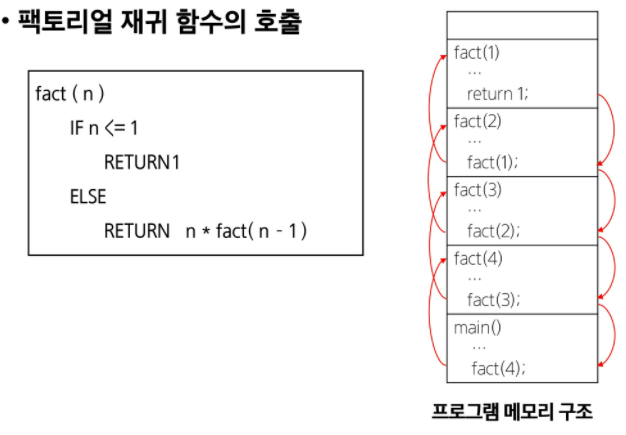
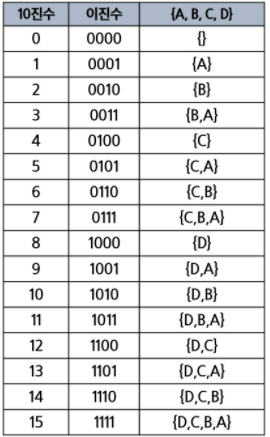
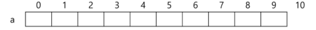
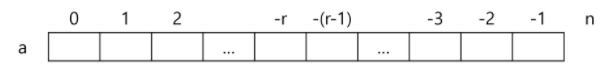
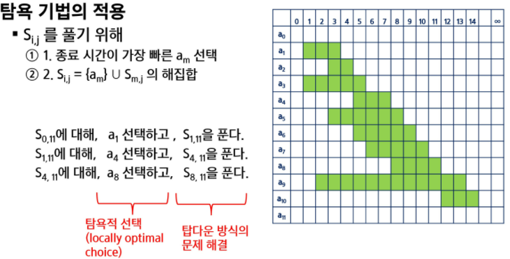
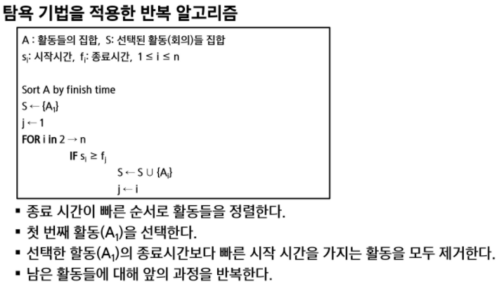

## 완전검색&그리디

.

- 반복, 재귀
  - 재귀: 반복알고리즘보다 더 많은 메모리와 연산을 필요로 한다. (이전상태의 정보를 저장해야하기 때문)
  - 입력값 n이 커질수록 재귀 알고리즘은 반복에 비해 비효율적일 수 있다.

.


### 완전검색

- 모든 경우의 수를 생성하고 테스트해서, 수행속도는 느림
- 해답을 찾아내지 못할 확률이 작다.
- 고지식한 방법(brute-force)
- 고려할 수 있는 모든 경우의 수 생성하기 (순열, 조합, 부분집합)

- ```python
  baby-gin
  - 0-~9사이의 숫자 중 임의로 6장을 뽑았을때, 123, 666 (run, triplet) 여부
  - 6장 모두 run혹은 triplet일때 baby-gin!
  6개의 숫자로 만들 수 있는 모든 숫자 나열 (중복포함)
  
  앞의 3자리, 뒤의 3자리 나누어 테스트하고 판단 !
  ```

  

#### 순열

- 몇개를 뽑아서, 순서대로 나열하는 것

```
nPr = n x n-1 x n-2 x... (r개)  , (n-r)!/(n-r)!    , n!/(n-r)!
nPn = n!
```

- TSP(Traveling salesman problem)
- n개의 요소에 대해, n!개의 순열이 존재
  - 12! = 479,001,600
  - n>12인경우, 시간복잡도 폭발적으로 증가

- 수도코드

``` python
p[] 순열저장배열, arr[i]순열 만드는데 사용할 숫자배열
n: 원소의 개수, i: 선택된 원소의 수
used[N-1]: 사용여부,  p결과저장배열
perm(n, k): #n인덱스 k내가 채울크기
    if n==k:
        if(n==k) print_arr()
    else:
        for i: 0->k-1 #모든 원소에 대해
            if not used[i]: #사용된 적이 없으면
                p[n] = arr[i] #순열에 사용
                used[i] = True #사용됨으로 표시
                perm(n+1, k)
                used[i] = False #다른자리에서 사용가능     #원상복귀하고, 바꿔주기?
```

- 3개 중에 3개

```python
def f(n, k):  #순열 p[n]을 채우는 함수, k배열의 크기
    if n==k:
        print(p)
    else:
        for i in range(k): # used에서 사용하지 않은 숫자 검색
            if used[i]==0: #사용된 적이 없으면
                used[i] = 1 #사용함으로 표시   # 사용표시 안하면, 중복순열로 사용 가능함
                p[n] = a[i] #p[n]결정  #순열에 사용(a에 i를 복사)
                f(n+1, k) #다음자리결정하러 이동
                used[i] = 0 #a[i]를 다른 위치에서 사용할 수 있도록 함
    return

a = [1,2,3]
p = [0]*3
used = [0]*3
f(0, 3)
```

- 좀 더 기본코드 ! (5개 중에 3개 고르기)

```python
def f(n, k, m):  #순열 p[n]을 채우는 함수, k 고를 개수, m 주어진 숫자 개수
    if n==k:
        print(p)
    else:
        for i in range(m): # used에서 사용하지 않은 숫자 검색
            if used[i]==0: #사용된 적이 없으면
                used[i] = 1 #사용함으로 표시
                p[n] = a[i] #p[n]결정  #순열에 사용(a에 i를 복사)
                f(n+1, k, m) #다음자리결정하러 이동
                used[i] = 0 #a[i]를 다른 위치에서 사용할 수 있도록 함
    return

a = [1,2,3,4,5] #주어진 5개에서, 3개 고르기
p = [0]*3 #perm
used = [0]*5
f(0, 3, 5) #5개에서 3개 골라야돼
```

- 교수님 코드 

```python
def func(perm):
    if len(perm) == r:
        print(perm)
        return
        #f2(perm) # 순열 조합을 사용하는 함수
    for i in lst:
        if i not in perm:  # 지우면, 중복순열
            perm.append(i)
            func(perm)
            perm.pop()

lst = [1, 2, 3, 4, 5]
r = 3
func([])
#---------
def func(perm, visited):
    if len(perm) == r:
        print(perm)
        return

    for i in lst:
        if i not in perm:
            perm.append(i)
            func(perm, visited+[i])
            perm.pop()


lst = [1, 2, 3, 4, 5]
v = []
r = 3
func([], v)
```


- babygin

  ```python
  def f(n, k):  #순열 p[n]을 채우는 함수, k 고를 개수
      if n==k:
          print(p)
      else:
          for i in range(k): # used에서 사용하지 않은 숫자 검색
              if used[i]==0: #사용된 적이 없으면
                  print(used)
                  used[i] = 1 #사용함으로 표시
                  p[n] = a[i] #p[n]결정  #순열에 사용(a에 i를 복사)
                  f(n+1, k) #다음자리결정하러 이동
                  used[i] = 0 #a[i]를 다른 위치에서 사용할 수 있도록 함
      return
  
  a = [0, 1, 2, 3, 4, 5, 6, 7, 8, 9]
  p = [0]*6
  used = [0]*6
  f(0, 6)
  ```

- 바이너리 카운팅

.

```python
arr = [3, 6, 7, 1, 5, 4]
n = len(arr)
# 0~2^n-1
for i in range(0, (1<<n)):  #1<<n: 부분집합의 개수
    for j in range(0, n):	#원소의 수만큼 비트를 비교함
        if i&(1<<j): #i의 j번 비트가 1이면 j번째 원소 출력
            print('%d'%arr[j],end='')
	print()
```


#### 조합

- 순서없이, 몇개를 뽑는 것

```python
nCr = n!/(n-r)!r!
nCr = n-1Cr-1 + n-1Cr  #재귀적 표현
nC0 = 1
```


- 10개중에 3개 고르기
- .

```python
for i: 0->7(n-r)     #j, k로 선택될 원소 남김
    for j: i+1 -> 8  #k로 선택될 원소 남김
        for k: j+1 -> 9
            f(a[i],a[j],a[k])
```


- n개에서 r개 고르기 (재귀)
- .

```python
def nCr(n, r, s): #n개에서 r개를 고르는 조합, s선택할 수 있는 구간의 시작
    if r==0:
        print(*comb)
    else:
        for i in range(x, n-r+1):
            comb[r-1] = A[i]
            nCr(n, r-1, i+1)
```


- 0~9까지 중에 3개 고르기  <기본>

```python
def f(i, j, k):
    print(i, j, k)
N = 10
R = 3
for i in range(N-2):
    for j in range(i+1, N-1):
        for k in range(j+1, N):
            f(i, j, k)
```

- n개에서 r개를 고르는 조합

```python
def nCr(n, r, s): # n개에서 r개를 고르는 조합, s:고를수 있는 구간의 시작 인덱스
    if r==0:
        print(comb)
    else:
        for i in range(s, n-r+1):
            comb[3-r] = A[i] #순서 바꾸고 싶으면 comb변형...r-1
            nCr(n, r-1, i+1)

n = 5
r = 3
comb = [0]*3
A = [i for i in range(1, n+1)]
nCr(n, r, 0)
```

```python
def nCr(n, r, s, k):
    if r==0:
        print(comb)
    else:
        for i in range(s, n-r+1):
            comb[3-r] = A[i]
            nCr(n, r-1, i+1, k)
# n 하고 r이 바뀌는 방식에 유용
n = 5 # n개에서
r = 4 #r개
k = r
comb = [0]*r
A = [i for i in range(1, n+1)]
nCr(n, r, 0, k)
```

- n개에서 r개를 고르는 조합, s 선택구간의 시작, k 고른개수

```python
def nCr(n, r, s, k):
    if k==r:
        print(*comb)
    else:
        for i in range(s, n-r+k+1): #n-r+k 선택할 수 있는 구간의 끝
            comb[k] = A[i]
            nCr(n, r, i+1, k+1)
n = 5
r = 3
A = [i for i in range(1, n+1)] 
comb = [0]*r
nCr(n, r, 0, 0)
```

- 교수님 코드

```python
# 조합
def make_combi_2(combi, idx):

    if len(combi) == r:  # 이부분 없으면 그냥 부분집합
        print(combi)
        return

    for i in range(idx+1, len(lst)):
        combi.append(lst[i])
        make_combi_2(combi, i)
        combi.pop()

make_combi_2([], -1)
lst = [1, 2, 3, 4, 5]
r = 3
```

```python
def func(idx, n, r, res):
    if idx ==r:
        print(res)
    start = 1
    if len(res):
        start = max(res)+1
        # start = max(res)  # +1이 없다면 중복 허용

    for i in range(start, n):
        res.append(i)
        func(idx+1, n, r, res)
        res.pop()
        
func(0, 6, 3, [])  #n값 변경
```


### 탐욕 알고리즘 (greedy)

- 여러 경우중 하나를 선택할때마다, '그 순간에 최적이라고 생각되는 것을 선택'
- 다만, 그것이 `최적이라는 보장이 없음`
- 한번 선택된 것을 번복하지 않음
- 최적화문제
- 동전, 배낭짐싸기 ( dp )
- 0-1 knapsack 가능한 모든경우
- fraction잘라서 담기, 탐욕적으로 풀수 있음 (무게 큰거부터 하면됨)


- 활동선택 문제(회의실 시간배정)

  .

  .

```python
s<-a1 첫번째 활동을 우리가 선택할 활동에 넣기
j<-1 현재 선택할 활동의 번호를 넣기
for i in 2->n: #2번째 활동부터 마지막 활동까지
    if si>=fj: #현재 j가 선택될 활동인데, 이게 끝나는 시간 이후에 시작될 애들 중에
        s<-s U {Ai} # i번이 j가 끝나는 시간 이후에 시작하면 i번을 선택하고
        j<- i #새로운 j로 만들어줌 
```

(재귀도 가능하지만, 끝까지 반복하면서 선택해야해서, 반복구조 권함 !)


- 2차원 배열에서 순열 또는 조합 고르기

- NxN 배열 만들기

  ```python
  # 10 개의 원소 중 3개 고르기
  (0, 0) (0, 1) (0, 2) (1, 0 )(1, 1)... 다 넣기
  0 1 2 3
  4 5 6 7
  7 8 9
  for i in range(7): #j로 선택될 원소 남김
      for j in range(i+1, 8): #k로 선택될 원소 남김
          for k in range(j+1, 9):
              f(a[i], a[j], a[k]) 
  ```


---

---

`코드추가`

```python
lst = [1, 2, 3, 4, 5]
div = '#'*30
r = 3

# 순열
def make_perm(perm):
    if len(perm) == r:
        print(perm)
        return
        #f2(perm) #순열조합을 사용하는 함수
    for i in lst:
        if i not in perm: #지우면 중복순열
            perm.append(i)
            make_perm(perm)
            perm.pop()

print(div, '순열', div)
make_perm([])

# 중복순열
def make_perm_re(perm):
    if len(perm) == r:
        print(perm)
        return
    for i in lst:
        # if i not in perm:
        perm.append(i)
        make_perm_re(perm)
        perm.pop()

print(div, '중복순열', div)
make_perm_re([])


# 조합 / sort 된 상태에서
def make_combi(combi):

    if len(combi) == r:
        print(combi)
        return


    for i in lst:
        if combi and i <= max(combi):
            continue
        combi.append(i)
        make_combi(combi)
        combi.pop()

print(div, '조합', div)
make_combi([])


#########
# 조합
def make_combi_2(combi, idx):

    if len(combi) == r:
        print(combi)
        return

    for i in range(idx+1, len(lst)):
        combi.append(lst[i])
        make_combi_2(combi, i)
        combi.pop()


print(div, '조합', div)
make_combi_2([], -1)
 
## 또는
def dfs(n, r, idx):
    if len(bit) == r:
        print(*bit)
    else:
        for i in range(idx, n+1):
            if i not in bit:
                bit.append(i)
                dfs(n, r, idx+1)
                bit.pop()


n, r = map(int, input().split())

bit = []
res = dfs(n, r, 1)


# 중복조합 / sort 된 상태에서
def make_combi_re(combi):

    if len(combi) == r:
        print(combi)
        return


    for i in lst:
        if combi and i <= max(combi):  # 콤비가 첨에 비기 때문에 max라는걸 가질 수 없음
            continue
        combi.append(i)
        make_combi(combi)
        combi.pop()

print(div, '중복조합', div)
make_combi_re([])        


# 중복조합
def make_combi_2_re(combi, idx):

    if len(combi) == r:
        print(combi)
        return

    for i in range(idx, len(lst)):
        combi.append(lst[i])
        make_combi_2_re(combi, i)
        combi.pop()


print(div, '중복조합', div)
make_combi_2_re([], 0)    
```

```python
# 순열

def perm( n,  k ): # p[n]을 채워서 k개의 숫자로 만드는 순열, 인덱스가 사전순으로 생성
    if n == k:
        print(p)
    else:
        for i in range(k):		# 모든 원소에 대해
            if used[i] == 0:    # 사용된 적이 없으면
                p[n] = arr[i]	# 순열에 사용
                used[i] = 1 	# 사용됨으로 표시
                perm(n+1, k)
                used[i] = 0	# 다른 자리에서 사용가능

arr = [1,2,3]
p = [0]*3
used = [0]*3
perm(0, 3)

def f(n, k, m):    # 순열 p[n]을 채우는 함수. k 고를 개수, m 주어진 숫자 개수
    if n==k:
        print(p)
    else:
        for i in range(m): # used에서 사용하지 않은 숫자 검색
            if used[i] == 0:    # 앞에서 사용하지 않은 숫자인 경우
                used[i] = 1     # 사용함으로 표시
                p[n] = a[i]     # p[n] 결정
                f(n+1, k, m)
                used[i] = 0     # a[i]를 다른 위치에서 사용할 수 있도록 함
    return

a = [1,2,3,4,5]
p = [0]*3
used = [0]*5
f(0, 3, 5)


# 조합
def nCr(n, r, s):   # n개에서 r개를 고르는 조합. s 고를 수 있는 구간의 시작 인덱스
    if r==0:
        print(comb)
    else:
        for i in range(s, n-r+1):
            comb[r-1] = A[i]
            nCr(n, r-1, i+1)

n = 5
r = 3
comb = [0]*3
A = [i for i in range(1, n+1)]
nCr(n, r, 0)


def nCr(n, r, s, k):   # n개에서 r개를 고르는 조합. s 고를 수 있는 구간의 시작 인덱스
    if r==0:
        print(comb)
    else:
        for i in range(s, n-r+1):
            comb[k-r] = A[i]
            nCr(n, r-1, i+1, k)

n = 10
r = 3
k = r
comb = [0]*r
A = [i for i in range(1, n+1)]
nCr(n, r, 0, k)
```

