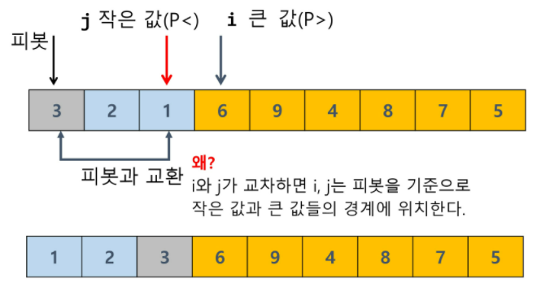

# 분할정복&백트래킹

- [병합정렬(merge-sort)](# 병합정렬(merge-sort))
- [퀵소트](# 퀵소트)
- [이진검색(binary search)](# 이진검색(binary search))
- [백트래킹](# 백트래킹)

.

- 반복알고리즘이 O(n)이면, 분할정복 알고리즘은 O(logn)이다.

  ```python
  #반복
  def f(x, n):
      result <-1
      for i in 1->n:
          result = result*x
      return result
  #분할정복
  def recursive_power(x, n):
      if n==1: return x
      if n is even:
          y <-recursive_power(x, n/2)
          return y*y
      else:
          y <-recursive_power(x, (n-1)/2)
          return y*y*x
      
  # 분할정복
  def Power(base, exponent):
      if exponent == 0 or base ==0:
          return 1
      if exponent%2  ==0:  #if else구조면, 재귀호출시 한 갈래로만 간다..
          newbase = power(base, exponent/2)
          return newbase*newbase
      else:
          newbase = power(base, (exponent-1)/2)
          return (newbase*newbase)*base
  ```

  


## 병합정렬(merge-sort)

- 병합단계: 2개의 부분집합을 정렬하면서, 하나의 집합으로 병합
- 특징: 인덱스만 올려보냄
- 단점: 분할시마다, `새로운 메모리 공간을 사용/대신 빠름`
- O(nlogn)
- f(n) = 2 - f(n/2) + n


- ```python
  def Power(base, exponent):
      if exponent == 0 or base ==0:
          return 1
      if exponent%2  ==0:  #if else구조면, 재귀호출시 한 갈래로만 간다..
          newbase = power(base, exponent/2)
          return newbase*newbase
      else:
          newbase = power(base, (exponent-1)/2)
          return (newbase*newbase)*base
  ```


<수도코드>

- 분할

  ```python
  merge_sort(list m):
      if length(m) == 1: return m
      list left, right # 선언
      middle <- length(m)/2
      for x in m before middle:
          add x to right
      left <- merge_sort(left)
      right <- merge_sort(right)
      return merge(left, right)
  # code base
  def merge_sort(lst):
      if len(lst) == 1:
          return lst
  
      middle = len(lst)//2
  
      left = lst[:middle]
      right = lst[middle:]
  
      left = merge_sort(left)
      right = merge_sort(right)
  
      return merge(left, right)
  ```

- 병합

  ```python
  merge(list left, list right):
      list result
      while length(left) > 0 or length(right) > 0: # 원소가 남아있는 경우
          if length(left) > 0 and length(right) >0: # 둘다 있을시
              if first(left) <= first(right): # 작은거 붙이기
                  append popfirst(left) to result
              else:
                  append popfirst(right) to result
          elif length(left) >0: # 마지막쯤, 한쪽만 남을때  왼
              append popfirst(left) to result
          elif length(right) >0:  #오
              append popfirst(right) to result
      return result
  # code base
  def merge(left, right):
      result = []
      while left or right:
  
          if left and right:
              if left[0] <= right[0]:
                  result.append(left.pop(0))
              else:
                  result.append(right.pop(0))
          elif left:
              result.extend(left)
              break
          elif right:
              result.extend(right)
              break
  
      return result
    
  ```
  

```python
# 자세히------------------------------------------------------------------
# 정렬하고 배열 반환
def merge_sort(arr):
    if len(arr) == 1:
        return arr
    # 전체를 절반으로 나누고
    mid = len(arr)//2
    # range(0, mid)
    # range(mid, len(arr))
    left = arr[:mid]
    right = arr[mid:]
    # 나뉜 각각을 정렬하고  # merge 후 또 받아서 또 병합할것
    left = merge_sort(left)
    right = merge_sort(right)
    # 정렬된 각각을 병합
    return merge(left, right)

# 나누어진 두 개의 배열을 하나로 합쳐주기(정렬하면서)
# 정렬된 배열 반환
def merge(left, right):
    result = []
    i = j = 0
    left_l = len(left)
    right_l = len(right)
    while i<left_l or j<right_l:# i와 j가 left와 right의 범위 안에 있으면 계속
    # 둘중에 하나라도 길이가 남아있다면 수행해라 ~
    # 근데, 둘 다 남아있어야 비교가 가능하기 때문에
        if i < left_l and j < right_l:
            if left[i] < right[j]:
                result.append(left[i])
                i += 1
            else:
                result.append(right[j])
                j += 1
        else: # 둘 중 하나는 이미 비교할 요소가 없음
            if i < left_l: # 왼쪽 요소가 남은것
                result.append(left[i])
                i += 1
            else: # 오른쪽 요소가 남은것
                result.append(right[j])
                j += 1
    return result

arr = [0, 7, 2, 6, 4, 9, 3, 8, 1, 5]
print(merge_sort(arr))
```


*퀵소트와의 차이점*

> 퀵정렬 : 우선 피벗을 통해 정렬(partition) → 영역을 쪼갬(quickSort)  // 기준값보다 작은거, 큰거
>
> 병합정렬 : 영역을 쪼갤 수 있을 만큼 쪼갬(mergeSort) → 정렬(merge)  // 무조건 반을 나눔

## 퀵소트

- [Hoare-partition algorithm](# Hoare-partition algorithm)

- [lomuto partition 알고리즘 **](# lomuto partition 알고리즘 **)

```python
quicksort(A[], l, r): #l, r정렬할 구간의 idx
    if l<r:
        s <- partition(a, l ,r):
            quickSort(A[], l, s-1)
            quickSort(A[], s+1, r)
#code_base
def quick_sort(lst, l, r):
    if l < r:
        pivot = partition(lst, l, r) # 밑에서
        quick_sort(lst, l, pivot-1)
        quick_sort(lst, pivot+1, r)
```

```python
# 이전에 학습한 partition algorithm
def partition(alist, start, end):
    pivot = alist[start]
left = start+1
    right = end
    done = False
while not done:
        while left <= right and alist[left] <= pivot:
            left += 1
        while alist[right] >= pivot and right >= left:
            right -= 1
if right < left:
            done = True
        else:
            tmp = alist[left]
            alist[left] = alist[right]
            alist[right] = tmp
    tmp = alist[start]
    alist[start] = alist[right]
    alist[right] = tmp
    return right
def quickSort(alist, start, end):
    if start < end:
        pivot = partition(alist, start, end)
        quickSort(alist, start, pivot-1)
        quickSort(alist, pivot+1, end)
    return alist
```

###### Hoare-partition algorithm

```python
## Hoare-partition algorithm
partition(a[], l, r):
    p <- a[l] #p피봇
    i<-l, j<-r
    while i<=j:
        while i<=j and a[i]<=p: i++  # 같거나 작으면 계속 증가//  큰애를 찾으면 멈춤
        while i<=j and a[j]>=p: j--  # 같거나 크면 계속 감소//   작은애를 찾으면 멈춤// 여기서 두개가 교차되는건 아님
        if i<j: swap(a[i], a[j])
    swap(a[l], a[j])
    return j

# code_base
def hoare_partition(lst, l, r):
    pivot = lst[l]
    i = l
    j = r
    while i <= j:
        
        while i <= j and lst[i] <= pivot:
        # while not (lst[i] > pivot):
            i += 1
        while i <= j and lst[j] >= pivot:
            j -= 1
        if i < j :
            lst[i], lst[j] = lst[j], lst[i]
            
    lst[l], lst[j] = lst[j], lst[l]
    #lst[l] 자리에, j가 들어가야 함

    return j # 정렬된 것이 무엇인지.. (j가 i일 것임, 만났을때 멈추므로)
```




​															우측 배열의 재귀깊이가 깊어짐				

###### lomuto partition 알고리즘 **

```python
## lomuto partition
partition(a[],p,r):
    x<-a[r]  #r이 x값이 됨
    i<-p-1  #i는 뒤에 가있음   # 특징: 양방향에서 오는게 아니라, 한 방향에서 출발함
    for j in p->r-1:
        if a[j]<=x:  #j 가 가리키는 애가 피봇보다 작으면
            i ++, swap(a[i], a[j])     # 피봇보다 작으면 i가 증가하다가, 큰애를 만나면 멈춤
            						 #  i는 그대로 (현재까지 찾은 작은값의 가장 오른쪽)
			                 # j만 증가(피봇보다 큰 곳에서) 작은것을 만나면 큰것중 젤 왼쪽꺼랑 자리를 바꿈
        swap(a[i+1]. a[r])   #i+1 위치가, 피봇보다 큰애들이 시작하는데니까 , 피봇이 들어와
    	return i+1
    
# code_base
def lomuto_partition(lst,l,r):  #r이  인덱스역할
    pivot = lst[r]
    i = l-1
    for j in range(l, r):  #r+1도 됨
        if lst[j] <= pivot:
            i += 1
            lst[j], lst[i] = lst[i], lst[j]
    lst[r], lst[i+1] = lst[i+1], lst[r]
    return i+1
 
# pythonic !
lst = [1, 2, 3, 4, 5, 6, 7, 8, 9, 0]
pivot = 6
left = [x for x in lst if x<pivot] # 왼쪽엔 작은거
right = [x for x in lst if x > pivot] # 오른족엔 큰거
result = left + [pivot] + right
```


## 이진검색(binary search)

- [검색(search)](../../../CS-Study/01_algorithm/검색(search))

## 백트래킹

- [백트래킹](../02_stack/백트래킹)


#### 상태공간트리를 구축하여 문제를 해결

- {1, 2, 3}의 powerset을 구하는 백트래킹 알고리즘

```python
backtrack(a[], k, input):  # k개를 결정
    c[MAXCANDIDATES] # 후보군 저장
    ncands #후보의 수
    IF k == input: process_soulution(a[], k)  #부분집합이 완성됐으면, 내가 원하는 답이 있는지 찾기
    ELSE:
        k++ #개수증가
        make_candidates(a[],k,input,c[],ncands) #후보추천  (추천후보결정한 결과, 현재 선택개수, 추천후보저장, 개수넣기)
        FOR i in 0 -> ncands -1  # 후보가 ncands개라고 ?
            a[k] <- c[i] # 꺼내서 넣을꺼야
            backtrack(a, k, input) # 다음번 후보 고르러 이동
main()
	a[MAX]  // powerset 저장할 배열
    backtrack(a[], 0, 3) // 3개의 원소를 가지는 powerset
    
    
make_candidates(a[],k,n,c[],ncancds):
    c[0] <- 1  (true)
    c[1] <- 0  (false)
    ncancds <- 2
    
process_solution(a[],k):
    for i in 1->k:
        if a[i] == True: print(i)
```

##### [부분집합](../02_Stack/부분집합_순열)

- 순열 - 위와 backtrack 코드 동일함 !
- make_candidates와 process만 변경해주면 됨

```python
backtrack(a[], k, input):  # k개를 결정
    c[MAXCANDIDATES] # 후보군 저장
    ncands #후보의 수
    IF k == input: process_soulution(a[], k)  #부분집합이 완성됐으면, 내가 원하는 답이 있는지 찾기
    ELSE:
        k++ #개수증가
        make_candidates(a[],k,input,c[],ncands) #후보추천  (추천후보결정한 결과, 현재 선택개수, 추천후보저장, 개수넣기)
        FOR i in 0 -> ncands -1  # 후보가 ncands개라고 ?
            a[k] <- c[i] # 꺼내서 넣을꺼야
            backtrack(a, k, input) # 다음번 후보 고르러 이동
main()
	a[MAX]  // 순열을 저장할 배열
    backtrack(a[], 0, 3) // 3개의 원소를 가지는 순열
    
    
make_candidates(a[],k,n,c[],ncancds):
    in_perm[NMAX]<-FALSE # 사용된 숫자인지 기록할 배열
    for i in l-> k-1: # a[],k에 들어갈 숫자를 찾는데,            ###사용하지 않은 목록 만들기##
        in_perm[a[i]] <- TRUE  # 사용된 숫자를 표시함
        
    ncands<-0  # 표시된 결과를 이용해서 여전히 false인 애를 넣어준다.
    for i in 1 -> n:
        if in_perm[i] == FALSE:  #in_perm 에서 확인
            c[ncands] <- i
            ncancds++
    
process_solution(a[],k):
    for i in 1->k: print(a[i])
    
```

```python
순열만드는 방법
1. 자리교환
2. 사용한 숫자 표시
3. 사용하지 않은 목록 만들기
```


## 트리

- [트리](../04_Tree/tree)


