#  그래프

:smiley: 

- 정점과 간선들의 집합으로 구성된 자료구조
- |V|; 정점의 개수
- |E|; 간선의 개수
- ex) 최대 |V|(|V|-1) / 2 개의 간선
- N:N 관계를 가지는 원소 표현


- 그래프 
  - 무향, 유향(방향성)
  - 가중치 (간선에 비용 적음)
  - 사이클이 없는 방향그래프(DAG)
  - 완전, 부분 그래프
- 인접 정점
  - 인접: 두개의 정점에 간선이 존재하면, 서로 인접해 있다고 함
- 경로
  - 단순 ;0-2-4
  - 사이클 ;1-3-5-1
- 표현
  - 인접행열
    - |V| x |V| 크기의 2차원 배열을 이용해 간선정보를 저장
    - 인접 = 1 or 0
    - 무향, 유향 그래프
    - 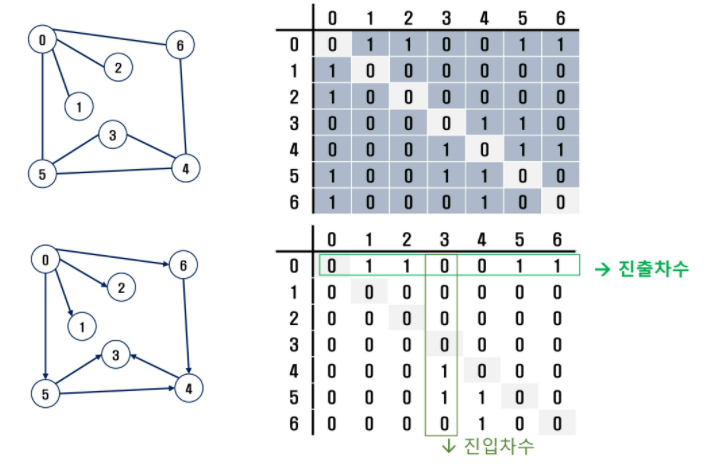
    - 단점: 비어있는 공간이 생김
  - 인접 리스트
    - 각 정점마다 해당 정점으로 나가는 간선의 정보를 순차적으로 저장
    - 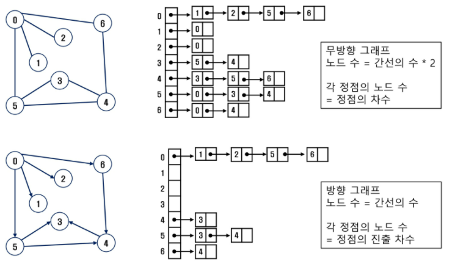
  - 간선의 배열
    - 간선을 배열에 연속적으로 저장

```python
'''
마지막 정점번호, 간선수
6 8
0 1 0 2 0 5 0 6 5 3 4 3 5 4 6 4
'''

def dfs1(v, V):
    visited[v] = 1
    print(v, end = ' ')
    for w in range(V+1): # v에 인접한 노드 w들에 대해
        if adjM[v][w] and visited[w]==0: #1이면
            dfs1(w, V)
def dfs2(v, V):
    visited[v] = 1
    print(v, end = ' ')
    for w in adjL[v]: # v에 인접한 노드 j들에 대해
        if visited[w]==0: # 방문하지 않은 곳이면
            dfs2(w, V)


V, e = map(int, input().split()) # v 마지막 정점 번호, e 간선수
arr = list(map(int, input().split()))
adjM = [[0]*(V+1) for _ in range(V+1)] # 인접행렬
adjL = [[] for _ in range(V+1)] # 인접리스트

for i in range(e):
    n1, n2 = arr[i*2], arr[i*2+1]
    adjM[n1][n2] = 1
    adjM[n2][n1] = 1   # 무향 그래프인 경우 사용(유향시 X)


for i in range(e):
    n1, n2 = arr[i*2], arr[i*2+1]
    adjL[n1].append(n2)
    adjL[n2].append(n1) # 무향 그래프인 경우 사용(유향시 X)
    
visited = [0]*(V+1)
#dfs1(0, V)
dfs2(0, V)
#print()
```


- DFS

  ```python
  stack s  # 스택 생성
  visited []
  def dfs(v): 
      push(s, v) # 출발정점 push
      visited[v] = True
      while not isempty(s):
          v = pop(s)
          visit(v)
          for each w in adjacency(v):   # 꺼낸 자식의 인접인자중, 스택에 들어있지 않은애 넣어줌
              if not visited[w]:
                  push(s, w)         
                  visited[v] = True
  ```

  - 내가 조사한 순서대로 스택에 넣어두고 꺼내기

  - ```python
    #stack
    1  #인접 자식 꺼내서 비지티트
    2|3 --> pop
    2|7 --> pop
    2|6 --> pop  
    2|4|5 --> pop
    2|4 --> pop
    2 --> pop
    ```

  - - 출력결과-> `1, 3, 7, 6, 5, 4, 2`

    - 만약, 인접인것 중에 빠른순서로 푸시를 했는데, 방문순서 자체를 작은거부터 방문해-- 하면 

      큰거부터 push하면 됨

  

  - 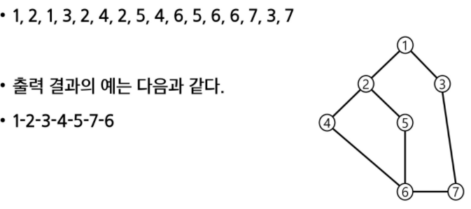.

  - ```python
    #stack
    # 현재 갈림길의 목록만 남겨서, 다시 점프해서 짤수 있음
    1  #인접 자식 꺼내서 비지티트
    2|3 --> pop
    2|7 --> pop
    2|6 --> pop  # 리턴해서 가봤자 나올 애는 2야  # 경로를 따라간다기보단, 바로 점프하는 느낌
    2 --> pop
    4|5 --> pop
    4 --> pop  #
    ```

- BFS
  - 너비우선탐색은, 인접한 정점부터 차례로 방문해야하기 때문에 que를 씀
  - 어팬드팝<데크<프론트리어 (젤 빠름)
  - 위의 출력결과의 예가 bfs .!


## 서로소 집합

- 서로소 집합

  - 교집합이 없다, 집합에 속한 하나의 // 대표원소 //를 통해 각 집합들을 구분한다. 
  - 이를 대표자라 한다.

  

  - 상호베타집합 표현

    - 연결리스트

      - 그래프는 부모노드가 여러개라, 트리가 아니다. (각각이 트리)
      - 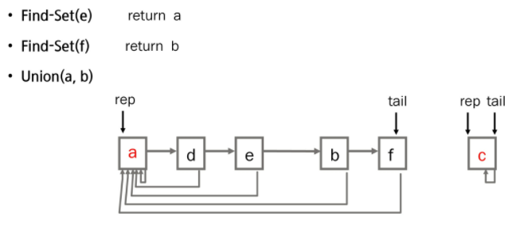.

    - 트리

      - 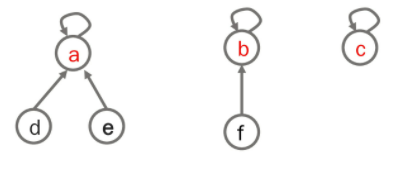.

      - 하나의 집합을 하나의 트리로 표현한다.

      - 자식노드가 부모노드를 가리키며, 루트노드가 대표자가 된다.

      - 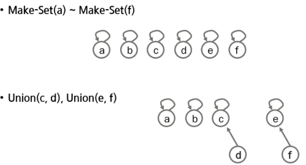.

      - 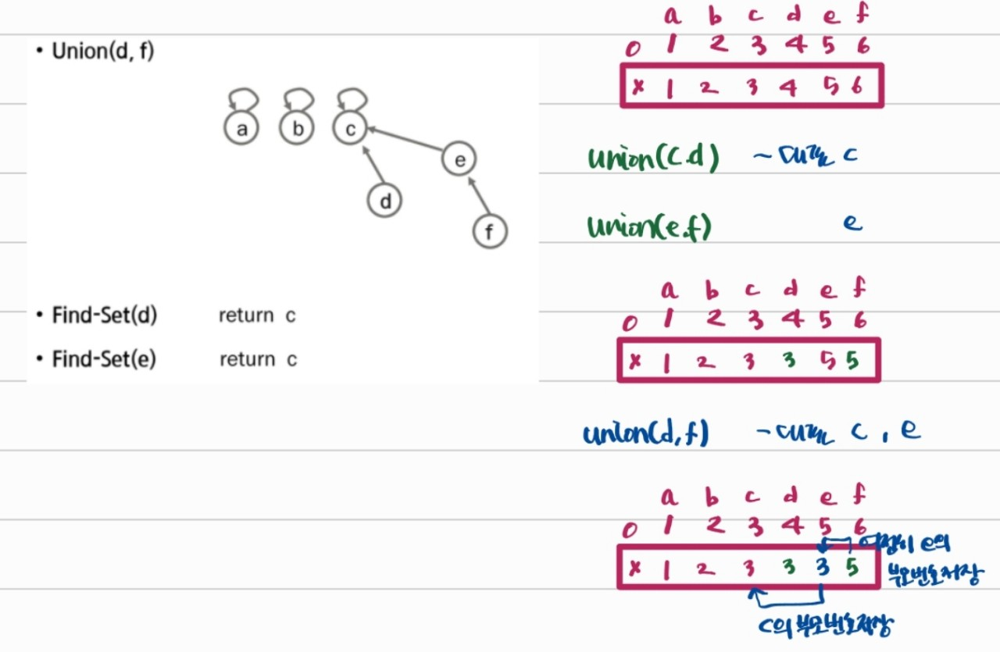

        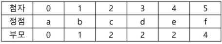.

        

  - 상호베타집합 연산

    - make-set (x) ; 유일한 멤버 x를 포함하는 새로운 집합을 생성하는 연산

      ```python
      Make-set(x):
          p[x] = x   ## p[] 자식을 인덱스로 부모번호를 저장한 배열
      ```

    - find-set (x) ; x를 포함하는 집합을 찾는 연산 < 대표원소 찾기 >

      ```python
      find-set(x):
          if x == p[x]: return x 
          else: return find-set(p[x]) # 리턴
      ---
      find-set(x):
          if x != p[x]:
              p[x] = find-set(p[x]) # 재할당 방식
          return p[x]
      
      -----반복--------------
      find-set(x):
          while x != p[x]:
              x = p[x]
      	return x
      ```

    - union (x, y) ; x, y를 포함하는 두 집합을 통합하는 연산 (x가 대표원소인 집합과 y가 대표원소인 집합 합치기)

      ```python
      Union(x, y):
          p[find-set(y)] = find-set(x)   
      ```

      ```python
      Union(x, y):
          link(find-set(x), find-set(y))
      ```

      ```python
      link(x, y):
          if rank[x] > rank [y]:  // rank는 트리의 높이
              p[y] = x
          else:
              p[x] = y
              if rank[x] == rank[y]:
                  rank[y]++
      ```


## MST(최소 신장 트리)

- 그래프에서 최소 비용 문제
  - 모든 정점을 연결하는 간선들의 가중치의 합이 최소가 되는 트리
  - 두 정점 사이의 최소 비용의 경로 찾기
- 신장트리
  - n개의 정점으로 이뤄진 무방향 그래프에서 n개의 정점과 n-1개의 간선으로 이루어진 트리
- 최소 신장 트리 (Minimum Spanning Tree)
  - 무방향 가중치 그래프에서 신장트리를 구성하는 간선들의 가중치의 합이 최소인 신장 트리


#### Prim 알고리즘

- 하나의 정점에서 연결된 간선들 중, 하나씩 선택해가면서 MST를 만들어 가는 방식
  - 임의의 정점 선택
  - 인접 정점 중 `최소비용의 간선이 존재하는 정점 선택`
  - 모든 정점 선택될때까지 반복
- 서로소인 2개의 집합 정보를 유지
  - 트리 정점들
  - 비트리 정점들

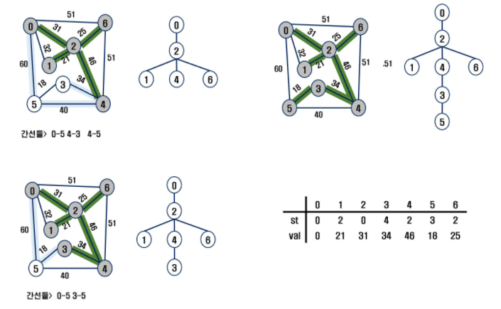.

```python
    0, 1, 2, 3, 4, 5, 6
MST[1, 1, 1, 0, 0, 0, 0]
0 [1, 32, 31, -, -, 60, 51] 0과 연결된 것 중 비용 작은걸 찾아 mst에 포함시킴
2[-, 21, -, -, 46, -, 25] 2와 연결된 것중 작은 것 
MST와 연결된 정점중 방문하지 않은 정점과 최소비용을 이루는 것
```


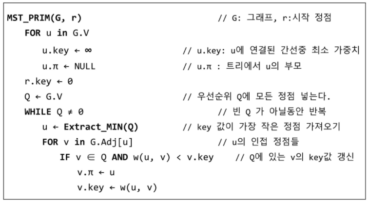.

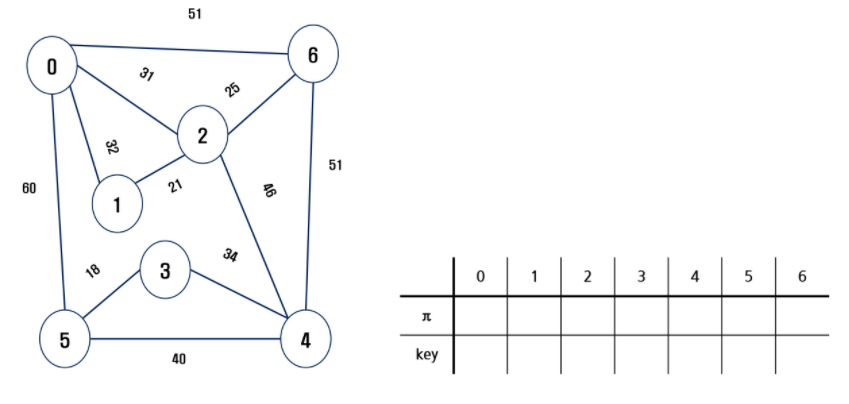.

```python
'''
# 마지막 번호, 11개의 간선정보
# 0과 1사이의 비용은 32이고. ~
6 11
0 1 32
0 2 31
0 5 60
0 6 51
1 2 21
2 4 46
2 6 25
3 4 34
3 5 18
4 5 40
4 6 51
'''

# 수도코드와 비슷
def prim1(r, V):
    MST = [0]*(V+1) # mst 포함여부
    key = [10000]*(V+1)  # 가중치의 최대값 이상으로 초기화, key[v]는 v가 MST에 속한 정점과 연결될 떄의 가중치
                        # 어떤 정점이 mst에 포함되는데 필요한 비용을 무한대로 표시 # 즉, 연결안됨 표시
    key[r] = 0 #시작 정점의 key
    for _ in range(V): # V+1개의 정점 중 v개를 선택
        # MST에 포함되지 않은 정점 중 (MST[u]==0), key 가 최소인 u 찾기
        u = 0  # 시작점이 0이라서 가능한 코드지만, 우선 시작점을 0이라고 가정
        minV = 10000
        for i in range(V+1):  # 0~v번 까지
            if MST[i] == 0 and key[i]<minV:  # minV보다 키 값이 작으면, 인접했다는 뜻
                u = i
                minV = key[i]
        MST[u] = 1  #정점 u를 MST에 추가
        # u에 인접인 v에 대해, MST에 포함되지 않은 정점이면
        for v in range(V+1):
            if MST[v]==0 and adjM[u][v]>0:
                key[v]=min(key[v], adjM[u][v]) # u를 통해 MST에 포함되는 비용과 기존 비용을 비교, 갱신
    return sum(key)                 #MST 가중치의 합


# MST에 속한 애의 최소 가중치를 계속해서 선택해 나가는 방식
def prim2(r, V): # r출발점 (0)
    MST = [0]*(V+1) #MST 포함 여부
    MST[r] = 1  # MST = [1, ,1 , , , , ] # 0과 2에 인접한 모든정점들에 가중치 찾아봄
    s = 0  # MST를 구성하는 최소 가중치의 합
    for _ in range(V): # v개 정점인데, 1개를 미리 포함시켰으므로 v-1번 하면 끝남 !
        u = 0  # 내가 선택할 정점 번호
        minV = 10000
        for i in range(V+1): # (0~V까지) MST에 포함된 정점 i와 인접한 정점 j중 MST..
            if MST[i] == 1:  # i가 mst에 속한 정점이면, 인접인거 찾을거임
                for j in range(V+1):
                    if 0<adjM[i][j]<minV and MST[j]==0: # 무한이나 0이 아닌(인접이면서) & 아직 mst에 속하지 않았다면
                        u = j
                        minV = adjM[i][j]
        s += minV  # 0, 2, 1, 6, 4, 3, 5 순으로 포함
        MST[u] = 1  # 너도 mst에 들어왔어 ! 표시
    return s


V, e = map(int, input().split()) # v 마지막 정점 번호, e 간선수
adjM = [[0]*(V+1) for _ in range(V+1)] # 인접행렬

for _ in range(e):  # 간선수만큼 반복해서, 인접행렬에 저장할 것
    u, v, w = map(int, input().split())
    adjM[u][v] = w   # u에서 v에 연결하는 비용 w
    adjM[v][u] = w   # v에서 u의 가중치 w   # 가중치가 있는 무방향 그래프(Mst에선 무조건)


# V, e = map(int, input().split()) # v 마지막 정점 번호, e 간선수
# adjL = [[] for _ in range(V+1)] # 인접리스트
#
# for _ in range(e):
#     adjL[u].append((v, w))  # u가 v랑 연결되는데, 가중치는 w야
#     adjL[v].append((u, w))
#
#


print(prim1(0, V))
print(prim2(0, V))
```

```python
from collections import defaultdict

V, E = map(int,input().split())
graph_list = defaultdict(list)
graph_matrix = [[0]*(V+1) for _ in range(V+1)]

for _ in range(E):
    s, e, weight = map(int,input().split())
    graph_list[s].append((weight,s,e))
    graph_list[e].append((weight,e,s))

    graph_matrix[s][e] = weight
    graph_matrix[e][s] = weight


# prim
def prim(node):
    mst = [0]*(V+1)  # visited
    key = [float('inf')]*(V+1) # cost
    parent = [-1]*(V+1)   #key에 대한 인덱스가 노드 # 누구한테 갈 수 있는지지
    key[node] = 0  #처음 갈것이라서 0을 선택
    for _ in range(V):
        min_val = float('inf')  # 다음 정점으로 넘어갈껀데, 최소값을 잡기 위한 코스트

        for i in range(V+1):  # 모든 정점들을 찾아보겠어
            if mst[i]==0 and key[i] < min_val: # 내가 지금 갈수있는거보다 작으면은
                s = i
                min_val = key[i]  # key 에는 전단계가 들어있다. 그래서 노드 key로 줄수있게..
        mst[s] = 1 # 방문표시
        # 모든 정점들에 대해서,
        for e in range(V+1):# 위 for문에서 선택하기 전에 a->b->c / s->에서 갈 수 있는거랑
                               #    a->c 이거랑 해서 더 짧은걸 선택
            if mst[e] == 0 and graph_matrix[s][e]>0:
                if key[e] > graph_matrix[s][e]:
                    key[e] = graph_matrix[s][e]
                    parent[e] = s
    return sum(key)


# prim, 우선순위 큐


import heapq

def prim2(node):
    
    mst = []  #mst를 집합으로 만들어 놓음 / (weight, s, e)

    visited = {node}# 위의 mst처럼 지나는거 저장

    candidate = graph_list[node] # 출발점에서 갈
    heapq.heapify(candidate)

    while len(visited) < V and candidate :
        weight, s, e = heapq.heappop(candidate) # 순서 중요 w 가 작은 순으로 뽑고 싶다.

        if e not in visited:
            visited.add(e)
            mst.append((weight,s,e))

            for route in graph_list[e]:
                if route[2] not in visited:
                    heapq.heappush(candidate, route)

    return sum(map(lambda x : x[0], mst))
```


#### Kruskal 알고리즘

- <간선기준정렬>

- `key` 를 가중치로 저장

  

- 간선을 가중치에 따라 오름차순으로 정렬

- 가중치가 가장 낮은 간선부터 선택하면서 트리를 증가시킴

  - 사이클이 존재하면 건너뛰고, 다음으로 가중치가 낮은 간선 선택

- n-1개의 간선이 선택될때까지 2)를 반복

  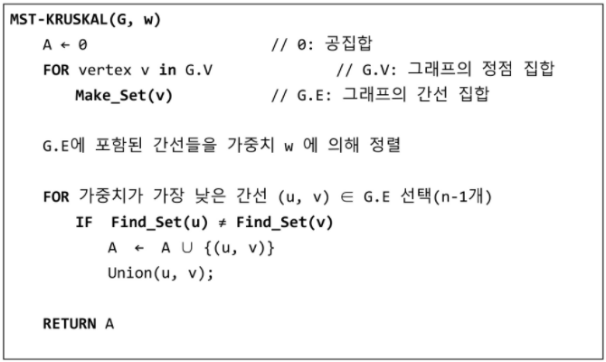.

  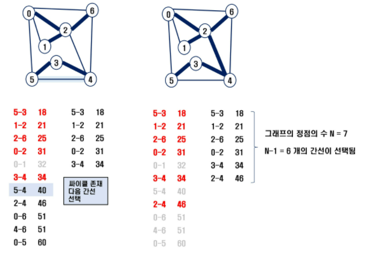.

  ```python
  	 0 1 2 3 4 5 6
  p = [ , , , , , , ]
  
  v1, v2에 대해
  findset(v1) != findset(v2):  #select  # 서로 대표원소가 다르면 포함시킴
  	union(v1, v2)
  ```

```python
'''
# 마지막 번호, 11개의 간선정보
# 0과 1사이의 비용은 32이고. ~
6 11
0 1 32
0 2 31
0 5 60
0 6 51
1 2 21
2 4 46
2 6 25
3 4 34
3 5 18
4 5 40
4 6 51
'''
def find_set(x):
    while x!=rep[x]:
        x = rep[x]
    return x

# 정점의 개수가 엄청 많을때 사용하기 좋은 알고리즘
def union(x, y):
    rep[find_set(y)] = find_set(x)


V, E = map(int, input().split())  # v 마지막 정점, 0~v번 정점, 개수(v+1)개
edge = []
for _ in range(E):
    u, v, w = map(int, input().split())
    edge.append([w, v, u])   # 이렇게 앞에 w를 놓고 sort하면 앞에꺼 기준으로 sort
edge.sort()
rep = [i for i in range(V+1)]  #대표원소 배열 # 자기자신 인덱스로 채우기
# MST의 간선수 N = 정점수 -1
N = V+1
cnt = 0  #선택한 edge의 수
total = 0 #MST 가중치의 합
for w, v, u in edge:
    if find_set(v) != find_set(u):  # 다르면 선택
        cnt += 1
        union(u, v)  # 대표원소 맞춰주기
        total += w   # 가중치 저장
        if cnt == N-1: # N-1개 다 찾으면/MST 구성이 끝나면
            break
print(total)
```

```python
V, E = map(int,input().split())
graph_kruskal = [list(map(int,input().split())) for _ in range(E)]

parent = [-1]*(V+1)
rank = [-1]*(V+1)   


def make_set(x):
    parent[x] = x
    rank[x] = 0

def find_set(x):  # 상호 베타 집합에 대한 연산만 만들어 놓는다면,, 쉽게 구현 가능
    while x != parent[x]:
        x = parent[x]
    return parent[x]

def union(x,y):
    link(find_set(x), find_set(y))

def link(x,y):
    if rank[x] > rank[y]:
        parent[y] = x
    else:
        parent[x] = y
        if rank[x] == rank[y]:
            rank[y] += 1


def mst_kruskal():

    mst = []

    for i in range(V+1):
        make_set(i)

    graph = sorted(graph_kruskal, key=lambda x : x[2])

    while len(mst) < V and graph:  # V개의 노드를 연결하는데, v개의 간선만 확인하면 되므로
        s, e, weight = graph.pop(0)
        if find_set(s) != find_set(e): # 존재하지 않으면 ####
            mst.append((weight,s,e)) # 넣어줌
            union(s,e)  # 하나로 만들어 준다.
    print(mst)
    return sum(map(lambda x : x[0], mst))

print(mst_kruskal())
# prim 같은 경우엔 내가 미니멈 트리야 미니멈 트리야...
# 크루스칼 결과적으로 마지막에서야 트리가 만들어짐

```


#### 최단경로

- 간선의 가중치가 있는 그래프에서 두 정점 사이의 경로들 중 간선의 가중치의 합이 최소인 경로
- 하나의 시작정점에서 끝 정점까지의 최단경로
  - 다익스트라
    - 음의 가중치를 허용하지 않음
  - 벨만포드
    - 음의 가중치 허용
- 모든 정점들에 대한 최단경로
  - 플로이드-워샬 알고리즘


#### 다익스트라 알고리즘

- `시작 정점`에서 `거리가 최소인 정점을 선택`해 나가면서 최단 경로를 구하는 방식

- 양방향 ?

- 시작정점 s에서 끝정점t 까지의 최단 경로에 정점 x가 존재한다.

  - `이때, 최단 경로는 s에서 t까지의 최단경로와 s-> x-> t 의 최단경로 구성된다.`

- 탐욕

- 프림과 유사

  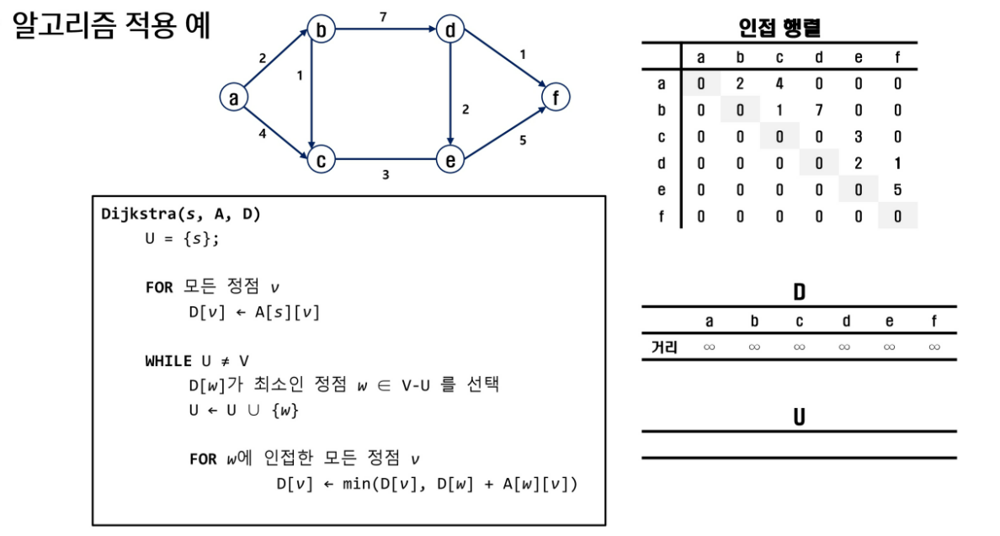.

  ```python
  !! 출발점을 정해주고 나면, 나머지 모든 최소비용에 대한 정점이 다 구해짐 !!
  a->f 로 갈때, 다른 노드를 무조건 지나야하는게 아님
  
  선택된 정점과, 그렇지 않은 정점으로 구분
  인접 X 시,  무한대로 초기화
  ```

  ```python
  dijkstra(s, A, D): # s- 출발점
      U = {s};  # 출발점을 선택된 정점으로 놓음
      for 모든정점 v:
          D[v] = A[s][v]  # 출발점으로 부터 도착하는 모든 정점 v에 대해서, 도착하는 비용을 D에 적는다.
      while u!=V:
          D[w]가 최소인 정점 w ∈ v-u 를 선택
          U = U | {w}
          for w에 인접한 모든 정점 v:
          	D[v] =  min(D[v], D[w]+A[w][v])
  ```

  ```python
  dijkstra(s, A, D): # s- 출발점
      U = {s};  # 출발점을 선택된 정점으로 놓음 # 1로 방문표시  #U = [0, 0, 0, ..]# visited처럼 .. 만들면됨 
      for v(a, f):
          if s==v:
          	D[v] = 0 # 출발점 초기화
          elif 0< adj[s][v]<100000:   # 인접한 애들은 가중치(weight)   # 인접 안했을시, 무한대 유지
              D[v] = adj[s][v]
      while u!=V: # 선택되지 않은 원소가 있으면, 모든 원소가 선택될때까지 반복 # 모든 정점의 최소비용이 결정될때까지
          D[w]가 최소인 정점 w ∈ V-U # 선택된 애 빼고, 선택되지 않은 애 중에서 ! 최소인 정점
          U = U | {w}  # 남은애 중에 최소인 b를 택하게 됨
          for w에 인접한 모든 정점 v:   # min(a->b->c // a-> c )  ___  a-> b ->d 도 갱신
          	D[v] =  min(D[v], D[w]+A[w][v])                       # 그 다음 w는 c..
  ```

  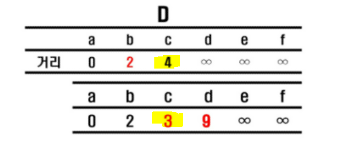.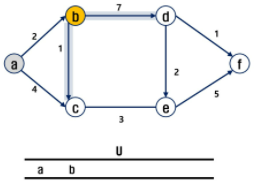.a 에서 c로 가는 값 갱신.. !

  c, d 중에 c가 더 짧으므로 e로 갈땐, c 반영

  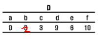.(결론)
  
  ```
  A에서 출발해서 각 정점을 거쳐가는 최소비용 ( 어디를 거쳐갔는지는 상관 없음 ) 구하기
  - 나는 a, c를 구해도 a가 가지는 모든 경로의 최소비용을 알 수 있음 
  - 도착 출발도 알 수 있다. !!
  ```

```python
from collections import defaultdict
import heapq

t = int(input())
for tc in range(1, t+1):
    V, E = map(int, input().split()) # 마지막 연결지점 번호, 도로의 개수

    graph = defaultdict(list)
    for _ in range(E):
        s, e, w = map(int, input().split())
        graph[s].append((e, w))  # 출발지점 = (도착지점, weight)

    def dijkstra(s):
        q = []
        distance = [float('inf') for _ in range(V+1)]
        heapq.heappush(q, (0, s)) # 최단경로, 시작지점
        distance[s] = 0

        while q:
            cost, s = heapq.heappop(q)

            if distance[s] < cost:  # distance의 값이 cost보다 작을때, 즉 inf>cost 므로,걸림
                continue
            for e, w in graph[s]:
                cost2 = cost + w
                if cost2 < distance[e]: # 처음 계산한 경로보다, 새로 간 경로가 더 짧을때
                    distance[e] = cost2
                    heapq.heappush(q, (cost2, e))

        return distance[V]

    res = dijkstra(0)
```

```python
# 다익스트라
# 출발점을 기준으로 [e, w]

from collections import defaultdict
V, E = map(int,input().split())
graph_di = defaultdict(list)
for _ in range(E):
    s, e, weight = map(int,input().split())
    graph_di[s].append((e,weight))

def dijkstra(s):
    U = {s}
    distance = [float('inf') for _ in range(V+1)]
    distance[s] = 0

    for e, weight in graph_di[s]:
        distance[e] = weight
    
    for _ in range(V+1):  # 도착지는 고려 안해도 되서 V로 해도 되는듯 

        min_val = float('inf')

        # idx = -1    도착할 수 없는 경우 판별
        
        for i in range(V+1):   # 도착지는 고려 안해도 되서 V로 해도 되는듯 
            if i not in U and min_val > distance[i]:      # 방문하지 않았고, 거리가 짧은 곳으로 갈것               
                min_val = distance[i]
                idx = i
        U.add(idx)

        for e, weight in graph_di[idx]:      # distance 초기화 = 작은걸로 초기화
            distance[e] = min(distance[e], distance[idx] + weight)
    print(distance)
dijkstra(1)

        # prim이랑 다른점 : 
        # 프림의 마지막 key[e] = grapj_martics[s][e]와
        # 다익스트라 마지막 for 문의 min(distance[e], distanceidx///..이 부분만 다르다.)
        
        # 보급로 문제: 다익스트라
```


### 코드 에러남 

```python
'''
5 11
0 1 3
0 2 5
1 2 2
1 3 6
2 1 1
2 3 4
2 4 6
3 4 2
3 5 3
4 0 3
4 5 6
'''

def dijkstra(s, V):
    U = [0]*(V+1) # 비용이 결정된 정점을 표시  #visited
    U[s] = 1 # 출발점 비용 결정 # 시작점 확정 표시
    for i in range(V+1):
        D[i] = adjM[s][i]  # D 값을 가져와서 복사함. 근데 인접되지 않은게 0으로 처리되잇으면 나중에 따로 처리

    # 남은 정점의 비용 결정
    for _ in range(V): # u 랑 v랑 일치하니___ 그냥 남은 정점 개수만큼 반복하면 됨
         # D[w]가 최소인 w 결정 , 비용이 결정되지 않은 정점 w 중에서
        minV = INF
        w = 0
        for i in range(V+1):
            if U[i] == 0 and minV > D[i]:  # 아직 안포함 됐고, minV보다 작으면 ~
                minV = D[i]
                w = i
        U[w] = 1   # 비용 결정
        for v in range(V+1):
            if 0< adjM[w][v]< INF:
                D[v] = min(D[w] + adjM[w][v])  # 기존 비용과, w를 거치는 비용 찾아서 작은거 택


# 자기자신 0, 인접이면 w, 그외 무한대
INF = 10000 # 무한히 큰 값
V, E = map(int, input().split())
adjM = [[INF]*(V+1) for _ in range(V+1)]  # 인접행렬을 무한대 값으로 초기화
for i in range(V+1):
    adjM[i][i] = 0  # 자기 자신을 0 으로 만들기
for _ in range(E):
    u, v, w = map(int, input().split())
    adjM[u][v] = w  # 인접행렬의 인접한 영역에 가중치를 적음
D =[0]*(V+1)  # D초기화
dijkstra(0, V)
print(D)
```


