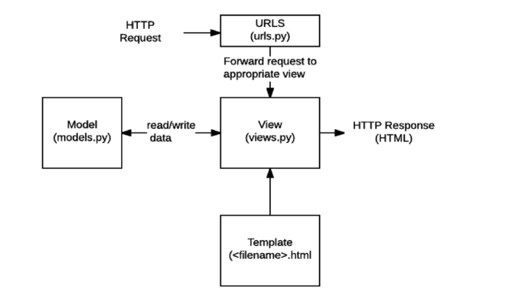

# web framework

- 클라이언트(웹 브라우저)가 서버에 요청(네트워크를 통해)하면, 
- 서버는 응답 !


- stastic web page - 서버에 미리 저장된 파일이 그대로 전달되는 웹 페이지

  - 모든 상황에서 모든 사용자에게 동일한 정보 표시
  - Html, Css, Javascript
- dynamic web page - 요청을 받아, 추가적인 처리과정 이후 클라이언트에 응답을 보냄

  - 방문자와 상호작용, 페이지내용 때에따라 다름
  - 서버 사이드 프로그래밍언어(python, java, c++..)
  - 파일 처리, 데이터베이스와의 상호작용

- `요청`이 들어오면 웹서버가 `응답`해야하는데, html은 정적인 내용임. 그래서 클라이언트의 유저가 다를때 요청에 따라 다른 응답을 해야함./ 이를 만들어내는 프로그램이 필요하며 web aplication이라고 함

  - 파이썬으로 요청을 받아, 응답하는 프로그램을 짜고 싶다

    - 요청과 응답을 자동으로 하고, 개발자는 응답할 내용을 작성!

      ㄴFramework

      - 파이썬을 실행하기 위한 web framework: django
      - 자바: spring Framework

- framework 구조  - MVC (model - view - controller)

  - Django 에선 MTV Pattern(template , view)
    - model - 데이터구조 정의, 기록 관리(추가, 수정, 삭제)
    - template - 파일의 구조, 레이아웃 정의
      - 실제 내용을 보여줌 (presentation)
    - view - http 요청 수신, 응답
      - 데이터에 접근

  ##### MTV pattern

  

  ```python
  model: 요청처리, 로직 수행
  ---
  urls.py(요청 파악, 함수 호출)  --->  view(필요한 데이터 확인)  <-- Template(결과)
  ```

  

# django intro

`프로젝트 구조`

- init.py (x)
- asgi.py - 웹 서버와 연결, 소통 (x)

** - setting.py - 애플리케이션 모든설정을 포함

- url.py - 사이트의 url과 적절한 views의 연결 지정 **

  

- wsgi.py - 장고 앱이 웹서버와 연결, 소통 (x)

- manage.py  - 장고 프로젝트와 상호작용하는 커맨드라인 유틸리티 (커맨드 동작) (x)


`Application 구조`

- init  (x)

- admin.py - 관리자용 페이지 설정

- apps.py - 앱의 정보 작성(수정하지 않음) (x)

- models.py - 앱에서 사용하는 모델을 정의

- tests.py - 프로젝트의 테스트코드 작성 (서버 테스트코드 작성)(x)

- views.py - view 함수들의 정의되는 곳

  

| 프로젝트(collection of apps) | application                                                  |
| ---------------------------- | ------------------------------------------------------------ |
| 여러 앱이 포함될 수 있다.    | 실제 요청처리, 페이지 보여줌<br />앱은 하나의 역할, 기능 단위로 작성 |

** 앱은 생성한 후 등록(setting.py)해야함 !


## 요청과 응답

1. 가상환경 생성, 활성화

   ```bash
   git ignore
   $ python -m venv [가상환경이름]   
   $ source [가상환경이름]/Scripts/activate 
   (가상환경이름)
   $
   $ ctrl shift p -> python interpreter 활성화.. (f1)
   $ source venv/Scripts/activate (가성환경 활성화)
   pip list
   # $ deactivate (비활성화, 사용할 일 없음)
   ```

   

2. 장고 설치

   ```bash
   pip install -r requirements.txt
   ---
   pip install django==3.2.12
   pip list
   ---
   pip list
   #라이브러리 설치
   $ pip install ipython
   $ pip install django-extensions  #하이픈###---###
   # more powerful interactive shell을 위한 2가지 라이브러리 설치
   $ pip freeze > requirements.txt(그냥 바로 해줘도 됨) 
   ```

   

3. 프로젝트 생성

   ```bash
   django-admin startproject firstpjt .
   ls #manage.py
   #firstpjt . 하면 현재 폴더가 가상환경이 되는 것 ?
   # pjtname/  manage.py*  venv/
   ---
   #외부라이브러리이기 때문에
   #우리꺼, 외부 라이브러리, 장고순 등록
   #settins.py
   INSTALLED_APPS = [
       'articles',
       'django_extensions',  #언더바
   ```

   ```
   git init
   git add .
   git commit -m 'firstcommit'
   git log --oneline
   ```

   

4. 로켓 확인

   ```bash
   python manage.py runserver (로켓)
   control c - bash창 나가기
   ```

   

5. (서버 종료 후) 앱 생성

   ```bash
   python manage.py startapp articles
   ```

   

6. 앱 생성 후 등록  (url, view, templates)

   ```python
   #애플리케이션 등록 (만든 앱을 pjt에 알림)
   project안의 settings.py의 Installed_apps에 'application', 
   										##local app, third party apps, django apps 순서
   #url과 view mapping
   urls.py 
   #from [application] import views  
   urlpatterns 에 #path('주소/', views.함수),
   			  path('index/', views.index ),
   (그럼 articles의 view에)
   
   #view함수 작성, 관련된 html 파일 랜더
   def index(request):  #요청이 들어오면 실행할 method   #요청처리...> 응답 생성 및 반환
       return render(request, 'index.html')  (템플릿 index.html 만들어야함 !ㄱ)
   			#render(request, '템플릿'): 템플릿을 이용해서 응답을 만들어주는 함수
       				#템플릿의 위치: app/templates/템플릿
   view와 같은 위치인 articles안에 templates(폴더)를 만들고 index.html 을 만들어줌  #html파일 만들기
   #템플릿 : 응답을 위한 기초 구조
   
   
   #urls.py
   from pages import views  #views가 다른 폴더에 있으니까 pages에서 views를 import해옴
   urlpatterns = [
       path('admin/', admin.site.urls),
       path('hello/', views.greeting),
   ]
   
   --
   python manage.py runserver
   ctrl 클릭
   ---
   http://127.0.0.1:8000/index/
   
   ```

   ```python
   #project_urls.py
   from django.contrib import admin
   from django.urls import path, include
   
   urlpatterns = [
       path('admin/', admin.site.urls),
       path('articles/', include('articles.urls')),
   ]
   #app_urls.py
   from django.urls import path
   from . import views
   
   app_name="articles"
   urlpatterns = [
       path('', views.index, name="index"),
       path('new/', views.new, name="new"),
       path('create/', views.create, name="create"),
       ]
   ```

   

7. 추가설정

   ```bash
   settings.py
   language_code = 'ko-kr'
   time_zone = 'Asia/Seoul'     /list of tz search..
   
   USE_I18N - 장고의 번역 시스템을 활성화해야 하는지 여부를 지정  (국제화)
   USE_L10N - 데이터의 지역화 된 형식을 기본적으로 활성화할지 여부 지정 (localization)
   USE_TX - datetimes가 기본적으로 시간대를 인식하는지 여부 지정 
   
   django - documentation, 우측 하단 언어 변경, 버전 3.2
   search <django settings - language>
   ```

=> [model](03_model.md)

# templete (presentation)

> 데이터 표현을 제어하는 도구, 표현에 관련된 로직

- DTL(django template language)
  - 조건, 반복, 변수, 치환, 필터 등.. 
  - 단순히 python이 html에 포함된 것이 아님
  - 프로그래밍적 로직이 아님 // 프레젠테이션을 표현하기 위한 것
  - (파이썬과 비슷한 부분이 있지만)
  - trailing comma (장고에서, 리스트안 요소 끝에 , 사용해야함)

#### 코드 작성 순서 (데이터의 흐름)

1. URL

2. VIEW

3. TEMPLATE

   

#### DTL syntax

1. 변수 

   dot(.)으로 변수속성에 접근

   render()의 <u>세번째 인자로 {'key': value}와 같은 딕셔너리 형태로 넘겨줌</u>

   ```python
   /urls.py
   from appname import views
   path('greeting/', views.greeting)  #url쓸땐, dtl-practice(하이픈권장)
   								##greeting요청이 왔을때, view함수를 실행 !
   #views.py 
   def greeting(request):
       return render(request, 'greeting.html', {'name': 'Alice',})
   
   -----------------------
   def greeting(request):
       num = [1, 2, 3, 4]
       info = {
           'name':'Alice',
       }
       context = {
           'num': num,   #왼쪽 key값
           'info': info,
       }
       return render(request, 'lotto.html', context)
   ------------
   import random
   def dinner(request):
       foods = ['족발', '햄버거', '피자',]
       pick = random.choice(foods)
       context = {
           'pick': pick,
       }
       return render(request, 'dinner.html', context)
   ```

   ```django
   #html  templates
   <body>
     안녕하세요 저는 {{ name }}입니다.  #키값을 사용함 !
   </body>
   ----------
     안녕하세요 저는 {{ info.name }}입니다.
     저는 {{ num.0 }}살 입니다.
   ```

   

2. Filter 

   [Built-in template tags and filters](https://docs.djangoproject.com/en/4.0/ref/templates/builtins/)

   ```django
   #html
   {{ name|lower }}
   ---
   <p>오늘 저녁은 {{ pick }} 이다! </p>
   
   <a href="/index/"> 뒤로 </a>
   <p> 글자수: {{ pick|length }} </p>  #2 (초밥)
   <p>{{ foods|join:', ' }}</p> #족발, 햄버거, 피자
     
   ```

3. tags ***중요

   1. 출력텍스트, 반복, 논리를 수행하여 제어 흐름을 만듦
   2. 일부 태그는 시작, 종료태그 필요

   ```django
   { % tag % }
   for + enter
   
   <p>메뉴판</p>
   <ul>
       ##tag는 중괄호 퍼센트로 열고 닫힘, 변수출력은 중괄호 두개
       <li>{{ food }}</li>   #변수출력은 중괄호 두개
     
   </ul>
   ```

> templete에서 연산하는것 아님.  (표현하는 것)
>
> 조작하는 것 == view함수로 역할 넘겨 주기

4. comments

   ```django
   {#이것은 한줄 주석입니다.#}  {#  #}
   
   
   <p>1</p>
   <p>1</p> 
   
   <!--   -->
   ```

​		(dtl도 add가 있지만, view에서 하기)

<details>
    <summary>dtl-practice</summary>
    <div markdown="1">
            
    
      <h3>1. for</h3>
      
        <p>{{ food }}</p>
      
      <hr>
      
        <p>{{ forloop.counter }} {{ food }}</p>
      
      <hr>
      
        <p>{{ user }}</p>
      
        <p>지금 가입한 유저가 없습니다.</p>
      
      <hr>
      <h3>2. if</h3>
      
        <p>짜장면엔 고추가루지 !</p>
      
      <hr>
      
        
          <p>짜장면+고추가루</p>
        
          <p>{{ food }}</p>
        
      
      <hr>
      <p>3. length filter 활용</p>
      
        
          <p>이름이 너무 길어요.</p>
        
          <p>{{ fruit }}, {{ fruit|length }}</p>
        
      
      <hr>
      <h3>4. lorem ipsum</h3>
      
      <hr>
      
      <hr>
      
      <hr>
      
      <hr>
      <h3>5. 글자 관련 필터</h3>
      <p>{{ 'ABC'|lower }}</p>
      <p>{{ my_sentence|title }}</p>
      <p>{{ foods|random }}</p>
      <hr>
      <h3>6. 연산</h3>
      <p>{{ 4|add:6 }}</p>
      <hr>
      <h3>7. 다양한 날짜 표현</h3>
      <br>
      <br>
      <br>
      
      <hr>
      
      <hr>
      
      Copyright {{ current_year }}
      <hr>
      <a href="">back</a>
    
    </div>
</details>>


## Template ingeritance(템플릿 상속)

#### skeleton template 

- 템플릿 상속은 기본적으로 코드의 재사용성에 초점을 맞춤

- 템플릿 상속을 사용하면 사이트의 모든 공통 요소를 포함하고, 하위 템플릿이 재정의(override) 할 수있는 블록을 정의하는 기본 “skeleton” 템플릿을 만들 수 있음

```python
templates folder (folder를 앱, pjt와 나란히) with base.html

#settings.py
TEMPLATES = [{
        'DIRS': [BASE_DIR / 'templates',],}] #templates상속을 위해 추가해준다.
INSTALLED_APPS = [
    'movies',]  #app추가
```

```django
<base.html 부모 템플릿>
 
CDN
      #재정의할 수있는 공간 미리 만들어둠
```

```django
자식템플릿 최상단에 작성
   #자식이 부모꺼를 확장

필요한 block을 가져와서 재정의함
 
	<p>안녕하세요 저는 {{ info.name|lower }} 입니다. </p>

```

- including   ;; base.html이 길어질 경우

```python
#articles/templates/      또는     templates/  (base.html과 같이)
_nav.html
#base.html

```


```
장고철학
1. 표현과 로직(view)를 분리
	템플릿은 그저 표현에 관련된 로직이다.
	넘어서는 기능을 지양한다.
2. 중복을 배제
	대다수의 동적 웹사이트는 header, footer, navbar같은 공통 디자인을 갖는다.
	이러한 요소를 한 곳에 저장하기 쉽게해 중복코드를 없애야 한다.
	이는 상속의 기초이다.	
```


# html Form

```django
<form action="" method="GET">  #form + tab
  <label for="message">
    message: 
    <input type="text" name="message" id="message">  # name 으로 key 데이터 전달 (?message=장고)
  </label>
  <input type="submit">
</form>
```

```django
<form>
>사용자 정보 입력방식 제공(text, checkbox...), 사용자 데이터-> 서버
action: 입력데이터가 전송될 url지정
method: 입력데이터 전달방식    get, post()
```

```django
<input>
>사용자로부터 입력받기 위함
type: 이에따라 동작방식이 달라짐
name: 중복가능, 양식 제출시 name에 설정된 값을 넘겨 값을 가져옴
	GET/POST 방식에서, 서버에 전달하는 파라미터(name은 key, value는 value로 매핑함)
	GET-> URL: ?key=value&key=value 형식으로 데이터 전달

```

```django
<label>
>사용자 인터페이스 항목에 대한 설명(caption)을 나타냄
label을 input요소와 연결!
    1. input에 id 속성 부여
    2. label엔 input의 id와 동일한 값의 for 속성 필요
    #즉 label for="메세지"  input id="메세지"
    이유: 시각적 + 사용자가 입력해야하는 텍스트가 무엇인지 쉽게 알수 있다.(프로그래밍적 이점)
   
label 클릭 : input에 초점맞추거나 활성화 가능

<for>
기능: for와 일치하는 id를 가진 문서의 1st요소 제어 
labelable elements: label요소와 연결할 수 있는 요소(button, input, select, ...)

<id>
전체 문서의 고유식별자 정의
```

```django
<HTTP>
웹의 모든 데이터 교환의 기초
request method: 리소스가 수행할 작업 (GET, POST, PUT, DELETE.....)
1. GET: 서버로부터 정보를 조회
    	데이터를 가져올때만 사용
    	데이터를 서버로 전송시, bodyX, Query String Prameters를 통해 전송
    	서버에 요청하면, HTML 문서파일 한장을 받는데, 이때 사용하는 요청방식임.
```


# Url


`variable routing`

- url의 일부를 변수로 지정하여, view함수의 인자로 넘길 수 있다.

- ```django
  path('hello/<name>/<int:age>/',views.hello, name="hello"),
  path('hello/<str:name>/', views.hello),
  ```

  - str: 기본값

  - int: 0 또는 양의 정수

  - slug: ASCII 또는 숫자, 하이픈 및 밑줄문자로 구성된 모든 슬러그 문자열과 매치

  - uuid

  - path

    

`App url mapping`

- app의 view함수가 많아지며, urls.py 의 path()가 많아지게 됨

-  app 또한 많이 작성됨

  ==> 각 app에 urls.py를 작성

- project/urls.py

  ```python
  from django.contrib import admin
  from django.urls import path, include ##include
  
  urlpatterns = [
      path('admin/', admin.site.urls),
      
      #article의 urls.py랑 연결
      path('articles/',include('articles.urls')),  #앱이름.urls
      path('pages/',include('pages.urls')),
  ]
  ```

- articles(app)/urls.py

  ```python
  from django.urls import path #
  from . import views #나한테 있는 views import
  
  ##
  urlpatterns = [
      path('index/',views.index, name="index"),
      path('throw/',views.throw, name="throw"),
      path('catch/',views.catch, name="catch"),
      path('hello/<name>/<int:age>/',views.hello, name="hello"),
  ]
  ```

  - naming url patterns

    - path() 함수의 name인자 정의해서 사용

      

- url template tag

   ``

  - 절대경로주소

  ```django
  #throw.html
  <form action="" method="GET">  
    ...
  </form>
  
  #catch.html
  
  
    <h1>Catch</h1>
    <h2>여기서{{ message }}를 받았어</h2>
    <a href="/articles/throw/">다시 던지러</a>
  
  ```

  ```django
  #index.html
  
  
    <a href="">greeting</a>
    <a href="">dinner</a>
    <a href="">throw</a>
    <a href="">dtl_practice</a>
  
  
  <!-- -->
  <a href="{url 'index'}">뒤로</a>
  ```
  
  ```django
  <form action="" method="GET">
  <link rel="stylesheet" href="">
  ```
  
  
