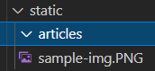
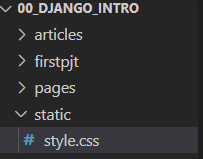

### 1. name space

두 앱에서 index.html을 rendering 한다고 할때, 장고는 INSTALL_APPS 순으로 , 먼저 등록한 앱의 index 페이지만 나온다.

따라서, 중간에 폴더를 만들어 두 index.html을 분리시킨다.

- url namespace (app_name, 참조)

```python
#articles/urls.py
app_name = 'articles' #써주기 
urlpatterns = [...]

#articles/index.html
  <a href="">greeting</a>
  <a href="">dinner</a>

=><a href="">greeting</a>
  <a href="">dinner</a>
  <a href=""></a>
```

- template namespace
  모아서보는 장고의 특성 => 추가경로를 작성 (중간경로)

```python
#articles/templates/articles 생성 (앱과 같은 이름의 폴더)
기존의 templates의 html 이동시킴
새로 생긴 articles가 templates의 namespace 역할을 함

#articles/views.py
def index(request):
    return render(request, 'index.html')
=>def index(request):
    return render(request, 'articles/index.html')

#templates/base.html

```


### 2. static files

- url에 있는 자원(resource)를 요청(http request)받아 제공(serving)하는 응답(http response)을 처리:: 기본동작
- 사진파일: 자원
- 파일경로: 웹 주소
- 즉, server는 요청받은 url로 정적자원을 제공

```django


ex) my_app/static/my_app/example.jpg

#temp 에선 app/templates/
#ststic은 app/static/app/
```


(1) STATICFILES_DIRS = [BASE_DIR/ 'static',]

(2) STATIC_URL = '/static/'

​	STATIC_ROOT에 있는 저적 파일 참조시 사용할 url

​	실제파일, 디렉토리가 아님 url로만 존재

​	비어있지 않은 값으로 설정시, 반드시 / 로 끝나야 함

(3) STATIC_ROOT

​	collectstatic이 배포를 위해 정적파일을 수집하는 디렉토리의 절대 경로, 장고의 모든 정적 파일을 모아넣음

 - 개발 settings.py의 DEBUG = True       #개발단계에서는 동작하지 않는다 !

 - 배포 settings.py의 DEBUG = False 

   - AllOWED_HOST = [*]

   - 참고

     ```python
     #settings.py
      STATIC_URL = '/static/'
      STATIC_ROOT = BASE_DIR / 'staticfiles'
     -------------------------------------------
     $python manage.py collectstatic
     ```


#### django template tag

- load

  - 템플릿 태그세트 로드
  - 라이브러리, 태그, 필터

- static

  ```django
     #built in XX
  
  ```


`활용`

- 기본경로

```django
#articles/static(생성) img 추가
#articles/templates/articles

(추가)

     #app/static 이므로 바로 이미지 삽입

이미지 url경로 보면 STATIC_URL = '/static/'쓰인걸 볼 수 있음  (즉, url로만 쓰임)
```

- .

  ```django
    
  ```

```python
STATIC_URL = '/static/'
밑에 추가하기
STATICFILES_DIRS = [
    BASE_DIR / 'static'
]
```

.

```django
#templates/base.html
  

#articles/templates/articles/index.html

<link rel="stylesheet" href="style.css">  #이렇게 쓰면 장고에선,  static 파일 못불러옴


=> <link rel="stylesheet" href="">

```


