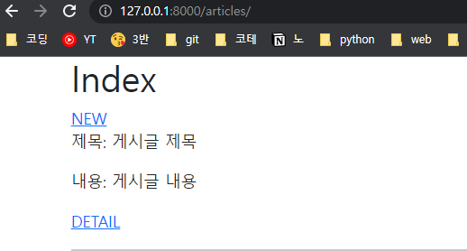

CRUD

1\) READ

.

2\) CREATE

.

3\) DETAIL

.

4\) UPDATE

.

5\) DELETE

### # django project

### url.py

```python
#crud
from django.contrib import admin
from django.urls import path, include

urlpatterns = [
    path('admin/', admin.site.urls),
    path('articles/', include('articles.urls')),
       
]
```

```python
#articles
from django.urls import path
from . import views


app_name="articles"
urlpatterns = [
    path('', views.index, name="index"),
    path('new/', views.new, name="new"),
    path('create/', views.create, name="create"),
    path('<int:pk>/', views.detail, name="detail"),
    path('<int:pk>/edit/', views.edit, name="edit"),
    path('<int:pk>/update/', views.update, name="update"),
    path('<int:pk>/delete/', views.delete, name="delete"),
    ]

```


### views.py

```python
from django.shortcuts import render, redirect
from .models import Article

def index(request):
    articles = Article.objects.all()[::-1]
    context = {
        'articles':articles
    }
    return render(request, 'articles/index.html', context)

def new(request):
    return render(request, 'articles/new.html')

def create(request):
    title = request.POST.get('title')
    content = request.POST.get('content')

    article = Article()
    article.title = title
    article.content = content
    article.save()
    return redirect('articles:detail', article.pk)
    #만들면, detail을 보여줌

def detail(request, pk):
    article = Article.objects.get(pk=pk)
    context = {
        'article':article,
    }
    return render(request,'articles/detail.html', context)

def edit(request, pk):
    article = Article.objects.get(pk=pk)
    context = {
        'article':article,
    }

    return render(request, 'articles/edit.html', context)


def update(request, pk):
    article = Article.objects.get(pk=pk)
    if request.method == 'POST':
        article.title = request.POST.get('title')
        article.content = request.POST.get('content')
        article.save()
    return redirect('articles:detail', article.pk)

def delete(request, pk):
    article = Article.objects.get(pk=pk)
    if request.method == 'POST':
        article.delete()
        return redirect('articles:index')
    else:
        ######
        return redirect('articles:detail', article.pk)
```


### template/

- detail.html

```django




<h1>DETAIL</h1><hr>
<p> {{ article.title }} </p>
    <p>{{ article.content }}</p>
    <p>작성일: {{ article.created_at }}</p>
    <p>수정일: {{ article.updated_at }}</p>
    <a href="">EDIT</a>
    <a href="">DELETE</a>
   <br><a href="">BACK</a>


```

- edit.html

```django


<h1>NEW</h1>
<form action="" method="POST">
  
  <label for="title" >TITLE: </label>
  <input type="text" name="title" id="title" value="{{ article.title }}"><br>

  <label for="content">CONTENT: </label>
  <textarea name="content" id="content" cols="30" rows="10">{{ article.content }}</textarea><br>
  <input type="submit" value="수정"><br>
  <a href="">BACK</a>
</form>



```

- index.html

```django




  <h1>Index</h1>
  <a href="">NEW</a>
    
      <p>제목: {{ article.title }} </p>
      <p>내용: {{ article.content }}</p>

      <a href="">DETAIL</a><hr>
    


```

- new.html

```django



  <h1>NEW</h1>
  <form action="" method="POST">
    
    <label for="title" >TITLE: </label>
    <input type="text" name="title" id="title"><br>

    <label for="content">CONTENT: </label>
    <textarea name="content" id="content" cols="30" rows="10"></textarea><br>
    <input type="submit" value="작성"><br>
    <a href="">BACK</a>
  </form>



```


### model.py

```python
from django.db import models

# Create your models here.
class Article(models.Model):
    title = models.CharField(max_length=30)
    content = models.TextField()
    created_at = models.DateTimeField(auto_now_add=True)
    updated_at = models.DateTimeField(auto_now=True)

```

