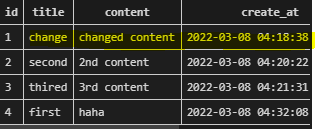
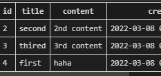
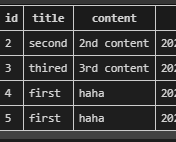
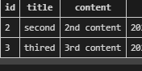
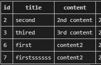
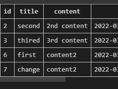

# Model

- 각각의 model은 하나의 데이터 테이블에 매핑됨
  - column을 모델이 설정해줌
- 사용자가 저장하는 데이터들의 <u>필수적인 필드</u>들과 동작들을 포함
- 각각의 모델은 하나의 <u>데이터베이스 테이블에 매핑됨</u>

- 데이터베이스(DB)
- 쿼리(Query)
  - 데이터를 조회하기 위한 명령어


### DB구조 \###

- 스키마: 데이터베이스의 자료구조, 표현방법, 관계 등을 정의한 구조 (특징들을 모아놓은 것)

  | column | datatype |
  | ------ | -------- |
  | id     | int      |
  | age    | int      |
  | name   | text     |

- 테이블

  - 열: 필드 or 속성 (객체들의 특징)

  - 행: <u>레코드</u> or 튜플  (하나의 객체)

    - 데이터가 입력될때, 레코드별로 입력 될 것임 !

    | id   | name   | age  |
    | ---- | ------ | ---- |
    | 1    | 박다빈 | 25   |

- PK(기본키)
  - 각 행의 고유값으로 primary key로 불림, 반드시 설정(장고에선 자동으로 설정됨)
  - 데이터베이스 관리 및 관계 설정시 주요하게 활용됨, 반드시 설정
  - ex) id (1, 2, 3, 4)


### ORM(object-relational-mapping)

- 객체지향 프로그래밍 언어를 사용하여 호환되지 않는 유형의 시스템간에(Django-SQL)

  데이터를 변환하는 프로그래밍 기술

- OOP 프로그래밍에서 RDBMS를 연동할 때, 데이터베이스와 객체지향 프로그램 언어간의 호환되지 않는 데이터를 변환하는 프로그래밍 기법

- Django는 내장 Django ORM을 사용함


~~파이썬을 사용해서model: database table에 매핑된 것~~

DB를 객체로 조작하기 위해 ORM 을 사용함 (즉, 파이썬의 객체지향 언어-> orm->sql statement)


- 장점
  - sql을 몰라도,  db조작이 가능
  - sql의 절차적 접근이 아닌 객체지향적 접근으로 인한 높은 생산성
  - 현대 웹 프레임워크의 요점은 웹 개발의 속도를 높이는 것(`생산성`)
- 단점
  - ORM 만으로 완전한 서비스를 구현하기 어려운 경우가 있음


#### models.py 작성

```python
#[app]/models.py
from django.db import models
#객체지향이라 class로 만들기
class Article(models.Model):  #상속받기
    title = models.CharField(max_length=10)  #char, string!
    content = models.TextField() #길이 제한이 없는 text field
```

- 각 모델은 dhango.models.Model 클래스의 서브클래스로 표현됨
  - django.db 에서 Model클래스를 상속받음

- models 모듈을 통해 어떤 타입의 DB컬럼을 정의할지 정의
  - title과 content는 모델의 필드를 나타냄
  - 각 필드는 클래스로 구성되어 있으며, 각 속성은 각 데이터베이스의 열에 매핑

[django문서](https://docs.djangoproject.com/ko/3.2/ref/models/fields/)

- 사용 모델필드

  - CharField(max_length=None, **options)

    - 길이제한 있는 문자열 넣음
    - max_length는 필수인자 
    - 필드의 최대 길이 (문자), 데이터베이스 레벨과 장고의 유효성 검사에 활용(값을 검증하는 것)

  - TextField(**options)

    - 글자수가 많을때 사용

    - max_length옵션 작성시, 자동양식인 textarea 위젯에 반영은 되지만

      모델과 데이터베이스 수준에는 적용되지 않음


### Migrations

- django가 모델에 생긴 변화를 반영하는 방법

  ```
  장고야 나 모델 만들었어 ! 이제 설계도 작성하고, 반영해줘
  ```

  

- migration(마이그레이션) 실행 및 db 스키마를 다루기 위한 명령어
  
  1. makemigrations
  
     - migrarions/\_\_init__.py 있어야댐(삭제하지말것)
  
     - 모델 변경에 기반해 새로운 migrations(설계도) 만들때 사용
  
  2. migrate
  
    - `설계도를 설계/반영 해줘`
    - <u>마이그레이션(설계도)을 실제 DB에 반영</u>
    - 모델에서의 변경사항들과 DB의 스키마가 동기화를 이룸
  
  3. sqlmigrate
    - 마이그레이션에 대한 SQL 구문을 보기 위해 사용
    - 마이그레이션이 SQL문으로 어떻게 해석되어서 동작할지 미리 확인할 수 있음
  
  4. showmigrations
    - 프로젝트 전체의 마이그레이션 상태를 확인하기 위해 사용
    - 적용이 되었는지 여부 (migraions file이 migrate됐는지)

	#### 모델 만들기

```python
#python model.py 작성 --위에서 함
```

```python
$python manage.py makemigrations  #migrations/0001_initial.py (설계도) 생성됨  #data table 생성 준비끝 !
#설계도 여러개 설정시, dependencies = []에 적어줄 것임
```

```python
$python manage.py migrate
#sqlite extention(확장프로그램설치함) -> db.sqlite3우클릭 -> open database
#sqlite explore3/articles_article
$python manage.py showmigrations
#[X] 되있는거 적용된거

#$ python manage.py sqlmigrate app_name 0001
$ python manage.py sqlmigrate articles 0001 

# CREATE TABLE "articles_article" ("id" integer NOT NULL PRIMARY
# KEY AUTOINCREMENT, "title" varchar(10) NOT NULL, "content" text NOT NULL);

# $ python manage.py showmigrations 하면 설계도가 만들어진게 보이고
#[]되어서, 체크 안되있는건, migrate되지 않은 것(db에 반영되지 않은상태)
```


### 모델 수정하기(처음에 잘 만들기)

```python
#articles/models.py
class Article(models.Model):
    title = models.CharField(max_length=10)
    content = models.TextField() 
    created_at = models.DateTimeField(auto_now_add=True) #최초 생성일자, 추가/자동저장
    updated_at = models.DateTimeField(auto_now=True) # 최종수정일자, db에 반영/자동저장
    
    
(모델이 있는데 필드를 추가하고 싶어)
#created_at 필드에 대한 default값 설정-> 1 입력 후 엔터
$ python manage.py makemigrations
# 1) Provide a one-off default now (will be set on all existing rows)  (지금 커맨드 창에서 디펄드값 설정해)
# 2) Quit, and let me add a default in models.py
Select an option: 1
#(default: timezonenow 설정해 줄까 ?? )
enter
# 0002_auto... #migrate아직 안해줬지만, 파일 생성됨

$ python manage.py migrate  #migrate됨  #수정사항 반영
좌측 하단 , sqlite explorer 새로고침하면
articles_articles에 추가되있는게 보임
$python manage.py showmigrations
```


- 시험/DATEField's option
  - auto_now_add
    - 최초 생성일자
    - 최초 insert(테이블에 데이터 입력)시에만, 현재 날짜와 시간으로 갱신(테이블에 어떤 값을 최초로 넣을때)
  - auto_now
    - 최종 수정일자
    - djagno orm 이 save를 할 때마다 현재 날짜와 시간으로 갱신

- DATETIMEFIELD가 아닌 DATEField's option을 확인한 이유
  - DTF는 DF와 동일한 추가인자를 사용함.
  - DTF는 DF의 서브클래스


- 반드시 기억해야할 migration 3단계
  - models.py
    - model변경사항 발생시
  - $python manage.py makemigraions
    - migrations 파일 생성
  - $python manage.py migrate
    - DB반영(모델과 DB 동기화)


### DATABASE API

- django가 기본적으로 orm을 제공함에 따른 것으로 db를 편하게 조작할 수 있도록 도움
- 모델을 만들면, 장고는 객체를 만들어 읽고 수정할 수 있는 data-abstract API를 자동으로 만듦

- DB API 구문-making queries

  ```python
  $Article.objects.all()  #밑에서 사용할 것임 !
  classname.manager.querysetAPI
  #article의 모든 object를 가져와줘
  #Django에서 사용 가능한 모듈 및 메서드를 대화식 Python Shell에서 사용하려고 할 때
  ```

  - manager
    - ~~모델클래스의 인스턴스(하나만 받을때)~~
    - 장고 모델에 데이터베이스 쿼리 작업이 제공되는 인터페이스
    - 기본적으로 모든 장고모델 클래스에 object라는 메니저를 추가

  - queryset ~~(여러개 받을때)~~
    - database로부터 전달받은 객체 목록
    - queryset안의 객체는 0개, 1개 혹은 여러개일 수 있음
    - 데이터베이스로부터 조회, 필터, 정렬 등을 수행할 수 있음

- Django shell

  - 일반 파이썬 쉘을 통해선 장고 프젝환경에 접근할 수 없음
  - 그래서 장고 프젝설정이 로드된 python shell 을 활용해 db api 구문 테스트 진행
  - 기본 장고 쉘보다 더 많은 기능을 제공하는 shell_plus를 사용해 진행
    - django-extension 라이브러리의 기능 중 하나임

  ```python
  pip list
  #라이브러리 설치
  $ pip install ipython
  $ pip install django-extensions  #하이픈###---###
  # more powerful interactive shell을 위한 2가지 라이브러리 설치
  $ pip freeze > requirements.txt(그냥 바로 해줘도 됨) 
  
  #외부라이브러리이기 때문에
  #우리꺼, 외부 라이브러리, 장고순 등록
  #settins.py
  INSTALLED_APPS = [
      'articles',
      'django_extensions',  #언더바
      
  #Django에서 사용 가능한 모듈 및 메서드를 대화식 Python Shell에서 사용하려고 할 때, Shell을 실행할 명령어
  #앱 등록 후 shell_plus 실행
  $ python manage.py shell_plus   		 #exit으로 나가기
  
  In [1]: Article.objects.all()  #전체 article 객체 조회
  							#db에 인스턴스 객체를 얻기 위한 쿼리문 날리기, 
          					#이때, 레코드가 하나만 있으면 인스턴스 객체로, 두개이상이면 쿼리문으로 리턴됨
  Out[1]: <QuerySet []>  #여러개다..~
  ```

  .

  data 들의 list라고 생각할 수 있음


CRUD

대부분의 컴퓨터 소프트웨어가 가지는 기본적인 데이터 처리기능인

Create(생성), Read(읽기), Update(갱신), Delete(삭제)를 묶어서 일컬음

```python
$ python manage.py shell_plus 
#create
#특정 테이블에 새롱누 행을 추가해여 데이터 추가
In [2]: article = Article()  # 인스턴트 생성 #Article(class)로 부터 article(instance)

In [3]: article.title = "first"  #인스턴스 변수(title)에 값을 할당

In [4]: article.content = "1st content" #인스턴스변수(content)에 값을 할당

In [5]: article.save()  #save를 해줘야 DB에 값이 저장됨
   			#좌측 하단의 sqlite explorer의 articles_articles > 눌러서 확인해보기
        
        
-------초기값과 함께 인스턴스 생성
In [6]: article = Article(title="second",content="2nd content")

In [7]: article.save()  #저장된 것 확인
In [9]: article  #저장 안됬으면, out: <Article: Article object(None)>
Out[9]: <Article: Article object (2)> #현 아티클에 article = second를 넣어줘서 변수를 보면 second가 나옴
        
In []: Article.objects.all()    #쿼리셋으로도 확인가능
    
    
--------QuerySetAPI - create() 사용 #쿼리 표현식  리턴
In [8]: Article.objects.create(title="third", content="3rd content")
Out[8]: <Article: Article object (3)>   #return 값이 있음   #save 안해도 됨

##테이블 확인해보기 #저장여부 
-----------------------------------------------------------------------
#인스턴스인 article을 활용하여, 변수에 접근한다.(저장된 것을 확인)
In [10]: article.created_at
Out[10] : ,,,
    
In [12]: article.id
Out[12]: 2

In [13]: article.pk
Out[13]: 2

In [14]: article.title
Out[14]: 'second'
    

```

- save() method

  - 객체를 데이터 베이스에 저장함

  - 데이터 생성시 , save()호출 전엔, 객체의 id값이 무엇인지 알 수 없음

    단순히 모델을 인스턴스화하는 것은 디비에 영향을 미치지 않기 때문에

    id값을 장고가 아니라 db에서 계산되게 할 수 있도록 save()해줘야함

- \_\_str__  method
  - 각각의 object가 사람이 읽을 수 있는 문자열을 반환하도록 함

```python
#articles/models.py
class Article(models.Model):
    title = models.CharField(max_length=10) 
    content = models.TextField() 
    create_at = models.DateTimeField(auto_now_add=True)
    updates_at = models.DateTimeField(auto_now=True)
    
   ####이거 ! 
    def __str__(self):
        return f"제목 : {self.title}"
   
    def __str__(self):
        return self.title #둘중하나 써보기
#작성후 반드시 shell_plus 재시작해야 반영됨 !! (model을 바꿔서인듯)
$ python manage.py shell_plus 

$ Article.objects.get(pk=1)
In [1]: Article.objects.all()
Out[1]: <QuerySet [<Article: 제목 : first>, <Article: 제목 : second>, <Article: 제목 : thired>]>
```

`READ`

- querysetAPI method를 사용해 다양한 조회를 하는 것이 중요
- querysetAPI method는 크게 2가지로 분류
  - Methods that return new querysets
  - Methods that do not return querysets

```python
#1
Article.objects.all() #all 현재 쿼리셋의 복사본을 반환
```

```python
#2
get()
#주어진 lookup 매개변수와 일치하는 객체를 반환

#객체를 찾을 수 없으면 DoesNotExist예외를 발생시키고, 둘 이상의 객체 찾으면 MultipleObjectsReturned 예외 발생
#따라서, primary key와 같이 고유성을 보장하는 조회에서 사용해야함
Article.objects.get(pk = 1)
In [3]: article=Article(title="first",content="haha")

In [4]: article.save()

In [5]: Article.objects.get(title="second")
Out[5]: <Article: 제목 : second>

In [6]: Article.objects.get(title="first")
---------------------------------------------------------------------------
MultipleObjectsReturned    #지금 first라는게 두개가 있어서 값을 가져올 수 없음 (second 는 하나라서 가능)
```

.

```python
#3
filter() #주어진 lookup 매개변수와 일치하는 객체를 포함하는 새 쿼리셋을 반환
In [7]: Article.objects.filter(title="second")
Out[7]: <QuerySet [<Article: 제목 : second>]>

In [8]: Article.objects.filter(title="first")
Out[8]: <QuerySet [<Article: 제목 : first>, <Article: 제목 : first>]>
#filter를 하게 되니까 됨
```


> 실습(교재)

`update`

```python
#update articles set title ="byebye" where id=1;
article = Article.objects.get(pk=1)
article.title
>>'first'
#값 변경, 저장
article.title = 'byebye'
article.save()
#변경 확인
article.title
>>'byebye'
```

`delate`

- Queryset의 모든 행에 대해 SQL삭제 쿼리를 수행하고, 

  삭제된 객체 수와 객체 유형당 삭제 수가 포함된 딕셔너리를 반환

```python
article = Article.objects.get(pk=1)
#삭제
article.delete()
>>(1, {'articles.Article':1})
#1번은 찾을 수가 없음
Article.objects.get(pk=1)
>> DoesNotExist
```


> 교수님과 실습한 부분

```python
In [7]: Article.objects.filter(title="second")
Out[7]: <QuerySet [<Article: 제목 : second>]>

In [8]: Article.objects.filter(title="first")
Out[8]: <QuerySet [<Article: 제목 : first>, <Article: 제목 : first>]>

In [9]: Article.objects.filter(title="fivth")
Out[9]: <QuerySet []>

In [10]: Article.objects.get(title="second")
Out[10]: <Article: 제목 : second>

In [12]: Article.objects.filter(title="second")
Out[12]: <QuerySet [<Article: 제목 : second>]>
```

#만약수정하고 싶어

```python
In [12]: Article.objects.filter(title="second")
Out[12]: <QuerySet [<Article: 제목 : second>]>  

In [13]: article = Article.objects.get(pk=1)   #지금 내 article이 first(pk=1)를 가리킴

In [14]: article.pk
Out[14]: 1

In [15]: article.title
Out[15]: 'first'
```

```python
In [16]: article.title = "change"

In [17]: article.content = "changed content"

In [18]: article.save()
```

. 바뀜

```python
In [19]: article = Article.objects.get(pk=1)

In [20]: article.title
Out[20]: 'change'

In [21]: article.delete()
Out[21]: (1, {'articles.Article': 1})
```

.

```
In [22]: article = Article(title="first", content="haha")

In [23]: article.save()
```

.

```python
In [24]: articles = Article.objects.filter(title="first")

In [25]: articles
Out[25]: <QuerySet [<Article: 제목 : first>, <Article: 제목 : first>]>
    
In [26]: articles
Out[26]: <QuerySet [<Article: 제목 : first>, <Article: 제목 : first>]>

In [27]: articles.delete()
Out[27]: (2, {'articles.Article': 2})
```

.

```python
In [28]: article = Article(title="first", content="content2")

In [30]: article.save()

In [31]: article = Article(title="firstssssss", content="content2")

In [33]: article.save()
```

.


- Field lookups
  - 조회 시 특정 검색 조건을 지정
    - QuerySet 메서드 filter(), exclude() 및 get()에 대한 키워드 인수로 지정됨

```python
In [34]: Article.objects.filter(pk__gt=2) ##(id가 2보다 큰거 ?)
Out[34]: <QuerySet [<Article: 제목 : thired>, <Article: 제목 : first>, <Article: 제목 : firstssssss>]>#
    
In [34]: Article.objects.filter(content__contains='ja')
```

하나하나 접근하면 인스턴스내뱉는데, 여러개 접근하면 쿼리셋으로 내뱉음

```python
In [37]: Article.objects.all()
Out[37]: <QuerySet [<Article: 제목 : second>, <Article: 제목 : thired>, <Article: 제목 : first>, <Article: 제목 : firstssssss>]>

In [39]: articles[:4]
Out[39]: <QuerySet [<Article: 제목 : first>]>
```

.


<u>만약모델 잘못 만들면 migrations  안에  __init__을 제외하고 지움, db.split3도 지움</u>

후 migration


QuerysetAPI

- 데이터베이스 조작을 위한 다양한 queryset api methods 연습하기
- [QuerySet API reference | Django 문서 | Django (djangoproject.com)](https://docs.djangoproject.com/ko/3.2/ref/models/querysets/#queryset-api-reference)


# admin site

- 사용자가 아닌 서버 관리자가 활용하기 위한 페이지
- model class를 admin.py에 등록하고 관리
- record 생성 여부 확인에 매우 유용하며, 직접 record를 삽입할수도 있음

```python
$ python manage.py createsuperuser
------------------------------------------------------
Username (leave blank to use 'ssafy_dabeen'): user
Email address: 
Password: 
Password (again): 
The password is too similar to the username.
This password is too short. It must contain at least 8 characters.      
This password is too common.
Bypass password validation and create user anyway? [y/N]: y
Superuser created successfully.
(venv) 

#서버 실행 후 /admin 가서 로그인
#계정만 만들시, 아무것도 안보임
#내가 만든 모델 보려면, admin.py에 작성해 장고 서버에 등록 해야함
```


```python
#articles/admin.py
from django.contrib import admin
from .models import Article
# Register your models here.

admin.site.register(Article)
#admin site에 register/등록 하겠다. 

#adminsite에서 확인해보기, 다른거도 추가할 수 있음
#제목 : second 내용: 2nd content
#아까 models.py에 정의한 __Str__의 형태로 객체가 표현됨 !
```


```python
#이 사이트에서 삭제, 추가 다가능함


#models.py
class Article(models.Model):
    title = models.CharField(max_length=10)  
    content = models.TextField()
    created_at = models.DateTimeField(auto_now_add=True) 
    updated_at = models.DateTimeField(auto_now=True)
    
    
    def __str__(self):
        return f"제목 : {self.title} 내용: {self.content}" #####이거해줌
    
```

.

- modeladmin options
  - list_display
    - models.py 정의한 각각의 속성 (컬럼)들의 값(레코드)을 admin페이지에 출력하도록 설정
  - list_filter, list_disply_links  등
  - [The Django admin site | Django 문서 | Django (djangoproject.com)](https://docs.djangoproject.com/ko/3.2/ref/contrib/admin/#modeladmin-options)

```python
#articles/admin.py
class ArticleAdmin(admin.ModelAdmin):
    list_display = ('pk', 'title', 'content', 'created_at', 'updated_at',)  #list, tuple

admin.site.register(Article, ArticleAdmin)

#admin.site.register(Article)
```

.


### CRUD 직접 작성해보기

1. 프로젝트 이름

   crud

2. 앱이름

   articles

3. 앱등록


- base 템플릿 작성 및 추가 템플릿 경로 등록

```html
#templates/base.html
<!DOCTYPE html>
<html lang="en">
<head>
  <meta charset="UTF-8">
  <meta http-equiv="X-UA-Compatible" content="IE=edge">
  <meta name="viewport" content="width=device-width, initial-scale=1.0">
  <title>Document</title>
</head>
<body>
  
  
  


</body>
</html>


#settings.py
TEMPLATES = [
    {
        'DIRS': [BASE_DIR / 'templates',],
        #밖의 templates를 베이스로 하겠어
```

```python
#articles/urls.py
from django.urls import path
from . import views

app_name = 'articles'
urlpatterns = [
    path('index/', views.index, name='index'),
    path('throw/', views.throw, name='throw'),
    path('catch/', views.catch, name='catch'),
]

 #index/hahah로 바꿔버리면
    #쓰였던 곳을 다 바꿔야 해서, name을 붙여줌
```

```python
#articles/views.py
from multiprocessing import context
from django.shortcuts import render
from .models import Article    #view는 article을 몰라... ######READ-전체 게시글 조회
# Create your views here.
def index(request):
    articles = Article.objects.all().order_by('pk').reverse()
    							.[::-1] #게시글 정렬 순서 변경 db로 받은 쿼리셋을 이후에 파이썬이 변경(python이 조작)
        						.('-pk') #처음부터 내림차순 쿼리셋으로 받음(db가 조작)

    context = {
        'articles':articles,
    }
    return render(request, 'articles/index.html', context)

def throw(request):
    context = {

    }
    return render(request, 'articles/throw.html', context)


def catch(request):
    title_ = request.GET.get('title')
    content_ = request.GET.get('content')
    #data = request.GET.get('content')

    article = Article()
    article.title = title_
    article.content = content_
    article.save()

    context = {
        #data : data,
        'title': title_,
        'content':content_,
    }
    return render(request, 'articles/catch.html', context)
```

```django
# templates/articles/index.html


<h1>인덱스야 !</h1>

<a href="">게시글로 작성</a>

 <p>{{ articles }}</p> 

<hr>
<ul>
  
  <p>{{ article.pk }}번쨰 글</p>  #####
  <p>제목 : {{ article.title }}</p> #####
  <p>내용 : {{ article.content }}</p> #####
</ul>
<hr>



  


```

```django
# templates/articles/catch.html




<h1>catch야!</h1>
 <form action="">
  <label for="content">content</label>
  <p>{{ data }}</p> 

<h2>catch야!</h2>
<p>제목: {{ title }}</p>
<p>내용: {{ content }}</p>

<a href="">인덱스로 이동</a>


```

```django
# templates/articles/throw.html


<h1>throw!</h1>
<form action="">

  <label for="title">제목을 입력해주세요 : </label>
  <input type="text" id="title" name="title">


  <label for="content">내용을 입력해 주세요</label>
  <input type="text" id="content" name="content">
  <br>
  <input type="submit">
</form>


```

- HTTP method
  - GET
    - 특정 리소스를 가져오도록 요청할 때
    - 반드시 데이터를 가져올때만 사용
    - db에 변화 주지 않음
    - crud에서 R역할
  - POST
    - 서버로 데이터를 전송할 떄 사용
    - 리소스를 생성/변경하기 위해 데이터를 HTTP body에 담아 전송
    - 서버에 변경사항 만듦
    - CUD 담당
