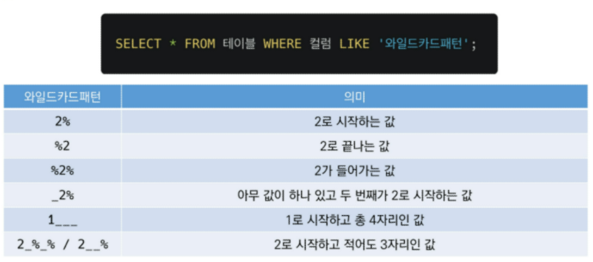

# 데이터베이스(db)

sqlite tutorial https://www.sqlitetutorial.net/

artertable https://www.sqlite.org/lang_altertable.html

datatype https://sqlite.org/datatype3.html

---

- [DATABASE](# DB)
  - [RDB](# 관계형 데이터베이스(RDB))
  - [RDBMS](# 관계형 데이터베이스 관리시스템(RDBMS))
- [SQL](# SQL )
  - [테이블생성 및 삭제](# 테이블 생성 및 삭제)
  - [CRUD](# CRUD)
  - [WHERE](# WHERE)
  - [Aggregate Functions](# Aggregate Functions)
  - [LIKE](# LIKE)
  - [ORDER BY & GROUP BY](# ORDER BY & GROUP BY)
  - [ALTER TABLE](# ALTER TABLE)

### DB

- 체계화된 데이터의 모임

- 여러사람이 공유, 사용할 목적으로 통합관리되는 정보의 집합

- 몇개의 자료파일을 조직적으로 통합하여

  자료항목의 중복을 없애고 자료를 구조화하여 기억시켜 놓은 자료의 집합체

`장점`

- 데이터 중복 최소화
- 데이터 무결성(정확한 정보)
- 일관, 독립, 표준화, 보안유지

### 관계형 데이터베이스(RDB)

- 키와 값들의 간단한 관계(relation를 표형태로 정리한 데이터베이스(ex, 엑셀)

- 스키마: 데이터베이스의 자료구조, 표현방법, 관계 등을 정의한 구조 (특징들을 모아놓은 것)

  | column | datatype |
  | ------ | -------- |
  | id     | int      |
  | name   | text     |
  | adress | text     |
  | age    | int      |

- 테이블

  - 열: 필드 or 속성 (객체들의 특징)

    ​	고유한 데이터 형식이 지정(id, name, age)

  - 행: <u>레코드</u> or 튜플  (하나의 객체)

    - 데이터가 입력될때, 레코드별로 입력 될 것임 !

      ex) 고객1명당 정보들

    | id   | name   | age  |
    | ---- | ------ | ---- |
    | 1    | 박다빈 | 25   |

  - PK(기본키)

    - 각 행의 고유값으로 primary key로 불림, <u>반드시 설정</u>(장고에선 자동으로 설정됨)
    - 데<u>이터베이스 관리 및 관계 설정시 주요하게 활용됨</u>, 반드시 설정
    - ex) id (1, 2, 3, 4)

### 관계형 데이터베이스 관리시스템(RDBMS)

- mysql, sqlite, oracle..

`sqlite`

- 서버 형태가 아닌 파일 형식으로 응용프로그램에 넣어 사용하는 비교적 가벼운 데이터베이스
- 구글 안드로이드 운영체제에 기본 탑재된 db

- `sqlite data type`
  - null
  
  - integer
  
  - real(float값)
  
  - text
  
  - blob(입력그대로 정확히 저장된 데이터/별다른 타입없이)
  
- 동적데이터 타입이라서 타입을 지정하지 않거나, int라도 타입 선호도라는 것으로 변경됨
- sqlite type affinity
  - (int, integer, .....) -> integer
  - (character, varchar...)-> text
  - (field, blob)-> blob
  - real
  - numeric

## SQL 

- 관계형 데이터베이스 관리시스템의 데이터 관리를 위해 설계된 특수 목적으로 프로그래밍 언어
- rdbms를 사용하는 언어이다.

`분류`

- DDL-데이터정의언어
  - 테이블, 스키마 정의
- DML-데이터조작언어(CRUD)
  - 데이터 저장조회수정삭제
- DCL-데이터제어언어
  - 사용자 권한제어

`SQL Keywords`

- insert, select, update, delete

### 테이블 생성 및 삭제

> 해당하는 데이터베이스 파일이 있으면 해당DB를 콘솔로 연다. 
>
> 만약 해당하는 파일이 없으면 새로 생성하고, 해당 DB를 콘솔로 연다.

```sqlite
--$ sqlite3 database

ex)
$ sqlite3 tutorial.sqlite3    // 1. 콘솔로 DB를 열고,
sqlite> .databases            // 2.데이터베이스 목록을 확인한다.
```


```bash
$ sqlite3 tutorial.sqlite3   (가운데 파일이름)
$.database #.은 프로그램의 기능을 실행
---
$sqlite> .mode csv  # CSV (쉼표로 구분 된 값) 데이터를 SQLite 테이블로 가져온다.
$sqlite> .import hellodb.csv examples  #테이블만듦  #기존의 hellodb.csv import
$sqlite> .tables
examples
#조회
$sqlite> SELECT * FROM examples;  #세미콜론까지가 하나의 명령(sql query)로 간주됨
#현재 examples table의 모든 데이터 조회됨
$sqlite> .headers on
$sqlite> SELECT * FROM examples;
id,first_name,last_name,age,country,phone
1,"길동","홍",600,"충청도",010-0000-0000table tabs tcl
$sqlite> .mode column
$sqlite> SELECT * FROM examples;
id  first_name  last_name  age  country  phone
--  ----------  ---------  ---  -------  -------------
1   길동          홍          600  충청도      010-0000-0000
```

 우측 + opendatabase 

 우측 + newquery + 저장 (sql확장자 파일 생성)

### CRUD

```sqlite
-- SQLite
SELECT * FROM examples; --우측 + run' selected query - > tutorial database

-- 테이블 생성
CREATE TABLE classmates (  --table이름 classmates
  id INTEGER PRIMARY KEY,  --스키마 넣기
  name TEXT
  ); -- 드래그 + run select
-- 테이블 제거
DROP TABLE classmates;
```

CREATE TABLE - 테이블 생성

DROP TABLE - 데이터베이스에서 테이블 제거

```sqlite
CREATE TABLE classmates (
  name TEXT,
  age INT,
  adress TEXT
  );
--bash
sqlite> .tables
sqlite> .schema classmates
```


1. CREATE

- INSERT는 특정 테이블에 <u>단일 행 삽입</u>

```sqlite
##이거만 외우면 됨 
INSERT INTO 테이블이름(컬럼1, 컬럼2..) VALUES (값1, 값2...);
```

- tutorial.sqlite3에서 new query + 저장 (01_create)

```sqlite
-- 삭제
DROP TABLE classmates;

---rowid만 존재하게, id 제외하고 만들기
CREATE TABLE classmates(
  --id INTEGER PRIMARY KEY,
  name TEXT NOT NULL,
  age INT NOT NULL,
  adress TEXT NOT NULL
  );


--value 넣기
--모든 열에 데이터가 있는경우, column 명시 안해도됨
INSERT INTO classmates VALUES ('홍길동',1, '서울');  

INSERT INTO classmates VALUES 
('홍길동',30, '서울'),
('김철수',30, '대전'),
('이광주',56, '광주'),
('김구미',30, '구미'),
('최전자',10, '부산');

--ID값을 스키마에 직접 작성하게 된다면 위는 오류가 남
--따라서 입력컬럼을 명시해줘야함
INSERT INTO classmates(name, age, adress) VALUES('홍길동', 30, '서울');
```


2. READ

2-1. SELECT statement(문)

- 테이블 데이터 조회
- 복잡하며, 다양한 절(clause)과 함께 사용
- clause
  - LIMIT
    - 쿼리에서 반환되는 행 수 제한
    - 특정 행부터 시작해서 조회하기 위해 offset키워드와 함께 사용됨
      - offset
        - 0부터 시작함
        - ABCDEF에서 문자 C는 2의 OFFSET을 지님
        - SELECT * FROM MY_TABLE LIMIT 10 OFFSET 5
        - (6TH 행부터 10개 행을 조회)
  - WHERE
    - IF (조건을 사용)
    - SELECT 컬럼1, 컬럼2, ... FROM 테이블이름 WHERE 조건;
  - SELECT DISTINCT
    - 조회 결과에서 중복행을 제거
    - select 키워드 바로 뒤 + distinct 절 작성하기

```sqlite
--전부조회
SELECT * FROM classmates;

--ID까지 전부 조회
SELECT rowid, *From classmates;

--특정컬럼조회
SELECT rowid, name FROM classmates;

-- LIMIT: 원하는 행의 개수(num)만큼 가져오기 -- 
-- id, name cloumn을 하나만 조회해보기
SELECT rowid, name FROM classmates LIMIT 1;

-- offset(0th~)
-- id, name cloumn 값을 '세번째'에있는거 하나만 조회해보기
SELECT rowid, name FROM classmates LIMIT 1 offset 2;


-- WHERE: 조건을 통해 값 가져오기 --
-- id, name 중 주소가 서울인 경우의 데이터
SELECT * FROM classmates WHERE adress='서울';

--selelct(바로뒤+)distinct (중복행제거)
--특정컬럼을 기준으로 중복없이 가져오기
SELECT DISTINCT age FROM classmates;
```

3. DELETE
   - 테이블에서 행을 제거
   - DELETE FROM 테이블이름 WHERE 조건;
     - 어떤 조건 ? 중복 불가능한 (unique) 값인 rowid를 기준으로 삭제

```sqlite
--bash에서 지운다면
sqlite> DROP TABLE classmates;
.tables

--기본
DELETE FROM 테이블이름 WHERE 조건;

--table지우기
DROP TABLE classmates;

-- id 5인 레코드 삭제
DELETE FROM classmates WHERE rowid = 5;

--삭제 확인
INSERT INTO classmates VALUES('홍삼삼',20,'부산');


--id조회
SELECT rowid, *FROM classmates;
--5가 재사용된것을 볼 수 있음  장고는 5를 재활용하지 않았는데, sqlite는 재활용
```

```sqlite
-- 재사용없이 사용하려면 ? (장고에선 이걸 기본으로 사용함)
-- CREATE TABLE 테이블이름 ( id INTEGER PRIMARY KEY AUTOINCREMENT,...);
```

```bash
장고에서 
$ python manage.py sqlmigrate app_name 0001 (설계도 번호)
(not null, autoincrement가 적용되어 있음)
$ python manage.py sqlmigrate app_name 0002 (설계도 번호)
```


4. UPDATE statement
   - SET clause에서 테이블의 각 열에 대해 새로운 값 설정
   - UPDATE 테이블이름 SET 컬럼1=값1, 컬럼2=값2,.. WHERE 조건;
   - 중복불가능값(UNIQUE)인 rowid 사용

```sqlite
UPDATE classmates 
  SET name='홍길동', adress='제주도'
  WHERE rowid=5;

SELECT rowid, * FROM classmates;
```


#### CRUD 정리

|      | 구문   | 예시                                                         |
| ---- | ------ | ------------------------------------------------------------ |
| C    | INSERT | INSERT INTO 테이블이름 (컬럼1, 컬럼2..) VALUES (값1, 값2);<br />(전체 값을 다 넣는거면 (컬럼1, 2)생략가능했음) |
| R    | SELECT | SELECT * FROM 테이블이름 WHERE 조건;                         |
| U    | UPDATE | UPDATE 테이블이름 SET 컬럼1=값1, 컬럼2=값2 WHERE 조건;       |
| D    | DELETE | DELETE FROM 테이블이름 WHERE 조건;                           |


## WHERE

```sqlite
--DROP TABLE users;
CREATE TABLE users (
  first_name TEXT NOT NULL,
  last_name TEXT NOT NULL,
  age INTEGER NOT NULL,
  country TEXT NOT NULL,
  phone TEXT NOT NULL,
  balance INTEGER NOT NULL
  );
-- $ sqlite3 tutorial.sqlite3
-- .mode csv
-- .import users.csv users
-- .tables 

-- age가 30 이상인 유저의 모든 칼럼 정보를 조회하려면 ?
SELECT *FROM users WHERE age>=30;
-- age가 30 이상인 유저의 '이름만' 조회하려면 ?
SELECT first_name FROM users WHERE age>=30;
-- 나이가 30이상 + 성이 김씨 인 사람의,,  나이와 이름만 조회
SELECT age, first_name FROM users WHERE age>=30 and last_name='김';
```


### Aggregate Functions

- 집계함수

- 값 집합에 대한 계산을 수행, 단일값 반환

  - 여러 행으로부터 하나의 결괏값을 반환하는 함수

- SELECT 구문에서만 사용됨

- 예시

  - 테이블 전체 행 수를 구하는 COUNT(*)  // 데이터의 개수

  - age 컬럼 전체 평균 값을 구하는 AVG(age) // 데이터들의 나이 평균

    

- 컬럼이 숫자일때 사용가능한 함수들

  - COUNT
    - SELECT COUNT(컬럼) FROM 테이블이름;
  - AVG
    - SELECT AVG(컬럼) FROM 테이블이름;
  - MAX
    - SELECT MAX(컬럼) FROM 테이블이름;
  - MIN
    - SELECT MIN(컬럼) FROM 테이블이름;
  - SUM
    - SELECT SUM(컬럼) FROM 테이블이름;

```sqlite
--USERS테이블의 레코드 총 개수를 조회한다면 ?
SELECT COUNT(*) FROM users;

--30살 이상인 사람들의 평균나이
SELECT AVG(age) FROM users WHERE age>=30;

--계좌 잔액이 가장 높은 사람의 이름과 그 액수를 조회
SELECT first_name, MAX(balance) FROM users;

--나이가 30 이상인 사람의 계좌 평균 잔액?
SELECT AVG(balance) FROM users WHERE age>=30;
```

## LIKE

- 와일드카드 문자

- 패턴일치를 기반으로 데이터를 조회하는 방법

- sqlite 는 패턴 구성을 위한 2개의 wildcards를 제공

  - %
    - 0개 이상의 문자
    - 이 자리에 문자열이 있을수도, 없을수도 있다.
    - 

  - _
    - 임의의 단일 문자
    - 반드시 이 자리에 한개의 문자가 존재해야 한다.
  - *, ? 등

```sqlite
-- 나이가 20대인 사람만 조회 ?
SELECT * FROM users WHERE age LIKE'2_';
--만일 2%로 하면 20대 가 아닌, 200, 2034,...


--지역번호가 02인 사람만 조회한다면 ?
SELECT * FROM users WHERE phone LIKE '02-%';
-- 지역번호가 024인 사람이 나올수도 있어서


-- 이름이 준으로 끝나는 사람조회
SELECT * FROM users WHERE first_name LIKE '%준';


--중간번호가 5114인 사람 조회 ?
SELECT * FROM users WHERE phone LIKE '%-5114-%';
```


### ORDER BY & GROUP BY

- order by
  - 조회 결과 집합을 정렬
  - select문에 추가하여 사용
  - 정렬 순서를 위한 2개의 키워드 제공
    - ASC -오름차순(default)
    - DESC-내림차순

```sqlite
SELECT * FROM 테이블 ORDER BY 컬럼 ASC;
SELECT * FROM 테이블 ORDER BY 컬럼1, 컬럼2 DESC;
```

```sqlite
--나이순으로 오름차순 정렬하여, 상위 10개만 조회한다면 ?
SELECT * FROM users ORDER BY age ASC LIMIT 10;

--나이, 성  순으로 오름차순 정렬하여 상위 10개만 조회한다면 ?
SELECT * FROM users ORDER BY age, last_name ASC LIMIT 10;
--age먼저 정렬하고, 그 안에서 성이정렬됨

--계좌 잔액 순으로 내림차순정렬하여,  유저 성+이름을 10개만 조회 ?
SELECT last_name, first_name FROM users
ORDER BY balance DESC
LIMIT 10;
```

- group by
  - 행 집합에서 요약 행 집합을 만듦
  - select 문의 optional절
  - 선택된 행 그룹을 하나 이상의 열 값으로 요약 행으로 만듦
  - 문장에 where절이 포함된 경우 반드시 where뒤에 작성

```sqlite
SELECT 컬럼1, aggregate_function(컬럼2) FROM 테이블 GROUP BY 컬럼1, 컬럼2;
-- 지정된 기준에 따라 행 세트를 그룹으로 결합
-- 데이터를 요약하는 상황에 주로 사용
```

```sqlite
--users에서 각 성씨가 몇명씩 있는지 조회한다면 ?
-- 이런 테이블과 컬럼은 존재하지 않음
SELECT last_name, COUNT(*) FROM users GROUP BY last_name;
-- db가 변경된 것은 아님 !

SELECT last_name, COUNT(*) AS name_count FROM users GROUP BY last_name;
```


### ALTER TABLE

```sqlite
잠시복습
-- title과 content라는 컬럼을 가진 articles라는 이름의 table생성
-- 두 컬럼 모두 비어있으면 X(not null하기), rowid를 사용

CREATE TABLE articles(
  title TEXT NOT NULL,
  content TEXT NOT NULL);

INSERT INTO articles VALUES('1번제목','1번내용');
```

- ALTER TABLE 기능

  - 테이블 이름 변경

    - ```sqlite
      ALTER TABLE 기존테이블이름 RENAME TO 새로운테이블이름;
      ```

  - 테이블에 새로운 컬럼 추가

  - 컬럼 이름 수정가능

    - ```sqlite
      ALTER TABLE table_name
      RENAME COLUMN current_name TO new_name;
      ```

  - DROP COLUMN (컬럼삭제)

```sqlite
-- title과 content라는 컬럼을 가진 articles라는 이름의 table생성
-- 두 컬럼 모두 비어있으면 X(not null하기), rowid를 사용

CREATE TABLE articles(
  title TEXT NOT NULL,
  content TEXT NOT NULL);

INSERT INTO articles VALUES('1번제목','1번내용');

--테이블 이름 변경
ALTER TABLE articles RENAME TO news;

--새로운 컬럼 추가
ALTER TABLE news ADD COLUMN created_at TEXT NOT NULL;
--에러/ not null이 붙은 컬럼은 그냥 추가할수 없음

--1. not null 없이 추가하기
ALTER TABLE news ADD COLUMN created_at TEXT;

INSERT INTO news VALUES ('제목','내용',datetime('now'));

--2. 기본값 설정하기
ALTER TABLE news ADD COLUMN subtitle TEXT NOT NULL DEFAULT '소제목';

-- 컬럼 이름 바꾸기
ALTER TABLE news RENAME COLUMN title TO main_title;

-- 컬럼 지워보기
ALTER TABLE news DROP COLUMN subtitle;
```


```sqlite
--sql
SELECT * FROM articles_article;
--orm
Article.objects.all()
```

```python
장고 01_django_model에서
shell_plus화면
Article.object.all()
Article.objects.all().query
print(Article.objects.all().query)

print(Article.objects.filter(pk=1).query)

Article.objects.get(pk=1).delete() = DELETE FROM articles_article WHERE id=1;
```


