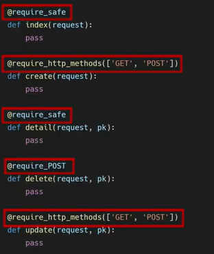
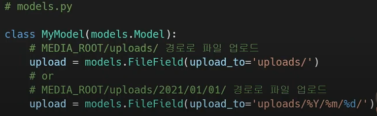
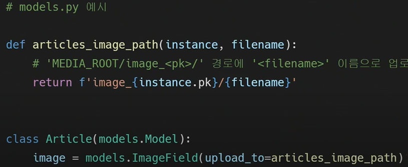

# HTTP

- 요청 처리 방법

  - django short cut function
  - view decorator 

  

### django short cut function

- 종류

  - render

  - redirect

  - get_object_or_404()

  - get_list_or_404()

    

- `get_object_or_404()`

  - 모델 메니저인 object 에서 get()을 호출하지만, 해당 객체가 없을시, does not exitst가 아닌 404 raise(없는 게시글을 조회하려고 할때)

  - 조건에 맞는 코드가 없을때 500이 호출된다.(서버가 처리 방법을 모르는 상황)

  - [http상태 코드](https://developer.mozilla.org/ko/docs/Web/HTTP/Status)

  - `상황에 따라 적절한 예외처리 + 올바른 에러상황 전달 중요`

  - ```python
    # views.py
    # update, detail, delete (게시글 조회 부분에 필요)
    def detail(request, pk):
        #article = Article.objects.get(pk=pk)
        article = get_object_or_404(Article, pk=pk) # 모델 클래스, 조회키워드 작성
    ```

  - .같음

- `get_list_or_404()`

  - API로 서버요청을 보낼때 사용

    

### django view decorator 

- [데코레이터](https://docs.djangoproject.com/ko/3.2/topics/http/decorators/)
  - 원본함수 수정하지 않으면서, 추가 기능만을 구현할때 사용
  - @

- Allowed HTTP methods
  - GET/POST /요청 메소드에 따라 view함수에 대한 엑세스 제한
  - 요청이 조건을 충족시키지 못하면 HttpResponseNotAllowed를 return
  - 만약 delete시 get요청으로 보내면 405 발생

- `require_http_methods()`
  - 데코레이터 종류를 나열할 수 있음 (["GET", "POST"])
- `require_POST()`
  - view함수가 POST 요청만 승인하도록 함 ()
  - ex_)delete
- `require_safe`
  - view함수가 GET  및 HEAD method 만 허용하도록 요구하는 데코레이터
  - require_get XX ->  require_safe 권장
  - ex) index, detail

```python
@require_http_methods(["GET", "POST"])
def create(request):
    if request.method == "POST":
        #create
        form = ArticleForm(request.POST)
        if form.is_valid(): 
            article = form.save()   
            return redirect('articles:detail', article.pk)
    else:  # POST가 아닌 다른 모든 거였는데, 데코레이션 때문에 바뀌며, 이게 아닌 요청시 405 나옴
```

.

- postman
  - main page에 대한 요청을 post로 보내면 main page를 안줘야함
  - post 요청을 보내는 프로그램


## Media file

> 사용자가 웹에서 업로드 하는 정적 파일(user-uploaded)

[field_type](https://docs.djangoproject.com/ko/3.2/ref/models/fields/#field-types)

MODEL FIELD

- imageField()
  - 이미지 업로드에 사용하는 필드
  - 파일 필드의 상속을 받음 !  + 이미지인지 검사
  - max_length로 길이변경 가능
  - `Pillow 라이브러리` need ~~migrate 위함~~
- fileField()
  - 파일 업로드에 사용하는 모델 필드
  - 2개의 선택인자
    - upload_to : 저장된 경로 작성
    - storage ?


- imageField 작성
  - upload_to = 'images/'
    - 실제 이미지 저장 경로 지정
      - 문자열 값, 경로지정
      - .
      - 함수 호출
      - .
  - `blank`
    - 모델 필드에 (blank=True)
    - 이미지 필드의 `빈값`이 허용되도록 설정
      - `유효성 검사`에서 통과 (is_valid)
    - 이미지 <u>선택적 업로드 하도록</u> 하기도 함 !
  - `null` - 값이 없음
    - 기본값 FALSE
    - TRUE인 경우, 빈값에 대해 `db`에 null로 저장 ! (db와 관련 ! )
    - char, text, image url와 같은 문자열 기반 필드에서 사용 X
      - 데이터가 없음에 빈 문자열(1) 과 NULL(2)의 2가지 가능한 값이 있음을 의미
  - null&True, blank=True
    - 문자열 필드가 아닌 경우 둘 다 사용 가능 -> NULL 만 저장


- 이미지필드나 파일 필드 사용위한 단계

  - settings.py에 media_root, media_url 설정

  - upload_to속성 정의하여 업로드된 파일에 사용할 media_root의 하위 경로를 지정

    - 즉 media_root -> upload_to

  -  업로드 된 파일의 경로는 장고가 제공하는 'url'속성을 통해 얻을 수 있음

  - ```django
      
      
       # 또는 스태틱 써서, 기본 이미지 제공
    ```


- media_root

  - 장고는 성능을 위해 업로드 파일을 db에 저장하지 않음
  - 실제 db에 저장되는 것 = 파일 경로

- media_url 

  - 업로드된 파일의 주소를 만들어줌

  ```python
  #settings.py
  MEDIA_ROOT = BASE_DIR/ 'media'
  MEDIA_URL = '/media/' # 비어있는 값이 아니라면 /로 끝나야 함 
  ```

- 사용자가 업로드 한 파일 제공해주기

  - https://docs.djangoproject.com/ko/3.2/howto/static-files/

  - <개발중 사용자가 업로드한 파일 제공>

  - ```python
    #pjt_url.py
    from django.conf import settings
    from django.conf.urls.static import static
    
    urlpatterns = [
        # ... the rest of your URLconf goes here ...
    ]+ static(settings.MEDIA_URL, document_root=settings.MEDIA_ROOT)  # 정적파일이라서 static을 import ! root가 media임을 주의 -!
    ```

  

- 이미지 업로드(Create)

  - form tag - 인코딩 속성
    - multipart/form-data
    - 파일/이미지 업로드시 반드시 사용 (전송되는 데이터 형식 지정)
    - input type="file" 일경우 사용

  ```django
  #create.html
  <form action="" method="POST" enctype="multipart/form-data">
  ```

  ```python
  def create(request):
      if request.method == 'POST':
          form = ArticleForm(request.POST, request.FILES) # create view_함수가 이미지를 받을 수 있도록
  ```

  

- input요소

  - accept 속성

    - 입력 허용 파일유형 나타냄

    - 파일을 검증하는 것은 아님 -!

      

- 이미지 수정(update)

  - 하나의 덩어리이기 때문에, 수정 불가 덮어씌우는거 가능

  - ```python
    #update.html
    <form action="" method="POST" enctype="multipart/form-data">
    #view
    def update(request, pk):
        article = Article.objects.get(pk=pk)
        if request.method == 'POST':
            form = ArticleForm(request.POST, request.FILES, instance=article) # 인스턴스는 뒤에 /키워드 인자가 아니이기 떄문
    ```


- 이미지 resizing

  - 크기 변경하기

    - 원본 이미지 서버에 업로드 하는건, 서버의 부담이 큼

    - 라이브러리 사용

    - [장고이미지키트](https://github.com/matthewwithanm/django-imagekit)

    - ```python
      pip install django-imagekit
      pip freeze > requirements.txt
      #settings.py
      INSTALLED_APPS = [
          'imagekit',
      ```

  - 원본 이미지 재가공 (원본 X, 썸네일 O)

  - ```python
    #model
    from imagekit.models import ProcessedImageField
    from imagekit.processors import Thumbnail
    # 기존 이미지 필드 주석
        image = ProcessedImageField( #processimagefield의 파라미터로 작성된 값은 변경하더라도 makemigration 필요 X
            blank=True,
            upload_to='thumbnails/',  # 원본저장 x 변환해서 썸네일에 저장
            processors=[Thumbnail(200, 300)],
            format='JPEG',
            options={'quality': 60})
    ```

  - 원본 이미지 재가공(원본 O, 썸네일 O)

  - ```python
    #기존 이미지 필드 유지 및 썸네일 생성
    from imagekit.models import ProcessedImageField, ImageSpecField
    from imagekit.processors import Thumbnail
        image = models.ImageField(upload_to="images/", blank=True)
        image_thumbnail = ImageSpecField(
    #        blank=True ?
            source='image', # 원본 이미지필드명
            processors=[Thumbnail(200, 300)],
            format='JPEG',
            options={'quality': 60})
    ```