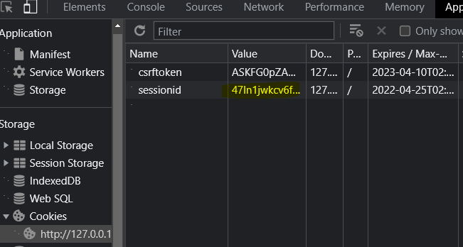

##### form 이름 외우기

## authentication _ 1

```python
# djang의 인증 시스템과 관련
INSTALLED_APPS = [
    'django.contrib.auth',
    'django.contrib.contenttypes',
```

인증시스템: 인증 + 권한


- 인증(authentication)
  - 사용자 신원 확인
- 권한, 허가(authorization)
  - 권한 부여, 사용자 수행작업 결정

```python
# 두번째 앱 생성
python manage.py startapp accounts  # accounts 이름 권장
# url
path('accounts/', include('accounts.urls')),
```


## 쿠키와 세션

- HTTP

  - HTML문서와 같은 리소스들을 가져올 수 있도록 해주는 프로토콜
  - 클라이언트-서버 프로토콜
  - 비 연결 상태
    - 서버는 요청에 대해 응답하고, 연결을 끊음
  - 무상태
    - 연결을 끊는순간 통신 끝, 상태정보 유지 x
    - 클라이언트와 서버의 메세지들은 독립적
  - 클라이언트와 서버의 지속적인 관계를 유지하기 위해 쿠키, 세션 존재
    - ex) 로그인

- 쿠키

  - 서버-> 사용자 웹 브라우저에 전송하는 작은 데이터 조각

  - 브라우저(클라이언트)는 쿠키를 로컬(컴)에 key-value 형식으로 저장

  - `http`는 상태가 존재하지 않아서, 상태가 유지되는 것 처럼 보이기 위해 요청에 쿠키가 넘어감 !

  - 페이지 접속-> 요청한 웹 페이지를 받으며 쿠키를 저장, 클라이언트가 같은 서버에 재요청시 요청과 함께 쿠키도 함께 전송

    

- 쿠키의 사용

  - 세션관리
    - 로그인, 아이디자동완성, 공지안보기, 팝업체크, 장바구니
  - 개인화
    - 사용자 선호, 테마 등 설정
  - 트래킹
    - 사용자 행동을 기록, 분석


## 쿠키와 세션

```python
개발자도구-NETwork-cartview.pang
		-application-cookies-마우스 우측, clear후 새로고침
```

- 세션
  - 상태 유지
  - 클라이언트가 서버에 접속 시, 서버가 특정 세션 id를 발급하고, 클라이언트는 발급받은 세션` id`를 쿠키에 저장
- 쿠키의 수명
  - 세션쿠키
    - 현재 세션이 종료되면 삭제됨
    - 일부/세션 복원으로 쿠키 유지 가능
  - persistant cookies
    - expires속성에 지정된 날짜, max-age에 지정된 기간이 지나면 삭제


### Session in django

- 미들웨어를 통해 구현
- database-backed-session 저장 방식을 기본값으로 사용
- 세션 아이디를 포함하는 쿠키를 사용해 각각 브라우저와 사이트가 연결된 세션을 알아냄
- 세션 정보는 장고 디비의 장고 세션테이블에 저장됨
- 모든것을 세션으로 사용하려면 서버에 부하 걸림

- ```python
  'django.contrib.sessions.middleware.SessionMiddleware', # 요청 전반에 걸쳐 세션 관리
  'django.contrib.auth.middleware.AuthenticationMiddleware', # 세션을 사용해 사용자를 요청과 연결
  ```

- HTTP요청-> 미들웨어-> url에 등록된 view로 연결 (반대도 성립)

- 데이터 관리, 앱서비스, 메시징, 인증 및 api관리

- [SESSION_ENGINE]([Settings | Django documentation | Django (djangoproject.com)](https://docs.djangoproject.com/en/3.2/ref/settings/#sessions))
- [SESSION_EXPIRE_AT_BROWSER]


## 로그인

- `AuthenticationForm`
  - request를 첫번째 인자로 취함, 사용자 로그인 폼
  - [django](https://docs.djangoproject.com/en/3.2/topics/auth/default/#module-django.contrib.auth.forms)
  - [git]([django/forms.py at main · django/django · GitHub](https://github.com/django/django/blob/main/django/contrib/auth/forms.py))

```python
#urls.py
from django.urls import path
from . import views

app_name="accounts"
urlpatterns = [
    path('login/', views.login, name="login"),
]
```

```python
from django.contrib.auth import login as auth_login
from django.contrib.auth.forms import AuthenticationForm

@require_http_methods(['GET', 'POST'])
def login(request):
    if request.user.is_authenticated: # 로그인 된 사람이면 이 view함수 호출하면 안됨
        return redirect('articles:index')
    if request.method =='POST':
        form = AuthenticationForm(request, request.POST) # 모델폼 말고, 폼 상속받음 //id비번 외에도 필요하므로, request도 담아서 보낸다.
        # login을 db에 저장xx # 인증의 수단일 뿐/ (회원가입과 다름)
        if form.is_valid(): # 폼에 인증된 사용자가 들어있음
            # 로그인  # user = form.get_user()
            auth_login(request, form.get_user()) # auth_login(request, user)
           # return redirect('articles:index')
            return redirect(request.GET.get('next') or 'articles:index')

    else:
        form = AuthenticationForm()
    context = {
        'form':form,
    }
    return render(request, 'accounts/login.html', context)
```

- login 함수
  - 인증된 사용자가 있는경우 함수 필요
  - 세션에 use의 id를 저장
  - .
  - key data django_session table에 저장

```django
# base.html
      <h3>hello,
        {{ user }}</h3> 
      <a href="">login</a>
```

- user id 출력됨

- django_templates_option_auth가 관여하는 user객체

  템플릿 requestcontext를 렌더링할때, 현재 로그인한 사용자를 나타내는  auth.user인스턴스

  비로그인시, anonymoususer // 템플릿 변수 user에 저장

- [django user model]([django.contrib.auth | Django documentation | Django (djangoproject.com)](https://docs.djangoproject.com/en/3.2/ref/contrib/auth/))


## 로그아웃

- 세션을 삭제
- `logout(request)`
- 반환값이 없으며, session data를 db에서 완전히 삭제
- 서버 및  클라이언트 쿠키에서 완전히 삭제함
- 다른 사람이 동일 브라우저 사용시, 이전 사용자의 세션 데이터에 엑세스하는 것을 방지


```python
from django.contrib.auth import logout as auth_logout
from django.views.decorators.http import require_http_methods, require_POST
@require_POST
def logout(request):
    # 로그인된 사람만 써야함
    if request.user.is_authenticated:
        auth_logout(request)
    return redirect('articles:index')
#base.html
      <form action="" method="POST">
        
        <input type="submit" value="logout">
      </form>
```


## 로그인 사용자에 대한 접근 제한

- the raw way
  - `is_authenticated` attribute
  - 인증되었는지 여부를 확인 True, Flase만 확인
  - user or anonymous인가 ? 확인만 함 -!

```django
#templates-request.user가 있어 정보 가져올 수 잇다-.
만약, 요청객체의 user의 속성값이 true면 -.
      
        <h3>hello,
          {{ user }}</h3>
        <a href="">login</a>
        <form action="" method="POST">
           <!--디비를 건들여야해서 post 사용-->
          <input type="submit" value="logout">
        </form>
      
        <a href="">login</a>
      
```

- 로그인을 했을때, 로그인 페이지로 다시 들어가지면 안됨

- 비로그인 사용자는 글을 쓰면 안됨

```django
#index.html

    <a href="">CREATE</a>
  
    <a href="">[새 글을 작성하려면, 로그인하세요]</a>
  
  <hr>
```


- the `login_required` decorator
  - 사용자가 로그인 되어있지 않으면, settings.login_url에 설정된 문자열 기반 절대경로로 redirect함
  - login_url의 기본 값은 accounts/login/
  - 사용자가 로그인 되어있으면 view함수 실행

```python
from django.contrib.auth.decorators import login_required

create, delete, update(CUD)
@login_required 첫번째 데코레이터에서 허용되어야 두번째 데코레이터 실행

# ?next=/articles/create/ 로그인 후 보내줄게 -!
```


- 'next' query string parameter
  - 로그인이 정상적으로 진행되면, 기존요청 주소로 redirect위해 주소를 keep해주는 것
  - 별도로 처리가 필요하다. 

```python
#view
def login(request):
            return redirect(request.GET.get('next') or 'articles:index')
#login.html
form action="" 비워두기 ( 현재 url/ next parameter가 있는/ 로 요청을 보내기 위해 )
```


```python
# view
@login_required  #비로그인 상태로 글 삭제됨 : 로그인 페이지로 가게됨/ 로그인을 하면 ? 405가 뜸!
# redirect는 무조건 get으로 요청이 감. 근데 삭제요청이 첨에 post였다가 로그인 이후 get으로 가게되버림!
@require_POST
def delete(request, pk):
    if request.user.is_authticated:
        article = get_object_or_404(Article, pk=pk)
        article.delete()
    return redirect('articles:index')
```


## authentication _ 2

### 회원가입

- username과 password로 권한이 없는 새 user를 생성하는 model form
  - username, password1-2

```python
from django.contrib.auth.forms import UserCreationForm

@require_http_methods(['GET', 'POST'])
def signup(request):
    if request.method=='POST':
        form = UserCreationForm(request.POST)
        if form.is_valid():
            user = form.save()
            auth_login(request, user) ## 회원가입 후 자동 로그인
        return redirect('articles:index')
    else:
        form = UserCreationForm()
    context ={
        'form':form,
    }
    return render(request, 'accounts/signup.html', context)
```

```django
//base.html
	<div class="container">
      
        <h3>hello,
          {{ user }}</h3>
        <form action="" method="POST">
          
          <input type="submit" value="logout">
        </form>
      
        <a href="">login</a>
        <a href="">signup</a>
      

      
    </div>
```

### 회원탈퇴

```python
@require_POST
def delete(request):
    if request.user.is_authenticated: # 현재 로그인한 회원만 탈퇴하도록 해야함
	# 반드시 회원 탈퇴 후 로그아웃 함수 호출
        request.user.delete()   # require post와, 로그인 requiredecorator를 같이 써줄수 없으므로, is_~ 해줌
        auth_logout(request) # 개발자도구에서 session도 지우고 싶다.

    return redirect('articles:index')
```

```django
        <form action="" method="POST">
          
          <input type="submit" value="회원탈퇴">
        </form>
      
```


### 회원정보수정

[usermodel]([django.contrib.auth | Django documentation | Django (djangoproject.com)](https://docs.djangoproject.com/en/3.2/ref/contrib/auth/))

```python
from .forms import CustomUserChangeForm
def update(request):
    if request.method=="POST":
        form = CustomUserChangeForm(request.POST, instance=request.user)
        if form.is_valid():
            form.save()
            return redirect('articles:index')
    else:
        form = CustomUserChangeForm(instance=request.user) # 유저객체 정보 가져오기
    context = {
        'form':form,
    }
    return render(request, 'accounts/update.html', context)
```

```python
#forms.py
from django.contrib.auth.forms import UserChangeForm
from django.contrib.auth import get_user_model # 현재 프로젝트에 사용하는 유저 클래스를 제공

# 회원정보수정을 내보냈을때, 필드전체가 다 보여버려서 수정하려고 작성
class CustomUserChangeForm(UserChangeForm):
    class Meta:
        model = get_user_model()  #user
        fields = ( 'email', 'first_name', 'last_name' )

#html
        <a href="">회원정보수정</a>
```


### 비밀번호 변경

`PasswordChangeForm`

[django athentic system](https://docs.djangoproject.com/en/3.2/topics/auth/default/#module-django.contrib.auth.forms)

```python
from django.contrib.auth.forms import( 
    AuthenticationForm, 
    UserCreationForm,
    PasswordChangeForm
    )
def change_password(request):
    if request.method=="POST":
        form = PasswordChangeForm(request.user, request.POST)
        if form.is_valid():
            form.save()
            return redirect('articles:index')
    else:
        form = PasswordChangeForm(request.user)  # 모델폼일 수가 없음
    context = {
        'form':form,
    }
    return render(request, 'accounts/change_password.html', context)
```

- 암호 변경시, 세션 무효화 방지
- 비밀번호가 변경되면, 기존 세션과 회원 인증정보가 일치하지 않게 되어 로그인 상태를 유지할 수 없기 때문

```python
from django.contrib.auth import update_session_auth_hash
@login_required
@require_http_methods(['GET', 'POST'])
def change_password(request):
    if request.method=="POST":
        form = PasswordChangeForm(request.user, request.POST)
        if form.is_valid():
            user = form.save()
            update_session_auth_hash(request, user)
            return redirect('articles:index')
    else:
        form = PasswordChangeForm(request.user)  # 모델폼일 수가 없음
    context = {
        'form':form,
    }
    return render(request, 'accounts/change_password.html', context)
```

