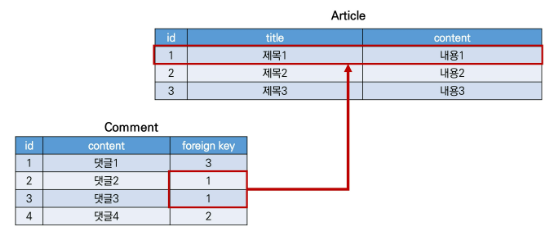

# 1:N

[customizing authentication in django](customizing authentication in django)

### Foreign key

- 외래(외부) 키
- 한 테이블의 필드 중 다른 테이블의 행을 식별할 수 있는 키
- 참조하는 테이블에서 속성(필드)에 해당하고, 이는 참조되는 테이블의 기본 키를 가리킴
-  참조하는 테이블의 외래키는 참조되는 테이블 행 1개에 대응됨
  - 없는 행 참조 불가
- 참조하는 테이블의 행 여러개가 참조되는 테이블의 동일한 행을 참조할 수 있음


- Article (참조 되는) 1  (하나의 행 값에 대응됨)  , 부모 테이블
  - id, title, content 
- Comment (참조하는 모델)    N:  N의 역할을 하는 모델이 FK를 가짐
  - id, content + FK (article의 pk값)

.


- ForeignKey field
  - A mant to - one relationship
  - 참조하는 모델클래스, on_delete옵션
- 데이터 무결성
  - 데이터의 정확, 일관성 유지 보증
  - 개체, 참조, 범위 무결성이 있음
  - 참조무결성-FK개념과 관련 

```python
class Comment(models.Model):
    # 참조하는 모델의 소문자 단수형으로 작성
    article = models.ForeignKey(Article, on_delete=models.CASCADE) # related_name='comments'써서 model_set 대체할 수 있음
    # on_delete : 게시글 삭제시, 댓글 처리방법
    # cascade; 부모객체 삭제시, 이름 참조하는 객체도 삭제
    content = models.CharField(max_length=200)   ## article, content는 auto-now 아니므로 값 넣어줘야함
    created_at = models.DateTimeField(auto_now_add=True)
    updated_at = models.DateTimeField(auto_now=True)
	# article_id 자동 생성됨
    def __str__(self):
        return self.content
```


- 댓글생성 연습
  - 댓글의 내용과, 어떤 게시글인지 - !

```python
$python manage.py shell_plus
IntegrityError: NOT NULL constraint failed: articles_comment.article_id 

comment.article_id = article.pk
comment.article = article ## 권장/ 객체를 통째로 넣으면 됨


In [5]: article = Article.objects.create(title="title", content="conten...: t")

In [6]: article.pk
Out[6]: 1

In [7]: comment.content
Out[7]: 'first comment'

In [8]: comment.article = article

In [9]: comment.save()

In [10]: comment.pk
Out[10]: 1

In [12]: comment.content
Out[12]: 'first comment'

In [13]: comment.article
Out[13]: <Article: title>
                                         
In [15]: comment.article.pk   # article의 인스턴스(comment에 종속된)
Out[15]: 1

In [16]: comment.article.content
Out[16]: 'content'
                                         
                                         
In [18]: comment = Comment(content = "second comment", article=article) 

In [19]: comment.save()
```

```python
from .models import Article, Comment # comment 추가
admin.site.register(Comment)
```

- 역참조

  - `comment_set`

  - 외래키가 없는 Article에서 Comment를 어떻게 참조하는가 ?

  - 1:N에서 1은 변화가 없었음

  - `article.comment_set`     # 자신을 참조하는 모델명.comment_set

  - ```python
    class Comment(models.Model):
        article = models.ForeignKey(Article, on_delete=models.CASCADE,related_name='comments')
        # 써서 model_set 대체할 수 있음
        article.comment_set > article.comments
        # 다만 1:N에서는 related_name 쓰지 않음
    ```

  - migrations

- 참조
  - comment-> Article
  - 실제 foreignkey또한 comment클래스에서 작성

```python
# 역참조
In [1]: article = Article.objects.get(pk=1)       

In [2]: article.comment_set.all()  # 모델말고, 인스턴스 조회 
Out[2]: <QuerySet [<Comment: first comment>, <Comment: second comment>]>

In [3]: comments = article.comment_set.all()      # 댓글 조회

In [4]: for comment in comments: # 댓글 출력
   ...:     print(comment.content)
   ...: 
first comment
second comment

In [5]: comment = Comment.objects.get(pk=1)       

In [6]: comment.article # comment입장에서 참조하는 게시글 조회
Out[6]: <Article: title>

In [7]: comment.article.content
Out[7]: 'content'

In [8]: comment.article_id  # ## ## 권장
Out[8]: 1
```


### commentCreate

- commentForm 작성

```python
#forms.py
class CommentForm(forms.ModelForm):
    class Meta:
        model = Comment
        field = '__all__'
        
#urls.py
    path('<int:pk>/comments/', views.comment_create, name='comment_create'),
    #path('<int:comment_pk>/comments/delete/', views.comment_delete, name='comment_delete'),
    path('<int:article_pk>/comments/<int:comment_pk>/delete/', views.comment_delete, name='comment_delete'),
    
    
#views.py

@require_safe
def detail(request, pk):
    article = get_object_or_404(Article, pk=pk)
    comment_form = CommentForm()
    # 조회한 article의 모든 댓글을 조회 (역참조)
    comments = article.comment_set.all()
    context = {
        'article': article,
        'comment_form':comment_form,
        'comments':comments,
    }
    return render(request, 'articles/detail.html', context)


@require_POST
def comment_create(request, pk):
    #댓글 출력은 어차피 detail에서 되므로.. 데이터베이스 처리만 하면 됨
    if request.user.is_authenticated:
        article = get_object_or_404(Article, pk=pk)
        comment_form = CommentForm(request.POST)
        if comment_form.is_valid():
            comment = comment_form.save(commit=False) # 댓글의 pk값 모름 #커밋: 실제 db에 저장하는 건데, 안하고 인스턴스만 만들고 save
            comment.article = article
            comment.save()
        return redirect('articles:detail', article.pk)
    return redirect('acoounts:login')

@require_POST
def comment_delete(request, article_pk, comment_pk):
    if request.user.is_authenticated:
        #comment = Comment.objects.get(pk=comment_pk)
        comment = get_object_or_404(Comment, pk=comment_pk)
        #article = comment.article.pk
        comment.delete()
        #return redirect('articles:detail', article)
    return redirect('articles:detail', article_pk)
    
```

```django
#detail.html
  
    <p>
      <b>{{ comments|length }}개의 댓글이 있습니다.</b>
    </p>
  

  <ul>
    
      <li>
        {{ comment.user }}
        -
        {{ comment.content }}
        <form action="" method="POST">
          
          <input type="submit" value="삭제">
        </form>
      </li>
	
  </ul>

```


### save()

`save(commit=False)`

- 아직 데이터베이스에 저장되지 않은 인스턴스를 반환
- 저장하기 전에 객체에 대한 사용자 지정 처리를 수행할때 유용하게 사용

### READ, Delete, 추가사항


## customizing authentication in django

#### [subtituting a custom user model](https://docs.djangoproject.com/en/3.2/topics/auth/customizing/#substituting-a-custom-user-model)

- 일부 프로젝트에선 내장 User 모델이 제공하는 인증 요구사항이 적절하지 않음
- 따라서 AUTH_USER_MODEL 값을 제공하여, default user model을 재정의하도록 함
- 프로젝트의 모든 migration 혹은 첫 migrate 를 실행하기 전에 이 작업을 마쳐야함

`AUTH_USER_MODEL`

- 프젝 진행중, 변경할 수 없음

- 기본값: 'auth.User' (auth앱의 User 모델)

- `AbstractUser`

- 마이그레이션 되기 전에 해야함 !!

- ```python
  #accounts/models.py
  from django.contrib.auth.models import AbstractUser
  class User(AbstractUser):
      pass
  
  #settings.py
  AUTH_USER_MODEL = 'accounts.User' # 기존: auth.User
  
  #accounts/admin.py
  from django.contrib import admin
  from django.contrib.auth.admin import UserAdmin
  from .models import User
  
  admin.site.register(User, UserAdmin)
  ```

- ```python
  db.sqlite3 파일 삭제
  migrations 파일 모두 삭제 *파일명에 숫자가 붙은 파일만 삭제
  $ python manage.py makemigrations
  $ migrate
  ```

- usercreationform, userchangeform ==> class Meta: model = User

- -->  custom user 모델로 대체해야함

- ```python
  # forms.py
  from django.contrib.auth.forms import UserChangeForm,UserCreationForm
  from django.contrib.auth import get_user_model
  
  
  class CustomUserChangeForm(UserChangeForm):
  
      # password = None
  
      class Meta:
          model = get_user_model() # 현재 장고프로젝트 모델의 활성화된 User를 참조함
          fields = ('email', 'first_name', 'last_name',)
  
  class CustomUserCreationForm(UserCreationForm):
      class Meta(UserCreationForm.Meta):
          model = get_user_model()
          fields = UserCreationForm.Meta.fields + ('email',)
  # view함수에서 변경해주기
  ```

- `get_user_model()`
  - 현재 프젝에서 active된 user model 반환
  - 커스터마이징되지 않으면 그냥 User반환
  - from django.contrib.auth.get_user_model()


## model relationship2

- 모델이 바뀐 Article, User

## User-Article(1:N)

사용자는 여러 게시물을 작성

```python
#articles/models.py
from django.conf import settings

class Article(models.Model):
    user = models.ForeignKey(settings.AUTH_USER_MODEL , on_delete=models.CASCADE)
#migrations - 1- 1 migrate
```

- User 모델 참조하기
  1. `settings.AUTH_USER_MODEL`    in models.py  (앱 순서를 고려하지 않기 위해) / str
  2. 그 외, `get_user_model()` / 객체 

```python
class ArticleForm(forms.ModelForm):

    class Meta:
        model = Article
        exclude = ('user',)
        
#views
create:
        if form.is_valid():
            article = form.save(commit=False)
            article.user = request.user
            article.save()
```

```python
#views
@require_POST
def delete(request, pk):
    article = get_object_or_404(Article, pk=pk)
    if request.user.is_authticated:
        if request.user == article.user:
            article.delete()
    return redirect('articles:index')

@login_required
@require_http_methods(['GET', 'POST'])
def update(request, pk):
    article = get_object_or_404(Article, pk=pk)
    if request.user == article.user:
        if request.method == 'POST':
            form = ArticleForm(request.POST, instance=article)
            if form.is_valid():
                article = form.save()
                return redirect('articles:detail', article.pk)
        else:
            form = ArticleForm(instance=article)
    else:
        return redirect('articles:index')
    context = {
        'article': article,
        'form': form,
    }
    return render(request, 'articles/update.html', context)
```


- 작성자 누구

```django
    <p>작성자:
      {{ article.user }}</p>
```

- 작성자 아니면 수정삭제 안보여줌

```django
 
  
```


## User-comment(1:N)

```python
#models.py
    user = models.ForeignKey(settings.AUTH_USER_MODEL, on_delete=models.CASCADE)

```

.


- 댓글 작성될때를 수정

  ```python
  def comment_create(request, pk):
              comment.user = request.user ### 추가 
              comment.save()
  ```

- 비로그인 유저 댓글 폼 안뜨게

```django
  
    <form action="" method="POST">
      
      {{ comment_form }}
      <input type="submit">
    </form>
  
    <a href="">[댓글을 작성하려면 로그인 하세요]</a>
  
```


