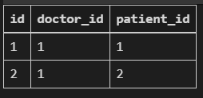
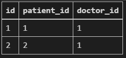
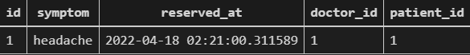

# M:N

- 1:N의 한계

- 해리가 의사 1, 2 모두에게 받을때 데이터가 중복되어 저장됨 (하나의 데이터에 doctor_id가 두개 들어갈 수 없다.)

  해리 -1, 해리-2

  한명의 의사-> 여러 환자

  한명의 환자-> 여러 의사

```python
from django.db import models


class Doctor(models.Model):
    name = models.TextField()

    def __str__(self):
        return f'{self.pk}번 의사 {self.name}'


# 외래키 삭제
class Patient(models.Model):
    name = models.TextField()

    def __str__(self):
        return f'{self.pk}번 환자 {self.name}'

# 중개모델 작성
class Reservation(models.Model):
    doctor = models.ForeignKey(Doctor, on_delete=models.CASCADE)     ## 둘다 역참조
    patient = models.ForeignKey(Patient, on_delete=models.CASCADE)

    def __str__(self):
        return f'{self.doctor_id}번 의사의 {self.patient_id}번 환자'
    
# mygration 숫자, db지우기
```

.

```python
# 코드 예시
doctor1 = Doctor.objects.create(name='justin')
patient1 = Patient.objects.create(name='tony')

Reservation.objects.create(doctor=doctor1, patient=patient1)

doctor1.reservation_set.all() # 둘다 역참조
patient1.reservation_set.all()

patient2 = Patient.objects.create(name='harry')
Reservation.objects.create(doctor=doctor1, patient=patient2)
# 중개테이블을 통해 역참조
```

- 컬럼 구조

  .

- 쿼리셋 데이터여서, for문으로 조회 가능

## ManyToManyField

- 하나의 필수 위치인자(M:N으로 설정할 모델클래스)
- 중개모델 필요 없어짐

```python
class Doctor(models.Model):
    name = models.TextField()      # doctor가 patient를 역참조 / patient_set
    

    def __str__(self):
        return f'{self.pk}번 의사 {self.name}'


class Patient(models.Model):
    # ManyToManyField 작성
    doctors = models.ManyToManyField(Doctor, related_name="patients")    
    # manytomanyfield가 doctor에 있어도 상관 없음 ### 복수####
    name = models.TextField()				# doctors라는 변수를 통해, 그냥 참조를 할 수 있음 !!

    def __str__(self):
        return f'{self.pk}번 환자 {self.name}'
    
## 컬럼 구조가 중개테이블과 같음_ 이름만 바뀜
# hospital_patient_doctors
```

- Foriegn Key 였으면, patient에 patient_id  처럼 새로운 컬럼이 생성되었을것인데 (종속 관계)

  M:N은 새로운 테이블을 만들어준다.

  (patient, doctor는 변화 없음 - 동등한 관계)

```python
# 코드 예시
doctor1 = Doctor.objects.create(name='justin')
patient1 = Patient.objects.create(name='tony')
patient2 = Patient.objects.create(name='harry')

patient1.doctors.add(doctor1)  # patient 입장에서 doctor를 add
patient1.doctors.all()
doctor1.patient_set.all()

doctor1.patient_set.add(patient2)
doctor1.patient_set.all()
patient2.doctors.all()
patient1.doctors.all()

doctor1.patient_set.remove(patient1)
doctor1.patient_set.all()
patient1.doctors.all()

patient2.doctors_set.remove(doctor1)
patient2.doctors.all()
doctor1.patient_set.all()
```

- 컬럼구조

  .

- 개념 및 특징

  - 하나의 필수인자 필요
  - add(), remove(), create(), clear()
  - `add()`
    - 이미 존재하는 관계에 사용할 시, 관계가 복제되지 않음

  - `remove()`
    - 내부적으로 queryset.delete()로 관계 제거

- 단점

  - pk_id_id 로만 만들어진다.
  - 하지만 의사_ 환자_ 만이 아니라, 더 많은 데이터가 필요_> 중개테이블 need _> through
  - [thorough](# thorough)

- `thorough`

  - 중개테이블읠 직접 작성하는 경우, 이 옵션을 통해 중개테이블을 나타내는 장고 모델 지정
  - 추가 데이터를 사용하는 다대다와 연결하여 사용

- `related_name`

  - target model이 source model을 참조할때 (역참조) 사용할 manager의 이름을 설정

  - 기존

    `patient1.doctors.all()`

    `dotor1.patient_set.all()`   doctor에서 patient를 역참조했어야 했음

  - `    doctors = models.ManyToManyField(Doctor, related_name="patients")    ` 후 migration

  - `doctor1.patients.all()`

- `symmetrical`

  - ManyToManyField가 동일한 모델(on self)을 가리키는 정의에엇만 사용
  
  - symmetrical=True(기본값)일 경우 django는 person_set매니저를 추가하지 않음 (양쪽에서 참조하므로, 역참조가 필요없어짐)
  
  - 대칭을 원하지 않는 경우 False로 설정 (맞팔 X)
  
    ```python
    class User(AbstractUser):
        # 재귀..
        followings = models.ManyToManyField('self', symmetrical=False, related_name='followers')
    ```
  
    - user모델의 인스턴스가 user모델의 다른걸 가리킬 수 있다.
  
  


#### thorough

```python
class Doctor(models.Model):
    name = models.TextField()

    def __str__(self):
        return f'{self.pk}번 의사 {self.name}'


class Patient(models.Model):
    doctors = models.ManyToManyField(Doctor, through='Reservation')
    name = models.TextField()

    def __str__(self):
        return f'{self.pk}번 환자 {self.name}'


class Reservation(models.Model):
    doctor = models.ForeignKey(Doctor, on_delete=models.CASCADE)
    patient = models.ForeignKey(Patient, on_delete=models.CASCADE)
    symptom = models.TextField()
    reserved_at = models.DateTimeField(auto_now_add=True)

    def __str__(self):
        return f'{self.doctor.pk}번 의사의 {self.patient.pk}번 환자'
```

```python
# 코드 예시
doctor1 = Doctor.objects.create(name='justin')
patient1 = Patient.objects.create(name='tony')
patient2 = Patient.objects.create(name='harry')

reservation1 = Reservation(doctor=doctor1, patient=patient1, symptom='headache')
reservation1.save()     # 의사도, 환자도 아닌 예약이 예약을 만든다.. ?? 는 아니고 다른걸로도 만들 수 있다.
doctor1.patient_set.all()
patient1.doctors.all()

patient2.doctors.add(doctor1, through_defaults={'symptom': 'flu'})  # through_defaults={'key': 'value'}
doctor1.patient_set.all()
patient2.doctors.all()

doctor1.patient_set.remove(patient1)
patient2.doctors.remove(doctor1)
```

.


- 중개테이블 필드 생성 규칙
- source model 및 target model이 다른경우
  - id
  - containingmodel_id
  - othermodel_id
- manytomanyfield가 동일한 모델을 가리킬때
  - id
  - from_model_id
  - to_model_id


# LIKE

user-article간 사용 가능한 db api

```python
article.user		게시글을 작성한 유저 1:N
article.like_users	게시글을 좋아요한 유저 M:N    //참조
    
user.article_set	유저가 작성한 게시글 1:N
user.like_article	유저가 좋아요한 게시글 M:N	// 역참조
```


- exist

  규모가 큰 queryset의 컨텍스트에서 특정 개체 존재여부와 관련된 검색에 유용

  (in을 쓰는 대신 사용)

  고유한 필드가 있는 모델이 쿼리셋 구성원인지 여부를 찾는 가장 효율적인 방법

  ```python
      # if request.user in article.like_users.all():
      if article.like_users.filter(pk=request.user.pk).exists(): 
  ```

  


## profile page

```python
#urls.py
    path('<str:username>/', views.profile, name='profile'),
    # str을 맨 위로 올려버리면 안됨.. 뒤에 int가 나오지 않는 이상, 다 str이 먹힘
    # 따라서 가장 마지막으로 빼주어야함
```


