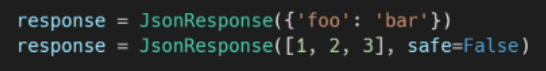
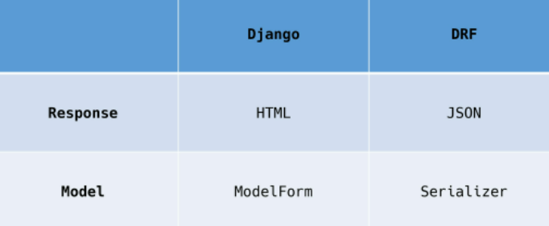
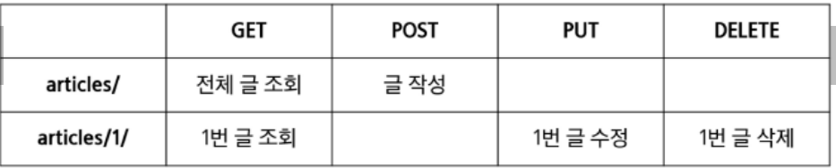

# RESTAPI

- 소프트웨어간 HTTP로 정보를 주고받는 부분이 있다면, 아래 규칙들을 준수해서 RESTful한 서비스를 만듦

### HTTP

- 웹 상에서 컨텐츠를 전송하기 위한 약속
- HTML 문서와 같은 리소스를 가져오는 프로토콜
- 웹에서의 데이터 교환 
  - 요청
    - 클라이언트에 의함
  - 응답
    - 서버에 의함
- 기본 특성
  - stateless _ 상태유지
  - connectionless _비연결성
- 쿠키와 세션을 통해 서버상태를 요청, 연결


#### HTTP request methods (요청)

- 자원에 대한 행위를 정의

- GET, POST, PUT, DELETE

- 조회, 작성, 수정, 삭제

  

#### HTTP request status methods (응답)

```python
1	1xx (조건부 응답)
2	2xx (성공)
3	3xx (리다이렉션 완료)
4	4xx (요청 오류)
5	5xx (서버 오류)
```

```python
- 200 successful responses

- 400 client error responses
- 401 Unauthorized (요청된 리소스에 대한 유효한 인증자격증명이 없어서, 클라이언트 요청이 완료되지 않음)
- 403 Forbidden (서버가 요청하지만, 권한이 거절됨)
- 404 Not Found (서버가 요청한 리소스를 찾을 수 없음)

- 500 Internal Server Error (서버에서 예기치 않은 상태가 발생하여 요청을 수행할 수 없다. 에러는 구체적이지 않은 catch-all 이다.)
```

[HTTP 상태 코드 - 위키백과, 우리 모두의 백과사전 (wikipedia.org)](https://ko.wikipedia.org/wiki/HTTP_상태_코드))


##### 웹에서의 리소스 식별

- HTTP요청의 대상==리소스, 자원 이라고함
- 문서, 사진, ..등등
- URI로 식별
  - 통합자원식별자
  - 인터넷 자원을 식별하는 유일한 주소_URL, URI

- URL
  - 통합자원 위치
  - 네트워크 상 어디있는지
  - 과거-실제자원위치
  - 현재-추상화됨
  - 웹주소, 링크
- URN
  - 통합자원 이름
  - 위치에 영향받지 않는 이름 역할
  - ex) ISBN_국제표준도서번호


- URI 구조
- Schema(protocol)
  - http(s), data, file, ftp, mailto
- HOST(domain name)
  - 요청받는 웹서버 이름
  - IP adrress(112.345.2..)
  - w ww.example.com
- Port
  - 리소스 접근시 사용되는 기술적인 '문(gate)'
  - HTTP 프로토콜의 표준 포트
    - HTTP80
    - HTTPS
    - :80
- Path
  - 웹 서버상 리소스 경로 _ 현재 추상화구조
  - /path/to/myfile.html

- Query(identifier)
  - 웹 서버에 제공되는 추가적인 매개변수
  - &로 구분되는 키벨류 목록
  - ?key=value
  - q=이거검색

- Fragment
  - #quick-start
  - 브라우저의 특정 부분을 보여주기 위함 
  - 서버에 전송X


---

#### RESTful API

- API
  - application programming interface
  - 앱과 프로그래밍으로 소통하는 방법 ___
  - `cli 명령`
  - `gui 그래픽_클릭`
  - `api 프로그래밍적 요청`
- web api
  - 웹 앱 개발에서 다른 서비스에 요청 보내고 응답 받기 위함
- 응답 데이터 타입
  - html, xml, json 등


- REST

  - REpresentation State Transfer 

    - API server를 개발하기 위한 일종의 소프트웨어 설계 방법론
    - 네트워크 구조원리의 모음
      - 자원을 정의하고 자원에 대한 주소를 지정하는 전반적인 방법

  - 웹 상에서 정의된 자원에 대해서 어디에 위치 시킬지 ??

    - 자원에 대한 주소: URI

    - 행위: HTTP Method

    - 표현: 자원과 행위를 통해 궁극적으로 표현되는 추상화된 결과물

      ​		 JSON으로 표현된 데이터를 제공

    - JSON
      - 자바스크립트의 표기법을 따른 단순 문자열
      - 사람이 읽고쓰기 쉽고, 기계가 파싱(해석,분석)하고 만들어내기 쉬움
      - 파이썬의 딕셔너리, 자바의 object처럼 C계열 언어가 가지는 자료구조로 쉽게 변화할 수 있는 key-value구조

  - REST 규칙

    - 정보_URI로 표현

    - 행위_HTTP method로 GET, POST, PUT, DELETE  표현

    - 지키지 않아도 괜찮음

      

- RESTFUL API
  - rest원리를 따라 설계한 API
  - restful services, 혹은 simply REST servieces라고도 부름


<모델과 뷰를 통해, json형태로 restful한 api 사용>

```python
INSTALLED_APPS = [
    'django_seed',
    'django_extensions',
    'rest_framework',
Django==3.2.12
django-extensions==3.1.5
django-seed==0.3.1
djangorestframework==3.13.1
```

- response

  [django_seed](https://pypi.org/project/django-seed/)

```python
#settings.py
pip install django-seed
'django_seed'

migrate
python manage.py seed articles --number=20
python manage.py seed api --number=20
```

```python
from django.http.response import JsonResponse, HttpResponse
def article_json_1(request):
    articles = Article.objects.all()
    articles_json = []

    for article in articles: # 쿼리셋 반복해서 딕셔너리 타입으로 append 됨
        articles_json.append(
            {
                'id': article.pk,
                'title': article.title,
                'content': article.content,
                'created_at': article.created_at,
                'updated_at': article.updated_at,
            }
        )
    return JsonResponse(articles_json, safe=False)


def article_json_2(request):
    articles = Article.objects.all()
    data = serializers.serialize('json', articles)
    return HttpResponse(data, content_type='application/json')
```

- content-type entity header
  - 컨텐츠의 유형이 무엇인지 ?
- JsonREsponse objects
  - json-ecnoded response를 만드는 httpresponse의 서브클래스
  - safe = True(기본)
  - json으로 응답해주는 객체이다 __!
  - .
  - 딕셔너리 이외의 객체를 직렬화 하려면 FALSE로 설정해야함

- Serialization(직렬화)
  - db응답으로부터 쿼리셋을 받으면, 이를 json으로 바로 변환할 수는 없음 
  - 따라서, 파이썬데이터 타입으로  --serialization-----> JSON, XML등의 유형으로 쉽게 변환 ! 
  - 쿼리셋 -> serialization을 통합 -> json, xml
  - 데이터 구조나 객체 상태(쿼리셋이나 모델객체)를 동일하거나 다른 컴퓨터 환경에 저장하고, 나중에 재구성할 수 있는 포맷으로 변환
  - deserialization - 받은 데이터를 validating 한 후에 parsed data를 complex type으로 다시 변환

```python
from django.core import serializers

def article_json_2(request):
    articles = Article.objects.all() # 쿼리셋을 json으로 변환하기 위해 data를 만들어서
    data = serializers.serialize('json', articles)  #data_ 직렬화된 객체로 만듦( 변환 )
    return HttpResponse(data, content_type='application/json')   
```

- django serializers
  - django 의 내장 httpresponse를 활용한 json 응답 객체
  - 주어진 모델 정보를 활용함
  - 이전과 달리 필드를 만들어줄 필요가 없음


---

---

- [resonse- django REST framework](https://www.django-rest-framework.org/)
- django rest framework(DRF) 라이브러리를 사용한 json 응답

```python
$ pip install djangorestframework
#settings.py
'rest_framework'

#views.py
# response drf 에서 제공
from rest_framework import status
from rest_framework.response import Response
from rest_framework .decorators import api_view
from django.shortcuts import get_list_or_404, get_object_or_404, render
from .serializers import ArticleListSerializer, ArticleSerializer, CommentSerializer
from .models import Article, Comment


# @api_view(['GET'])
@api_view()    # 필수, none이면 get
def article_json_3(request):
    articles = Article.objects.all()
    serializer = ArticleSerializer(articles, many=True) # 직렬화된 객체를 # many=True
    return Response(serializer.data)  # 응답  # 데이터가 뭐가 들어있을까..


#serializers.py
from rest_framework import serializers
from .models import Article


class ArticleSerializer(serializers.ModelSerializer):  # 게시글 쿼리셋을 serializer해주는 도구, 유효성검사

    class Meta:
        model = Article
        fields = '__all__'
```

- 앞에 들어오는 객체가 단일 객체가 아닐때, many=True 해줌
- 지금은 쿼리셋이기 때문이..(detail page는 이런게 필요없는데)


```python
# a.py
$ pip install requests

import requests
from pprint import pprint
response = requests.get('https://api.themoviedb.org/3/movie/550?api_key=accc38313aaf1d93d6c77da224a547b2')

pprint(response.json())
# json viewer로 봤던게 나옴  type은 list..
# .json() 으로 파이썬에서 쓸수 있는 데이터로 바꿔준다.
# dir(response)
articles_list = response.json()
for article in articles_list:
    print(article.get('title'))
#response.json()[1]

# 근데 api의 제공자가 우리임
# drf 라이브러리 통해서..
```


- DRF
- 웹 api 구축을 위한 강력한 툴을 제공하는 라이브러리
- 웹 api : 앱 개발에서 다른 서비스에 요청을 보내고 응답 받기 위해 정의된 명세

.


```python
pip install ipython

app_name 을 왜 썼는지_
:8000/articles/create
:8000을 바탕으로 서버로 들어가고, 서버에서 뒷부분 path를 통해 찾아감 
    즉, articles/create 가 있네 하고 뷰를 실행하는 건데

app_name은 관여하지 않았음
templates에서 url로 이동할때, 근데 걔가 articles에 있는 create야  로 가줘할때 쓰는 것 .
```


### single Model

- 단일 모델의 data를 직렬화하여 json으로 변환하는 방법 학습
- 단일 모델을 두고 crud로직을 수행 가능하도록 설계
- api 개발을 위한 핵심 기능을 제공하는 도구 활용

`postman`

- API를 구축하고, 사용하기 위해 여러도구를 제공하는 API 플랫폼
- 설계, 테스트, 문서화 등 도구를 제공함으로써 API를 더 빠르게 개발, 생성할 수 있도록 함

```python
#settings.py
    'articles',
    'django_seed',
    'django_extensions',
    'rest_framework',
python manage.py migrate
python manage.py seed articles --number=20
# url
```

- ModelSerializer
  - 모델 필드에 해당하는 필드가 있는 시리얼라이저 클래스를 자동으로 만들 수 있는  shortcut
  - 모델 정보에 맞춰 자동으로 필드 생성
  - serializer에 대한 유효성 검사기를 자동으로 생성
  - .create() & .update() 의 간단한 기본 구현 포함

```python
articles/ serializers.py 생성
from rest_framework import serializers
from django import forms
from .models import Article

class ArticleListSerializer(serializers.ModelSerializer):
    # list= article의 쿼리셋을 직렬화 하려고
    class Meta:
        model = Article
        fields = ('id','title')

class ArticleForm(forms.ModelForm):
    class Meta:
        model = Article
        fields = ('id', 'title')

    
from articles.serializers import ArticleListSerializer
articles = Article.objects.all()
serializer = ArticleListSerializer(articles, many=True) # 단일객체가 아니면 many=true 넣어주기
serializer.data
--- 이 데이터를 만드는 이유: 언어를 다 다른걸 쓸 수도 있어서, 그 사용자에게 json으로 변환해서 사용해야해서 준비된 serialize 파일이다.

serializer = ArticleListSerializer(articles)# 쿼리셋으로 시리얼라이저를 만들면
serializer.data # 데이터 확인시, 에러남 왜냐면 단일객체가 아니기 때문에..
```

- `many=True`

  단일 인스턴스 대신 QuerySet등을 직렬화하기 위해선, serializer를 인스턴스화 할때 many=True를 키워드 인자로 전달해야함


---

.

1. GET-Article List

- `api_view` decorator
  - 기본적으로 GET 메서드만 허용
  - 다른 요청에 405 method not allowed
  - drf에서는 필수로 작성해야 view 함수가 동작함

2. GET-Article detail

   - index 페이지에서 게시글이 없어도 보여주려고 get_list_or_404안썼었음

   - 여기선 데이터가 없으면 404 나오도록


`request.data`

```
request의 data를 가져와준다. request.POST와도 비슷하다.
입력받은 데이터를 POST에만 사용하는게 아니다. 다른 메소드에서도 사용하기위해 .data 를 쓴다. 
django_rest_framework 때문에 사용할 수 있음 !
```

3. POST - create Article

   - 201 created

   - article_list 함수로 게시글을 조회하거나 생성하는 행위를 모두 처리 가능

   - post는 body의 form-data 누르기 (postman)

​		[rest_framework_tuto](https://www.django-rest-framework.org/tutorial/2-requests-and-responses/)

- status code in drf

  ```python
  from rest_framework import status # status 모듈 
  
  return Response(serializer.data, status=status.HTTP_201_CREATED) # 생성된 데이터 return 
  return Response(serializer.errors, status=status.HTTP_400_BAD_REQUEST)  # 유효성 검사 통과 못하면 처리
  status=201 도 가능하지만 권장 X
  ```

- `raise_exception`

  ```python
      elif request.method =='POST': 
          serializer = ArticleSerializer(data=request.data)   
          if serializer.is_valid(raise_exception=True): # 유효성 검사
              serializer.save()
              return Response(serializer.data, status=status.HTTP_201_CREATED) 
          # return Response(serializer.errors, status=status.HTTP_400_BAD_REQUEST)  # 유효성 검사 통과 못하면 처리
          # is_valid 안에 raise_exception으로 대체가능
  ```

  

4. DELETE - delete Article
   - 삭제가 잘 되면 204 no content 상태코드로 응답

5. Put - update Article


---

## 1:N

db 지우고

- 모든 댓글 조회

```python
#models.py
기존 article모델 밑
코멘트 추가_ migrate, seed, 
#serializers.py
class CommentSerializer(serializers.ModelSerializer):
    # 댓글은 굳이 list, 단일 나누지 말고 article에 딸려오거나 내가쓴거 보게
    class Meta:
        model = Comment
        fields = '__all__'
#url
#view
#get으로 확인
```

- 단일 댓글 조회

- 댓글 작성

  POST - create comment

```python
@api_view(['POST'])
def comment_create(request, article_pk):
    article = get_object_or_404(Article, pk = article_pk)
    serializer = CommentSerializer(data = request.data)
    if serializer.is_valid(raise_exception=True):  # 통과 안되면 400 
        serializer.save(article=article)  # 원래 commit=False해서, 넣어줬는데 serializer는 직접 넣어줘야함
        #serializer를 통해서 보여주고 받는걸 다 같이함. 
        return Response(serializer.data, status=status.HTTP_201_CREATED)
    elif request.method=='POST':
        pass
```

```python
    if serializer.is_valid(raise_exception=True):  # 통과 안되면 400 
        #is_valid에서 어떤 게시글에 작성하는 댓글인지에 대한 정보를 form-data로 넘겨주지 않았기 떄문에, 
        #직렬화하는 과정에서 article 필드가 유효성 검사를 통과하지 못함
```

- commentserializer에서 article field에 해당하는 데이터 또한 요청으로부터 받아서 직렬화하는 것으로 설정되었기 때문
- 이때는 `읽기전용` 필드를 설정해, 직렬화하지 않고 `반환값에만 해당 필드가 포함`되도록 설정
- article은 validation에서는 빠져서 댓글만 유효성검사를 하게 된다.


- 1:N serializer

  - 특정 게시글에 작성된 댓글 목록 출력하기

    - 기존 필드 override

      ```python
      #override, 추가 둘다 가능
      1. PrimartKeyRelatedField
      	article의 pk
      	comment_set = serializers.PrimaryKeyRelatedField(many=True, read_only=True)
      	# comment_set의 pk를 들고옴
      
      2. Nested relationships
      	모델 관계상으로 참조된 대상은 참조하는 대상의 표현(응답)에 포함되거나 중첩될 수 있음
          				Article<-----comment
              article은 comment의 표현에 자동으로 표함되어있는데, 
              (자신을 참조하는 모델을 부를 수 있음)
              article도 comment를 불러올 수 있음
      	comment_set = CommentSerializer(many=True, read_only=True)
      	# comment_set 전체를 출력
      ```

      

  - 특정 게시글에 작성된 댓글 개수 구하기

    - 새로운 필드 추가

      ```python
          comment_count = serializers.IntegerField(source='comment_set.count', read_only=True)
          #article.comment_set.count() # articleserializer라서 article은 생략하고 속성 적기
      ```

      