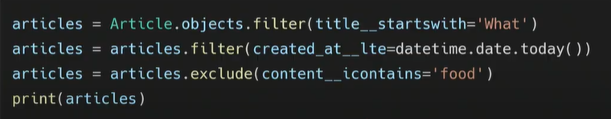
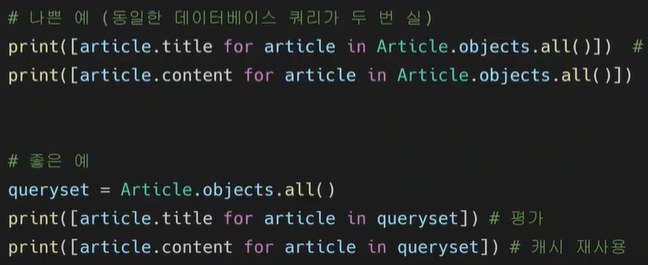
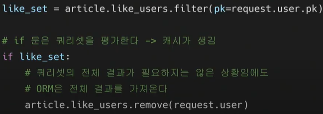
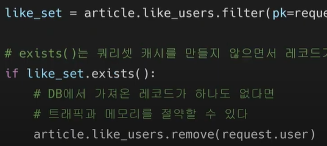
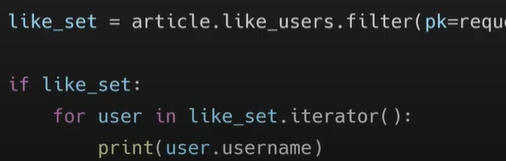
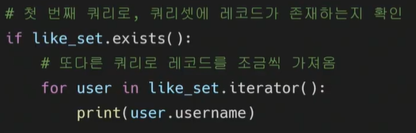
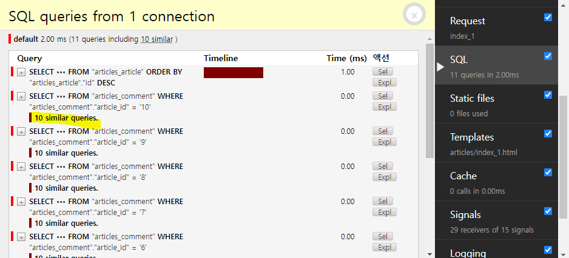

#### rest api library

[공식문서](https://drf-yasg.readthedocs.io/en/stable/readme.html#usage)

```bash
pip install -U drf-yasg
INSTALLED_APPS = [
   ...
   'django.contrib.staticfiles',  # required for serving swagger ui's css/js files
   'drf_yasg',
   ...
]
```

```python
from drf_yasg.views import get_schema_view
from drf_yasg import openapi
schema_view = get_schema_view(
openapi.Info(
    # 필수
    title="Snippets API",
    default_version='v1',
    # 선택
    description="Test description",
    terms_of_service="https://www.google.com/policies/terms/",
    contact=openapi.Contact(email="contact@snippets.local"),
    license=openapi.License(name="BSD License"),
    ),
public=True,
)
urlpatterns = [
    path('swagger/', schema_view.with_ui('swagger')), # redoc 도 지원함

]
```

[swagger로 post넣고 싶으면](https://drf-yasg.readthedocs.io/en/stable/custom_spec.html)

```python
@swagger_auto_schema(method="POST")
```


## Fixtures

db를 같이 push하지 말고, fixtures를 서로 공유해야함 (데이터를 추출한것을 -!)

- 데이터베이스의 serialized된 내용을 포함하는 파일 모음

- django가 fixtures 파일을 찾는 경로

  `app/fixtures` 앱이 여러개면 뒤에 더 추가해야 할 수도 있음

- dumpdata
- fixtures의 목적은 dumpdata를 사용하려고 하는 것_ !! 직접 json을 만들지 말것

```bash
python manage.py seed articles --number=10
json의 indentation을 4칸으로 하겠다.
앱이름.모델이름 > 모델.json으로 추출함 !

python manage.py dumpdata --indent 4 articles.article > articles.json
python manage.py dumpdata --indent 4 articles.comment > comments.json
python manage.py dumpdata --indent 4 accounts.user > users.json

#app/fixtures  욺겨주기
python manage.py migrate

#fixture의 내용 검색해서 db로 로드
한번에 여러개 가능
python manage.py loaddata articles.json comments.json users.json
# db 채워짐

# app/fixtures/name_space
articles/articles.json accounts/....이 케 하면됨
```


## Improve query

article.objects.all()   -- 쿼리셋은 게으르다 ---- 쿼리셋은 db작없이 포함되지 않는다.

하루종일 필터를 함께 쌓을 수 있으며, 장고는 쿼리셋이 평가될때까지 실제로 쿼리를 실행하지 않음

.

프린트에서, 단 한번 db에 전달 (마지막에 일을 함)

- 평가
  - 쿼리셋에 해당하는  db의 레코드를 실제로 가져오는 것
  - 평가된 모델들은 쿼리셋의 내장캐시에 저장되며, 덕분에 우리가 쿼리셋을 순회하더라도 똑같은 쿼리를 db에 다시 전달하지 않음
  - 이미지같은 큰 것들을 캐쉬로 욺겨놓고, 실제 서버에서 보내주는 것은 얼마 없음

- 쿼리셋이 평가되는 시점

  - Iteration

    - 쿼리셋은 반복가능하며, 처음 반복시 데이터베이스 쿼리를 실행

    - ```python
      for article in Article.objects.all():
          print(article.title)
      ```

  - bool

    - bool() 또는 if 문 사용과 같은 bool 컨텍스트에서 뭐리셋을 테스트하면 쿼리가 실행

    - ```python
      if Article.objects.filter(title='Tesr'):
          print('heollo')
          # 결과가 하나 이상인지 확인만 하려면 exist가 효율적
      ```

    - repr(), len(),,...

    

- 새로운 쿼리셋이 만들어지면 캐시는 비어있음
- 쿼리셋이 처음으로 평가되면 디비에 쿼리가 발생
  - 장곤는 쿼리결과를 쿼리셋의 캐시에 저장하고 명시적으로 요청된 결과를 반환
  - 이후 쿼리셋 평가는 캐시된 결과를 재사용

- .# 평가 # 평가

- 쿼리셋에서 특정 인덱스를 반복적으로 가져오면 매번 디비를 쿼리
- 그러나 쿼리를 article for article inqueryset해서 미리 평가해둔 후 인덱스로 가져오면, 캐시에서 확인함

- with 템플릿 태그
- iterator()


## 필요하지 않은 것을 검색하지 않기

- count (len보다 좋음)
  - 카운트만 원할시
- exitst()
  - 최소한 하나의 결과가 존재하는지 확인할때, if queryset.. ~~ 대신 사용하기


- 좋아요 코드 예시
- if 문 때문에 쿼리셋이 평가되고, 이에 따라 쿼리셋 캐시에도 전체 레코드가 저장됨
- /
- .
- if 문 안에 반복문이 있다면, 순회할땐 if문에서 캐시된 쿼리셋이 사용됨
- 근데 쿼리셋이 너무 크면, 캐시자체가 문제가 될 수 있음
- .
- .

- 안일한 최적화 주의
- exist, iterator는 쿼리를 안만듦으로, db쿼리가 중복될 수 있다.


## annotate

`django debug tool`




### 한번에 모든 것을 검색하기

1. select_related()
   - 1:1 또는 1:N 참조 관계에서 사용
   - db에서 이너조인
2. prefetch_related()
   - M:N 또는 1:N 역참조 관계에서 사용
   -  db가 아닌 파이썬을 통한 조인

```python
from django.shortcuts import render
from .models import Article, Comment
from django.db.models import Count


def index_1(request):
    # articles = Article.objects.order_by('-pk')
    articles = Article.objects.annotate(Count('comment')).order_by('-pk')
    context = {
        'articles': articles,
    }
    return render(request, 'articles/index_1.html', context)


def index_2(request):
    # articles = Article.objects.order_by('-pk')
    # 한번에 가져오기 셀렉트..
    articles = Article.objects.select_related('user').order_by('-pk')
    # article가져올때, 1:N의 1인 user를 같이 가져온다.
    context = {
        'articles': articles,
    }
    return render(request, 'articles/index_2.html', context)


def index_3(request):
    # 1:N역참조일떄, article을 불러올때 댓글을 가져오는 법
    # articles = Article.objects.order_by('-pk')
    articles = Article.objects.prefetch_related('comment_set').order_by('-pk')
    context = {
        'articles': articles,
    }
    return render(request, 'articles/index_3.html', context)

from django.db.models import Prefetch

def index_4(request):
    # 2, 3번이 동시에 일어난 상황
    # 1:N 역참조, N:1 참조가 동시에 일어남
    # articles = Article.objects.order_by('-pk')
    articles = Article.objects.prefetch_related('comment_set').order_by('-pk')
    articles = Article.objects.prefetch_related( #아티클의 입장에서 밑의거를 가져옴 
        Prefetch('comment_set', queryset=Comment.objects.select_related('user')) # 여러개를 가져온다.comment_set./ 사실상 queryset이 먼저..
    ).order_by('-pk')
    context = {
        'articles': articles,
    }
    return render(request, 'articles/index_4.html', context)
## 하나의 입장에서 여러개를 가져온다.

```


### 섣부른 최적화

- 작은 효율성에 대해선 97% 에 대해선 사용하지 말기 _ ! 
- 만약 한번쓰고 말 것이라면, 캐쉬를 하지 않는게 더 낫다.


