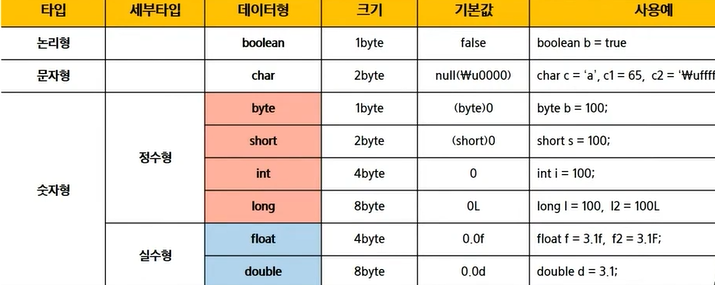
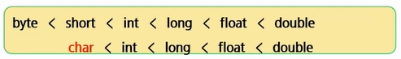
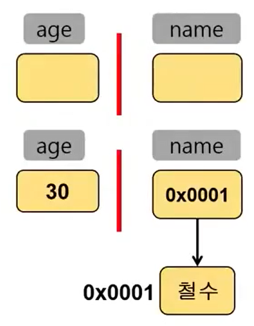

## 변수와 타입

- 주석 ctrl _ shift_ c
- 정렬 ctrl_shift_f
- 줄 복사 ctrl_alt_화살표

```java
new > javaproject
src > class
main ctrl + space
    sysout + ctrl _ space
```

```
출력문

- print
- println   # linenext   # \n
- printf
  - %d
```


- 변수
  - 선언
  - 자료형 변수명
  - int age; String name;
  - 정수는 4 바이트
  - string 크기를 알 수 없어서, 다른데에 저장하고, 그 위치를 기억하도록 함


- 자료형
  - .
  - .(자료형의 크기 비교)
  
- 자료형의 type
  - 기초 자료형
    - age - 30
    - 내가 확보한 공간에 데이터를 넣는것
  - 참조 자료형
    - 데이터는 다른곳에 넣고, 그 위치를 보관하는 것
    - name - 0x0001   -- 0x0001 -  철수
    - .


```java
package java_0330;

/*
 * 여러줄 주석
 */
// 주석은 이렇게
public class test {
	public static void main(String[] args) {
		System.out.print("hello world\n");
		System.out.println("hi");
		System.out.printf("%d \n", 10); //정수(10진수)
		System.out.printf("%o \n", 10); //정수(8진수)
		System.out.printf("%x \n", 10); //정수(16진수)
		
		System.out.printf("%4d \n", 10);  // 4칸 확보 후 오른쪽부터 차지
		System.out.printf("%04d \n", 10);  //오른쪽부터 차지, (빈공간은 0)
		System.out.printf("%-4d \n", 10);  // 왼쪽부터 차지

		System.out.printf("%f \n", 10.1);  // 실수
		System.out.printf("%.2f \n", 10.1);  // 실수(소수점 둘째자리 까지)
		
		System.out.printf("%s \n", "다빈");  //문자열
		
		System.out.printf("%s의 나의는 %d입니다. \n", "다빈", 25);  // 
		
		
		
		int a;
		a = 10;
		System.out.println(a);  // 변수는 값을 할당하지 않고, 사용할 수 없다.
		
		int b = 20;
		System.out.println(b);
		
		int c = a; // 오른쪽 변수를 꺼내서 왼쪽 변수에 담는다.
		
		c = b;
		System.out.println(c);
	}
}
```


- 형변환

  - 묵시적
    - 범위가 넓은 데이터에 좁은거 넣음
  - 명시적
    - 범위가 좁은 데이터에 넓은거 넣음

  

```java
public class type {
	public static void main(String[] args) {
		//사람의 정보 담기
		
		//입력		
		String name = "Hong";
		int age = 25;
		int height = 179;
		int weight = 70;
		
		//출력
		System.out.printf("이름은 %s 이고, 나이는 %d입니다. \n", name, age);
		System.out.printf("키는 %3d 이고, 몸무게는 %3d입니다. \n", height, weight);
		
	}
}
```

