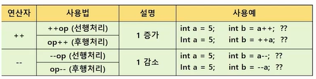

##  연산자

- 스캐너 만들기
  - sca_ ctrl_space
  - Scanner sc = new Scanner(System.in);

- 증감 연산자
  - .

```java
import java.util.Scanner;

public class type {
	public static void main(String[] args) {
		
		Scanner sc = new Scanner(System.in);
		//사람의 정보 담기
		
		//입력		
		String name = sc.next();  //문자를 받음
		int age = sc.nextInt();  //숫자를 받음
		int height = 179;
		int weight = 70;
		
		//연산
		//내림연산
		age = age/10 *10;
		age = age - (age%10);
		
		//반올림
		//+5 더하고, 내림을 한다.
		height = ( height + 5 )/ 10*10;
		
		//BMI 결과 비만 or 정상 // 몸무게/(키*키)
		boolean isHeavy = ( weight / ( height / 100.0 ) * ( height / 100.0 ) ) > 30;
		
		//출력
		System.out.printf("이름은 %s 이고, 나이는 %d입니다. \n", name, age);
		System.out.printf("키는 반올림해서 %3d 이고, 몸무게는 %3d입니다. \n", height, weight);
		
		System.out.printf("BMI결과는 %s 입니다. \n", isHeavy ? "비만" : "정상");
//		System.out.printf("BMI결과는 %s 입니다. \n", isHeavy ? "비만" : ( ? "과체중"));
		
		
		
		int num = 10;  //10
		System.out.println(num++); //11  //num을 써서 일단 출력 후// 그 다음에 늘리기
//		System.out.println(num++);
//		num = num +1;
		
		System.out.println(++num); //12  //먼저 num을 늘리고 //num 출력
//		num = num + 1;
//		System.out.println(num);		
		
	}
}

```

- 3항 연산자

  - (true or flase) ? 값1 : 값2

  - ​       1 **             2       3

  - 첫번째 항이 true일 경우, 전체를 값 1로 처리

    ​		   		False인 경우 전체를 값2로 처리

  ```java
  public class bool {
  	public static void main(String[] args) {
  		int a = 10;
  		boolean b1 = a > 10;  //F
  		boolean b2 = a != 10; //F
  		boolean b3 = a >= 10; //T
  		System.out.println(b1);
  	}
  }
  ```

- 조건 연산자: 결과값으로 참, 거짓이 반환

  - | 연산자 | 사용법 | 설명                         |
    | ------ | ------ | ---------------------------- |
    | &&     | A&&B   | a와 b 모두 참일경우          |
    | \|\|   | A\|\|B | a또는 b둘 중 하나가 참일경우 |
    | !      | !A     | A가 참이면 거짓, 거짓이면 참 |

  - 윤년
  - (year%4)==0: && (year%100)!=0:    ||    (year%400)==0:

  - 사용자에게 년도 입력 받아서, 윤년인지 아닌지 출력


