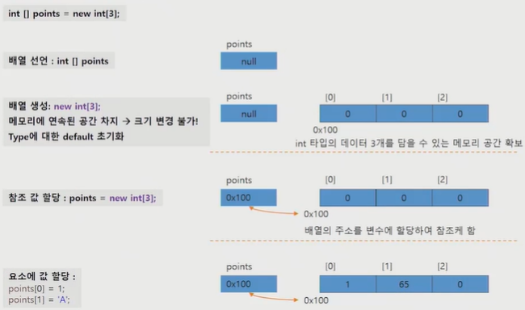

# 2차원 배열

- 1차원 배열 선언
  - `int[] prime`
  - `prime = new int [10]`
- 2차원 배열 선언
  - `int [][] prime`
  - `arrname = new arr[1차원 배열개수][1차원 배열크기];`
  - `arrname = new arr[1차원 배열개수][];`

- 선언
  - `int [] iArr;`
  - `char [] cArr;`
  - `boolean [] bArr;`
  - `String [] strArr;`
  - `Date [] dateArr;`


- 배열의 초기화

  - 자동 초기화

  - int a

  - sysout a  XXX 안됨

  - 근데 배열에선 기본값을 초기화 함

    ```java
    int:0
    boolean:false
    char:'\u0000'
    참조: null
    ```

  - 초기화

    ```java
    int [] prime = {1, 2, 3};
    int [][] twoArr = {{1, 2}, {3, 4}, {5, 6}};
    ```


- 배열 출력

  - `System.out.println(Array.toString(destArr))`

    

- 응용

```java
int intArray[] = {1, 3, 5, 7, 9};
for(int x: intArray){   //readonly(copied)
    System.out.println(x);
}  
//동일함
for(int i=0; i<intArray.length; i++){
    int x = intArray[i];
    System.out.println(x)
}
```

- 최대 최소 찾기

  ```java
  //for-each문
  for(int n: prime){
      sysout(n);
  }
  
  
  //////
  int[] intArr = {3, 5, 7, 5}
  int max = Integer.MAX_VALUE; // 최대값 초기화 가능 library 활용
  int min = Integer.MIN_VALUE;
  for (int num:intArr){
      min = Math.min(min, num);
      max = Math.max(max, num);
  } sysout("min: %d, max: %d", min, max);
  //
  for (int num:intArr){
      if (num<min){
          min = num;
      }
      if(num>max){
          max = num;
      }
  } 
  
  ```

- 요소의 빈도 카운팅

  ```java
  int[] intArray = {4, 5, 2, 6};
  int[] used = new int[10];
  
  for (int num:intArray){
      used[num]++;
  }sysout(Arrays.toString(used));
  ```

- 배열 copy

  ```java
  System.arraycopy(src, srcPos, dest, destPos, length)
  src: 원본배열
  srcpos: 원본배열의 복사시작위치(0~)
  dest: 복사할 배열
  destpos: 복사받을 시작위치
  length: 복사할 크기
  ```

  ```java
  String[]oriArr = {"봄", "여름"};
  String[]destArr = new String[oriArr.length+1];
  System.arraycopy(oriArr, 0, destArr, 0, oriArr.length);
  destArr[3] = "겨울";
  for (int i=0; i<destArr.length; i++)
      sysoutprintln(destArr[i]);
  ```

  <메모리할당단계>

- .

