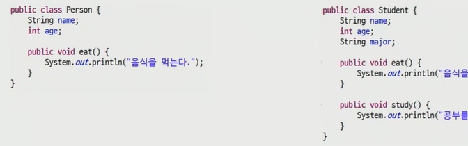
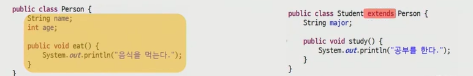

# 상속(inheritance)

```
사람 - superclass
#이름 #나이 등등 - subclass
```

.

.


`상속`

- 확장, 재사용성
  - 부모의 생성자와 초기화 블록은 상속x
- 클래스 선언시 extends 키워드 명시
- object 클래스는 모든 클래스의 조상 클래스
  - 별도의 extends 선언이 없는 클래스는 extends object가 생략


```java
package 상속;

class Parent {
	int data = 10;
	
	Parent(int data){
		this.data = data;
		System.out.println("parent클래스의 생성자");

	}
//	Parent(){
//		System.out.println("parent클래스의 생성자");
//	}
}
class Child extends Parent{
	String name;
	Child(){
		// 부모클래스에 기본 생성자가 있다면, super는 생략해도 됨
		super(10); // 부모 클래스 생성자의 호출, 상속을 받으면 생성자의 첫 줄에서 이 문장을 수행하게 됨
		//부모클래스에 기본 생성자가 없는 경우,
		//자식클래스 생성자의 첫 줄에서 명시적으로 부모클래스의 생성자를 호출해줘야됨
		System.out.println("Child 클래스의 생성자");
	}

}

public class ExtendsTest {
	public static void main(String[] args) {
		Child c = new Child();
	}
}
```

- 오버라이딩 ( 재정의 )

```java
class Parent {
	int data = 10;
	public void print() {
		System.out.println(data);
	}
}
class Child extends Parent{
	int data = 20;
	public void print() {
		int data = 30;
		System.out.println(data);     // 30
		System.out.println(this.data); //20
		System.out.println(super.data);//10
	}
}

public class ExtendsTest {
	public static void main(String[] args) {
		Child c = new Child();
		System.out.println(c.data);
		c.print();
	}
}
```

- 오버라이드
  - 상위클래스의 매서드를 자식클래스에서 재정의 하는 것
  - 메서드의 이름, 반환형, 매개변수(타입, 개수, 순서) 동일
  - 하위 클래스의 접근제어자 범위가 상위 클래스보다 크거나 같아야 한다.
  - ~~메서드오버로딩이 아님~~
- `@Override`
- 컴파일러야 이거 오버라이드 하는거니까 문제있나 체크해


- final

  1. 변수: 상수
  2. 메소드: 오버라이딩 금지
  3. 클래스: 상속

  ```java
  class Printer{  
      public final void print(){}  // 내가 만든대로만 동작해야해
  }
  ```

  

