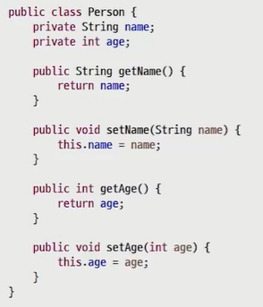

# 접근제한자(access modifier)

// 자동 import: ctrl + shift + o

## 패키지(package)

- 패키지: 많은 클래스를 관리하기 위해 패키지를 이용한다.
- 패키지의 구분은 dot(.)을 이용
- com.소속.project\_이름.module_이름  (큰것부터)

```java
//import java.util.Scanner; // 풀패키지명
import java.util.*; // java.util 안에 있는 모든 클래스 import


public class 패키지1 {
	public static void main(String[] args) {
//		Scanner s;
		Arrays a; // import java.util.*; // java.util 안에 있는 모든 클래스 import
		
		//import java.util.function.DoubleFunction;
//		DoubleFunction d; // import java.util.function.DoubleFunction;
		
		
		List<String> l;
		// java.awt.List
		// import를 안하고 쓰거나, 동일한 이름의 클래스가 내가 사용하는 범주 내에서 겹친다면
//		java.util.Scanner s;
		

	}
}
// 패키지가 다르면, 안의 클래스 name은 같아도 된다.
// import는 풀패키지명으로 가져오거나 *로 가져온다
// *는 직속으로 있는 클래스만 온다. (더 깊이있는건 x)
// import 시, 임포트 안하고, 풀패키지명으로 직접사용도 가능하고
// 
// import하려는 대상이 여러가지면, 하나만 default로 부르고 나머지는 풀패키지로 사용
```


### 캡슐화(Encapsulation)

- 객체의 속성(data field)와 행위(method)를 하나로 묶고, 실제 구현 내용 일부를 외부에 감추어 은닉한다.

- 노출메소드, 데이터(public)
- 숨긴..(private) 

```java
// 수식어 없어서 default, import불가해서 public 붙여줌
public class Car {
	String color;
	private int speed;  // 속도는 최소 0이고, 최대 250을 넘을 수 없다. 사용자가 speed값을 바꾸지 못하도록 함 !! 
	void speedUp() {
		if (speed + 10<250)  // 10을 더해도 250이 안될때만 !
			speed += 10;
	}
	//대신 갖다주는 친구 // getter
	public int getSpeed() {
		return speed;
	}
	//대신 넣어주는 친구 // setter
	public void setspeed(int speed) {
		//변수가 아니라 함수 ! 동작을 수행할 수 있음
		if (speed >=0 && speed<250)
			this.speed =speed;   // this도 100인데 speed도 본인에게 가까운 speed 찾음 == 100 이네 --
	}
}


public class CarTest {
	public static void main(String[] args) {
		Car c = new Car();
//		c.color = 'OK';
		
		c.speedUp();
//		c.speed = 300; // private멤버는 외부에서 접근이 불가하다.
		c.setspeed(100);
		System.out.println("자동차의 속도는 ? " + c.getSpeed() );
		//speed의 값을 78로 해주고 싶어		
	}
}
```

```java
import java_0412.Car;

// 자동 import: ctrl + shift + o
public class StudentTest {
	public static void main(String[] args) {
		Car c = new Car();
//		c.color = "no"; // 다른 패키지에서는 default 접근제한자에 접근 못함
	}
}
```


### 접근제한자(access modifier)

- public: 모든 위치에서 접근 가능
- protected : 같은 패키지 내에서 접근 가능/ 다른 패키지 접근 불가 (상속관계 있을시 제외)
- default: 같은 패키지에서만 접근 허용 / 접근제한자 선언 안되었을시, 기본적용
- private: 자신 클래스에서만 접근 허용
- 클래스(외부)사용가능: public, default

| 수식어    | 클래스내부<br>멤버변수, 메소드사용 | 동일패키지 | (패키지내의) 하위 클래스 | 다른클래스 |
| --------- | ---------------------------------- | ---------- | ------------------------ | ---------- |
| private   | o                                  |            |                          |            |
| (default) | o                                  | o          |                          |            |
| protected | o                                  | o          | o                        |            |
| public    | o                                  | o          | o                        | o          |


`접근제어와 getter + setter`

1. setter를 통해 값을 검증
2. getter만 작성하면 읽기전용 (접근자)
3. setter만 작성하면 쓰기전용 (설정자)

.


