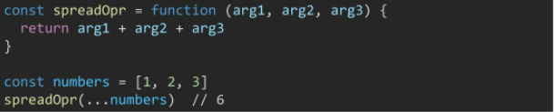
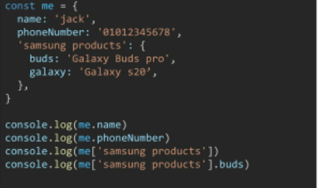

[ko](https://ko.javascript.info/)

[eng](https://javascript.info/)

#### DOM

- 문서가 객체로 구조화되어 있으며 key로 접근 가능
- window.print()
- window.confirm('진짜 삭제 ?')

#### BOM

- browser object model

#### ECMAscript6

- ecma 에서 제안하는 6번째 표준명세
- 정보통신에 대한 표준을 제정하는 비영리 기구


#### 코딩스타일가이드

- https://github.com/airbnb/javascript
- https://google.github.io/styleguide/jsguide.html
- https://standardjs.com/


### 변수와 식별자

- 식별자

  - 변수를 구분할 수 있는 변수명

  - 문자, 달러, 밑줄로 시작

    

  - camelCase = 변수, 객체, 함수

  - PascalCase = class, 생성자

  - SNAKE_CASE = 상수 : 바뀌지 않을 값


- 변수 선언 키워드 (let, const)

  - let, const 둘다 `재선언` 불가능

    ```js
    let a = 2
    let a = 3 불가
    ```
  
  - let
  
    - `재할당`할 예정인 변수 선언
  
    - ```javascript
      let bar = 0   // 선언+ 할당 ' 선언 need
      console.log(bar) // 0
      bar = 1 // 재할당 가능
      ```
  
  - :star: const
  
    -  상 ! 수 !  첨에 값줌
  
    - 재할당할 예정이 없는 변수 선언
  
    - `값을 바꾸는건 가능하나`// 재"할당" 불가능( = 두번 사용 불가)
  
    - 나중에 재할당 되어, 값이 변경되는것을 막음 !
  
    - ```javascript
      const a = [1, 2, 3]
      a[1] = 10
      a //[1, 10, 3] 은 된다 _  리스트를 보고 있는 거기 때문에, 어떤 메모리를 보고 있는건 가능
      ```
  

```javascript
let x = 1
if (x===1){
    let x = 2				//블록스코프
    console.log(x) //2
}
console.log(x)  //1
```

- var  `사용 x`

  - 함수스코프
  
  - 블록에 의한 범위 제한이 없다. 
  
  - 재선언, 재할당 모두 가능
  
  - `호이스팅` 되는 특성으로 인해 예기치 못한 문제 발생가능
    
    - 변수선언 이전에 참조할 수 있는 현상 // undefined
    
    - ```javascript
      console.log(username) // undefined
      var username="홍길동"
      
      //let과 const도 호이스팅 대상이지만, undefined로 변수를 초기화하지 않는다. 
      console.log(username) // Uncaught ReferenceError
      let username="홍길동"
      ```
      
      
  

### 데이터 타입

.

| 원시타입                                                | 참조타입                              |
| ------------------------------------------------------- | ------------------------------------- |
| 객체가 아닌 기본타입                                    | 객체타입                              |
| 변수에 해당 타입의 값이 담김                            | 변수에 해당 객체의 참조 값이 담김     |
| 다른 변수에 복사할때 실제 값이 복사됨                   | 다른 변수에 복사할때 참조 값이 복사됨 |
| message = 'bye'<br />  // message가 bye를 보고 있다 _ ! |                                       |


- 원시타입(primitive type)

  - type of

  - 숫자

  - .NotANumber 문자/숫자

  - 문자

    - `''`,`""` , ``
      
    - 템플릿리터럴
      
    - 따옴표 대신 `` 백틱으로 표현
      
      `${expression} `형태로 표현식 삽입 가능
      
      ```javascript
      const a = `abc`
      const b = 'bbb'
      const alpha = `${a} ${b}`
      console.log(alpha) //abc bbb
      ```

  - null

    - 의도적으로 변수가 없음을 표현
    - 원시타입이나 object 이다.

  - undefined

    - 자동
    - 변수의 값이 없음/ 함수의 리턴값이 없음

  - boolean

    - `true` , `false`
    - 모든 object(ex_list)는 항상 참이다. 빈 리스트도 object라서 참이다.

- 참조타입(Reference type)

  - object
    - 키 벨류 라고 생각 _- !!
    - 함수, 배열, 객체


### 연산자

- 알파벳끼리는 아스키코드값을 비교한다.

- 동등비교연산자 `==`

  - 값을 비교
  - 암묵적 타입변환을 통해 타입 일치 시킨 후 같은값인지 비교

- 일치비교연산자 `===`

  - 엄격한 비교_ 암묵적 타입변환 X

  - 두 피연산자가 모두 객체일 경우 메모리의 같은 객체를 바라보는지 판별

  - ```js
    let a = 3
    let b = 3
    console.log(a===b) // true // 값이 같으면 상자를 새로 만들지 않고 있는걸 쓰기 때문/ 따라서
    let c = new Number(3)
    console.log(a===b)//false
    ```

  - 

- 논리연산자
  - .

- 삼항연산자

  - 가장 왼쪽의 조건식이 참이면 콜론 앞의 값 사용

    그렇지 않으면 콜론 뒤의 값 사용

    ```javascript
    let x = 1 > 2
    x ? 1: 2    //2      x가 뭐야?? true면 1 / 아니면 false 2
    
    10 > 1 ? '크다':'아니다'
    
    const result = Math.PI > 4 ? 'YES':'NO'
    				이 값이 4 보다 큰가?
    ```

  - .


### 조건문

- if statement

  - ```javascript
    if(2>1){
        console.log('2가 더 크다')
    }else if(2===1){
        console.log('1과 2가 같다.')
    }
    else{
        console.log('1이 더 크다')
    }
    ```
    
    ```javascript
    if(true){
        var a = 1
        let b = 2
        const c = 3
    }
    // a = 1  / a 만 접근ㄱㄴ
    ```
    
    

- switch statement

  - break 필수
    
    ```javascript
    const nation = 'korea'
    switch(nation){  //nation 값에 대한 비교만 하겠다.
        case 'korea':{  //nation이 코리아라면
            console.log('안녕하세요')
            break
        }
        case 'france':{
            console.log('bonjour!')
            break
        }
        default: {
            console.log('Hello!')
        }
    }
    ```


### 반복문

- while

  ```javascript
  let i = 0
  while(i<5){
      console.log(i) // 0, 1, 2, 3, 4
      i ++
  }
  
  //------------------
  let i = 0
  while (i<3){
      var a = 1
      let b = 2
      const c = 3
      i++
  } //a = 1 blockscope
  
  ///---------------------
  while(true){
      console.log('hi')
      break
  } // hi
  ```

- for

  ```javascript
  for (let i=0; i<2; i++){
      console.log(i) //0, 1
  }
  //-------------------
  const arr = [1, 2, 3]
  for(let i=0; i<arr.length; i++){
      console.log(arr[i]) //1, 2, 3
  }
  ```

- for ... in

  - 객체만 사용 가능하다. `(객체: key=value로 이루어진 딕셔너리를 말함)`

  - `객체(object)의 속성(key)들을 순회할때 사용`

  - 배열순회( array도 object라서 사용 가능) 하지만, 인덱스순으로 한다는 보장이 없어 권장 X

  - ```javascript
    const words = ['a','b','c']    // 선언 안해주면 var 가 들어가서, word가 바뀜..
    for (word in words){
        console.log(word)
    } // 0, 1, 2              //배열의 키값은 0, 1, 2 이기 떄문에 0, 1, 2가 나온다 __ !//
    
    const words = ['a','b','c']  
    for(const word of words){
        console.log(word)
    }// a, b, c
    
    //----------------------------------------
    const capitals = {
        korea:'seoul',
        france:'paris',
        usa:'Wdc'
    }
    for (let nation in capitals){
        console.log(nation) //korea, france, usa
    }
    for (let nation in capitals){
        console.log(`${nation}의 수도는 ${capitals[nation]}`)
    } //korea의 수도는 seoul, franc....
    
    capitals.korea  //seoul  .으로도 접근 가능
    ```

- :star: for ... of

  - `반복가능한 객체`를 순회하며 값을 꺼냄

  - iterable 한 object는 array임 !!  `리스트일때 사용할 것`

  - .

    ㄴ (let 과 const 비교 _ __  let 으로 쓰면, 내부에서 `재할당` 가능 _ ____ !!)

  - ```javascript
    const fruits = ['딸기', '사과']
    for(let fruit of fruits){
        cosole.log(fruit)  //딸기, 사과
    }
    //------
    const fruits = ['딸기', '사과']
    for(const fruit of fruits){        // const의 특징:재할당 X 근데 회차 돌때마다, 블럭이 재탄생되고 다시 도는거라서 const도 됨 
        cosole.log(fruit)  //딸기, 사과
    }
    //------
    const capitals = {
        korea:'seoul',
        france:'paris',
        usa:'Wdc'
    }
    for (let capital of capitals){
    }////error ___ 객체는 iterable이 아니기 때문에
    ```


### 함수

- 함수
  - 변수에 할당가능   a = f()
  - 함수의 매개변수로 전달 가능  f(f())
  - 함수의 반환값으로 사용 가능   return f()
- 매개변수와 인자의 개수 불일치 허용

```javascript
const name = function(args){
    // function(args) // 익명함수
}
//함수 표현식 사용 ㄱ
const add = function(num1, num2){
    return num1 + num2
}add(1, 2)
//기본인자
const greeting = function(name='Anonymous'){
    return `hi ${name}`
} greeting()

```

- rest operation ` ...`

  - python의 *args 와 유사
  - .

- spread operation `...`

  - 얕은 복사

  - .

  - ```javascript
    a = [1, 2, 3, 4, 5]
    b = [...a]
    a[3] = 100
    
    a //[1, 2, 100, 4, 5]
    b //[1, 2, 3, 4, 5]
    ```

### 함수의 선언식과 표현식

| 선언식                          | 표현식                        |
| ------------------------------- | ----------------------------- |
| 익명함수 불가능<br />호이스팅 O | 익명함수 가능<br />호이스팅 X |

```javascript
//선언식
 function sub(args) {}
//표현식
 const add = function(args){}

// 호이스팅
// 선언
add(2, 7)
function add(num1, num2){
    return num1 + num2
} //9

// 표현 __ 함수 정의 전에 호출 시 에러발생 __ 변수로 평가되어 변수의 scope 규칙을 따른다.  !!! 표현식 사용 !!!
sub(7, 2)  // uncaught ReferenceError
const sub = function(num1, num2){
    return num1-num2
}
```

- 표현식 사용할것

  

## Arrow Function

- function 키워드 생략가능
- 매개변수가 하나면 `()`도 생략가능
-  몸통이 표현식 하나라면 `{}`과 return 도 생략가능
- 기존 function 키워드 사용 방식과의 차이점은 후반부 this 키워드를 학습하고 다시 설명..

```javascript
const add = e1  // 함수 표현 생략
//  화살표 함수
const arrow1 = function(name){
    return `hi ${name}`
} arrow1('jun')


const arrow2 = (name) =>{
    return `hi ${name}`
} arrow2('jun')


const arrow3 = name =>{
    return `hi ${name}`
} arrow3('jun')

const arrow4 = name => `hi ${name}`
arrow4('jun')
```


### String

| includes | 특정 문자열 존재여부 참/거짓<br />str.includes('word')       |
| -------- | ------------------------------------------------------------ |
| split    | 문자열을 토큰 기준으로 나눈 배열  (value 없으면 문자열로 담아 반환)<br />`return 배열` |
| replace  | 해당 문자열로 교체 <br />`String.replace(from, to)` # 하나만 바꿔줌<br />`String replaceAll(from, to) `# 다 바꿔줌 __ python |
| trim     | 좌우공백제거반환 _`trimstart`, `trimend`<br />id 받을때 사용할 수 있음 |

```javascript
const str = 'a santa at nasa'
str.include('santa') // True
```

.


### 배열

- key-value object

- array.length

- ```javascript
  reverse =  원본 배열의 요소들의 순서를 반대로 정렬
  push, pop  = 배열의 가장 뒤 요소를 추가 또는 제거
  unshift, shift = 배열의 가장 앞 요소를 추가 또는 제거
  includes = 배열의 특정값이 존재하는지 판별 후 참/거짓 반환
  indexOf = 							''  인덱스 반환 ( 값 없으면 -1 반환 )
  join = 배열의 요소 반환/ default = ,
  ```

- spread operator(...)

  - 얕은복사에 활용
  - `Array.concat()` - es5


- `Array Helper Method`

- `callback 함수`

  - 어떤 함수의 내부에서 실행될 목적으로 인자를 넘겨받는 함수를 말함
  - .

  ```javascript
  //for each  
  const fruits = ['딸기', '수박', '사과']
  fruits.forEach((fruits) => {
      console.log(fruit)
  } )    //프루츠에 들어가서 반복을 할거야  // forEach (함수)
  
  fruits.forEach((fruit, index) =>{
      console.log(fruit, index)
  })
  //map
  const number = [1, 2, 3, 4, 5]
  const doubleNums = number.map((num) =>{ 
      return num * 2
  })
  console.log(doubleNums) //2, 4, 6, 8, 10
  
  //filter
  const numbers = [1, 2, 3]
  const oddNums = numbers.filter((num,index) =>{
      return num%2})
  console.log(oddNums)  //[1, 3]
  
  //reduce// acc 매개변수 받는다 _ 
  콜백함수의 반환값을 하나의 값(acc)에 누적 후 반환 .. initial value 정해놓지 않을시, default=arr[0]
  const numbers = [1, 2, 3]
  const result = numbers.reduce((acc, num) =>{
      return acc  + num 
  }, 0)  //0은 initial value
  console.log(result) // 6
  //--------
  const requestUrl = Object.entries(api).reduce(function (acc, el) {
    return acc + `${el[0]}=${el[1]}&`
  }, baseUrl)
  //-----------
  const names = ['harry', 'jason', 'tak', 'tak', 'justin']
  const result = names.reduce((acc, name) =>{
      if (name in acc){
          acc[name]++
      }
      else{
          acc[name] = 1
      }
      return acc
  }, {})
  console.log(result)    //{harry: 1, jason: 1, tak: 2, justin: 1}
  //-------------------
  
  
  //find반환값이 참이면 해당 요소 반환 (같은값일시, 첫번째 요소만)
  const people = [
      {name: '다빈',  age:23},
      {name: '지선', age:36}]
  const result = people.find((someone) =>{
      return someone.name ==='다빈'})
  console.log(result)   // {name: '다빈', age: 23}
  
  //some   //하나라도 통과하면 참 반환 / 빈 배열은 항상 거짓
  const numbers = [1, 2, 5, 7, 9]
  const hasEvenNumber = numbers.some((num)=>{
      return num %2 ===0 })
  console.log(hasEvenNumber)  // true
  
  //every  // 모든 요소가 통과하면 참 반환
  const numbers =[1, 3, 6]
  const isEveryNumberEven = numbers.every((num) =>{
      return num%2===0})
  console.log(isEveryNumberEven)  // false
  ```
  
  
  
  ```javascript
  for of // 일부 브라우저에서 지원 X
  
  for loop // 모든 브라우저 환경에서 지원
  forEach  // 대부분의 브라우저 환경에서 지원 // break, continue 사용 불가능
  ```
  
  

### 객체(objects)

- 객체는 속성의 집합

- key-value쌍으로 표현

  - key : 문자열 타입만 가능 (띄어쓰기 같은 구분자 존재시, 따옴표로 묶어 표현)
  - value : 모든 타입 (함수도) 가능

- 요소 접근

  - .

- 메서드 내부에서는 this 키워드가 객체를 의미함

  ```javascript
  //매서드는 어떤 객체의 속성이 참조하는 함수
  //객체.메서드명()으로 호출 가능
  const me = {
      firstName:'john',
      lastName: 'Doe',
      fullName: this.firstname + this.lastName,   // 메서드가 아니라서 정상출력되지 않음 NaN
      
      getFullName: function(){
          return this.firstName + this.lastName    // 메서드라서 해당 객체를 이어서 반환
      }
  }
  ```

  - 속성명 축약

  -  메서드 축약

    - 선언시 function키워드 생략가능

    - ```javascript
      var obj = {
          greeting:function(){
              console.log('hi')
          }
      }
      obj.greeting() // hi
      //---
      const obj = {
          greeting(){
              console.log('hi')
          }
      }
      obj.greeting() // hi
      ```

  - 계산된 속성

    - 144

    - ```javascript
      const key = 'regions'
      const value = ['광주', '대전']
      const company = {
          [key]: value,  // 대괄호 쳐줘야 함
      }
      console.log(company) // {regions: Array(2)}
      console.log(company.regions) // ['광주', '대전']
      ```

  - 구조분해할당

    - .

  - spread operator

    - 얕은 복사

  - Json

    - ```js
      - JSON 데이터는 바로 객체처럼 key 접근이 가능하다.
      	F: pasing 작업을 거쳐야함
      ```
  
    - 객체와 유사하게 생겼으나 실제, 문자열 타입
  
    - JSON.parse()
      - JSON => 자바스크립트 객체 (object)
      - **키값이 꼭 문자열이여야 한다.**
      
    - JSON.stringify()
      
      - 문자열화해줌
      - 자바스크립트 객체 => JSON (string)


## this

` 'this'는 현재 기능을 실행하고 있는 대상을 가리킨다.`

1. class 내부의 생성자함수
   - this는 생성되는 객체를 가리킴(python의 self)
2. 메서드(객체.메서드명()으로 호출 가능한 함수)
   - this는 해당 매서드가 소속된 객체를 가리킴


- 위의 두가지 경우를 제외하면 모두 최상위 객체(window)를 가리킴

  

- function keyword와 화살표 함수의 차이

  ```javascript
  const obj = {
      PI:3.13,
      radiuses: [1, 2, 3, 4, 5],
      printArea:function(){
      	this.radiuses.forEach(function(r){ 
              console.log(this.PI*r*r)
          }.bind(this))
      }
   
  }
  ```
  
  ```javascript
  const obj = {
      PI:3.13,
      radiuses: [1, 2, 3, 4, 5],
      printArea:function(){
          console.log(this, 1)
      	this.radiuses.forEach(function(r){ 
              console.log(this, 2)  // window를 가리킴
          }.bind(this))  // }) 했을때는 ㄴ윈도우 가리킴
      }, 
  }
  obj.print(Area()) // 
  
  //--------
  // 화살표는 this bindng 을 하지 않음 . 
  const obj = {
      PI:3.13,
      radiuses: [1, 2, 3, 4, 5],
      printArea:function(){
          console.log(this, 1)
      	this.radiuses.forEach((r) = > { 
              console.log(this, 2)  // window를 가리킴
          })
      }, 
  }
  
  //=====================
  const obj = {
      outer:function(){ 
          const innerFunc = function(){
              console.log(this)
              const innerFunc = function(){
                  console.log(this)  // obj 를 this로 가짐 (강제적으로 묶여서)..........
              }
          }
          innerFunc() 
          const obj2 = {
              innerMethod:innerFunc
          }
          obj2.innerMethod()
      }
  }
  obj.outer() 
  
  
  //--
  const obj = {
      outer:function(){  //의 this는  obj
          const innerFunc = function(){
              console.log(this)
          }
          innerFunc()  // 그냥 function(method X)   //의 this는 window
          const obj2 = {
              innerMethod:innerFunc
          }
          obj2.innerMethod()  // this가 obj2
      }
  }
  obj.outer() // innermethod를 가진 object
  
  
  //-------
  ```
  
  


## lodash

- 모듈성, 성능 등등...     유틸리티 라이브러리

- https://lodash.com/

  ```html
  <script src="https://cdn.jsdelivr.net/npm/lodash@4.17.21/lodash.min.js"></script>
  
  <script>
      const ranNums = _.sample([1, 2, 3, 4])
      Array(5).keys()
      range(0, 5)
  </script>
  ```

  


### is_palindrome ?

```javascript
    // 주어진 문자열이 회문인지 판별하는 isPalindrome 함수를 완성하시오.
    function isPalindrome(str) {
      const result = str.replaceAll(' ', '')
      const len = result.length
      for ( let i=0; i< Math.floor(len/2); i++ ){
        if(result.charAt(i)===result.charAt(len-1-i)){
          continue
        }
        else{
          return false
        }        
      }return true
    }

    // 출력
    console.log(
      isPalindrome('a santa at nasa'),  // true
      isPalindrome('google')  // false
    )
```

