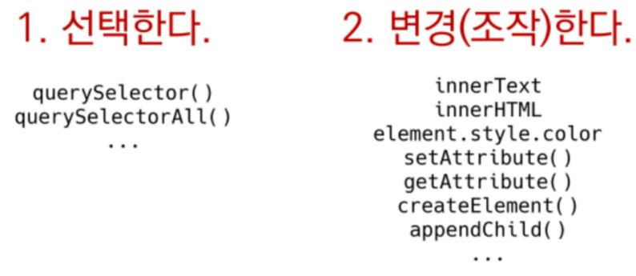

## DOM 조작

- 트리구조
- 돔트리

#### 선택 관련 메서드

- `document.querySelector(selector)`

  - 하나 선택/ css selector를 만족하는 첫번째 element 반환 _ 없으면 null

- `document.querySelectorAll(selector)`

  - 제공한 선택자와 일치하는 여러 element 선택, NodeList 반환
  - getElementsByClassName('') 이런식으로 쓸 필요가 없음

  

- `htmlCollection`, `NodeList`는 `Livecollection`으로 실시간으로 반영이 되지만, `querySelectorAll()의 NodeList`는 `static collection`으로 실시간으로 반영되지 않음
- `livecollection`과 달리 dom이 변경되어도 collection에는 영향을 주지 않는다.  `-- length가 변화해도 영향 x`

```javascript
const h1 = document.querySelector('h1')
h1.innerText   //객체.키로 접근  (수정도 가능함)
h1.innerText = '쉬는시간 ?!'
```


#### 추가 삭제

- `document.createElement()`
  - 작성한 태그명의 HTML 요소 생성, 반환
- `Element.append()`
  - 어디에 붙일 것인지 _
  - 특정 부모 요소(Node)의 자식 노드리스트중 마지막 자식 다음에 (여러) Node 객체나 DOMString 을 삽입
  - 반환값 X

- `Node.appendChild()`
  - `한 노드`를 부모노드의 자식 노드리스트 중 마지막 자식으로 삽입(NODE(createelement의 결과물)만 추가 가능)
  - 한번에 하나의 `노드`만 추가가능
  - 주어진 노드가 이미 존재하는 다른 노드를 참조하면, 새로운 위치로 이동
  - (string을 반환할 순 없기 때문에 input도 확실한 node만 된다)

```javascript
    // 2-2. append
    const ulTag = document.querySelector('ul')
    const newLiTag = document.createElement('li')
    newLiTag.innerText = '새로운 리스트 태그'
    ulTag.append(newLiTag)
    ulTag.append('문자열도 추가 가능')

    const new1 = document.createElement('li')
    new1.innerText = '리스트 1'
    const new2 = document.createElement('li')
    new2.innerText = '리스트 2'
    ulTag.append(new1, new2)


    // 2-3. appendChild
    const ulTag = document.querySelector('ul')
    const newLiTag = document.createElement('li')
    newLiTag.innerText = '새로운 리스트 태그'
    ulTag.appendChild(newLiTag)
    ulTag.appendChild('문자열은 추가 불가', '여러개도 못넣음')
```


#### DOM 변경

- 속성(property)
  - `Node.innerText`
    - string  / markup 인지 X
    
  - `Element.innerHTML`
  
    - 사용자에게 input 받을때 사용하지 말것  ( 사용자가 우리에게 데이터를 전해주는 방식에서 사용하지 말 것 __ !!  )
    - html로 인지 __ 그러나 XSS 공격에 취약하므로 사용금지
  
    - li.innerHTML = content
  
    - `    ulTag.innerHTML = '<li><a href="javascript:alert(\'당신의 개인정보 유출\')">춘천</a></li>'`

#### DOM 삭제

- 관련메서드
  - `ChildNode.remove()`
    - 노드가 속한 트리에서 해당 노드 제거
  - `Node.removeChild()`
    - DOM에서 자식 노드를 제거하고 제거된 노드 반환
    - 노드는 인자로 들어가는 자식노드의 부모노드

```javascript
    // 3-1. remove
    const header = document.querySelector('#location-header')
    header.remove()

    // 3-2. removeChild
    const parent = document.querySelector('ul')
    const child = document.querySelector('ul > li')
    const removedChild = parent.removeChild(child)  //부모.removeChild(자식)
    console.log(removedChild)
    parent.append(child) // 추가가능

```


#### DOM 속성

- 속성관련 메서드

- 키를 가지고 value를 가지고 오고 싶을때 (?)

  - `element.setAttribute(name, value)`   <update>
    - name 속성을 value값으로 설정한다.
    - 지정된 요소의 값을 지정
    - 속성 존재시 값 갱신
    - 존재 x 시, 지정된 이름과 값으로 새 속성 추가
  - `element.getAttribute(attributeName)`    <read>
    - name이라는 속성값을 가져온다.

    - 해당 요소의 지정된 값(문자열) 반환

    - 인자는 값을 얻고자 하는 속성의 이름

  
  - `Element.hasAttribute(name) `
    - name에 해당하는 속성여부`true/false`
  - `Element.removeAttribute(name)`
    - name 속성을 삭제

```javascript
    // 4. 속성
    // 4-1. setAttribute
    const header = document.querySelector('#location-header')
    header.setAttribute('class', 'ssafy-location')  //class에 ssafylocation을 setting 한다.

    // 4-2. getAttribute
    const getAttr = document.querySelector('.ssafy-location')
    getAttr.getAttribute('class')
    getAttr.getAttribute('style')    //read

    //2-5. Element Styling
    li1.style.cursor = 'pointer'
    li2.style.color = 'blue'
    li3.style.background = 'red'


const firstLi = document.querySelector('body>div>ul>li:nth-child(1)')
firstLi.style.color = 'red'
firstLi.style.background = 'yellow'
//보단
.focus{
    
}
fistLi.setAttribute('class', 'focus')   //재사용성에서 좋음
```

- [Element.classList](https://developer.mozilla.org/ko/docs/Web/API/Element/classList)

  - 여러개 클래스 넣음
  - [DOMTokenList](https://developer.mozilla.org/ko/docs/Web/API/Element/classList)
  
  ```js
  const header = document.querySelector('#location-header')
  header.classList.add('new-class')
  //<h2 id="location-header" class="new-class">Location</h2>  // newclass 추가됨
  header.classList.remove('new-class')
  ```
  
  



```css
    #main {
      background-color: rgba(197, 255, 251)
    }

    /* 중앙 정렬 */
    .box-container {
      display: flex;
      justify-content: center;
      align-items: center;
    }

    /* 박스 별 테두리 */
    .box-item {
      margin: 20px;
      padding: 30px;
      border-radius: 10px;
      width: 600px;
      background-color: white;
    }

    /* 버튼 텍스트 변경 및 스타일링 */
    .button {
      background-color: rgba(45, 166, 153);
      border-radius: 4px;
      color: white;
      padding: 10px 20px;
      margin: 20px;
      cursor: pointer;
      font-size: 15px;
    }

    /* footer */
    .footer {
      margin-top: 3vh;
      margin-bottom: 3vh;
    }
```

```js
// 배경색 설정
const body = document.querySelector('body')
body.setAttribute('id', 'main')

//선택
const nav = document.querySelector('nav')
const header = document.querySelector('header')

//.box-container 중앙정렬하기
nav.setAttribute('class', 'box-container')
header.classList.add('box-container')

//테두리 설정
//section내부의 div선택 후 .box-item 클래스를 지정한다.
const questionDivs = document.querySelectorAll('section div')
questionDivs.forEach(function(div){     //배열아니지만 forEach 제공 _ !  //div 여러개를 for문//
    div.setAttribute('class', 'box-item')
})

//버튼 변경
const button = document.querySelcetor(#submitbutton)
button.setAttribute('class', 'button')

//img 사이즈
const navImage = document.querySelctor('nav img')
navImage.width = 600  //600px 되긴 한다..

//footer
const footer = document.createElement('footer')
footer.innerText = '하하'
footer.setAttrivute('class', 'box-container')
body.appendChild(footer)

//input요소 스타일링
const nameInput = document.querySelector('#name')
nameInput.style.marginTop = '50px'  //px 원래안돼..
```


```js
    const liveNodes = document.getElementsByClassName('live')
    // console.log(liveNodes)

    for (let i = 0; i < liveNodes.length; i++) {
      liveNodes[i].className = 'red'    // live->red로 바귀면서 계속 상태를 업데이트함/ ==> 원하는 for문이 아님
      console.log(liveNodes)
    }
```

