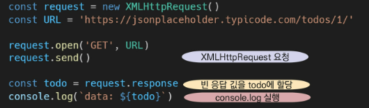
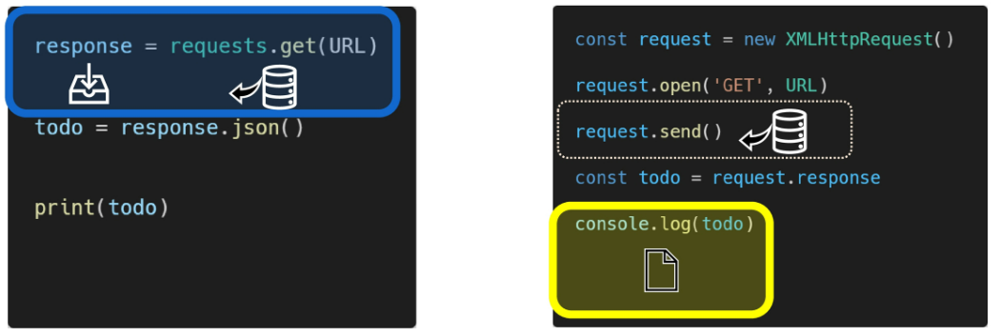
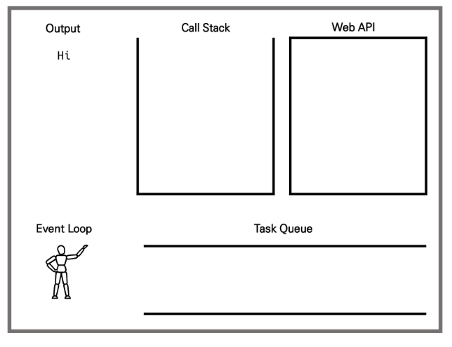
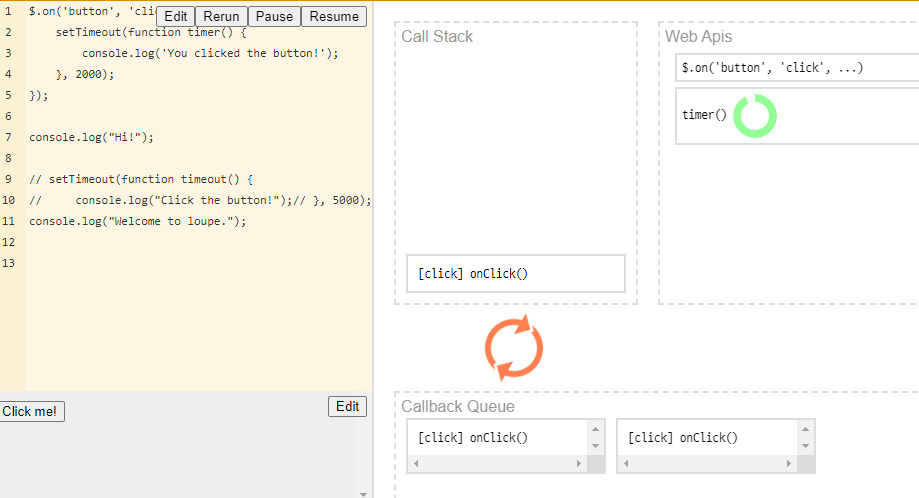
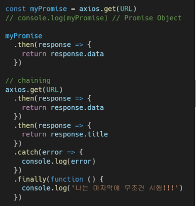

## AJAX(Asynchronous JavaScript And XML)

- XMLHHttpRequest 객체를 활용 (XHR)
- XML = extended Markup Language_내가 원하는 태그명 작성
- JSON, XML, HTML 그리고 일반 텍스트 형식 등을 포함한 다양한 포맷을 주고받을 수 있음
- ajax의 x가 xml을 의미하긴 하지만, 요즘은 더 가벼운 용량과 js의 일부라는 장점때문에 json을 더 많이 사용함


- AJAX의 특징
  - 페이지 전체를 reload하지 않아도 수행되는 **비동기성**
    - 페이지의 일부분 업데이트
  - **페이지 새로고침 없이 서버에 요청해 데이터를 받아 작업 수행**


##### XMLHHttpRequest 객체

-  새로고침 없이 서버에 요청해 데이터를 받아올 수 있음

[JSONPlaceholder - Free Fake REST API (typicode.com)](https://jsonplaceholder.typicode.com/)

```js
 const request = new XMLHttpRequest()  //new써줘야함 __init__ 
  const URL = 'https://jsonplaceholder.typicode.com/todos/1/'
  
  request.open('GET', URL)//동기식
  request.send()//비동기식--일꾼한명이 처리할 수 없어서 지나감

  const todo = request.response//응답 가져와
  console.log(todo)
  JSON.parse(todo) //객체로 존재 (접근가능)
```

```
- - - 객체와 유사하게 생겼으나 실제, 문자열 타입
--- parsing

    - JSON.parse()
      - JSON => 자바스크립트 객체 (object)

    - JSON.stringify()
      - 자바스크립트 객체 => JSON (string)
```


- 동기식

  - 순차, 직렬적 Task 수행
  - 하나가 끝나면 다음게 실행

- 비동기식

  - 병렬적 Task수행

  - 요청을 보내고 응답을 기다리지 않고 다음 코드가 실행됨

  - 결과적으로 변수 todo엔 빈 문자열이 출력됨

  - .

  - ```js
    //js
    const request = new XMLHttpRequest()
    const URL = 'url'
    
    request.open('GET', URL)
    request.send()
    
    setTimeout(function(){}, 1000)
    
    const todo = request.response
    console.log(`data:${todo}`)
    ```

  - ```python
    #python
    import requests
    
    reponse = request.get('url')
    todo = response.json()
    print(todo)
    ```

  - 비동기식 코드라면 데이터를 요청하고 응답받는 동안 앱 실행을 함께 제공

  - 지속적으로 응답 화면을 보여줌

  - 많은 웹 API 기능은 비동기 코드를 사용


- 자바스크립트는 단일 스레드(단일 프로세스)
  - cpu는 여러 코어를 가지고 있어서 한번에 여러가지 일을 처리할 수 있지만, main 스레드에서만 작업함
    - 이벤트를 처리하는 Call Stack이 하나의 언어
    - 처리 x이벤트->web api로 보내서 처리
    - 처리된 이벤트->순서대로 대기실에 줄세움
    - call Stack 이 비면, 담당자(event loop)가 대기줄에서 가장 오래된 이벤트를 call Stack으로 보냄




##### Concurrency model

evenvt loop를 기반으로 하는 동시성 모델

- call stack  `thread`
  - 함수의 호출스택
  - 요청이 들어올때마다 해당 요청을 순차적으로 처리하는 stack형태의 자료구조
  - 맨 밑으로 쌓임
  - 만약 setTimeout()이 들어오면  web api에 함수를 넘김_내가 못해
- web api(browser api)
  - js 엔진이 아닌 브라우저 영역에서 제공하는 API
  - setTimeout(), DOM evenvts 그리고 AJAX로 데이터를 가져오는 시간이 소요되는 일들을 처리

- Task Queue
  - web api에서 먼저 끝난게 queue에 들어온다.
  - call Stack이 비어있는지 확인하고
  - 1st순으로 callstack에가서 output됨 !
  - 비동기 처리된 callback함수가 대기하는 queue형태의 자료구조
  - main thread가 끝난 후 실행되어 후속 js코드가 차단되는 것을 방지
- Event Loop
  - call Stack이 비어있는지 확인
  - 비어있는 경우 Task Queue 에서 실행 대기중인 callback함수가 있는지 확인
  - task Queue에 대기중인 callback함수가 있다면 가장 앞에 있는 callback함수를 callstack으로 push



```js
console.log('hi')
setTimeout(function ssafy(){
    console.log('ssafy')
}, 3000)
console.log('bye')

VM460:1 hi
VM460:5 bye
VM460:3 ssafy
```




#### 순차적인 비동기 처리하기

web api로 들어오는 순서는 중요하지 않고 어떤 이벤트가 **먼저**처리되느냐가 중요_실행순서 불명확

- Async callbacks
  - 백그라운드에서 실행을 시작할 함수를 호출할때 인자로 지정된 함수
  - addEventListener()의 두번째 인자
- promise-style
  - Modern Web Apis에서의 새로운 코드 스타일
  - xml httprequest객체를 사용하는 구조보다 조금 더 현대적


## Callback function

- 다른 함수에 인자로 전달된 함수
- 외부 함수 내에서 호출되어 일종의 루틴 또는 작업을 완료함
- 동기, 비동기식 모두 사용됨
  - 비동기 작업이 완료된 후 (너가해) 코드 실행을 계속하는데 주로 사용됨
- 비동기 작업이 완료된 후 코드 실행을 계속하는데 사용되는 경우를 비동기 콜백이라고 함


자바스크립트 함수는 일급객체(first class object)이다.

- 일급객체(일급함수)

  - 다른 객체들에 적용할 수 있는 연산을 모두 지원하는 객체(함수)

- 일급객체의 조건

  - ```js
    //변수에 할당할 수 있어야 함
    const a = function(){}
    //함수의 반환값으로 사용할 수 있어야함
    function asdf(x){
        return x
    }
    //인자로 넘길 수 있어야 함
    asdf(a) //a가 함수임에도 세가지 조건 모두 만족  !
    ```

  - `map(인자, numbers)`

  - `path('', views.index) // views의 index  (로 넘기겠다 ..)`


- Async callback
  - **백그라운드에서 클릭 언제 일어나나 듣고, 일어나면 명세서 함수호출(콜백함수)**
  - 백그라운드에서 코드 실행을 시작할 함수를 호출할때 인자로 지정된 함수
  - 백그라운드 코드 실행 끝나면, callback함수를 호출해서 작업 완료를 알리거나 다음 작업을 실행하게 함
    - ex) addEventListener()의 두번째 매개변수
  -  callback함수를 다른 함수의 인수로 전달할때, 함수의 참조를 인수로 전달할 뿐이지 즉시 실행되지 않고, 함수의 바디에서 called back됨
  - 정의된 함수는 때가되면 callback함수를 실행하는 역할을 함


- 비동기 로직 수행시, callback 필수 !
- callback함수는 명시적 호출이 아닌 특정 루틴 혹은 action에 의해 호출되는 함수
  - 명시적 호출 아니라 다른 함수의 `매개변수`로 전달하여 해당 함수 내에서 특정 시점에 호출
    - ~~요청이 들어오면 (장고)
    - ~~이벤트가 발생하면(event)


## PROMISE

> 콜백지옥 탈출 위함

.

promise에 있는 메서드들은 return 값이 다 프로미스로 이어지게 함

##### promise method

`.then(callback)` : 성공에 대한 약속  // 그다음에 ~ 다음 then 실행하기 

​	이전 작업이 성공했을때 수행할 콜백함수로 이전작업의 성공결과를 인자로 받는다

`.catch(callback)`: 실패에 대한 약속

​	하나라도 실패하면, 동작(try-except)

`.finally()`:성공실패 여부와 관계 없이 실행


## Axios

**Promise based HTTP client for the browser (and Node.js)**

알아서 parsing 해줌

싱글스레드 -> event loop -> async -> callback -> promise -> axios

CDN 가져오기

```js
<script src="https://unpkg.com/axios/dist/axios.min.js"></script>
<script> 
    axios.get('https://jsonplaceholder.typicode.com/todos/1') //promise return 
	.then(..) //.then(function(res){console.log(res)})
	.catch(..)

</script>
```

```html
<script src="https://unpkg.com/axios/dist/axios.min.js"></script>
<script> 
const response = axios.get('https://jsonplaceholder.typicode.com/todos/1') 
	response.then(res => {console.log(res)})
	response.then(function(response){
    console.log(response)})
    
    
    
const response = axios.get('https://jsonplaceholder.typicode.com/todos/1')  //reqeust.send()
	.then(res =>{     //const todo = request.response
        console.log(res)
    })


</script>


```


#### async & await

| callback !== | promise == | async-await                                                  |
| ------------ | ---------- | ------------------------------------------------------------ |
|              |            | promise로 이루어진 코드를 refactorin함<br />함수 내부적으로는 promise가 동작한다. |

- 함수로 묶어야 한다 !
- 그래야 함수 앞에 async를 사용할 수 있음

```js
  <script src="https://unpkg.com/axios/dist/axios.min.js"></script>
  <script>
    const URL = 'https://dog.ceo/api'

    function fetchDogImages() {
      axios.get(URL + '/breeds/list/all') // 비동기
        .then(res => {
          const breedObj= res.data.message
          const breedArray = Object.keys(breedObj)
          const breed = breedArray[0]  // 아펜핀셔
          return axios.get(URL + `/breed/${breed}/images`) // 비동기
        })
        .then(res => console.log(res.data))
        .catch(err => console.error(err))
    }
    
    fetchDogImages()


    /* 
      0. async-await를 사용하려면, 함수로 묶어야 한다.
      1. 해당 함수 맨 앞에 async 라는 키워드로 표시를 남긴다.
      2. 함수 블록 내부에, 비동기로 동작하는 함수들을 찾아서 앞에 await를 남긴다.
    */
    async function fetchDogImages() {
      const res = await axios.get(URL + '/breeds/list/all')
      const breedObj= res.data.message
      const breedArray = Object.keys(breedObj)
      const breed = breedArray[0]  // 아펜핀셔
      const images = await axios.get(URL + `/breed/${breed}/images`)
      console.log(images)
    }

    fetchDogImages()
      .catch(err => console.error(err))
```


