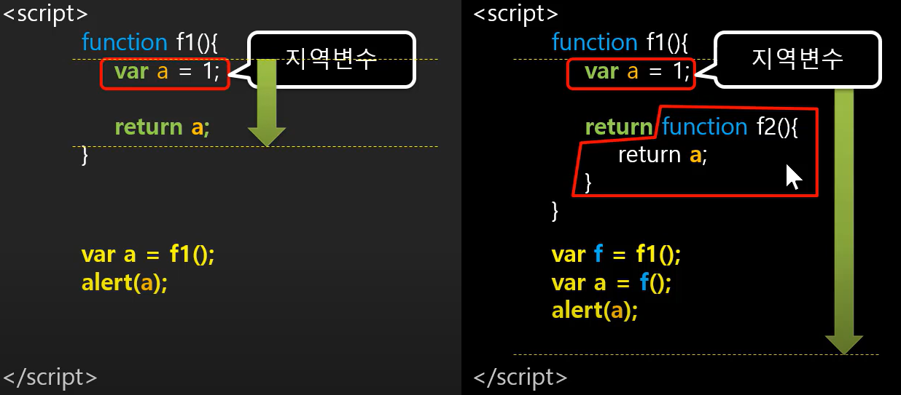
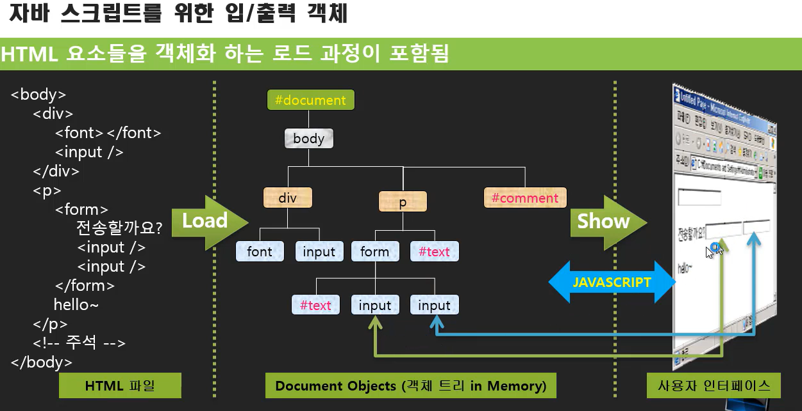

#### closure : 함수를  close하게 할 수 있는 key를 가지고 있다.



오른쪽에서, return function f2() 에서 **a**를 쓰고 있음 

따라서, var f 에서 함수를 닫을수가 없기 때문에, 이와 관련된 function f2(); 를 closuer라고 부른다.

이때문에 자원이 묶일 수 있으므로, 의도적으로 하는 경우가 아니라면 조심할것.


#### 브라우저 객체

```js
window
window.location
window.history
window.document -- body-- img, form -- input
```


```js
window.alert("해도 나옴")
var x = prompt("x값을 입력하세요", 0)  // 문자열__Built-in objects 에서 맞는거 찾아서 넣기 ex_parseint
alert(typeof x)

플랫폼 다를때 100px이 문자열로 오므로, parseint해주면 그냥 100 나옴

var answer = confirm("정말삭제?")
if(answer)
    alert("삭제되었습니다.")
```


#### 문서의 엘리먼트 객체 이용하기




참고

---

[youtube_뉴렉처](https://www.youtube.com/watch?v=VdKQxYMZw3c&list=PLq8wAnVUcTFWhQrIXNN6kPYXJA6X2IQM4&index=18)