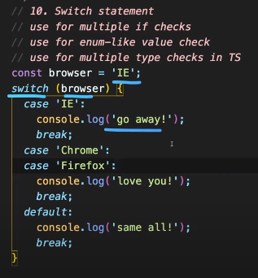
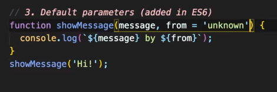
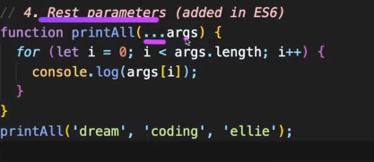
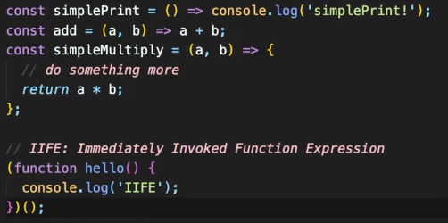

[TOC]

# JS boolean

- false: 0, null, undefined, NaN, ' '
- true: any other value

# mutable data (가변)

- object

# switch statemenet

 


# Default parameters

 


 # Rest parameters

 

`for of, for each`

# IIFE

 


# 비동기

## JS call back

```js
setTimeout(() =>  console.log('2'), 1000) //1초
```

### synchronus callback

### asynchronus callback


---

[참고]

[드림코딩엘리](https://www.youtube.com/watch?v=YBjufjBaxHo&list=PLv2d7VI9OotTVOL4QmPfvJWPJvkmv6h-2&index=4)