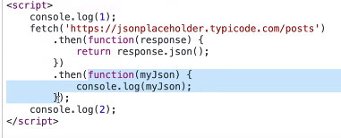
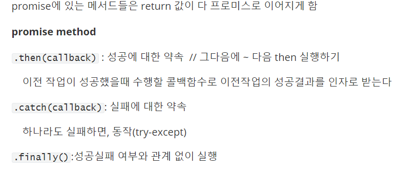
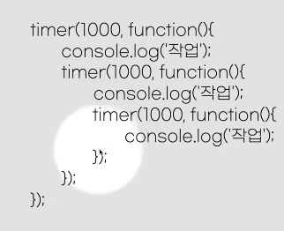
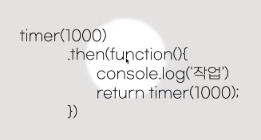
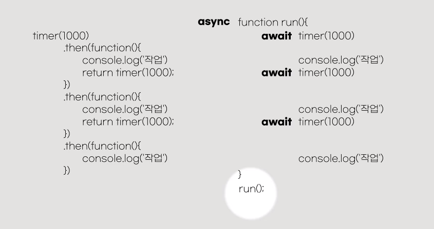
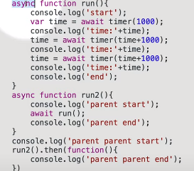
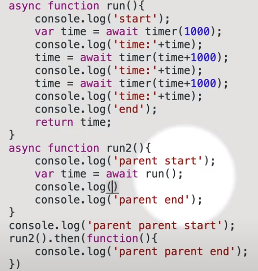
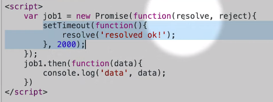
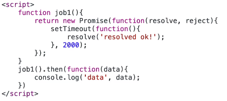

[TOC]

## 1. Promise

`const fetchResponePromise = fetch(resource [, init])`

 

.then이 promise

:star: 중요

  

---

## 2. Async Await

- 문제점 (callback 지옥)

 

- promise적용으로 해결

 

- 인간은 문법적 단순함을 꿈꿈 (오른쪽으로 변경함)
- :star2: 

 

- await는 언제나 함수 안에서 실행되야하고, 그 앞에는 async가 붙어있어야 함

`예시`

 

async함수는 자동으로 promise를 return 하기에 await를 쓴다.

 

만약 return 을 만든다면, return 받은 값을 쓸 수 있음

---

## 3. 내 Promise만들기

 

:star: 대부분 함수 안에서 promise를 return해줌

- 좀 더 효율적으로 쓰기 `성공 시 resolve`

 

---

`참고`

05_ajax.md

https://www.youtube.com/watch?v=1z5bU-CTVsQ&list=PLuHgQVnccGMBVQ4ZcIRmcOeu8uktUAbxI&index=3

https://www.youtube.com/watch?v=PasFh_t1mhY&list=PLuHgQVnccGMBVQ4ZcIRmcOeu8uktUAbxI&index=4

https://crmrelease.tistory.com/98