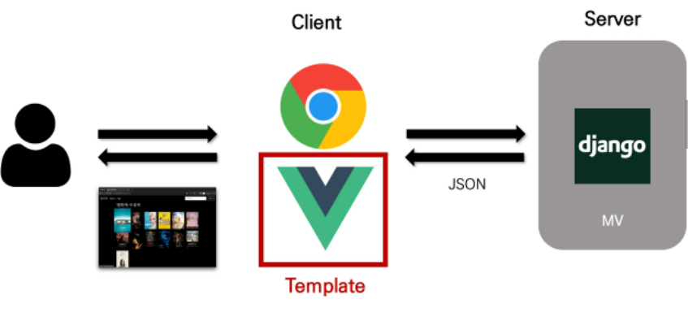
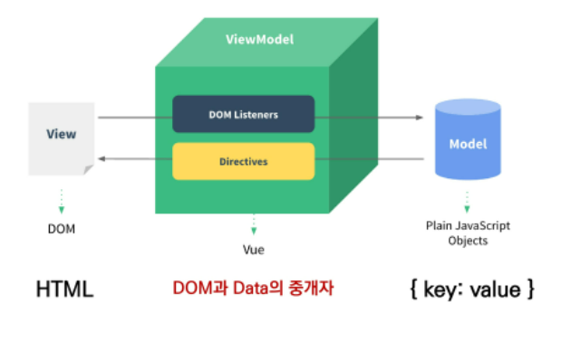
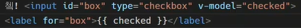

# VUE

## Front-End Development

- HTML, CSS & JS를 활용해 데이터를 볼 수 있게 만들어줌
- 이를 통해 User는 데이터와 상호작용할 수 있음 
- 사용자 인터페이스를 만들기 위한 진보적인 자바스크립트 프레임워크로 **Single Page Application**을 완벽지원
  - Evan You




## SPA 

- 단일페이지 앱
- 현 페이지를 동적으로 렌더링함으로써 사용자와 소통함
- 첫 페이지를 받은 이후, 필요한 부분으로 동적으로 재작성(DOM을 구성)
- 스마트폰 이후, 모바일 최적화 필요에 의해 등장


## CSR

- client side rendering 클라이언트에서 화면 구성

- 뼈대만 받아 브라우저에서 동적으로 DOM을 그림

- SPA가 사용하는 렌더링방식

- 최초 요청시 HTML, CSS, JS 등 데이터를 제외한 각종 리소스를 응답받고 이후 클라이언트에선

  필요한 데이터만 요청해 JS로 DOM을 렌더링하는 방식

| 장점                                                 | 단점                                                         |
| ---------------------------------------------------- | ------------------------------------------------------------ |
| 서버, 클라이언트간 트래픽 감소<br />사용자 경험 향상 | SSR에 비해 최종 렌더링 시점이 느림<br />SEO(검색엔진최적화)에 어려움이 있음_최초문서에 데이터 마크업이 없어서 |


## SSR

- django같은 것 `for article in articles`
- serverside rendering 서버에서 화면 구성
- 전통적인 렌더링 방식

| 장점                                    | 단점                                                         |
| --------------------------------------- | ------------------------------------------------------------ |
| 초기 구동 속도가 빠름<br />SEO에 최적화 | 모든 요청마다 새로운 페이지를 구성하여 전달<br />반복되는 전체 새로고침 UX 저하, 상대적으로 트래픽 많아 서버 부담 |


## Vue.js

- **data가 변화하면 dom이 변경**

- MVVM Pattern

  - model, view, modelview
  - .

- vue 2가 더 안정적

- [공식문서 시작하기](https://kr.vuejs.org/v2/guide/index.html)

- ```vue
  <!-- 개발버전, 도움되는 콘솔 경고를 포함. -->
  <script src="https://cdn.jsdelivr.net/npm/vue/dist/vue.js"></script>
  ```

- Vue instance ===Vue component

  

```vue
  <div id="app"> <!--view-->
    <p>{{ message }}</p>
    <label for="inputArea">userName: </label>
    <input v-on:input="onInputChange" type="text" id="inputArea">
    <hr>
    <!-- 3. DOM이 update(re-render) -->
    <h1>안녕하세요 {{ userName }}</h1>

  <script src="https://cdn.jsdelivr.net/npm/vue/dist/vue.js"></script>
  <script>
    // MVVM - ViewModel
    const app = new Vue({
      //1. DOM과 data 연결
      el: '#app',
      data: {  // MVVM - Model
        userName: 'Unknown', //키 벨류
        message: 'Hello Vue.js',
      },
      //2. Data가 바뀌면 
      methods: {
        onInputChange: function (event) {
          this.userName = event.target.value
        }
      }
    })
  </script>
```


- data

  - vue의 인스턴스 객체
  - 인스턴스의 상태데이터 정의
  - v-bind, v-on과 같은 derective에서도 사용가능

- method

  - vue에 추가할 메서드

  - 키 (함수이름): 벨류(함수)

  - ```html
    <script>
    // 6. 사용자 입력 핸들링
        const app5 = new Vue({
          el: '#app-5',
          data: {
            message: '안녕하세요! Vue.js!' //값
          },
          methods: {  //함수선언
            reverseMessage: function () {
              this.message = this.message.split('').reverse().join('') //데이터를 뒤집어서 갱신하겠다.
              //이 this의 message가 내부적으로 이 Vue객체를 소화하려고 하기 때문에 다 뜯어져서 위의 message를 의미
              //this는 function으로 만드는거랑 arrow로 만드는거랑 차이가 있다.
              //methods는 절대 화살표함수로 쓰면 안된다 ! :function지워도 됨
            }
          }})
    
      </script>
    ```

  - 

- `디렉티브`

  - v-text `<p v-text="message"></p>`

  - v-html `<p`

    

- `v-show`
  - 요소가 항상 DOM에 남아 있음
  - `v-show` 는 단순히 `css` 의 `display` 속성만 변경된다.

- `v-if`

  - 렌더링이 안됨
  -  `v-if`는 조건에 따라 컴포넌트가 **실제로** 제거되고 생성된다.


- `v-for :key`

  - key값 꼭 있어야 함

  - v-if와 사용시 for의 우선순위가 더 높아, 같이 사용 x

  - item in items 이건 ㄱㅊ지만

  - maintaning state

    - vue가 효율적으로 일하고 싶어서

    - abc중 b만 바꾸고 싶을때, ...등등

    - ```html
      <div v-for="item in items" v-bind:key="item.id">
      이때 key는 독립적이기만 하면 됨
      <div v-for="(fruit, idx) in fruits" :key="`fruit-${idx}`">
      ```

- `v-bind`

  - :로 대체해서 씀

- `v-on`

  - ```HTML
    <button v-on:click="alertHello">button</button>
    <form action="" @submit.prevent="alertHello"> <button> gogo</button> </form>
    <button @click="alertHello"></button>
    <input type="text" @keyup.enter="log('a')"> //실행할때 1번 인자로 a를 넘기겠다  log args('asd')
    ```

- **`v-model`**

  - 양방향으로 데이터 바꿈
  - .

- computed

  - 데이터에 의존하는 계산된 값_유연하게 바뀜

  - 종속된 데이터가 변경될때만 저장(캐싱)된다. _ 관련있는거만 바뀜

  - 어떠한 데이터가 변할때 실행되는 함수이므로, 반드시 반환값이 있어야 함

  - method는 함수지만, computed는 값이기 대문에, 알아서 움직이면서 값을 바꿔준다.

    

- method: data를 바꾸는 로직 /setter함수

- computed: data를 통한 값을 얻음 / getter함수

- watch: 감시할 대상을 의미 (쓸일없음)

- filters: `|`와 함께 추가되어야 한다.


## [lifecycle hook](https://kr.vuejs.org/v2/guide/instance.html#%EC%9D%B8%EC%8A%A4%ED%84%B4%EC%8A%A4-%EB%9D%BC%EC%9D%B4%ED%94%84%EC%82%AC%EC%9D%B4%ED%81%B4-%ED%9B%85)

1. 뷰 인스턴스가 끝나면 id와 el연결 (beforemount)
2. created로 외부 api에서 초기 데이터 받아올때 많이 사용
3. 