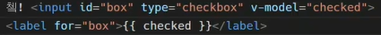

vue

- vue에선 `' '` 을 쓰도록한다 : 이후 html`" "`과 엮이지 않기 위해

.

---

interpolation

- text

  - ```html
    <span>메시지:{{msg}}</span>
    ```

- raw html

  - ```html
    <span v-html="rawHtml"></span>
    ```

- attributes

  - ```html
    <div :id="dynaminId"></div>
    ```

- js 표현식

  - ```js
    {{number+1}}
    {{message.split('').reverse().join('')}}
    ```


v-text

- ```html
  <p>{{message}}</p>
  <p v-text="message"></p>
  -CSR: client:browser가 rendering해서 사용자에게 message값만 보여지게 함
  ```


v-html

- ```html
  <p v-html="message"></p>
  message: '<strong>강하다</strong>',
  ```


v-show	

- 값이 true일때만 보여줌

- ex) 버튼 누르면 보여줄때

- 화면에 p tag를 다 올려두고, 전환시 효율적

- ```html
  <p v-show="isFalse">False</p>   <!--아예 화면에 안나오며,display:none-->
  
  isTrue:true,
  isFalse:false,
  ```


v-if

- dom에 없다 `<!-- -->`
- p tag를 다 올리지 않음_ 따라서 전환이 잦을시 비효율

- ```html
      <p v-if="seen">seen is true</p>
      <p v-if="myType==='A'">A</p>
      <p v-else-if="myType==='B'">B</p>
      <p v-else>Not a/b</p>    <!--console에도 안뜸 -->
  
     seen:true,
     myType:'A',
  ```

  


v-for

- v-for를 사용할때, `value, key(idx)` 순으로 순회한다.

- key 지정시, `v-for="item in items" :key="item.id"`로 사용한다.

  - ```html
    <div v-for ="todo in todos" :key="`todo-${todo.id}`">
    ```

  - key는 독립적이어야하며 이를 설정하는 이유는 dom구조와 관련됨

  - idx를 키로 쓰지 않는 이유: 바뀔 수 있어서
  
  - v-for와 v-if를 함께 쓰지 말것

`{객체} 면 키값 접근 가능`

```html
todos:[{id:1, title:'todo1'}]
=>{{todo.title}}
```


v-bind === `:`

- **기존속성과 vue연결**

- src='벨류 자체를' src로 사용하겠어 _ !

  ```js
  //속성 바인딩
    //vue를 통한 src
      
      
  //클래스 바인딩
  //css
  .active{
    color: red;
  }
  //html
  <div :class="{active:isRed}">red</div>
  <h3 :class="[activeRed, myBgcolor]">hello vue</h3>
  //vue
  isRed: true,
  activeRed: 'active',
  myBackground: 'my-background-color',
      
      
  //스타일 바인딩
  <p :style="{ fontSize: fontSize + 'px' }">
  //vue
  fontSize: 16,
  ```

  

v-on  === `@`

- 엘리먼트에 event listener를 연결

-  이벤트 발생시 코드 실행

- `v-on:eventname="function"`

- ```html
  <form action="" @submit.prevent="alertHello('form_notmove')"><button>
  <input type="text" @keyup.enter="log">  <!--keyup.조건-->
        methods:{
          alertHello(message){
            alert(message)
          },
          log(){
            console.log('keyup!!')
          },
  <!--cb함수에서 특수문법 log(a) log실행시 1번인자로 a넘김/추가인자-->
  <input type="text" @keyup.enter="log('ssafy')">
  
      
  <!--html-->
  <p>{{ message }}</p>
  <button @click="changeMessage">change message</button>
  <!--vue-->
  this.message = 'New message!!!'
  ```


v-model

- html의 input요소와 `data`를 양방향으로 바꿔줌
- `v-model="dataname"`

```html
<p>{{ msg1 }}</p>
<input type="text" @input="onInputChange">
onInputChange (event) {this.msg1 = event.target.value}
```

=> 이렇게 안써도 됨

```html
<p>{{ msg2 }}</p>
<input type="text" v-model="msg2">
msg2: '222'
<!--바로 바꿔 줌-->

쳌! <input id="box" type="checkbox" v-model="checked">
<label for="box">{{ checked }}</label>
checked: true,
```


---

method

- return값이 들어가는게 거의 쓰이지 않음

- data를 자체를 바꾸는 로직 위주

- setter 함수

  

computed

- 함수처럼 쓰지만, 함수가 아님            //함수의 형태로 들어감 왜냠 data를 조작해야하기 때문

- return __ 데이터를 바꿔서 새로운 값으로 만들때 쓰인다.

- getter 함수

- (data에 기반한) 계산된 값으로 존재

- ```js
  <p>reverse by computed: {{reversedMessage}}</p> 
  --method면 reversemessage() 호출했을 것 _ !
  <!--vue--> 
  computed:{
    reversedMessage(){
      return this.message.split('').reverse().join('')
    }
  //this.dataname--종속된 대상에 따라 저장_캐싱된다. 다른값과 관계없음
  ```

- ```js
  isLoggedIn() {
  	return this.sessionid ? true : false}
  ```


watch: 감시할 대상을 의미

- 특정값이 변동했을때, 콜백함수를 실행시키기 위한 트리거

- ```js
  // a가 변경되면 변경된 값을 콜백함수의 첫번째 인자로 전달하고 이전 값을 두번째 인자로 전달
  // computed는 새 프로퍼티를 생성하지만 watch는 아무 프로퍼티도 생성하지 않고 익명함수는 단순히 콜백함수 역할만 함
  // watch에 명시된 프로퍼티는 감시할 대상을 의미할 뿐임
  watch: {
     a: function (newValue, oldValue) {
       console.log('Watch !')
       this.increase = newValue - oldValue}}
  ```


filters: `|`와 함께 추가되어야 한다.

- [filter관련](https://v3.ko.vuejs.org/guide/migration/filters.html#%E1%84%80%E1%85%A2%E1%84%8B%E1%85%AD)
- 3.0버전부터 지원 x
- computed 권장

- ```html
  <div id="app">
    {{ numbers | getOddNumbers | getUnderTen }}
    {{ getOddAndUnderTen }}
  </div>
  
  <script>
    const app = new Vue({
      el: '#app',
      data: {
        numbers: [1, 2, 3, 4, 5, 6, 7, 8, 9, 10, 11, 12, 13, 14, 15],
      },
      filters: {
        getOddNumbers(array) {
          return array.filter(num => num % 2)
        },
        getUnderTen(array) {
          return array.filter(num => num < 10)
        }
      },
      // computed
      computed: {
        getOddAndUnderTen() {
          return this.numbers.filter(num => num % 2 && num < 10)
        }
      }
  ```


---


##### 라이프사이클훅

```html
  <div id="app">
    
    <button @click="getImg">d</button>
  </div>
  
  <script src="https://cdn.jsdelivr.net/npm/axios/dist/axios.min.js"></script>
  <script src="https://cdn.jsdelivr.net/npm/vue/dist/vue.js"></script>
  <script>
    const API_URL = 'https://dog.ceo/api/breeds/image/random'
    const app = new Vue({
      el: '#app',
      data: {
        imgSrc: '',
      },
      methods: {
        getImg: function () {
          axios.get(API_URL)
            .then(response => {
              this.imgSrc = response.data.message
            })
        }
      },
      created: function(){  //생성된 시점에 알아서 실행
          //created===vue가 실행됐을때
        this.getImg()  //이거실행
      }
    })
```


---

---

##### if for 사용시 한번 읽어볼 것 !

```html
<body>
  <div id="app">
    <!-- bad 1 -->
    <ul>
      <li
        v-for="user in users"
        v-if="user.isActive"
        :key="user.id"
      >
        {{ user.name }}
      </li>
    </ul>

    <!-- good 1 -->
    <ul>
      <li
        v-for="user in activeUsers"
        :key="user.id"
      >
        {{ user.name }}
      </li>
    </ul>

    <!-- bad 2 -->
    <ul>
      <li
        v-for="user in users"
        v-if="shouldShowUsers"
        :key="user.id"
      >
        {{ user.name }}
      </li>
    </ul>

    <!-- good 2 -->
    <ul v-if="shouldShowUsers">
      <li
        v-for="user in users"
        :key="user.id"
      >
        {{ user.name }}
      </li>
    </ul>
  </div>
  
  <script src="https://cdn.jsdelivr.net/npm/vue/dist/vue.js"></script>
  <script>
    const app = new Vue({
      el: '#app',
      data: {
        users: [
          { id: 1, name: 'harry', isActive: false, },
          { id: 2, name: 'john', isActive: true, },
          { id: 3, name: 'tony', isActive: false, },
          { id: 4, name: 'eric', isActive: true, },
        ],
        shouldShowUsers: true,
      },
      computed: {
        activeUsers: function () {
          return this.users.filter(user => {
            return user.isActive
          })
        }
      },
    })
  </script>
</body>
</html>

```
