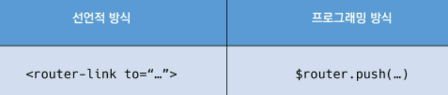

# vueCli

### SFC(single file component)

- 하나의 컴포넌트는 .vue확장자를 가진 하나의 파일 안에서 작성되는 코드의 결과물(html,js,css)
- 한 화면을 구성하는 여러 컴포넌트로, 각 기능별로 파일을 나눠서 개발
- .
- 하나의 파일==하나의 컴포넌트
- vue component는 `const app = new Vue({...})`의 app을 의미하며, 이는 vue의 인스턴스
- 

```bash
node
```

 ```bash
 npm install -g @vue/cli    # g: global  # 프젝마다 venv같은걸 기본으로 만들기 때문에 g사용
 vue --version
 ```

```bash
vue create my-first-app
default vue2 
cd my-first-app
npm run serve
```


#### babel

- 최신버전을 구버전으로 바꿈
- 컴파일러

### bundler

- 모듈 의존성 해결해준 작업: 빌딩

- 도구: bundler

- ### webpack

  - 모듈간의 의존성 해결
  - 모듈 번들러로 다양한 bundler중 하나
  - `</script src="말고">`
  - ESMA 사용

### node.js

- JS를 브라우저 밖에서 실행할 수 있음


### 프젝구조

.

- `src/assets`- webpack에 의해 빌드된 정적파일
- `src/App.vue`-최상위컴포넌트
- `src/components`-하위 컴포넌트들이 위치
- `src/main.js`-webpack이 빌드 시작할 때 가장 먼저 불러오는 entry point
  - el로도 mount 시킬 수 도 있고, .$mount로도 가능하다
- `babel.config.js`
- `package.json`- `requirements.txt`
- `package-lock.json`-의존성 패키지 충돌 방지

```
Vetur 때매 vue + enter ㄱㄴ
```


### Pass Props & Emit event

- 부모-> 자식: props
  - 부모, 자식 방이 따로 있기때문에, 자식에서 부모 참조 불가
- 자식-> 부모: Emit
- 불러오기, 등록하기, 보여주기 __ import, register, print

1. 부모에서 자식 사용하고 싶음

   1. 자식 vue 파일 생성 후, 부모vue에 등록(경로, components) + 사용하기(케밥케이스)
   1. 자식 vue에서 이름 등록
   1. props 사용
   
   ```vue
   #부모
   <about-view></about-view>
   
   import AboutView from './components'
   components:{
   	AboutView,
   }
   
   #부모
   <about-view give-data="받아라 !"></about-view>
   #자식
   <h1>
       {{giveData}}
   </h1>
   ```
   
   ```vue
   #부모
   <about-view :give-data="받아라 !"></about-view>
   data(){
   	return{
   	appData:'앱 데이터'
   }}
   #자식
   <h1>
       {{giveData}}
   </h1>
   <button @click="emitEvent">
       
   </button>
   props:{
   	emitData(){
   	this.$emit("log-hello")
   }
   }
   ```
   
   


```vue
    <!-- 카멜케이스 -->
    <TheAbout my-message="CamelCase"/> 
    <!-- 케밥케이스 -->
    <the-about my-message="kebab-case"></the-about>
```

```vue
<template>
  <div id="app">
    
    <TheAbout :my-message="parentData"/> 
     <!--바인드를 안하면 스트링이고, 바인드하면 가져옴-->
    <the-about :my-message="parentData"></the-about>
  </div>
</template>

<script>
// 1. 불러오기(import)
import TheAbout from './components/TheAbout.vue' // as의 영역_ 변수명 (import)


export default { //객체
  name: 'App', 
  // 2.등록하기(register)
  components: { //컴포넌츠라는 키값으로
    // TheAbout:TheAbout, //키 벨류가 같으면 한번만 써도 됨
    TheAbout,
  },
  // 컴포넌트에서 데이터는 함수를 써야 함 : 이유 부모가 자식을 참조할떄, 같은 data를 공유해서
  data:function(){
    return{
      parentData:'This is parent data to child component',
    }
  }
}
</script>

```

- html안의 attrbute의 key빼고 다 케밥-case...
- 자식-> 부모 : event로 올려줄 것임 !!

- `$emit`
  - 현재 인스턴스에서 이벤트를 트리거
  - 추가 인자는 리스터의 콜백함수로 전달


- `@`v-on에서 camelCase를 못 알아들으므로 항상 kebab-case를 쓰는걸 권장


### Vue Router

- vue.js 공식 라우터
- 라우트에 컴포넌트를 매핑한 후, 어떤 주소에서 렌더링할 지 알려줌
- SPA 상에서 라우팅을 쉽게 개발할 수 있는 기능을 제공

```bash
cd ..  // ls 시,  node_modules있는 곳 
vue create my-router-app
cd my-router-app

code my-router-app

# vue router plugin
vue add router
yy
```

```js
#main.js, app.vue 변경
router/index.js 추가됨
```


- `<router-link>`
  - html5 히스토리모드에서 router-link는 클릭이벤트를 차단하여 브라우저가 페이지를 다시 로드하지 않도록 함
  - a tag 이지만, 이벤트를 제거한 형태로 구성
- `<router-view>`
  - 주어진 라우트에 대해 일치하는 컴포넌트를 렌터링하는 컴포넌트

- `history-mode`
  - html history  api를 사용해서  router를 구현한 것
  - 브라우저의 히스토리를 남기지만 실제 페이지는 이동하지 않는 긴으을 지원


- `named Routes`
  - .
  - bind 필수
- 프로그래밍방식 네비게이션
  - .
  - vue 인스턴스 내부에서 `$router`로 라우터 인스턴스에 접근한다.
  - 다른 url로 이동시 this.$router.push 호출
  - <router-link :to="...">    와 `router.push(...)`는 같음
  - .
  - `this.$router.push({name:'home'})`
  - 


자식

부모ㅇ


