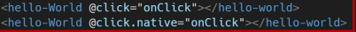

# vueCli

### SFC(single file component)

- 하나의 컴포넌트는 .vue확장자를 가진 하나의 파일 안에서 작성되는 코드의 결과물(html,js,css)

- 한 화면을 구성하는 여러 컴포넌트로, 각 기능별로 파일을 나눠서 개발

- .

- 하나의 파일==하나의 컴포넌트

- vue component는 `const app = new Vue({...})`의 app을 의미하며, 이는 vue의 인스턴스

  

```bash
node
```

 ```bash
 npm install -g @vue/cli    # g: global  # 프젝마다 venv같은걸 기본으로 만들기 때문에 g사용
 vue --version
 ```

```bash
vue create my-first-app
default vue2 
cd my-first-app
npm run serve
```


#### babel

- 최신버전을 구버전으로 바꿈
- 컴파일러

### bundler

- 모듈 의존성 해결해준 작업: bundling

- 도구: bundler

- ### webpack

  - 모듈간의 의존성 해결
  - 모듈 번들러로 다양한 bundler중 하나
  - `</script src="말고">`
  - ESMA 사용`import x from x`

### node.js

- JS를 브라우저 밖에서 실행할 수 있음


### 프젝구조

.

- `node_modules` - venv

- `package.json`- `requirements.txt`

- `package-lock.json`-의존성 패키지 충돌 방지

  

- `src/assets`- webpack에 의해 빌드된 정적파일

- `src/App.vue`-최상위컴포넌트

- `src/components`-하위 컴포넌트들이 위치

- `src/main.js`-webpack이 빌드 시작할 때 가장 먼저 불러오는 entry point
  
  - el로도 mount 시킬 수 도 있고, .$mount로도 가능하다
  
- `babel.config.js`

```
Vetur => vue + enter 가능
```

### 규칙

```vue
<TheAbout/>
<the-about></the-about>
```

- template 안에 div 
- data는 반드시 함수
- html안의 attrbute의 key빼고 다 케밥-case


### Pass Props & Emit event

- 부모-> 자식: props
  - 부모, 자식 방이 따로 있기때문에, **자식에서 부모 참조 불가**
- 자식-> 부모: Emit

1. 부모-> 자식

   1. 자식 vue 파일 생성 후, 부모vue에 등록(경로, components) + 사용하기(케밥케이스)
   1. 자식 vue에서 이름 등록
   1. props 사용
   1. 자식에게 내려보낼때 바인드 사용할 것 !


```vue
#부모
<about-view give-data="받아라 !"></about-view>  //   키="벨류"
<the-about :my-message="parentData"></the-about>
<script>
componets:{ //컴포넌츠라는 키값
	AboutView,
    TheAbout
},
  data(){
    return{
      parentData: 'This is parent data to child component'   //특정키의 변수명을 밑에서 찾게해줌
    }
  }
</script>


#자식
<h1>
    {{giveData}}  //자유롭게 사용 !
    {{myMessage}}
</h1>
props:{  //키
	giveData: String,  //object // 키:데이터타입
	myMessage:String,
}
```


2. 자식->부모
   1. Emit event   위로 이벤트를 보내고, 부모는 @ 듣고있음
   2. `$emit`(eventname)
      1. 현재 인스턴스에서 이벤트트리거
   3. 부모는 자식 컴포넌트가 사용되는 템플릿에서 v-on을 사용하여 자식 컴포넌트가 보낸 이벤트를 청취
   4. `@`v-on에서 camelCase를 못 알아들으므로 항상 kebab-case를 쓰는걸 권장

```vue
#부모
<the-about 
 @child-input-change="parentGetChange"></the-about>

<script>
  methods:{
    parentGetChange(inputData){
      console.log('parent: 들리는군', inputData)  //두번째로 인자 넘어옴
    }
  }
</script>

#자식
<div>
<input 
  type="text"
  v-model="childInputData"
  @keyup.enter="childInputChange">
</div>

<script>
  data(){
    return {
      childInputData:''
    }
  },
  methods:{
    childInputChange(){
      // const data  = {  //여러개 보낼때
      // }
      console.log('child', this.childInputData)
       //첫번째인자로 이벤트 발생, 두번째인자로 값 넘김
      this.$emit('child-input-change', this.childInputData)
    }
  }
</script>
```

-  .native 는 기본요소를 무시하고 상위컴포넌트에 있는 이벤트를 실행시킨다
-  emit이벤트를 무시하고, 현 templete의 click이벤트를 발생시킴
-  [native](https://v3.ko.vuejs.org/guide/migration/v-on-native-modifier-removed.html#%E1%84%80%E1%85%A2%E1%84%8B%E1%85%AD)
- .
- .
- 추후 추가하기

### Vue Router

- vue.js 공식 라우터
- 라우트에 컴포넌트를 매핑한 후, 어떤 주소에서 렌더링할 지 알려줌
- SPA 상에서 라우팅을 쉽게 개발할 수 있는 기능을 제공

```bash
vue create my-router-app
cd my-router-app   //ls 시,  node_modules있는 곳  // code .
# vue router plugin
vue add router
yy
```

.

- `<router-link>`
  - 각각 컴포넌트
  - html5 히스토리모드에서 router-link는 클릭이벤트를 차단하여 브라우저가 페이지를 다시 로드하지 않도록 함
  - a tag 이지만, 이벤트를 제거한 형태로 구성

- `<router-view>`
  - 주어진 라우트에 대해 일치하는 컴포넌트를 렌터링하는 컴포넌트
- `history-mode`
  - html history  api를 사용해서  router를 구현한 것
  - 브라우저의 히스토리를 남기지만 실제 페이지는 이동하지 않는 기능을 지원

```vue
#app.vue
<router-link to="/">Home</router-link> 
<router-link :to="{name:'home'}">Home</router-link>
<router-view/> ## == component(HomeView) routerlink누르면 보여줄것

```

```js
#index.js
const routes = [
  {
    path: '/',
    name: 'home',
    component: HomeView  //routerview에 들어갈것
  },
```

- index.js에서 컴포넌트 불러와서 등록해주기

- `named Routes`
  - .
  - bind 필수


- 프로그래밍방식 네비게이션

  - ```vue
    <template>
      <div class="about">
        <h1>This is an about page</h1>
        <button @click="moveToHome">Tohome</button>
      </div>
    </template>
    
    <script>
    export default {
      name:'AboutView',
      methods:{
        moveToHome(){
          this.$router.push({name:'home'})   /////!
        }
      }
    }
    </script>
    ```

  - vue 인스턴스 내부에서 `$router`로 라우터 인스턴스에 접근한다.

  - 다른 url로 이동시 this.$router.push 호출

  - .

  - `this.$router.push({name:'home'})`

- route matching

- .

- `this.$route.params`로 사용가능

- ```js
  #index.js
  {
      path: '/user/:userId/:username',
      name: 'profile',
      component: UserProfile
    }
  
  
  #Userprofile.vue
  <p>   당신의 id는 {{user.userId}} , 당신의 이름은 {{user.username}} </p>
  export default {
    name:'UserProfile',
    data(){
      return {
        user:this.$route.params,
      }
    }
  }
  ```

  
