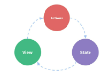
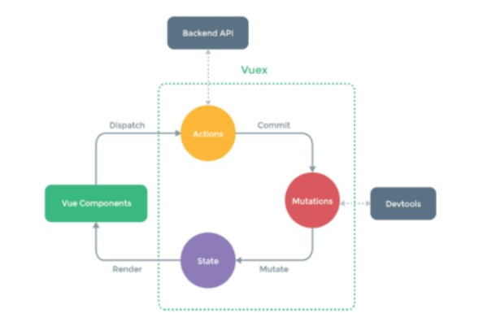

# VUEX

- `상태관리`패턴 + 라이브러리
- 상태를 전역저장소로 관리할 수 있도록 지원하는 라이브러리로, 상태가 예측 가능한 방식으로만 변경될 수 있도록 보장
- 모든 컴포넌트에 대한 `중앙집중`식 저장소
- `State === data`로, 중앙에서 관리하는 모든 상태정보


- 상태관리패턴

  - 컴포넌트의 공유된 상태를 추출하고, 이를 전역에서 관리하도록 함
  - 트리거 : 특정 동작에 반응, 자동으로 필요한 동작 실행

  

- `기존 pass props&emit event === 단방향 데이터`

  - .
  - state앱 을 작동하는 원본소스 (data(객체))
  - view는 state의 선언적 매핑
  - action은 view에서 사용자 입력에 대해 반응적으로 state를 바꿈(methods)


- `Vuex management pattern`
  - 중앙저장소(store)에 state를 모아놓고 관리_ 컴포넌트는 state(상태)만 신경쓰면 됨
  - 동일한 state를 공유하는 타 컴포넌트들도 동기화 됨


## vuex  core concept

.

```js
컴포넌트에서,
this.$store 로 store의 index.js에 접근
```

[API 레퍼런스 | Vuex (vuejs.org)](https://v3.vuex.vuejs.org/kr/api/#mapmutations)

1. `stete==data`

   1. 원본소스 역할
   2. mutation에 의해 변경됨

2. mutations(state, ) 

   1. 실제로 state를 변경하는 유일한 방법  `  CREATE_TODO(state,){`
   2. mutation(handler)함수는 반드시 동기적이어야함_**상수**
   3. 비동기로직(콜백함수)은 state를 변화하는 시점과 달라질 수 있어 추적할 수 없음
   4. action에서 `commit()`메서드에 의해 호출됨

1. actions(context,)
   
   1. mutation을 commit()메서드로 호출, 비동기 작업포함 가능
   
   2. 컴포넌트에서` this.$store.dispatch('함수명', 인자)`로 호출
   
      ```
      $store === context(vuex store의 전반적 속성 포함)
      context.state
      context.getters
      context.dispatch()
   
   3. **`state를 직접변경하지 않음`**
   
   ```js
     mutations: {
       CREATE_TODO(state, todoItem){
         state.todos.push(todoItem)
       }
     },
     actions: {
       createTodo(context, todoItem){
         context.commit('CREATE_TODO', todoItem)
       }
     },
   ```
   
4. getters
   1. state에서 넘어감   `function(state)`
   1. store의 상태를 기반하는 계산값
   2. computed와 유사

- state에 간단한 더미데이터 만들어주고, todo 짜서, action으로 보내줌


## project

```js
vue create todo-vuex-app
cd todo-vuex-app
```

```bash
vue add vuex  y
/store/index.js 생성
```

- props
  - todolist-> todolistitem으로 v-for 로 내릴때 사용

```js
computed:{  //state의 todo는 변화하는게 아니라, 목록을 가져오는 것. todo가 추가되는 등일땐 새로 계산한 값을 반환하는 방향으로 변경
    todos(){
        return this.$store.state.todos
    }
}
```

- delete_ idx 활용법

```js
    DELETE_TODO(state, todoItem){
      const idx = state.todos.indexOf(todoItem)
      state.todos.splice(idx, 1)
    }
```

- `   console.log(JSON.parse(JSON.stringify(state.todos)))` obj로 나올때, 변환방법

- 데이터 불변성

```js
// 데이터의 불변성, 가상돔에서 원래꺼 복사 후 변경된거만 다시 기존돔에 그리기
    UPDATE_TODO(state, todoItem){
      state.todos = state.todos.map(todo => {
        if (todo === todoItem){
          return {
            ...todo,
            is_completed : !todoItem.is_completed
          }}
        else{
          return todo
        }})}},
```


#### 구조분해할당  js destructing assignment

```js
const context = {
    commit(){
        console.log('hi')
    },
    state:{
        todo:'할일1',
    },
    getters:{},
    mutations:{}
}
//1. 하나하나 할당
const commit = context.commit
const state = context.state

console.log(commit()) //'hi'
console.log(state) //{todo:'할일1'}

//2. 구조분해할당, 이름으로 가져옴
//순서 필요x
const {state, commit} = context
console.log(commit()) //'hi'
console.log(state) //{todo:'할일1'}

//한개만 가져와도 됨
const {state} = context
console.log(state) //{todo:'할일1'}
```

```js
  actions: {
    createTodo(context, todoItem){
      context.commit('CREATE_TODO', todoItem)
    }
  actions: {
    createTodo({commit}, todoItem){
      commit('CREATE_TODO', todoItem)
    } 
```


#### 전개구문_ js spread syntax

- 0개 이상의 key-value의 쌍으로 된 객체로 확장시킬수 있음
- `...`를 붙여서 요소 또는 키가 0개 이상의 iterable object를 하나의 object로 간단하게 표현하는 법
- 반드시 iterable객체여야함
- 함수호출, 배열, 객체(객체복사)

```js
//객체복사
const obj1 = {foo:'bar', x:42}
const cloneobj1 = {...obj1}  //{foo:'bar', x:42}
```

```js
//spread_syntax.js
const todoItem={
    todo:'할일1',
    isCompleted:false
}
//1st
const myupdate={
    todo:'할일1',
    isCompleted:true,
}
//2nd
const myupdate={
    ...todoItem,
    isCompleted:true,
}
```


### component binding helper

- 배열조작을 편하게 하도록함

  - arr를 input으로 받고 output이 obj

  - mapState - computed와 store의 state mapping   __  객체 반환
  
    ```js
      computed:{
        todos(){
          return this.$store.state.todos
        }
    ----------------------------------
    import { mapState } from 'vuex'
      computed: mapState([
        'todos'
      ])
    ----------------------------------
      computed: {
          ...mapState([   //다른 computed값을 같이 사용하려면, (...객체전개연산자로)복사해서 쓰기
          'todos',
        ])
      }
    ```

  - mapGetters - computed와 getter매핑
  
    ```js
      completedTodosCount(){
          return this.$store.getters.completedTodosCount
        },
    -------------------------------
      computed:{
        ...mapGetters([
          'completedTodosCount',
    ```

  - mapActions - action을 전달하는 컴포넌트 method옵션을 만듦
  
    ```js
        <button @click="deleteTodo">delete</button> 
      methods:{
        deleteTodo(){
          this.$store.dispatch('deleteTodo', this.todo)  //payload
        },
    -------------------------------
        <button @click="deleteTodo(todo)">delete</button>   //pass prop
      methods:{
        ...mapActions([
          'deleteTodo',
        ]),
    ```
  
  - mapMutations
  


### local storage

- ssesion Storage - tab이 켜져있는 동안 유지
- local storage - 영구저장, 페이지 새로고침되도 vuex state 유지됨

```js
npm i vuex-persistedstate

//index.js
import createPersistedState from 'vuex-persistedstate'

export default new Vuex.Store({
  plugins:[
    createPersistedState()
  ],
```

---

###### install 안하고 그냥 쓸때

```js
application tab
localStorage.setItem('todos', todos)  //key, value

const data = Json.stringify(todos)
localStorage.getItem('todos')

const prevData = localStorage.getItem('todos')
Json.parse(prevData)
```

```js
mutations: { //change
    LOAD_TODOS(state){
      const todosString = localStorage.getItem('todos')
      state.todos = JSON.parse(todosString)
      //둘다 쓸수 있음
      const oldTodos = localStorage.getItem('todos')
      if(oldTodos){
        const objOldTodos = JSON.parse(oldTodos)
        state.todos = objOldTodos
      }
    },
actions: { //methods
    saveTodos({state}){
      const jsonData = JSON.stringify(state.todos)
      localStorage.setItem('todos', jsonData)
    },
    createTodo(context, newTodo){
      context.commit('CREATE_TODO', newTodo) //context.commit
      context.dispatch('saveTodos')
    },
    deleteTodo({commit, dispatch}, todoItem){
      if(confirm('진짜 삭제 ?')){
        commit('DELETE_TODO', todoItem)
        dispatch('saveTodos')
      }
    }, 
```

```js
import { mapState, mapMutations } from 'vuex'
methods:{
    ...mapMutations(['LOAD_TODOS',])
  },
  created(){
    this.LOAD_TODOS()
  }
```

---

- `깊은복사?`

  const newobj1 = JSON.parse(JSON.stringify(obj))

- `style scoped`

- ```html
      <input type="text" @keyup.enter="createTodo" id="input1">
      <button @click="createTodo">Add</button>
  ```

- ```js
  createTodo(event){
        const todoTitle = document.querySelector('#input1').value.trim()  //버튼 연결해주기
        // const todoTitle = event.target.value.trim()
  ```
