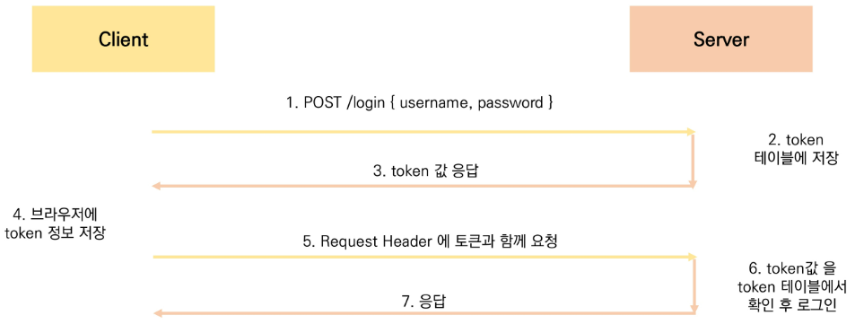
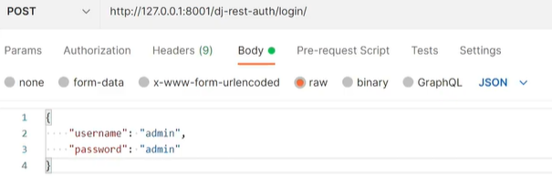
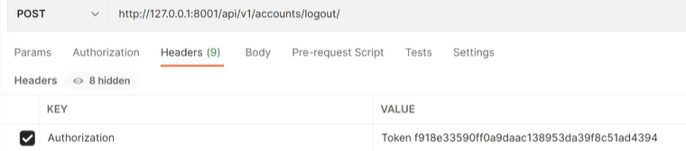
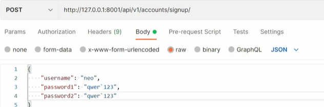
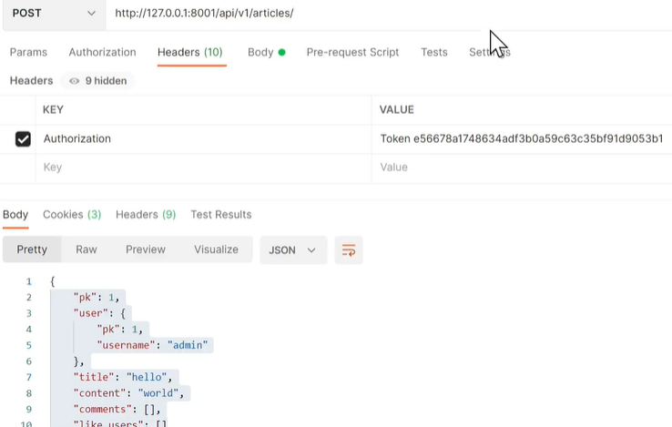

# Server&Client

- server
  - 정보제공(db와 통신하며 데이터 CRUD)
  - 응답하는 존재,  resource
  - template, Json
- client
  - 정보요청 & 표현
  - browser, postman


## Start Project Model + Serializer

```python
pip install django==3.2.12 djangorestframework django_extensions
pip freeze > requirements.txt
django-admin startproject django_back .
touch .gitignore
python manage.py startapp accounts
python manage.py startapp article
등록
    #3rdparty
    'django_extensions',
    'rest_framework',
AUTH_USER_MODEL  = 'accounts.User'

```

```python
#models.py
from django.contrib.auth.models import AbstractUser
class User(AbstractUser):
    pass
```

```python
serializers 폴더에 __init__.py 만들기
```


## CORS

- same-origin policy (SOP)
- 동일출처정책
- 다른출처에서 가져온 리소스와 상호작용하는 것을 제한하는 보안방식

```python
		http://localhost:3000/posts/3
scheme/protocol   host   port//  path
	origin이 같을때만 동일출처//
```

- **해결방법**
  - CORS header를 포함한 응답을 반환해야함
  - why cors ? 
    - 응답받은 자원에 대한 최소한의 검증

## CORS

- 교차 출처 리소스(자원) 공유
- 추가 httpheader사용
- 다른출처의 리소스를 불러오려면, **그 출처에서** (괜찮슴니다) 올바른 cors header를 포함한 응답을 반환해야함
- 막는건 client이지만, 허용은 응답을 주는 쪽에서 해야함  --> client(음?출처에서 괜찮다네 ? 통과 !)
- 내가 만든 서비스만 api를 쓸수있게해야함

```python
Access-Control-Allow-Origin: *        / 모든 도메인에서 접근할 수 있음
    *이외에 특정 origin하나를 명시할 수 있음  Access-Control-Allow-Origin: https://localhost:8080  명시
```

[cors headers](https://github.com/adamchainz/django-cors-headers)

```python
pip install django-cors-headers
INSTALLED_APPS = [
    "corsheaders",
MIDDLEWARE = [  # 뭐가 먼저쓰이는지 중요
    "corsheaders.middleware.CorsMiddleware",
    #"django.middleware.common.CommonMiddleware", #CommonMiddleware보단 위에 위치
    
# 특정 origin 에게만 교차 출처 허용
CORS_ALLOWED_ORIGINS = [
    # vue local host
    "http://localhost:8080",
]
#CORS_ALLOWED_ORIGINS = True # 모든거 허용
```


## Authentication & Authorization

| Authentication                | Authorization                  |
| ----------------------------- | ------------------------------ |
| 인증                          | 권한/허가                      |
| 자신이라고 주장하는 유저 확인 | 유저가 자원에 접근할 수 있는지 |


##### 다양한 인증방식

**basic token based**

.

**JWT**


### 'dj-rest-auth' & 'django-allauth'

```python
#회원가입
pip install django-allauth
pip install dj-rest-auth
```

[restframework](https://www.django-rest-framework.org/api-guide/authentication/)

[dj-rest-auth](https://dj-rest-auth.readthedocs.io/en/latest/installation.html)

- 로그인,로그아웃

```python
INSTALLED_APPS = (
    ...,
    'rest_framework',
    'rest_framework.authtoken', # token 기반 auth
    ...,
     # DRF auth
    'dj_rest_auth'   # signup 제외 auth 관련 담당
REST_FRAMEWORK = {
    'DEFAULT_AUTHENTICATION_CLASSES': [
        'oauth2_provider.contrib.rest_framework.TokenAuthentication',  ##'rest_framework.authentication.TokenAuthentication',
    ],
    'DEFAULT_PERMISSION_CLASSES': [
        # 모두에게 허용
       #'rest_framework.permissions.AllowAny',
#        인증된 사용자만 모든일이 가능 / 비인증 사용자는 모두 401 Unauthorized
        # login required //login signup제외한 모든! //비인증시 401
        'rest_framework.permissions.IsAuthenticated',
        
	]   
}
#masterurl
urlpatterns = [
    #path('api/v1/accounts/', include('accounts.urls')),
    path('api/v1/accounts/', include('dj_rest_auth.urls'))  #path변경하기// 위에찾아보고없으면 여기로옴 ! 
]  #migrate
```

`python  manage.py runserver 8001`

토큰 발급

.

#login 시, headers비워져있는지 확인.. 

모델에 key, create_at, user_id 저장됨 ( 토큰생성 )

.

테이블에서 지워짐( 토큰삭제 )

- 회원가입

```python
#회원가입하기
#pip install django-allauth  가 관여
INSTALLED_APPS = (
     # DRF auth
    'dj_rest_auth.registration',   # signup 담당
    # signup 담당을 위해 필요 
    'allauth',
    'allauth.account',
    'allauth.socialaccount',
    ...,
    'django.contrib.sites',  #마지막 에 작성했네..
SITE_ID = 1  #allauth사용위함
#url
urlpatterns = [
    ...
    path('api/v1/accounts/signup', include('dj_rest_auth.registration.urls'))
] #migrate
```

.

뷰에서 추가 필드로 annotate 해준 것을 serializer로 전달

- 게시글 조회

.

---

---

```python

# Application definition

INSTALLED_APPS = [
    # local apps
    'accounts',
    'articles',
    # 3rd party apps
    'django_extensions',
    
    'rest_framework',
    'rest_framework.authtoken',  # token 기반 auth
    # DRF auth
    'dj_rest_auth',  # signup 제외 auth 관련 담당
    'dj_rest_auth.registration',  # signup 담당

    # signup 담당을 위해 필요 
    'allauth', 
    'allauth.account',
    'allauth.socialaccount',

    # CORS 세팅
    'corsheaders',

    # native apps
    'django.contrib.admin',
    'django.contrib.auth',
    'django.contrib.contenttypes',
    'django.contrib.sessions',
    'django.contrib.messages',
    'django.contrib.staticfiles',
    'django.contrib.sites',  # dj-rest-auth signup 필요
]

SITE_ID = 1

MIDDLEWARE = [
    'corsheaders.middleware.CorsMiddleware',
    'django.middleware.security.SecurityMiddleware',
    'django.contrib.sessions.middleware.SessionMiddleware',
    'django.middleware.common.CommonMiddleware',
    'django.middleware.csrf.CsrfViewMiddleware',
    'django.contrib.auth.middleware.AuthenticationMiddleware',
    'django.contrib.messages.middleware.MessageMiddleware',
    'django.middleware.clickjacking.XFrameOptionsMiddleware',
]

# Static files (CSS, JavaScript, Images)
# https://docs.djangoproject.com/en/3.2/howto/static-files/

STATIC_URL = '/static/'

# Default primary key field type
# https://docs.djangoproject.com/en/3.2/ref/settings/#default-auto-field

DEFAULT_AUTO_FIELD = 'django.db.models.BigAutoField'

AUTH_USER_MODEL = 'accounts.User'

# 특정 origin 에게만 교차 출처 허용
# CORS_ALLOWED_ORIGINS = [
#     # Vue LocalHost
#     'http://localhost:8080',
#     'http://127.0.0.1:8001',
# ]

# 모두에게 교차출처 허용 (*)
CORS_ALLOW_ALL_ORIGINS = True


# DRF 인증 관련 설정
REST_FRAMEWORK = {
    'DEFAULT_AUTHENTICATION_CLASSES': [
        'rest_framework.authentication.TokenAuthentication',
    ],
    'DEFAULT_PERMISSION_CLASSES': [
        # 모두에게 허용
        # 'rest_framework.permissions.AllowAny', 

        # 인증된 사용자만 모든일이 가능 / 비인증 사용자는 모두 401 Unauthorized
        'rest_framework.permissions.IsAuthenticated'
    ]
}

```

```python
urlpatterns = [
    path('admin/', admin.site.urls),
    path('api/v1/articles/', include('articles.urls')),
    path('api/v1/accounts/', include('accounts.urls')),
    path('api/v1/accounts/', include('dj_rest_auth.urls')), ##
    path('api/v1/accounts/signup/', include('dj_rest_auth.registration.urls')), ##
]
```

```python
##accounts
from rest_framework import serializers
from django.contrib.auth import get_user_model
from articles.models import Article
##
from django.contrib.auth.models import AbstractUser
class User(AbstractUser):
    pass
##article
from django.db import models
from django.conf import settings
##serializer
from django.contrib.auth import get_user_model
User = get_user_model()
```
