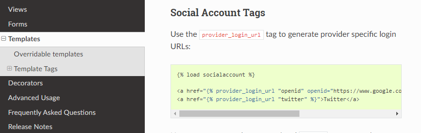
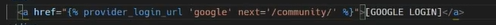
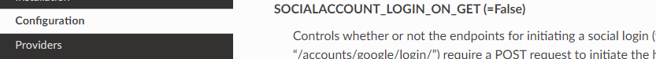

https://django-allauth.readthedocs.io/en/latest/installation.html

```
gcp
콘솔
프젝생성
api 및 서비스 -> oauth동의화면 - 외부 - 테스트 사용자 추가
```

[승인된리디렉션](https://django-allauth.readthedocs.io/en/latest/providers.html#google)

```
사용자 인증정보 -> 사용자 인증정보 만들기 -> OAuth클라이언트 ID -> 웹 애플리케이션 -> 승인된 리디렉션에
http://127.0.0.1:8000/accounts/google/login/callback/ 만들기 후
django admin page에서 소셜어플리케이션 추가
이름, ID, 비밀키 채워주기
추후 sites에 도메인으로 바꿔주기
```

 

 

 

#settings.py

True로 바꿔주면, 구글 로그인으로 바로 redirect 해줌


