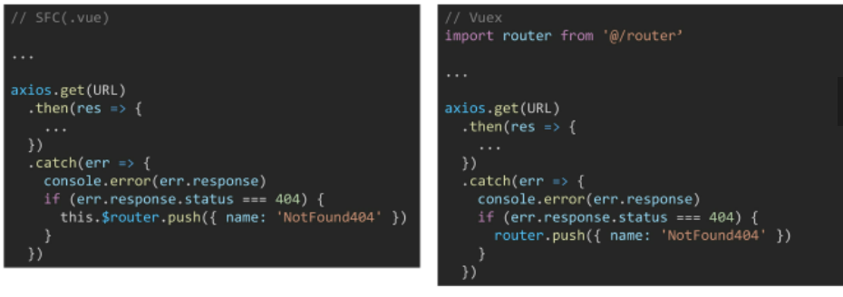
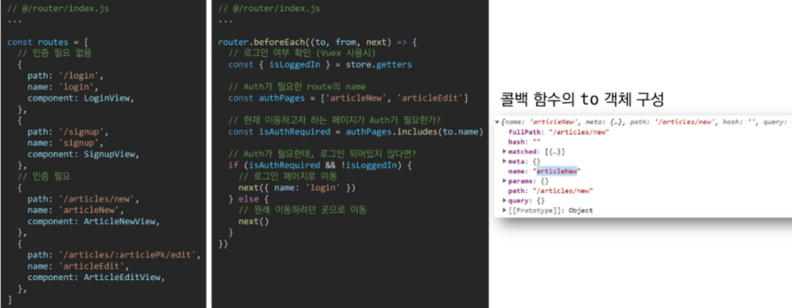
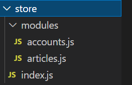
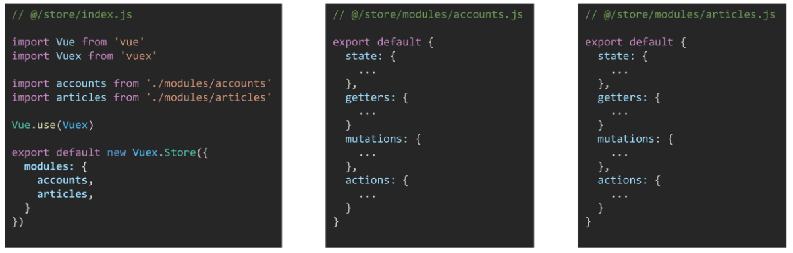
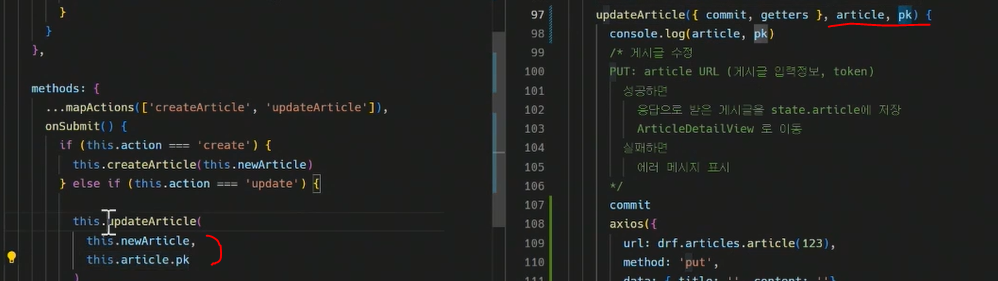

# Vue router

- components: 부품
- views: url과 mapping될 컴포넌트: router.index.js에 쓰임

```js
import LoginView from '@/views/LoginView.vue'
{
    path:'/login',
    name:'login',
    component: LoginView
}
```


### 404 page

1. vue router에 등록되지 않은 routes일 경우 `/no-such-routes`

```js
  {
    path: '/404',
    name: 'NotFound404',
    component: NotFound404
  },
  {
    path: '*',  //마지막에쓰기
    redirect: '/404'   //redirect
  },
```

2. vuerouter에 등록되어 있지만, 서버에서 해당 리소스를 찾을 수 없는 경우 `/articles/123455`

- .

  

### Navigation Guard

- 전역가드
  - URL을 이동할때마다, 이동하기 전 모든 경우 발생
  - login required같은

.

```js
router.beforeEach((to, from, next) =>{
    //로그인 여부 확인(vuex 사용시)
    const {isLoggedIn} = store.getters
    //auth가 필요한 router의 name
    const authPages = ['articleNew', 'articleEdit']
    //현재 이동하고자 하는 페이지가 auth가 필요한가 ?
    const isAuthRequired = authPages.includes(to.name) //가려고 하는 to.name 이 있는지
    //auth가 필요한데, 로그인 되어있지 않다면 ?
    if (isAuthRequired&&!isLoggedIn){
        //로그인 페이지로 이동
        next({name:'login'})
    }else{
        //원래 이동하려던 곳
        next()
    }
})
```

```js
router.beforeEach((to, from, next) => {
  // 이전 페이지에서 발생한 에러메시지 삭제
  store.commit('SET_AUTH_ERROR', null)

  const { isLoggedIn } = store.getters

  const noAuthPages = ['login', 'signup']

  const isAuthRequired = !noAuthPages.includes(to.name)

  if (isAuthRequired && !isLoggedIn) {
    alert('Require Login. Redirecting..')
    next({ name: 'login' })
  } else {
    next()
  }

  if (!isAuthRequired && isLoggedIn) {
    next({ name: 'articles' })
  }
})

/*
Navigation Guard 설정
  (이전 페이지에서 있던 에러 메시지 삭제)


  0. router 에서 이동 감지

  1. 현재 이동하고자 하는 페이지가 로그인이 필요한지 확인
  
  2. 로그인이 필요한 페이지인데 로그인이 되어있지 않다면
    로그인 페이지(/login)로 이동

  3. 로그인이 되어 있다면
    원래 이동할 곳으로 이동
  
  4. 로그인이 되어있는데 /login, /signup 페이지로 이동한다면
    메인 페이지(/)로 이동
    

*/
```


# Vuex

### Vuex modules & namespace

. 

vuex는 store/index.js에 사용하지만, App이 커질수록 파일이 커지므로 modules 폴더를 만들어 분리해준다.



- 모듈별 분리: namespaced: true 적용

  ```js
  const store = createStore({
    modules: {
      account: {namespaced: true}
    }  //혹은 아래처럼
  ```


## accounts

```js
export default {
  // namespaced: true,

  // state는 직접 접근하지 않겠다!
  state: {
    token: localStorage.getItem('token') || '' ,   //새로고침해도, token유지되도록
    currentUser: {},  //현재 사용자
    profile: {},  //누구 프로필 ?
    authError: null,  //에러메세지
  },
```

- state 작성 후, mutation 작성

```js
  mutations: {
    SET_TOKEN: (state, token) => state.token = token,
    SET_CURRENT_USER: (state, user) => state.currentUser = user,
    SET_PROFILE: (state, profile) => state.profile = profile,
    SET_AUTH_ERROR: (state, error) => state.authError = error
  },
```

- getters : state를 getter통해 접근

```js
  getters: {
    isLoggedIn: state => !!state.token, //유효한 토큰이 있으면 로그인한것임. T/F want
    currentUser: state => state.currentUser,  // state => {return state.currentUser}
    profile: state => state.profile,
    authError: state => state.authError,
    authHeader: state => ({ Authorization: `Token ${state.token}`})
  },
```

- actions

```js
  actions: {
    saveToken({ commit }, token) {
      /* 
      state.token 추가 
      localStorage에 token 추가
      로그인, 회원가입 시
      */
      commit('SET_TOKEN', token)
      localStorage.setItem('token', token)  //key, value
    },

    removeToken({ commit }) {
      /* 
      state.token 삭제
      localStorage에 token 추가
      */
      commit('SET_TOKEN', '')
      localStorage.setItem('token', '')
    },
    
        
    //login은 signup 복붙해서 수정하는 식으로 해보기
    signup({ commit, dispatch }, credentials) {        //4. credentials받아서, 이후 작업 수행
      /*      
      POST: 사용자 입력정보를 signup URL로 보내기
        성공하면
          응답 토큰 저장
          현재 사용자 정보 받기  //fatchCurrentUser
          메인 페이지(ArticleListView)로 이동
        실패하면  
          에러 메시지 표시
      */
      axios({
        url: drf.accounts.signup(),
        method: 'post',
        data: credentials  // credentials = 사용자 입력 정보
      })
        .then(res => {
          const token = res.data.key
          dispatch('saveToken', token)
          dispatch('fetchCurrentUser')
          router.push({ name: 'articles' })
        })
        .catch(err => {
          console.error(err.response.data)
          commit('SET_AUTH_ERROR', err.response.data)
        })
    },

```

```vue
<template>
  <div>
    <h1>Signup</h1>

    <account-error-list v-if="authError"></account-error-list>

    <form @submit.prevent="signup(credentials)">   <!--3. credential 받아서, action에 넘겨줌-->
      <div>
        <label for="username">Username: </label>          <!--1. 사용자 입력받기-->
        <input  v-model="credentials.username" type="text" id="username" required/>
      </div>
      <div>
        <label for="password1">Password: </label>
        <input v-model="credentials.password1" type="password" id="password1" required />
      </div>
      <div>
        <label for="password2">Password Confirmation:</label>
        <input v-model="credentials.password2" type="password" id="password2" required />
      </div>
      <div>
        <button>Signup</button>
      </div>
    </form>
  </div>
</template>

<script>
  import { mapActions, mapGetters } from 'vuex'
  import AccountErrorList from '@/components/AccountErrorList.vue'

  export default {
    name: 'SignupView',
    components: {
      AccountErrorList,
    },
    data() {
      return {
        credentials: {   //2. 사용자 입력정보 받아서, return
          username: '',
          password1: '',
          password2: '',
        }
      }
    },
    computed: {
      ...mapGetters(['authError'])
    },
    methods: {
      ...mapActions(['signup'])
    },
  }
</script>

<style></style>

```

```js
 fetchCurrentUser({ commit, getters, dispatch }) {
      /*
      signup, login 이후 실행
      GET: 사용자가 로그인 했다면(토큰이 있다면)
        currentUserInfo URL로 요청보내기
          성공하면
            state.cuurentUser에 저장
          실패하면(토큰이 잘못되었다면)
            기존 토큰 삭제
            LoginView로 이동
      */
      if (getters.isLoggedIn) {
        axios({
          url: drf.accounts.currentUserInfo(),
          method: 'get',
          headers: getters.authHeader,
        })
          .then(res => commit('SET_CURRENT_USER', res.data))
          .catch(err => {
            if (err.response.status === 401) {
              dispatch('removeToken')
              router.push({ name: 'login' })
            }
          })
      }
    },

    fetchProfile({ commit, getters }, { username }) {
      /*
      GET: profile URL로 요청보내기
        성공하면
          state.profile에 저장
      */
      axios({
        url: drf.accounts.profile(username),
        method: 'get',
        headers: getters.authHeader,
      })
        .then(res => {
          commit('SET_PROFILE', res.data)
        })
    },
  },
}
```

- app.vue

```js
  export default {
    name: 'App',
    components: { NavBar },
    methods: {
      ...mapActions(['fetchCurrentUser'])
    },
    created() {
      this.fetchCurrentUser()   // 실행하자마자 currentUSer 가져오기 
    }
  }
```


---

```js
//profileView.vue
//Vue: localhost:8000/profile/admin 해서 payload에서 admin을 읽음
  created() {
    const payload = { username: this.$route.params.username }  //key username: value
    this.fetchProfile(payload) 
  },
      
//drf.js
    profile: username => HOST + ACCOUNTS + 'profile/' + username,

//accounts.js
    fetchProfile({ commit, getters }, { username }) {   //username
      axios({
        url: drf.accounts.profile(username),   //payload.username으로 받거나, 애초에 username 받기
        method: 'get',            //django: 127.0.0.1/api/v1/accounts/profile/admin
        headers: getters.authHeader,
      })
        .then(res => {
          commit('SET_PROFILE', res.data)
        })
    },
        
//router/index.js
  {
    path: '/profile/:username',  //profile/neo
    name: 'profile',
    component: ProfileView,
  },
```

- module을 나누었지만, 결국 index.js에서 합쳐짐

```js
//modules/article.js

import _ from 'lodash'
// import accounts from './accounts'

export default {
  // namespaced: true,
  state: {
    articles: [],
    article: {},  
  },

  getters: {
    articles: state => state.articles,
    article: state => state.article,
    isAuthor: (state, getters) => {
      return state.article.user?.username === getters.currentUser.username  //혹은 pk
    },   // 게시글 작성자와, 현재 currentUser가 같은지 확인하는 법을 미리 정의해두기
         // 만일, 네임스페이스를 분리하고 싶으면 true 하고, accounts.getters...
    isArticle: state => !_.isEmpty(state.article), //단일 article이 비어있는지 물어볼 함수
  },

```

```js
  mutations: {
    SET_ARTICLES: (state, articles) => state.articles = articles,
    SET_ARTICLE: (state, article) => state.article = article,
    SET_ARTICLE_COMMENTS: (state, comments) => (state.article.comments = comments),
  },

  actions: {
    fetchArticles({ commit, getters }) {
      /* 게시글 목록 받아오기
      GET: articles URL (token)
        성공하면
          응답으로 받은 게시글들을 state.articles에 저장
        실패하면
          에러 메시지 표시
      */
      axios({
        url: drf.articles.articles(),
        method: 'get',
        headers: getters.authHeader,
      })
        .then(res => commit('SET_ARTICLES', res.data))  // SET_ARTICLES: (state, articles)
        .catch(err => console.error(err.response))
    },
        
        //vue에서 함수 실행하기
  //import { mapActions, mapGetters } from 'vuex'
  //  created() {
  //    this.fetchArticles() }
        //vuex 열어서 들어갔는지 확인 ! 
//vue 파일 템플릿 설정하기
        //vuex로 장고에서 넘어온 객체 확인하기     
        
```

```vue
<template>
  <div>
    <h1>Home</h1>
    <ul>
      <li v-for="article in articles" :key="article.pk">
        <!-- 작성자 -->
        {{ article.user.username }} : 

        <!-- 글 이동 링크 (제목) 그냥 router-link 사용하면 됨 ! -->
        <router-link 
          :to="{ name: 'article', params: {articlePk: article.pk} }">
          {{ article.title }}
        </router-link>

        <!-- 댓글 개수/좋아요 개수 -->
        =>
        ({{ article.comment_count }}) | +{{ article.like_count }}

      </li>
    </ul>
   
  </div>
</template>
```


- createArticle, editArticle

```js
    fetchArticle({ commit, getters }, articlePk) {
      /* 단일 게시글 받아오기
      GET: article URL (token)
        성공하면
          응답으로 받은 게시글들을 state.articles에 저장
        실패하면
          단순 에러일 때는
            에러 메시지 표시
          404 에러일 때는
            NotFound404 로 이동
      */
      axios({
        url: drf.articles.article(articlePk),
        method: 'get',
        headers: getters.authHeader,
      })
        .then(res => commit('SET_ARTICLE', res.data))
        .catch(err => {
          console.error(err.response)
          if (err.response.status === 404) {
            router.push({ name: 'NotFound404' })
          }
        })
    },
        
//article new와 edit은 articleform 공유
    createArticle({ commit, getters }, article) {
      /* 게시글 생성
      POST: articles URL (게시글 입력정보, token)
        성공하면
          응답으로 받은 게시글을 state.article에 저장
          ArticleDetailView 로 이동
        실패하면
          에러 메시지 표시
      */
      
      axios({
        url: drf.articles.articles(),         //create라 인자 필요 없음 !
        method: 'post',
        data: article,
        headers: getters.authHeader,
      })
        .then(res => {
          commit('SET_ARTICLE', res.data)
          router.push({
            name: 'article',
            params: { articlePk: getters.article.pk }
          })
        })
    },

    deleteArticle({ commit, getters }, articlePk) {
      /* 게시글 삭제
      사용자가 확인을 받고
        DELETE: article URL (token)
          성공하면
            state.article 비우기
            AritcleListView로 이동
          실패하면
            에러 메시지 표시
      */
      
      if (confirm('정말 삭제하시겠습니까?')) {
        axios({
          url: drf.articles.article(articlePk),
          method: 'delete',
          headers: getters.authHeader,
        })
          .then(() => {
            commit('SET_ARTICLE', {})
            router.push({ name: 'articles' })
          })
          .catch(err => console.error(err.response))
      }
    },

    likeArticle({ commit, getters }, articlePk) {
      /* 좋아요
      POST: likeArticle URL(token)
        성공하면
          state.article 갱신
        실패하면
          에러 메시지 표시
      */
      axios({
        url: drf.articles.likeArticle(articlePk),
        method: 'post',
        headers: getters.authHeader,
      })
        .then(res => commit('SET_ARTICLE', res.data))
        .catch(err => console.error(err.response))
    },
```


```vue
## ArticleNewView
<template>
  <div>
    <h1>New Article</h1>
    <article-form :article="article" action="create"></article-form>    
  <!--비어있는 article 넘김, action을 지정해서, form에서 받아서, create 할수 있게(수정엔 action update해줌)-->
  </div>
</template>

<script>
  import ArticleForm from '@/components/ArticleForm.vue'
  export default {
    name: 'AritcleNewView',
    components: { ArticleForm },
    data() {
      return {
        article: {
          pk: null,
          title: '',
          content: '',       
        }
```

.

X ------->

```js
# articleForm.vue

    methods: {
      ...mapActions(['createArticle', 'updateArticle']),
      onSubmit() {
        if (this.action === 'create') {
          this.createArticle(this.newArticle)  //article로 넘어감
        } else if (this.action === 'update') {
          const payload = {   //여러 인자 넘겨주기
            pk: this.article.pk,
            ...this.newArticle,
          }
          this.updateArticle(payload)
        }
      },
    },
```

```js
//articles.js
    updateArticle({ commit, getters }, { pk, title, content}) {  //article  article.pk, title..로 써도됨
      /* 게시글 수정
      PUT: article URL (게시글 입력정보, token)
        성공하면
          응답으로 받은 게시글을 state.article에 저장
          ArticleDetailView 로 이동
        실패하면
          에러 메시지 표시
      */
      axios({
        url: drf.articles.article(pk),
        method: 'put',
        data: { title, content },
        headers: getters.authHeader,
      })
        .then(res => {
          commit('SET_ARTICLE', res.data)
          router.push({
            name: 'article',
            params: { articlePk: getters.article.pk }
          })
        })
    },

```


- Edit article에서 fetch해야하는데, 언제 넘어올지 모름. 
- articleform보다, articleEditView의 created보다 먼저 실행됨 _ ?
- 따라서

```html
    <h1>Edit Article</h1>
    <article-form v-if="isArticle" :article="article" action="update">   v-if is Article걸어주기
```

```js
  getters: {
    isArticle: state => !_.isEmpty(state.article),   // 있다 : 비어있지 않음
  },
```


```js
		createComment({ commit, getters }, { articlePk, content }) {
      /* 댓글 생성
      POST: comments URL(댓글 입력 정보, token)
        성공하면
          응답으로 state.article의 comments 갱신
        실패하면
          에러 메시지 표시
      */
      const comment = { content }

      axios({
        url: drf.articles.comments(articlePk),
        method: 'post',
        data: comment,
        headers: getters.authHeader,
      })
        .then(res => {
          commit('SET_ARTICLE_COMMENTS', res.data)
        })
        .catch(err => console.error(err.response))
    },

    updateComment({ commit, getters }, { articlePk, commentPk, content }) {
      /* 댓글 수정
      PUT: comment URL(댓글 입력 정보, token)
        성공하면
          응답으로 state.article의 comments 갱신
        실패하면
          에러 메시지 표시
      */
      const comment = { content }

      axios({
        url: drf.articles.comment(articlePk, commentPk),
        method: 'put',
        data: comment,
        headers: getters.authHeader,
      })
        .then(res => {
          commit('SET_ARTICLE_COMMENTS', res.data)
        })
        .catch(err => console.error(err.response))
    },

    deleteComment({ commit, getters }, { articlePk, commentPk }) {
      /* 댓글 삭제
      사용자가 확인을 받고
        DELETE: comment URL (token)
          성공하면
            응답으로 state.article의 comments 갱신
          실패하면
            에러 메시지 표시
      */
        if (confirm('정말 삭제하시겠습니까?')) {
          axios({
            url: drf.articles.comment(articlePk, commentPk),
            method: 'delete',
            data: {},
            headers: getters.authHeader,
          })
            .then(res => {
              commit('SET_ARTICLE_COMMENTS', res.data)
            })
            .catch(err => console.error(err.response))
        }
      },
  },
}
```


```vue
    <!-- Article Like UI -->
    <div>
      Likeit:
      <button
        @click="likeArticle(articlePk)"
      >{{ likeCount }}</button>
    </div>

	<script>
	computed: {
      ...mapGetters(['isAuthor', 'article']),
      likeCount() {
        return this.article.like_users?.length
      }
    },
	</script>
```


---

---

- 그냥 들으면서 적어본것


- django-> API       데이터 건네줌

vue -> JS     axios요청 보내서(django한테)

```
# view파일 생성 + router에 등록 + app.vue(<router-link to='/articles'>article) + store에서 기능 만들기

+ article.vue만들기
articles먼저 만들기, 장고에서 정보 가져와서 actions에서 console.log찍어보기, ->article.title

로그인 해주기

```


```js
isAuthRequired : 인증 필요 여부
isLoggedIn: 로그인 여부
## 인증이 필요한데, 로그인 안된경우 로그인하러 가야함

//router
beforeEach(()=>{
	const isAuthRequired = authPages.includes(to.name)// boolean t -> 인증 need
})
```


```
optional chaning 
article = {user:'다빈'}
article.user?.username
article?.user.username

    isAuthor: (state, getters) => {
      return state.article.user?.username === getters.currentUser.username
    },

게시글 아직 안썼을때, user가 아직 안채워져서 없음=> 에러 
=> 방지하기 위함  // undefined로 출력됨
```


```
state.모듈.변수
모듈 안에 state니까 모듈.state겠지 하는데 아님

getters
state.article.articles
getters.articles로 바로 접근 가능 // 변수명 겹치지 않도록....!

getters를 computed로만 쓰거나/ 재정의 하는 부분으로 쓰거나
```


axios 러닝 가이드


인터셉터


