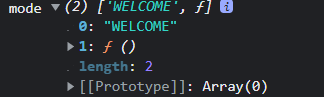

[TOC]


### 01_수업소개

```
- 리액트는 사용자 정의 태그를 만드는 기술입니다. 
- Props는 컴포넌트의 외부에서 사용하는 입력값입니다.  
- State는 컴포넌트 내부에서 사용하는 값입니다. 
- 이벤트는 Props를 이용합니다.
- event.preventDefault()를 이용해서 기본동작을 비활성화 할 수 있습니다. 
- form을 변경할 때는 Props를 State로 전환 후 onChange를 이용합니다. 
```

[참고 _ 리액트 강의](https://www.youtube.com/watch?v=AoMv0SIjZL8&list=PLuHgQVnccGMCOGstdDZvH41x0Vtvwyxu7&index=2)


### 02_실습환경 구축

- [stackblitz](https://stackblitz.com/edit/react?file=src%2FApp.js)

  

- [create-react-app.dev](https://create-react-app.dev/)

- node.js 준비

- ```bash
  npx create-react-app [디렉토리명]
  # 서버켜기
  npm start
  ```

- cf) react router 설치

- ```bash
  npm install --save react-router
  ```

- cf) react router dom 설치

- ```bash
  npm i react-router-dom
  ```

- cf)  redux toolkit 

- ```bash
  npm install @reduxjs/toolkit
  
  npm install redux
  
  # Redux + Plain JS template
  npx create-react-app my-app --template redux
  
  # Redux + TypeScript template
  npx create-react-app my-app --template redux-typescript
  ```


- ```bash
  npx create-react-app my-app --template redux
  ```

  

### 03_소스코드수정방법

- 배포

  ```bash
  npm run build
  # -s index.html service 해줌
  npx serve -s build
  ```

  

### 04_컴포넌트만들기

###### 사용자 정의 태그 만들기 == 컴포넌트

- react에서 사용자 정의 태그를 쓸땐, 대문자로 시작
- Header 컴포넌트를 어디에서든 사용할 수 있다는 점
- 여러 태그를 부품으로 사용할 수 있게 함

```react
// <!--App.js-->
function Header(){ <!--대문자-->
  return <header>
    <h1><a href="/">React</a></h1>
  </header>
}
function App() {
  return (
    <div>
      <Header></Header>  <!--여기에서 사용-->
    </div>
  );
}

export default App;
```


### 05_props

- Props는 컴포넌트의 외부에서 사용하는 입력값입니다.   

- `props: 속성`

```react
// <!--App.js-->
function Component(props){   //함수의 첫번째 인자로 props사용
	return <h1>{props.title}</h1>  //2. 여기서 사용   {중괄호로 접근}
}
function App(){
return (
	<div>
       <Component title="WEB"></Component>   <!--1. 여기에서 입력한 값을-->
 	</div>
  );
}
```

```react
// <!--App.js-->
//  + event
function Nav(props){
  const lis = []
  for(let i=0; i<props.topics.length; i++){
    let t = props.topics[i];
    lis.push(<li key={t.id}>
      <a id={t.id} href={'/read/'+ t.id} onClick={(event)=>{
      event.preventDefault();
      props.onChangeMode(event.target.id);
    }}>{t.title}</a></li>)
  }
  return <nav>
    <ol>
      {lis} 
    </ol>
  </nav>
}

function App() {
  const topics = [
    {id:1, title:'html', body:'html is ...'},
    {id:2, title:'css', body:'css is ...'},
    {id:3, title:'javascript', body:'javascript is ...'}
  ]
  return (
    <div>
      <Nav topics={topics} onChangeMode={(id)=>{
        alert(id);
      }}></Nav>    
    </div>
  );
}
```


### 06_event

```react
// <!--App.js-->

function Header(props){
  return <header>
    {/* errowfunc // onClick=(event)=>{내용} */}
    <h1><a href="/" onClick={function(event){
      event.preventDefault();
      props.onChangeMode();
    }}>{props.title}</a></h1>
  </header>
}
function App() {
    return (
    <div>
      <Header title="WEB" onChangeMode={()=>{
        alert('Header');
      }}></Header>
    </div>
  );
}
```


### 07_ state

- State는 컴포넌트 내부에서 사용하는 값입니다

실제 페이지를 이동하지 않고, mode의 값을 바꾸면서 페이지를 바꾸고 있음

 `const mode = _mode[0]; 0번째 인자로 상태값을 읽을 수 있다.`

userState의 인자는 그 state의 초기값이다.
state의 값은 0th idx로 있다.
state를 바꿀땐, 1th idx함수로 바꾼다.

```react
// <!--App.js-->
// 기본적인 형식
import {useState} from 'react';


function App() {
    
  const mode = 'WELCOME';
  let content = null;
  if(mode === 'WELCOME'){
    content = <Article title="Welcome" body="Hello, WEB"></Article>
  }else if(mode === 'READ'){
    content = <Article title="Read" body="Hello, Read"></Article>
  }
  return (
    <div>
      {content}
    </div>
  );
```


```react
// 응용
import {useState} from 'react';   //useState 훅 import 하기

function Nav(props){
  const lis = []
  for(let i=0; i<props.topics.length; i++){
    let t = props.topics[i];
    lis.push(<li key={t.id}>
      <a id={t.id} href={'/read/'+ t.id} onClick={(event)=>{
      event.preventDefault();
      // 태그의 속성으로 넘기면 문자열 id 가 되기때문에 converting need
      props.onChangeMode(Number(event.target.id)); 
    }}>{t.title}</a></li>)
  }
  return <nav>
    <ol>
      {lis} 
    </ol>
  </nav>
}
function Article(props){
  return <article>
    <h2>{props.title}</h2>
    {props.body}
  </article>
}
function App() {

  const [mode, setMode] = useState('WELCOME');  //이렇게 상태를 만들면 상태가 return 됨
  const [id, setId] = useState(null);
  const topics = [
    {id:1, title:'html', body:'html is ...'},
    {id:2, title:'css', body:'css is ...'},
    {id:3, title:'javascript', body:'javascript is ...'}
  ]
  let content = null;
  if(mode === 'WELCOME'){
    content = <Article title="Welcome" body="Hello, WEB"></Article>
  }else if(mode === 'READ'){
    let title, body = null;
    for(let i=0; i<topics.length; i++){
      if(topics[i].id === id){
        title = topics[i].title;
        body = topics[i].body;
      }
    }
    content = <Article title={title} body={body}></Article>
  }
  return (
    <div>
      <Header title="WEB" onChangeMode={()=>{
        setMode('WELCOME')  //click 시, setMode('WELCOME') 
      }}></Header>          <!-- // welcome으로 mode를 setting한다.(Appcomponent 재실행)-->
      <Nav topics={topics} onChangeMode={(_id)=>{
        setMode('READ'); // nav component의 글을 클릭할때 새로운 ID값이 지정
        setId(_id);  //mode의 값이 바뀜, APP componenet 재실행 및 read로 setting
      }}></Nav>
      {content}
    </div>
  );
}

export default App;

```


### 08_create

- `PRIMITIVE type = string, number, bolean, bigint, undefined, symbol, null`

```react
const[value, setValue] = userState(PRIMITIVE);
```

- `범 객체 = object, array`

```react
const[value, setValue] = useState(Object);
newValue = {...value}
newValue 변경  //복제본 변경
setValue(newValue)  //이렇게 해야 컴포넌트가 다시 실행이 된다.
//배열이라면
newValue = [...value]
newValue 변경
setValue(newValue)
```


```react
// <!--App.js-->
// import logo from './logo.svg';
import './App.css';
import {useState} from 'react';

function Header(props){
  return <header>
    {/* errowfunc // onClick=(event)=>{내용} */}
    <h1><a href="/" onClick={function(event){
      event.preventDefault();
      props.onChangeMode();
    }}>{props.title}</a></h1>
  </header>
}
function Nav(props){
  const lis = []
  for(let i=0; i<props.topics.length; i++){
    let t = props.topics[i];
    lis.push(<li key={t.id}>
      <a id={t.id} href={'/read/'+ t.id} onClick={(event)=>{
      event.preventDefault();
      props.onChangeMode(Number(event.target.id)); //태그의 속성으로 넘기면 문자열 id 가 되기때문에 converting need
    }}>{t.title}</a></li>)
  }
  return <nav>
    <ol>
      {lis} 
    </ol>
  </nav>
}
function Article(props){
  return <article>
    <h2>{props.title}</h2>
    {props.body}
  </article>
}
function Create(props){
  return <article>
    <h2>Create</h2>
    <form onSubmit={event=>{
      event.preventDefault();
      const title = event.target.title.value;
      const body = event.target.body.value;
      props.onCreate(title, body);
    }}>
      <p><input type="text" name="title" placeholder="title"/></p>
      <p><textarea name="body" placeholder="body"></textarea></p>
      <p><input type="submit" value="Create"></input></p>
    </form>
  </article>
}


function App() {
  //useState로 상태를 만들기 !
  const [mode, setMode] = useState('WELCOME');
  const [id, setId] = useState(null);
  const [nextId, setNextId] = useState(4);
  const [topics, setTopics] = useState([
    {id:1, title:'html', body:'html is ...'},
    {id:2, title:'css', body:'css is ...'},
    {id:3, title:'javascript', body:'javascript is ...'}
  ])
  let content = null;
  if(mode === 'WELCOME'){
    content = <Article title="Welcome" body="Hello, WEB"></Article>
  }else if(mode === 'READ'){
    let title, body = null;
    for(let i=0; i<topics.length; i++){
      if(topics[i].id === id){
        title = topics[i].title;
        body = topics[i].body;
      }
    }
    content = <Article title={title} body={body}></Article>
  }else if(mode === 'CREATE'){
    content = <Create onCreate={(_title, _body)=>{
      const newTopic = {id:nextId, title:_title, body:_body}
      const newTopics = [...topics] // 복제본에 push 해야함
      newTopics.push(newTopic);
      setTopics(newTopics);
    }}></Create>
  }
  return (
    <div>
      <Header title="WEB" onChangeMode={()=>{
        setMode('WELCOME')
      }}></Header>
      <Nav topics={topics} onChangeMode={(_id)=>{
        setMode('READ');
        // nav component의 글을 클릭할때 새로운 ID값이 지정
        setId(_id);
        //mode의 값이 바뀜, APP componenet 재실행 및 read로 setting
      }}></Nav>
      {content}
      <a href="/create" onClick={event => {
        event.preventDefault();
        setMode('CREATE');
      }}>Create</a>
    </div>
  );
}

export default App;

```


### 09_update

```react
// import logo from './logo.svg';
import './App.css';
import {useState} from 'react';

function Header(props){
  return <header>
    {/* errowfunc // onClick=(event)=>{내용} */}
    <h1><a href="/" onClick={function(event){
      event.preventDefault();
      props.onChangeMode();
    }}>{props.title}</a></h1>
  </header>
}
function Nav(props){
  const lis = []
  for(let i=0; i<props.topics.length; i++){
    let t = props.topics[i];
    lis.push(<li key={t.id}>
      <a id={t.id} href={'/read/'+ t.id} onClick={(event)=>{
      event.preventDefault();
      props.onChangeMode(Number(event.target.id)); //태그의 속성으로 넘기면 문자열 id 가 되기때문에 converting need
    }}>{t.title}</a></li>)
  }
  return <nav>
    <ol>
      {lis} 
    </ol>
  </nav>
}
function Article(props){
  return <article>
    <h2>{props.title}</h2>
    {props.body}
  </article>
}
function Create(props){
  return <article>
    <h2>Create</h2>
    <form onSubmit={event=>{
      event.preventDefault();
      const title = event.target.title.value;
      const body = event.target.body.value;
      props.onCreate(title, body);
    }}>
      <p><input type="text" name="title" placeholder="title"/></p>
      <p><textarea name="body" placeholder="body"></textarea></p>
      <p><input type="submit" value="Create"></input></p>
    </form>
  </article>
}
function Update(props){
  const [title, setTitle] = useState(props.title);
  const [body, setBody] = useState(props.body);
  return <article>
    <h2>Update</h2>
    <form onSubmit={event=>{
      event.preventDefault();
      const title = event.target.title.value;
      const body = event.target.body.value;
      props.onUpdate(title, body);
    }}>
      <p><input type="text" name="title" placeholder="title" value={title} onChange={event=>{
        setTitle(event.target.value);  //값을 입력할때, onChange가 발생함
      }}/></p>
      <p><textarea name="body" placeholder="body" value={body} onChange={event=>{
        setBody(event.target.value);
      }}></textarea></p>
      <p><input type="submit" value="Update"></input></p>
    </form>
  </article>
}


function App() {
  //useState로 상태를 만들기 !
  const [mode, setMode] = useState('WELCOME');
  const [id, setId] = useState(null);
  const [nextId, setNextId] = useState(4);
  const [topics, setTopics] = useState([
    {id:1, title:'html', body:'html is ...'},
    {id:2, title:'css', body:'css is ...'},
    {id:3, title:'javascript', body:'javascript is ...'}
  ])
  let content = null;
  let contextControl = null;
  if(mode === 'WELCOME'){
    content = <Article title="Welcome" body="Hello, WEB"></Article>
  }else if(mode === 'READ'){
    let title, body = null;
    for(let i=0; i<topics.length; i++){
      if(topics[i].id === id){
        title = topics[i].title;
        body = topics[i].body;
      }
    }
    content = <Article title={title} body={body}></Article>
    contextControl = <li><a href={'/update/'+ id}
    onClick={event=>{
      event.preventDefault();
      setMode('UPDATE'); //setmode로 update로 이동하도록
    }}>Update</a></li>
  }else if(mode === 'CREATE'){
    content = <Create onCreate={(_title, _body)=>{
      const newTopic = {id:nextId, title:_title, body:_body}
      const newTopics = [...topics] // 복제본에 push 해야함
      newTopics.push(newTopic);
      setTopics(newTopics);
    }}></Create>
  }else if(mode === 'UPDATE'){
    //update라는 prop를 전달
    let title, body = null;
    for(let i=0; i<topics.length; i++){
      if(topics[i].id === id){
        title = topics[i].title;
        body = topics[i].body;
      }
    }
    content = <Update title={title} body={body} onUpdate={(title, body)=>{
      const newTopics = [...topics]
      const updatedTopic = {id:id, title:title, body:body}
      for(let i=0; i<newTopics.length; i++){
        if(newTopics[i].id === id){
        newTopics[i] = updatedTopic;
        break;}
      }
      setTopics(newTopics);
      //상세보기 페이지로 이동
      setMode('READ');
    }}></Update>  //content를 update component가 출력되도록 할 것임
  }
  return (
    <div>
      <Header title="WEB" onChangeMode={()=>{
        setMode('WELCOME')
      }}></Header>
      <Nav topics={topics} onChangeMode={(_id)=>{
        setMode('READ');
        // nav component의 글을 클릭할때 새로운 ID값이 지정
        setId(_id);
        //mode의 값이 바뀜, APP componenet 재실행 및 read로 setting
      }}></Nav>
      {content}
      
      <ul>
      <li><a href="/create" onClick={event => {
        event.preventDefault();
        setMode('CREATE');
      }}>Create</a>
      </li>
      {contextControl}
      </ul>
    </div>
  );
}

export default App;

```


### 10_delete

```react
// import logo from './logo.svg';
import './App.css';
import {useState} from 'react';

function Header(props){
  return <header>
    {/* errowfunc // onClick=(event)=>{내용} */}
    <h1><a href="/" onClick={function(event){
      event.preventDefault();
      props.onChangeMode();
    }}>{props.title}</a></h1>
  </header>
}
function Nav(props){
  const lis = []
  for(let i=0; i<props.topics.length; i++){
    let t = props.topics[i];
    lis.push(<li key={t.id}>
      <a id={t.id} href={'/read/'+ t.id} onClick={(event)=>{
      event.preventDefault();
      props.onChangeMode(Number(event.target.id)); //태그의 속성으로 넘기면 문자열 id 가 되기때문에 converting need
    }}>{t.title}</a></li>)
  }
  return <nav>
    <ol>
      {lis} 
    </ol>
  </nav>
}
function Article(props){
  return <article>
    <h2>{props.title}</h2>
    {props.body}
  </article>
}
function Create(props){
  return <article>
    <h2>Create</h2>
    <form onSubmit={event=>{
      event.preventDefault();
      const title = event.target.title.value;
      const body = event.target.body.value;
      props.onCreate(title, body);
    }}>
      <p><input type="text" name="title" placeholder="title"/></p>
      <p><textarea name="body" placeholder="body"></textarea></p>
      <p><input type="submit" value="Create"></input></p>
    </form>
  </article>
}
function Update(props){
  const [title, setTitle] = useState(props.title);
  const [body, setBody] = useState(props.body);
  return <article>
    <h2>Update</h2>
    <form onSubmit={event=>{
      event.preventDefault();
      const title = event.target.title.value;
      const body = event.target.body.value;
      props.onUpdate(title, body);
    }}>
      <p><input type="text" name="title" placeholder="title" value={title} onChange={event=>{
        setTitle(event.target.value);
      }}/></p>
      <p><textarea name="body" placeholder="body" value={body} onChange={event=>{
        setBody(event.target.value);
      }}></textarea></p>
      <p><input type="submit" value="Update"></input></p>
    </form>
  </article>
}


function App() {
  //useState로 상태를 만들기 !
  const [mode, setMode] = useState('WELCOME');
  const [id, setId] = useState(null);
  const [nextId, setNextId] = useState(4);
  const [topics, setTopics] = useState([
    {id:1, title:'html', body:'html is ...'},
    {id:2, title:'css', body:'css is ...'},
    {id:3, title:'javascript', body:'javascript is ...'}
  ])
  let content = null;
  let contextControl = null;
  if(mode === 'WELCOME'){
    content = <Article title="Welcome" body="Hello, WEB"></Article>
  }else if(mode === 'READ'){
    let title, body = null;
    for(let i=0; i<topics.length; i++){
      if(topics[i].id === id){
        title = topics[i].title;
        body = topics[i].body;
      }
    }
    content = <Article title={title} body={body}></Article>
    contextControl = <>
    <li><a href={'/update/'+ id}
    onClick={event=>{
      event.preventDefault();
      setMode('UPDATE'); //setmode로 update로 이동하도록
    }}>Update</a></li>
    <li><input type="button" value="Delete" onClick={()=>{
      const newTopics = []  //오리지널과 다른 데이터
      for(let i=0; i<topics.length; i++){
        if(topics[i].id !== id){
          newTopics.push(topics[i]);
        }
      }
      setTopics(newTopics);
      //토픽 삭제 후 welcome으로 가기
      setMode('WELCOME')
    }}/></li>
    </>
  }else if(mode === 'CREATE'){
    content = <Create onCreate={(_title, _body)=>{
      const newTopic = {id:nextId, title:_title, body:_body}
      const newTopics = [...topics] // 복제본에 push 해야함
      newTopics.push(newTopic);
      setTopics(newTopics);
    }}></Create>
  }else if(mode === 'UPDATE'){
    //update라는 prop를 전달
    let title, body = null;
    for(let i=0; i<topics.length; i++){
      if(topics[i].id === id){
        title = topics[i].title;
        body = topics[i].body;
      }
    }
    content = <Update title={title} body={body} onUpdate={(title, body)=>{
      const newTopics = [...topics]
      const updatedTopic = {id:id, title:title, body:body}
      for(let i=0; i<newTopics.length; i++){
        if(newTopics[i].id === id){
        newTopics[i] = updatedTopic;
        break;}
      }
      setTopics(newTopics);
      //상세보기 페이지로 이동
      setMode('READ');
    }}></Update>  //content를 update component가 출력되도록 할 것임
  }
  return (
    <div>
      <Header title="WEB" onChangeMode={()=>{
        setMode('WELCOME')
      }}></Header>
      <Nav topics={topics} onChangeMode={(_id)=>{
        setMode('READ');
        // nav component의 글을 클릭할때 새로운 ID값이 지정
        setId(_id);
        //mode의 값이 바뀜, APP componenet 재실행 및 read로 setting
      }}></Nav>
      {content}
      
      <ul>
      <li><a href="/create" onClick={event => {
        event.preventDefault();
        setMode('CREATE');
      }}>Create</a>
      </li>
      {contextControl}
      </ul>
    </div>
  );
}

export default App;

```


