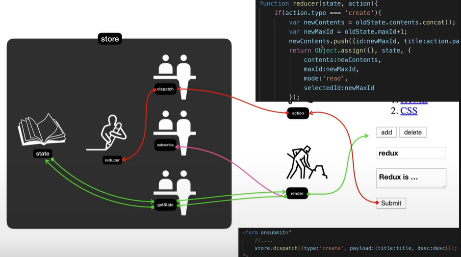
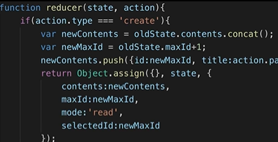
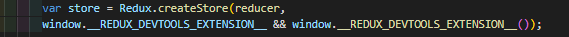

[생활코딩](https://opentutorials.org/course/4901)
[Redux시작하기](https://ko.redux.js.org/introduction/getting-started/)


**redux 사용법**

1. store 만들기 

   ```js
   function reducer(state, action){
      //최초 호출되는데, state가 undefined라서 처리해줘야함
       if(state===undefined){
           //초기값 setting
           return
       }
       return
   }
   var store = Redux.createStore(reducer);
   ```

   - 값 접근: state에 바로 접근하지 못하므로 `store.getState();`로 가져와야함

2. 사용하기

   ```react
   <script src="https://cdnjs.cloudflare.com/ajax/libs/redux/4.2.0/redux.min.js" integrity="sha512-1/8Tj23BRrWnKZXeBruk6wTnsMJbi/lJsk9bsRgVwb6j5q39n0A00gFjbCTaDo5l5XrPVv4DZXftrJExhRF/Ug==" crossorigin="anonymous" referrerpolicy="no-referrer"></script>
   
   <div id="toc"></div>
   <script>
         function TOC(){
           var state = store.getState();
           var i = 0;
           var liTags = '';
           console.log(state)
           while(i<state.contents.length){
             liTags = liTags + `<li><a href="${state.contents[i].id}">
                 ${state.contents[i].title}<a/></li>`;
             i = i + 1 ;
           }
           document.querySelector('#toc').innerHTML = `
           <nav>
             <ol>
               ${liTags}
             </ol>
           </nav>
           `
         }
         function reducer(state, action){
           if(state === undefined){
               return {
                 contents:[
                   {id:1, title:'HTML', desc: 'HTML is..'},
                   {id:2, title:'CSS', desc: 'CSS is..'},
                 ]
               }
           }
         }
         var store = Redux.createStore(reducer);
         TOC();
   </script>
   ```

3. submit버튼-> action-> 

   action만들기 **type이 가장 중요함**

   ```js
    while(i<state.contents.length){
             liTags = liTags + `
             <li>
               <a onclick="
                 event.preventDefault();
                 var action = {type: 'SELECT', id:${state.contents[i].id}}
                 store.dispatch(action); //store의 dispatch로 action을 넘겨주기
               " href="${state.contents[i].id}">
                 ${state.contents[i].title}<a/>
             </li>
             `;
             i = i + 1 ;
           }
   
         function reducer(state, action){
           console.log(state, action)
           if(state === undefined){
               return {
                 selected_id: null,
                 contents:[
                   {id:1, title:'HTML', desc: 'HTML is..'},
                   {id:2, title:'CSS', desc: 'CSS is..'},
                 ]
               }
           }
           var newState = {};
           if(action.type==='SELECT'){
             newState = Object.assign({}, state, {selected_id:action.id});  //복제된 값 return
           }
           console.log(action, state, newState);
           return newState
         }
   ```

   - `store.getstate();`로 확인하기

4. 복제

   - object 복제
     `newState = Object.assign({}, state, {selected_id:action.id});  //복제된 값 return`

   - 배열 복제

     `concat 사용`
     `var newContents = state.contents.concat();`

     ```js
             newContents.push({id:newMaxId, title:action.title, desc:action.desc});
             newState = Object.assign({}, state, {
                 max_id:newMaxId,
                 contents:newContents,
                 mode:'read'
     ```

     아무런 인자를 주지 않으면 기존 배열을 복제해서 똑같은 값 리턴해줌
     
     

---




- dispatch: reducer 호출로 state변경, subscribe 이용해 render함수 갱신
-  
- store.dispatch 사용시 ({type:'필수', color:'red'})
- dispatch 는 reducer를 무조건 한번 호출하게 되어있음.
  
- <u>reducer는 이전의 state와 action을 받아서, 다음의 state값을 보내주는 친구.</u>
- state값 복사해서 값 바꿔서 return

- 객체 return 시

- ```react
  Object.assign({}, {name:'egoing'}, {city:'seoul'});  
  # 첫번째인자: 반드시 빈 객체   / 이유: object assgin의 return 값은 첫번째 인자이기 때문
  # 그 이후: 빈 객체에 복사할 속성
  ```

- reduce 는 state값을 변경해준다. return 시 **state를 복제한것**을 돌려주어야 한다.


### redux devtool

 추가

```
window.__REDUX_DEVTOOLS_EXTENSION__ && window.__REDUX_DEVTOOLS_EXTENSION__()
```