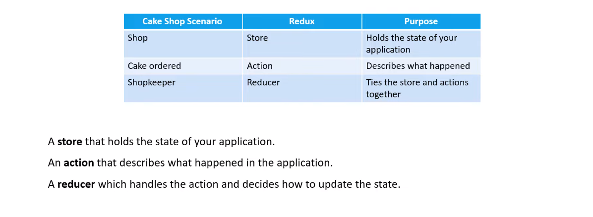
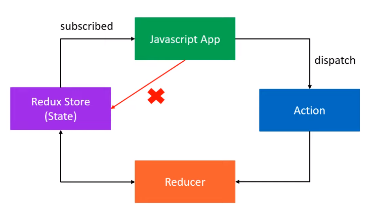
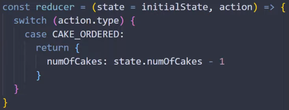

# Redux toolkit

```bash
npm install @reduxjs/toolkit
npm install redux
없으면
npm i react-redux
```


```react
import {createSlice, configureStore} from '@reduxjs/toolkit';

const counterSlice = createSlice({
    name: 'counter',
    initialState: {value:0}, //초기값
    reducers:{  //store는 reducer가 필요
        up:(state, action)=>{  //action type에 따른 조건문
            state.value = statel.value + action.step; //복사 안해도됨 //추후 action.payload로 변경
        }
    }    
});
```

```react
const store = configureStore({
    reducer:{ //필수
        counter: counterSlice.reducer
    } 
});
```

```react
function Counter(){
    const dispatch = useDispatch();
    const count = useSlector(state=>{
        return state.counter.value;
    });
    return <div>
    <button onClick={()=>{
                //dispatch({type:'counterSlice/up', step:2});
                //action을 직접 만들지 않고, 툴을 제공한다.
                dispatch(counterSlice.actions.up(2));  //actions를 써서 payload로 들어옴
            }}>+</button> 
    </div>
}
```


##### App.js

```react
import React from 'react';
import store from './store';
import {Provider,useSelector,useDispatch} from 'react-redux'
```


---


---

참고

## Three core Concepts

 

`케익샵  사는사람  가게주인`


[리덕스 저장소|Redux store]
 

1. 모든 상태가 단일 객체에 저장되어 있다.
   The global state of your app is stored as an object inside a single store
2. The only way to change the state is to **dispatch** an action, an object that describes what happend. (값변경)
3. To specify how the state tree is updated based on action you write pure **reducer**s.(상태변화)
   Reducer = (shopkeeper)
   


https://www.youtube.com/watch?v=7cREd9mesMg&list=PLC3y8-rFHvwiaOAuTtVXittwybYIorRB3&index=3
