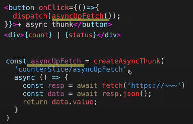
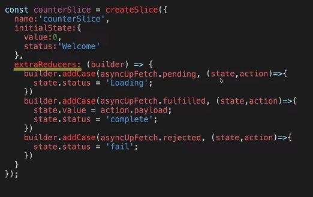
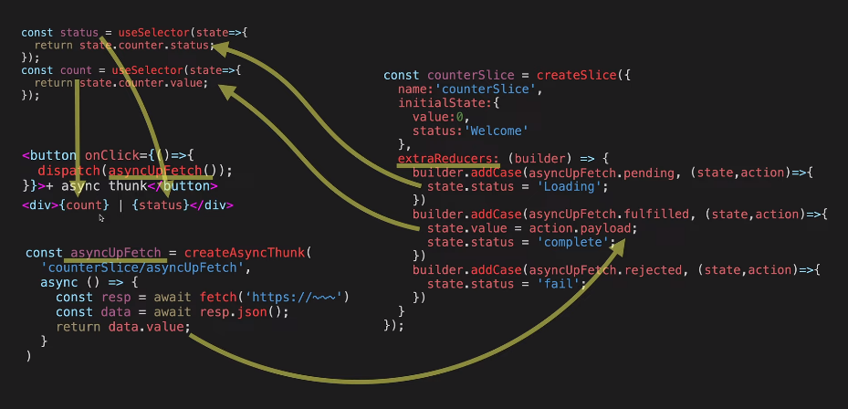
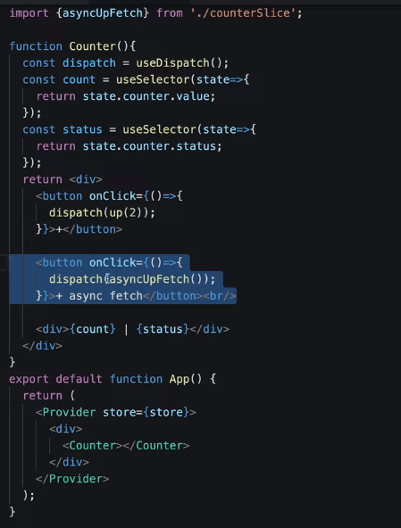

**createAsyncThunk은 비동기작업을 처리하는 action creator를 만듭니다.** 

[thunk 생활코딩](https://www.youtube.com/watch?v=K-3sBc2pUJ4)

[stackblitx](https://stackblitz.com/edit/react-bnjjtz?file=src%2FApp.js)

https://zakelstorm.tistory.com/158

 

`asyncUpFetch`는 `action creator`이다.
`counterSlice/asyncUpfetch`  -> 타입임  === `내가원하는슬라이스/내이름`
결과를 return (두번째 파라미터)

`counterSlice/asyncUpfetch`는 구분하기 위한 이름
대부분 비동기 처리하는 url과 같게 사용함.


 

- pending
  비동기 작업을 시작했을때
- fulfilled
  데이터를 가져왔을때(성공 시)  //이때만 정의해도 됨
- reject
  오류시

상태별로 리듀서가 필요 == extrareducers
builder.addCase를 통해서 (pending일때 동작할 리듀서를, 두번째 파라미터를 통해서 정의해줌)


 

- 동기엔 reducer, 비동기엔 extrareducers
- reducer는 actioncreator를 툴킷이 자동으로 만들어주지만, extrareducers는 못만들어줘서 정의해야함

```react
builder.myConsultantDx.pending
					.fulfilled
					.rejected
const signUpSlice = createSlice({
  name: 'signup',
  initialState,
  extraReducers: {
    [signUpMember.pending]: (state) => {
      state.status = 'loading';
    },
    [signUpMember.fulfilled]: (state, { payload }) => {
      state.status = 'succeeded';
      state.data = payload
    },
    [signUpMember.rejected]: (state) => {
      state.status = 'failed';
    },
  }
});
```


질문: 내가하는작업이 비동기냐

 

```react
import React from "react";
import {createStore} from 'redux';
import {Provider,useSelector,useDispatch} from 'react-redux';
import store from './store';
import {up} from './counterSlice';
import {asyncUpFetch} from './counterSlice';

function Counter(){
  const dispatch = useDispatch();
  const count = useSelector(state=>{
    return state.counter.value;
  });
  const status = useSelector(state=>{
    return state.counter.status;
  });
  return <div>
    <button onClick={()=>{
      dispatch(up(2));
    }}>+</button>  
    
    <button onClick={()=>{
      dispatch(asyncUpFetch());
    }}>+ async fetch</button><br/>
    
    <div>{count} | {status}</div>
  </div>
}
export default function App() {
  return (
    <Provider store={store}>
      <div>
        <Counter></Counter>
      </div>
    </Provider>
  );
```


